Computing Notes
===============

 The story of modern electronic digital computing
should start with Alan Turing, the man for whom the Turing Trust is
named. Turing published a paper in 1936 *On Computable Numbers, with an
application to the Entscheidungsproblem*. The paper proved that you
could build a machine capable of processing a digital stream of 1s and
0s according to programmed instructions and it would be capable of
solving any computable problem. As it happens, the set of problems
included in this definition is the universe of mechanically solvable
problems. Hence, the Turing Machine is also known as the *Universal
Machine*, the theoretical precursor to the electronic digital computer
which we use today.

So what is a computer? The computer’s like the human brain. Your brain’s
there inside your body and controls everything your body does, but the
only way you can see it is if you take a look inside your head. When it
comes down to it, the computer is a brain, too; it’s a tiny chip inside
a machine such as a desktop or a laptop, a phone or a car, which, with
your help, controls how the machine works. You don’t need to know how
the chip does its job. It does what it’s told, using instructions
programmed into it by people who know how to tell it what to do.

So the way the computer works is really quite simple. The computer (the
tiny chip) receives *input* in the form of data, which it *processes*
according to programmed instructions, and then *outputs* the processed
data in a form that meets our needs. Input-Processing-Output (IPO).
That’s it. The computer repeats this IPO process over and over again,
millions of times a second, to produce something useful for you and me.

*Software*, programs such as a word processor or a video game or a
spreadsheet, runs on the computer and accepts *input* from people like
you and me. The input can also come from other computers if it’s
connected to a network like the Internet. Input can even come from
sensors that have been set up to capture data from the environment (like
weather sensors, or traffic sensors, or cameras, and so on). Inside the
computer are what are called *processors*, which accept the input and
process it according to the instructions in the program (the software).
After the processing is complete, the computer *outputs* the processed
data onto some kind of output device, such as a screen, or a printer, or
a speaker, depending on what you, the *user*, want it to do.

Who would have thought that such a simple machine could do all the
wonderful things that we rely on computers for today? Most manufacturing
today is done on machines controlled by computers. Most office work is
now handled by computers. Hospitals rely on computers to manage all that
patient data and to process all those medical tests and screenings.
Every car on the road has dozens of little computers inside, monitoring
the car’s performance; the same for planes and trains, and ships and
spaceships. The internet (and your phone now relies on the internet) has
transformed our world into a global village, where everyone everywhere
is now no more than a few seconds away from everyone anywhere else in
the world. We go shopping on the Internet; we use the Internet to find
out anything we want to know.

And we’re just beginning to discover what the computer can help us do!

## Part I: The Components of a Computer & Basic Operations

### Chapter 1: Hardware

#### Turning the computer on

*Booting*

*Booting* your computer is the process of starting or restarting it and
starting the operating system. Turning it on may include turning on the
screen as well as the computer. If the screen is separate from the
computer, you will need to turn on the screen first so that you can see
what’s happening when you turn on the computer itself.

*Hard and soft boot*

A hard boot is when you start the computer using the power button (see
left Figure below). This is also sometimes called a cold boot, because
the computer is not yet warmed up by the flow of electricity. A soft, or
warm, boot is when you *restart* the computer without turning it off.
You do this using the **Restart** option in the Start Menu (see right
Figure below).

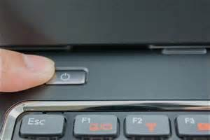 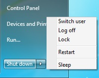

#### The Processor

*ALU—the Arithmetic & Logic Unit*

All you need to know about the ALU is that it’s the central “brain” of
the computer; it does all the computation that the software tells it to
do. As such, it’s the most important component in a computer, though
it’s the one we’re least aware of.

*Memory*

The computer would be just a useless machine without somewhere to store
all the data used during the processing done in the ALU. Memory enables
the computer to store and save the data before and after processing.

There are two types of computer memory: Primary memory and Secondary
memory.

*Primary memory (RAM and ROM)*

Primary memory is really part of the ALU. Read Only Memory (ROM)
contains special programs the system needs to start itself up during the
boot process explained above. These programs, such as the Basic
Input-Output System (BIOS), are hardwired on the chips inside the ALU
(see Figure below).

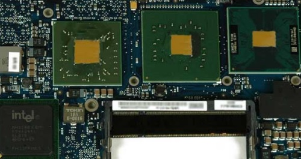

Intel’s Core 2 Duo logic board

Random Access Memory (RAM), also called working memory, is made up of a
lot of other chips, all interconnected, which, at any one time, contain
the programs (software, applications like Word or Internet Explorer or a
video game) that are actually running on the computer when you’re using
it to do work, or when you’re playing video games, and so on.

*Secondary memory*

This is the memory that you have on the computer’s hard drive, or on
your USB drive, or on CDs and DVDs, or Flash memory cards, like the ones
in your camera (see Figure below).

There are lots of types of Secondary memory, even what they call “The
Cloud,” which is Secondary memory that companies like Google or
Microsoft manage for you so you can store all your data (photos, video
clips, Word documents, Spreadsheets, etc.) out there on the network.
We’ll talk more about networks in a bit. There’s no limit to the size of
Secondary memory; it’s literally as big as you want it to be so you can
store all your stuff. We’ll talk about how to sensibly store all your
stuff in a bit, too.

#### Input devices

A picture tells a thousand words, so he’s a picture which illustrates
all the different types of input devices (see Figure).

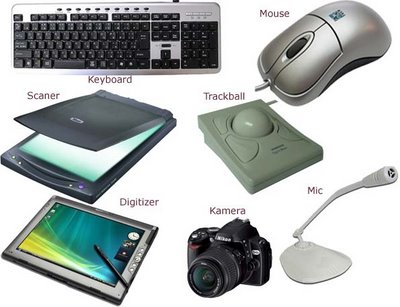

*The Keyboard*

The most traditional input device.

*Mouse*

The input device that is now commonly part of the Graphical User
Interface (see Part I, Chapter 3, p. 11).

*Touch pad*

Most common on laptop computers, used with your finger or a stylus
instead of the mouse to scroll and move the mouse pointer on the screen.

*Touch screen*

Most modern mobile phones use a touch screen so you can scroll through
pictures or text on the phone’s screen. But now regular desktop and
laptop computers come with touch screens if you have the latest
Microsoft operating systems.

*Microphone (voice input)*

A microphone can be plugged into your computer, or it can come built-in
to the computer screen, so you can speak into the computer and record
your voice, or send your voice over the network when you’re chatting
with someone online.

*Camera (video input)*

A camera is now more often than not a part of your computer screen, and
certainly built into any modern mobile phone, allowing you to take
pictures or video that you can share with others on the network, or
simply store for your own use.

*Scanner*

The scanner (illustrated on the previous page) allows you to make a copy
of any paper document or picture and scan it into the computer as a
digital image made up of thousands or millions—even billions—of bits or
pixels, depending on the quality of the scanner’s resolution. A pixel
(**PI**cture **El**ement) is another name for one of the dots that make
up the scanned image. The more dots, the better the resolution. Low
resolution (thousands of bits) is not nearly as sharp an image as high
resolution (millions or billions of bits).

#### Output devices

A picture tells a thousand words, so he’s a picture which illustrates
all the different types of output devices (see Figure).

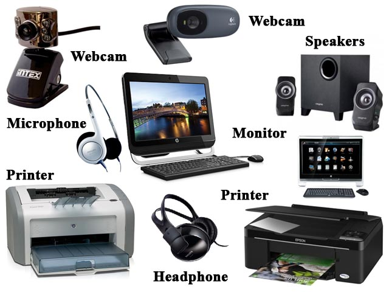

*The Screen (Monitor)*

The computer screen (or the display on a mobile phone) is the most
traditional computer output device.

*Speakers (voice output)*

Speakers are built into your computer so you can listen to music or
speech, or hear someone you’re chatting with over the network when
you’re online.

*Camera (video output)*

A camera (such as a webcam) is built into most every modern
computer—desktop or laptop or phone—so you can see who you’re chatting
with online, or play back video that you’ve captured using the camera.

*Printers*

There are all kinds of printers. The most traditional printer is the one
attached to your computer, whether it’s inkjet or laser. Inkjet printers
are cheap and provide pretty good colour images, but laser printers are
much higher resolution and also produce the printout much faster than an
inkjet printer. But today they have 3D printers—printers that actually
MAKE THINGS like models and all kinds of 3-dimensional objects. Hold
onto your seat, but they’re now using 3-d printers to make human body
parts (from stem cells)! Yes, it’s mind-boggling, like so much to do
with computer technology.

#### Communications

Communication is not the same thing as Communications.

Communication, without an “s” on the end of the word, is all about the
art of communicating using writing (in books and magazines, etc.) and
speech (where one or two people are chatting together or where an
audience is gathered for a formal or informal address).
Communication**s** with an “s”, on the other hand, is all about using
*electronic* media, such as those we’re going to discuss in this
section, for the purpose of Communication. It’s a subtle difference, and
one of which most people are unaware, but it’s good to know, all the
same.

*Networks (LAN and WAN, wired and wireless)*

In general, electronic media such as the phone and so forth operate over
networks, which can be Wide Area Networks (WANs), linking people in a
village or a town or a city or a nation or between nations, and Local
Area Networks (LANs), linking people in the same house or the same
building. LANs are usually linked to WANs. Today we think of the whole
world as one big networked planet. The WANs and LANs are linked together
either over physical wires and cables strung from telegraph poles or
buried underground or even running along the ocean floor, as well
wireless transmissions via satellites orbiting the earth and microwave
towers dotted over the landscape.

*Phone*

Today, the modern phone works hand-in-hand with the Internet. It’s
become what they call an “Edutainment device”—something you can use not
just for chatting with your family and friends and business associates
and so forth, but also to access the Internet (see next section), to go
shopping, to book airline flights and call a taxi, and even to watch
movies. You can also use it to write memos and so forth (see personal
organizers in Part I, Chapter 2). The modern phone is rapidly becoming
something that you really cannot be without, which is why they’ve become
mobile, of course.

*Email*

Email is a method of exchanging digital, computer-based messages from an
author to one or more recipients. Modern email operates across the
Internet. The neat thing about email is that it enables you to send
messages more or less instantaneously around the globe. By contrast,
traditional mail (using the Post Office) is still relatively slow, which
is why it’s called *snail mail*!

*Internet*

So the Internet is the mother-of-all communications devices. It
incorporates phone technology and, with the rapidly increasing number of
apps (applications) that are being written for it, the Internet-capable
phone, as a mobile device, is becoming an integral part of all aspects
of our daily lives. It’s like you really want to pick it up and go. Yes,
you can access it on your desktop computer, but you can’t take your
desktop with you. You want it in your pocket or your purse, and that’s
where it will soon (easily within 10 years) be for almost everyone alive
on the planet. Already, in 2014, almost 90% of people on earth have a
mobile phone—that’s 9 out of 10 people. It’ll be closer to 100% by 2014,
guaranteed.

*Skype*

Skye is a free internet telephone service which incorporates video as
well as speech. It is pretty good, too, though the images are not as
sharp as if you pay for it using a subscription service, and the sound
quality may not be so good either. But it is a free video phone service.

*Social Media*

Some of the more popular apps available on the internet are what are
called Social Media—Facebook, Twitter, Instagram, and so on. These apps
make it very easy for you to interact all day and all night with family
and friends—if you can afford the internet subscription. The world is
becoming a tiny village where anyone anywhere can quickly and easily
touch base with anyone else. This is changing the way we live.

### Chapter 2: Software

**Software Applications in general**

An application is a computer program designed to help people use the
computer to perform an activity. Examples include an accounting system,
a library management system, a phone network management system, a
manufacturing control system, an image processing program such as Adobe
*PhotoShop*, video games of all kinds, and so on.

There are literally thousands of applications such as these, and more
are being written by programmers every day.

**Office Productivity Software**

Office productivity software, such as Microsoft *Office*, has been
designed to *standardize* applications such as word processing,
spreadsheets, database management, and presentation software, as well as
drawing and personal organizer software. Standardization means that each
of these office productivity tools has a similar look and feel, which
makes them easier to learn and use.

ICCSE, in collaboration with The Turing Trust, is making available a
separate set of tutorials to help you learn many of the features of
these Office Productivity tools. Let’s briefly take a look at each of
them now so that you know what to expect when you work your way through
the Office tutorials.

*Word processing*

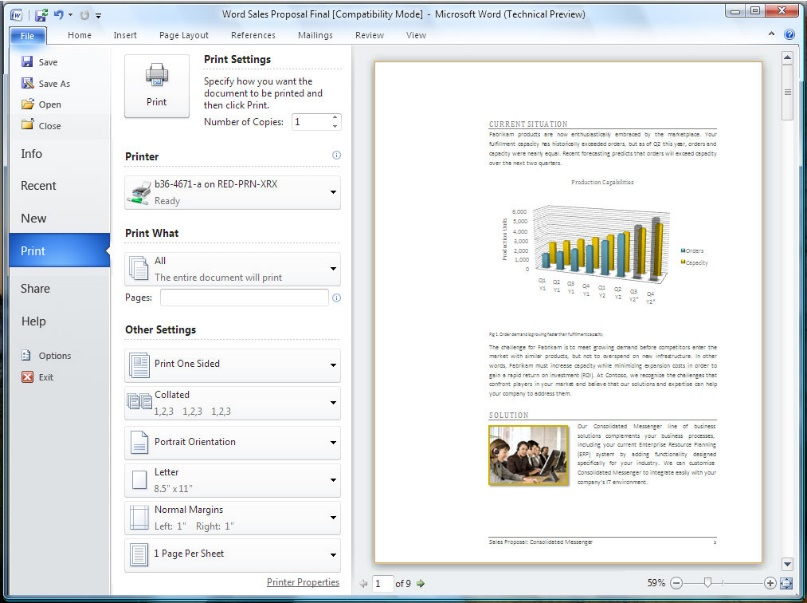A word processor, such as Microsoft *Word* or
LibreOffice *Write*, is designed to help the user with the composition,
editing, formatting, and sometimes printing of any sort of written
material, such as letters, papers, memos, résumés and curriculum vitae
(CVs), contracts, advertising flyers and other signs, greeting cards of
all kinds, and so on. The most useful features of a word processor are
that (a) it makes correcting mistakes easy; and (b) it makes editing,
updating, and formatting of text a snap once you’ve learned how to use
the software. Above all, the word processor makes you look good!

*The Spreadsheet*

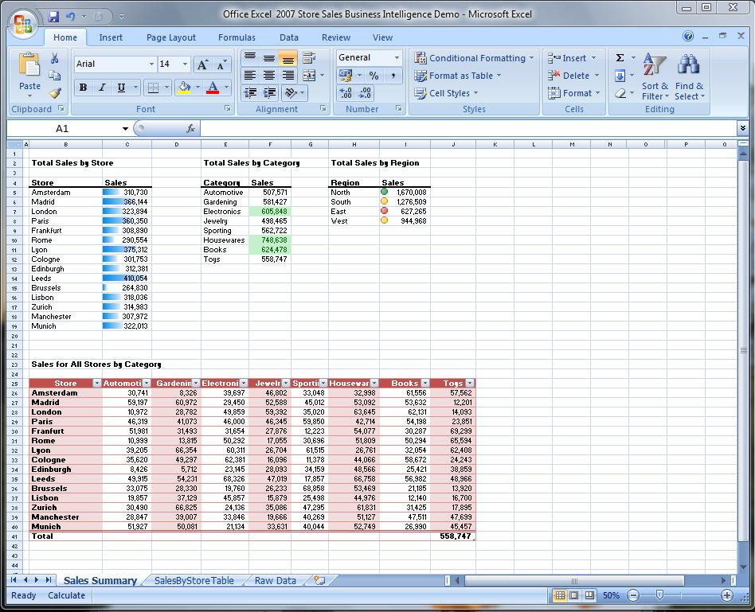Historically, spreadsheets were maintained in
accounting journals or ledgers. They date back to the 14th and 15th
centuries. Nearly 500 years later, in 1978, Dan Bricklin, a young
graduate student at the Harvard School of Business in the USA, came up
with the idea for an interactive spreadsheet and, together with Robert
Frankston, developed the first computer-based electronic spreadsheet
application (called *Visicalc*).

Pretty soon, every large and small business in the world wanted an
electronic spreadsheet to help them manage their business accounting.
And not long after that, the application (called *Excel* in Microsoft
*Office*, *Calc* in LibreOffice) was being used to manage any kind of
columnar/tabular data, such as weather info, scientific/research data,
even simple apps like an address book or a CD collection. It has all
kinds of built-in mathematical functions and formulas, along with
easy-to-use formatting and layout tools. Think of it like a word
processor for *lists* of data, whether the lists be numbers or text.

*Database Management*

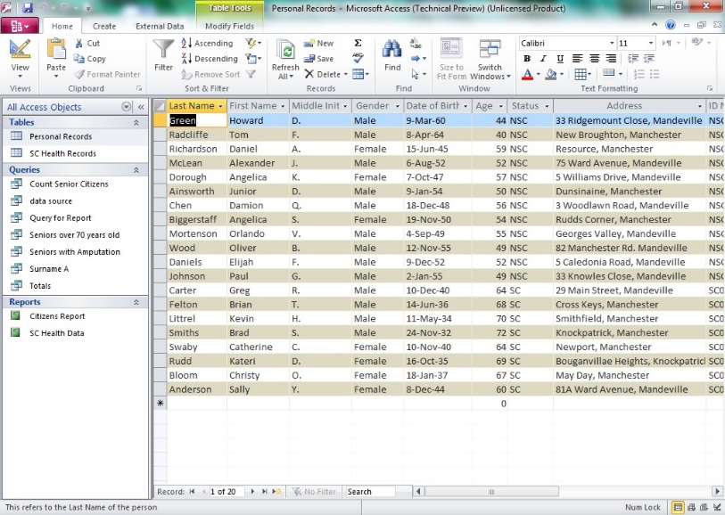A database is an electronic storage system that
holds any and all data that you need to access and use. A database
Management System is a collection of programs that enables you to store
all that data, modify it, and extract information from the database.
“Knowledge is power”; data is the raw material of knowledge. But data is
only useful if you can easily access it and use it to help you in your
daily life. That’s where a database like Microsoft Office *Access* or
LibreOffice *Base* comes in handy. It’s like a library that’s organized
in such a way that you can use it to answer questions and accomplish
tasks that would be very hard, if not impossible, without it.

*Presentation Software*

Presentation software such as Microsoft Office
*PowerPoint **or LibreOffice** Impress*, are tools designed to help you
present data in the form of multiple media—*multimedia*—that might be
text, still images, video and/or sound. Presentations are not designed
to teach as such; rather they are designed to *help* you teach. But they
may, nonetheless, be useful as standalone tools for presenting useful
information.

So, computer-based presentations have various uses. A good teacher or
presenter will often want to use *audio-visual* multimedia material to
help the members of his or her audience to learn. Computer-based
presentation tools enable the presenter to gather together this
instructional media and organize into attractive, eye-catching,
audio-visually appealing slides that are more likely to engage the
audience’s attention and understanding than simple speech.

A well-designed computer-based presentation can also be displayed online
or in the foyer of a building to give the viewer an overview or
description of some topic of interest, such as a company or university’s
history and goals.

*Drawing/Graphics Tools*

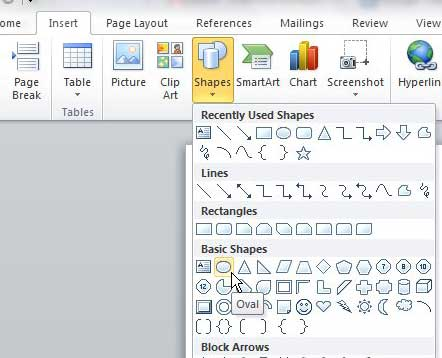Each of the Office applications is designed for
a particular purpose. *Excel* is a number cruncher, *Word* is a powerful
word processor, and *PowerPoint* is a presentation application
extraordinaire. Although you use the different Office applications for
different purposes, graphics—images, shapes, and clip art—are used for
pretty much the same purpose in all the applications.

Graphics enable you to enhance information and add interest to the
spreadsheets, documents, and presentations that you create. In MS Office
or LibreOffice, the commands and tools used to insert and modify images,
shapes, SmartArt graphics, and clip art are very consistent across the
different applications in the Office suite. So, if you know how to use
graphics in Word, you can apply that knowledge to another Office
application, such as PowerPoint.

### Chapter 3: The Graphical User Interface (GUI)

*WIMP*

The key features of GUIs are the **W**indows, **I**cons, **M**enus, and
**P**ointers (the components of the so-called WIMP interface) which are
now common to all types of computers—whether it’s a desktop computer,
laptop, tablet, or phone.

Touch screens have now been added to the GUI mix, and the point is that
these interaction tools have made it possible for more or less anyone to
use a computer—even children as young as two years of age.

So you have no excuse for not becoming skilled in the use of a computer.
All you have to do is practice and, as we all know, practice makes
perfect! You’re no doubt already familiar with the GUI from your
experience using computers at various times and in various places during
the course of your life. It’s hard to avoid computers these days. But
you might like to learn some of the keyboard shortcuts that by-pass the
GUI and let you get things done more quickly than if you use the mouse
and point and click.

*Quick keyboard shortcuts*

Take a moment to try out each of the shortcuts illustrated in the Figure
below, and keep this Figure handy for future use.

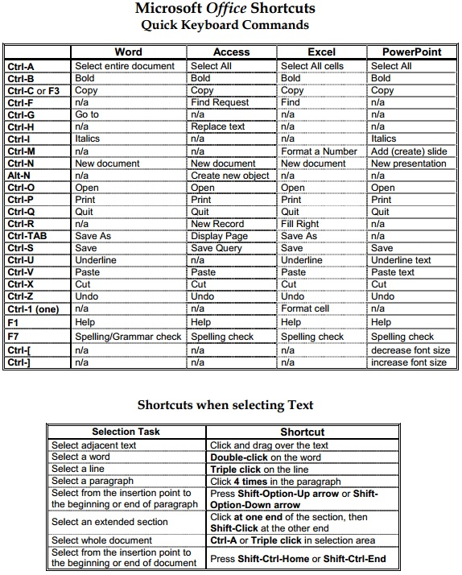

### Chapter 4: Working with Files

In computer terminology, a file is any kind of digital object[^1] that
you have created using the computer. Over the years since the digital
computer was invented by Alan Turin in 1936, people have come up with
various ways of using just 1s and 0s to represent *text* (the characters
on the keyboard), *still images* and video (which is really just still
images running rapidly one after the other to create a motion picture).
It is also possible to use 1s and 0s to represent *sound* and even
*smells* (scents) and *tastes* (there are computers that have been
programmed to taste wine, for example).

The most common files that you are likely to create and save are text
files and image files (photos, charts, drawings, for example), and
you’ll also often store files that combine text and images. If you learn
to use Office *Word*, you’ll be creating mostly text files, though
you’ll sometimes include images among the text. If you learn to use
Office *Access*, you’ll be creating and saving database files. If you
learn to use Office *Excel*, you’ll be creating and saving spreadsheet
files. And if you learn to use Office *PowerPoint*, you’ll be creating
and saving presentation files.

*Creating files*

Every time you take a photo with your phone or any modern camera, you’re
creating a file. It’s a digital file in one of several image formats,
such as .jpg, or .gif, which is automatically saved with a default name
on the memory card in your camera or phone. Every time you use Office
*Word* to Open a New Blank doc, you’re creating a file, which is empty
until you type some text into the document, such as a letter, and this
new file, too, is saved with a default name—unless you name it yourself.

*Naming and renaming files*

Naming files is VERY important. Who knows what an image file called
DSCN1525 contains? That’s the kind of default name your camera or phone
gives to the photo files you take. What you should always do, when you
upload the pictures from your phone or camera to a computer such as a
desktop, laptop, or tablet, is *rename* the picture files with a name
that describes in a couple of words what the picture is all about.
Likewise, if you have a Word document on your computer with a default
name that doesn’t describe what’s in the document, you should rename it.
This is easy enough to do.

As illustrated below, the computer stores all your files in a hierarchy
of folders:

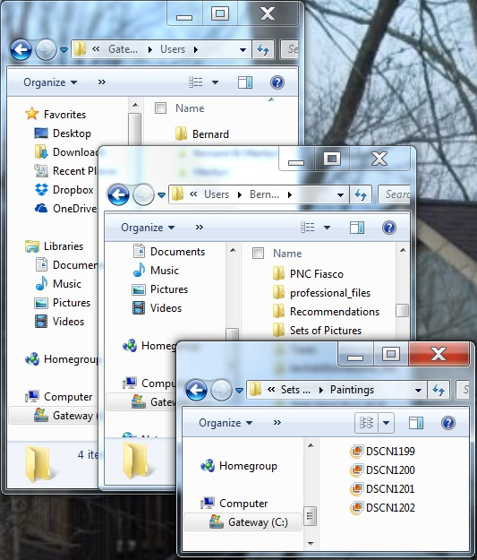

The easiest way to rename a folder or file is by *right-clicking* on the
*name* of the folder or file, which brings up what’s called a *Context
menu* (see Figure).

So whenever you *right-click* on any object on the screen a Context menu
pops up, which gives you a menu of options that you can carry out on the
object you’re pointing at—such as the option to *Rename* the file called
DSCN1199. In the Context menu, you select the option to *Rename*, and
the system highlights the name of the file in blue. Now all you have to
do is type the new file name and hit the Enter key on the keyboard.
Easily done.

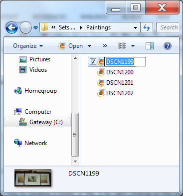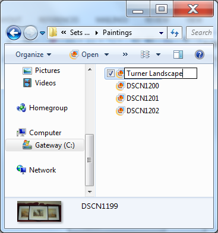

*Saving files (Save and Save As)*

When you create a new document in Word or any of the other Office
programs, and you go to Save the file, Office will assume that you’ll
want to give the new file an appropriate name. So it will display the
*Save As* dialog box to prompt you to do this. Notice (see the first
Figure below) that Office automatically chooses a file name based on the
*first few words* of the new document you’re saving. At this point you
also have the opportunity to decide where you want to save the file—on
the desktop or in one of the folders you already have on your disk
drive. You’ll have the opportunity to practice doing this many times
when you work your way through the ICCES Office tutorials.

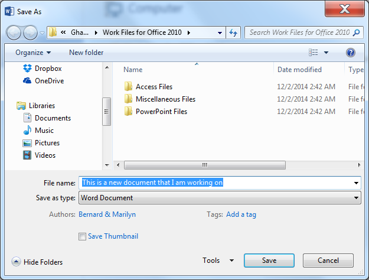

While this Office default name is still highlighted in Blue, you’ll go
ahead and type a file name that briefly describes the content of the
document—in this case *Application Letter*—and then, still in the dialog
box, click on the *Save* button (see Figure below).

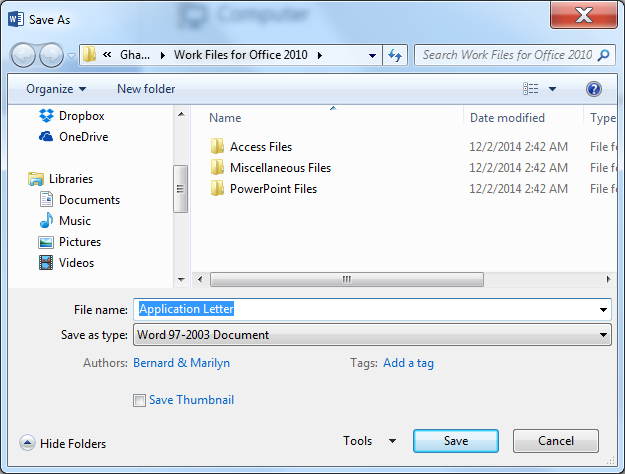

*Organizing files*

As illustrated above on pages 14-16, you really should be careful to
give good names to your files and organize them all into folders on your
disks so that they are easier for you to find when you need them. It can
be a pain to do this, but in the long run you’ll be glad you did. When
you work your way through the various ICCES Office tutorials, you will
have lots of opportunities to practice doing this, so you don’t need to
worry about the process at this time. Just be aware that it is
IMPORTANT, in the same way as it’s important that you store things in
your house in some tidy fashion so that you know where everything is.

*Deleting files*

Deleting files is a bit like the process of cleaning house. After a
while you’ll have hundreds, even thousands, of files on your disk
drives. You may well have duplicates of files all over the place, or you
may have files that you no longer need or want. Deleting them is easy to
do. Basically it’s the same process as when you rename a file. The
easiest way to delete a folder or file is by *right-clicking* on the
*name* of the folder or file, which again brings up a *Context menu*
(see Figure).

This time, instead of Renaming the file, you want to *Delete* it. When
you select the option to Delete the file, you’ll be prompted to confirm
that this is what you want to do.

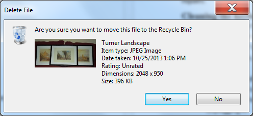

When you click on the *Yes* button, the file is still not actually gone
altogether. Windows (the Operating System on your computer) puts the
deleted file in the *Recycle Bin* on your desktop and leaves it there
till you decide to actually throw it away by emptying the Recycle Bin.
In other words, you can still recover the file if you want. To empty the
Recycle Bin, you just go to the Desktop and *right click* on the Recycle
Bin icon to bring up the Context menu (see Figure) and, in the menu that
pops up, select the option to *Empty Recycle Bin*.

## Part II: Basic Computer Maintenance

### Chapter 1: The importance of keeping your computer healthy

A computer is an expensive piece of equipment, and as with all big
purchases you will want to protect your investment. A computer can help
your school progress. It gives you a means of writing reports, saving
photos, accessing the internet, sending emails…. and so much more.

This booklet provides step-by-step instructions to help you prolong the
life of your computer and to help keep it working at a consistently high
level.

This booklet covers three main areas: keeping it **physically clean**,
protecting it from **malware**, and **backing up** your important files.
There is also a short section at the back detailing ways to prevent
personal strain and injury which can result from long periods at a
computer.

### Chapter 2: Keeping your computer physically clean

The main natural physical threats to your computer are:

-   Dust

-   Heat

-   Moisture

Any of them can potentially cause problems for your computer, leading to
very costly repairs or even irreparable damage.

**YOU** are another threat to your computer. If you eat or drink in
front of it, it is likely that some food or drink will end up on the
keyboard of the computer, which could make some of the keys unusable.

It is good working practice to go away from your computer to get a drink
or to have some food. Getting away from the computer every hour or so
gives you a chance to move around and stretch your legs.

By cleaning your computer regularly, you can help to **keep it working
properly** and **avoid expensive repairs.**

#### Cleaning the keyboard

A dirty keyboard doesn't look nice and can cause your keyboard to **not
work** properly. Dust, food, liquid, and other particles can get stuck
underneath the keys, which can prevent them from working properly.

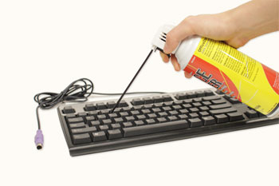Check your owner's manual to see if the
manufacturer has provided you with instructions for your specific
keyboard. If so, follow them. If not, the following steps are basic
cleaning tips that can help keep your keyboard clean:

1.  Unplug the keyboard from the USB or PS/2 port. If the keyboard is
    plugged into the PS/2 port, you will need to shut down the computer
    before unplugging it.

2.  Turn the keyboard upside down, and gently shake it to remove dirt
    and dust.

3.  Use a can of compressed air to clean between the keys (see
    Figure above).

4.  Moisten a cotton cloth or paper towel with rubbing alcohol (surgical
    spirit), again turn the keyboard upside down, and use it to wipe
    clean the tops of the keys. **Do not pour alcohol (or any
    other liquid) directly onto the keys!**

5.  Reconnect the keyboard to the computer once it is clean and dry. If
    you are connecting it to a PS/2 port, you will need to connect it
    before turning the computer on.

*Dealing with liquids*

If, heaven forbid, you *do* spill liquid on the keyboard, quickly shut
down the computer, disconnect the keyboard and turn it upside down to
allow the liquid to drain.

If the liquid is sticky, you will need to hold the keyboard on its side
under running water to **rinse** the sticky liquid away. Then turn the
keyboard upside down to drain for two days before reconnecting it. The
keyboard may not be repairable at this point, but rinsing the sticky
liquid off of it is the only chance for it to be usable again.

**The best way to avoid this situation is to keep drinks away from the
computer area.**

#### Cleaning the mouse

There are two main types of mice: **optical** and **mechanical**. Each
is cleaned in basically the same way, although the mechanical mouse
requires a bit more work.

-   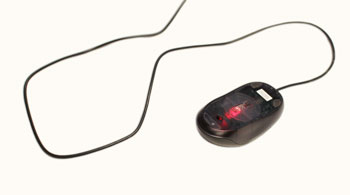**Optical mice**
    require **no internal cleaning** since there aren't any rotating
    parts; however, they can get **sticky** over time as dust collects
    near the light emitter. This can cause erratic cursor movement or
    prevent the mouse from working.

-   **Mechanical mice** are especially susceptible to **dust** and
    **particles** that can accumulate inside the mouse, which can make
    it difficult to track—or move—properly. If the mouse pointer does
    not move smoothly, the mouse may need to be cleaned.

Before you clean the mouse, check the owner's manual to see if the
manufacturer has provided you with instructions for your specific mouse.
If so, follow those instructions. If not, the following steps are basic
cleaning tips that will help keep your mouse clean.

1.  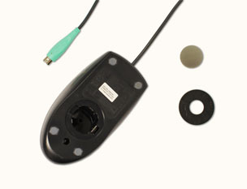**Unplug** the mouse from the USB or
    PS/2 port. If the mouse is plugged into the PS/2 port, you will need
    to shut down the computer before unplugging it.

2.  Moisten a **cotton cloth** with rubbing alcohol, and use it to clean
    the top and bottom of the mouse.

3.  If you have a **mechanical mouse**, remove the **tracking ball** by
    turning the **ball-cover ring** counterclockwise. Then clean the
    tracking ball and the inside of the mouse with a **cotton cloth**
    moistened with rubbing alcohol.

4.  Let **all of the parts dry** before reassembling and reconnecting
    the mouse. If you are connecting it to a PS/2 port, you will need to
    connect it **before** turning the computer on.

If you just want to give the mouse a quick cleaning, place it on a
clean, white sheet of paper and move the mouse back and forth. Some of
the dust and particles should rub off onto the paper.

#### Cleaning the monitor

Dirt, fingerprints, and dust can make your
computer screen difficult to read. However, it's easy to clean your
screen when needed. Although there are monitor-cleaning kits you can
buy, they may do more harm than good if they are designed for a
different type of monitor. For example, a monitor cleaner that is
designed for glass screens may not work with some non-glass LCD screens.
The safest method for cleaning any monitor is to use a soft, clean cloth
moistened with water.

Do not use glass cleaner (such as Windex) to clean a monitor. Many
screens have anti-glare coatings that can be damaged by glass cleaner.

1.  Turn off the computer.

2.  Unplug the monitor from the power. If you are using a laptop, unplug
    the laptop.

3.  Use a soft, clean cloth moistened with water to wipe the
    screen clean.

Do not spray any liquids directly onto the screen. The liquid could leak
into the monitor at the edges and damage it.

#### Tips for cleaning other computer surfaces

From time to time, you should clean your computer case and the sides and
back of the monitor to avoid buildup of dust and dirt. Here are a few
tips you can use when cleaning these surfaces:

-   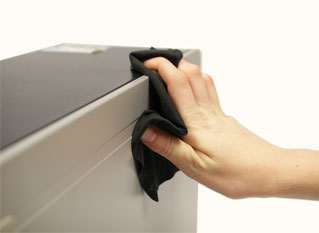Dust is your computer's main enemy. Use an
    anti-static wipe to lightly dust your computer casing. Don't use
    furniture cleaners or strong solvents.

-   Use a can of compressed air with a narrow nozzle to blow out debris
    from the air intake slots.

-   Spray cleaning solution (such as diluted ammonia cleaner or
    glass cleaner) on a paper towel or anti-static wipe. Clean the
    monitor housing and case (not the monitor screen) by wiping in a
    downward motion.

-   A safe cleaning solution for computer surfaces (not
    computer screens) is ammonia diluted with water, or glass cleaner
    comprised mostly of ammonia and water (check the label). Remember,
    the milder the solution, the better. **Do NOT use these solutions on
    the computer screen!**

#### Cleaning Methods Overview

  -----------------------------------------------------------------------------------------------------
  Computer Part      Cleaning method
  ------------------ ----------------------------------------------------------------------------------
  Keyboard           Shake it upside down to remove dust and dirt
                     
                     Can of compressed air to clear dirt between the keys
                     
                     Wipe with a cotton cloth moist with rubbing alcohol

  Mouse              Both Optical and mechanical: wipe with a cotton cloth moist with rubbing alcohol
                     
                     Quick method: move up and down on clean white paper

  Monitor            Wipe the screen with a clean cotton cloth moistened with WATER

  Computer case      Wipe with an ant-static wipe to prevent dust

  Air intake slots   Blow out dust with compressed air

  Monitor housing    Wipe with a cleaning solution such as water and ammonia or a glass cleaner

  -----------------------------------------------------------------------------------------------------

#### Keep it cool

Don't restrict airflow around your computer. A computer can generate a
lot of heat, so the casing has fans that keep it from overheating. Avoid
stacking papers, books, or other items around your computer.

Many computer desks have an enclosed compartment for the computer case.
If you have this type of desk, you may want to position the case so it
is not against the back side of the desk. If the compartment has a door,
you may want to leave it open to improve airflow.

### Chapter 3: Safeguarding against malware

#### What is malware?

Malware is any type of software that is designed to damage your computer
or gain unauthorized access to your personal information. It includes
viruses, worms, Trojan horses, spyware, and other types. Most malware is
distributed over the Internet, often bundled with other software. It can
also insert its way into your computer from a USB drive or CD/DVD disc.

The easiest way to think about it is as if it was a virus, infecting a
body. If it gets in, and is not treated, it gets worse and can affect
other computers by passing the virus on to them.

#### How malware infects your computer

Malware infects your computer in lots of different ways. Some of the
most common ways are as follows:

-   Through emails from other infected computers;

-   When you download programs or files from the internet; and

-   When you visit internet websites that are infected or set up by
    people who write programs deliberately set up to infect
    your computer.

#### Signs that your computer is infected

Unlike with a person, it is hard to tell when a computer is infected! A
number of signs are as follows:

-   Your computer is running slower than usual;

-   Your friends tell you that they have received emails which you
    didn’t send yourself;

-   You get error messages;

-   Internet browsers or programs open, even if you didn't try to open
    them!

#### How you can avoid malware

*Antivirus software*

The best way to guard against malware is to install antivirus software.
Antivirus software does three main things:

-   Prevents your computer from being infected;

-   Searches your computer to see if you have any infections; and

-   Removes any malware found.

Although it might sound daunting, downloading and installing antivirus
software is relatively easy, and step-by-step instructions are available
online, and have been written for newcomers to computers.

There are many different companies supplying antivirus software – we
aren’t going to recommend a specific one here. Please search the
internet, or talk to a supplier for the package that suits your needs
and budget (some are even free!).

New malware is being created all the time, so it's important to update
your antivirus software frequently – this should be done automatically
by the antivirus program when you connect to the internet. But if not,
there is an easy way to change the settings.

Also, antivirus software, such as the software illustrated below, may
run out (for example, after 1 year). It is thus important to know when
that happens so you can update to the newest version.

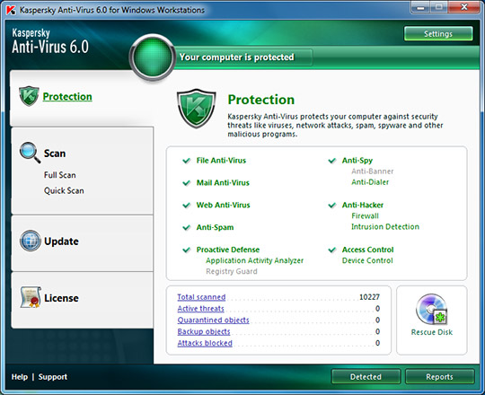

*General good practice *

It's important to **stay smart** when you're browsing the Web or using
email. If a website or email attachment looks suspicious, trust your
instincts. Keep in mind that your antivirus program may not catch
everything, so it's best to avoid downloading anything that might
contain malware. You might say that a little paranoia is a good thing.
When it comes to malware such as viruses, you should always be wary of
anything you download to your computer!

#### What to do if you think your computer is infected

-   If you have antivirus software – disconnect from the internet and
    run the software. Let it find the malware and delete it from
    the system. If this does not work, you will need to contact an
    IT specialist.

-   If you do not have antivirus software (why not?!) – download one
    from the internet and follow the above steps.

### Chapter 4: Backing up the data on your computer

#### Why is backup important?

Imagine what would happen if your computer suddenly stopped working.
Would you lose any important documents, photos, or other files? You
could lose years of work in 1 second!

It may be possible to repair your computer, but your files may be **lost
forever**. Luckily, you can prevent this by creating **backup** copies
of all of your files (or just the important ones) on an **external hard
drive** or an **online backup service**.

#### External hard drives

-   You can purchase an **external hard drive**
    and copy the contents of your computer to it. The **initial backup
    could take several hours**, so you will need to select a period of
    time when you do not need access to your computer. Running the
    backup overnight usually works best.

-   Follow-up backups should be conducted on a regular basis, but will
    not take as long because the drive will only need to copy your most
    recent files.

-   **Western Digital**, and **Seagate** produce popular external
    hard drives. Conduct some research on which product best suits your
    storage needs, or ask a computer sales representative
    for recommendations.

-   One drawback, compared to online backup services, is that your
    external hard drive can be lost, damaged, or stolen just as your
    computer might be. Therefore, it is important to keep your drive in
    a **secure location** when not in use.

#### Online backups

-   You can also backup your files to one of the **online backup
    services** like [Mozy](http://mozy.com/home),
    [Carbonite](http://www.carbonite.com/) or
    [Box](http://www.box.net/), and your files will always be accessible
    to you, as long as you are connected to the internet.

-   The amount of storage space provided by these sites varies, and you
    may have to pay a monthly or yearly fee for adequate storage.

-   Again, do your research, as these services are constantly changing
    and offer varying features.

-   One drawback to online backup services is that the initial backup
    can be slow and may even take days to upload if you have a large
    number of files. However, subsequent backups should not take
    as long.

### Chapter 5: Other maintenance techniques and personal health

#### Other maintenance techniques

-   To keep your computer running smoothly, it's important to keep files
    and folders **uncluttered**. Cluttered or unorganized folders make
    it more difficult to find the files you need.

-   Additionally, unwanted files can eventually fill up your **hard
    drive**, which will make your computer slower and more difficult
    to use. Here are a few things you can do to delete unwanted files
    and improve your computer's performance:

-   **Delete files:** If you have any unwanted files, you can delete
    them manually. To do this, simply drag them into the **Recycle Bin**
    (or **Trash**), then empty the Recycle Bin. Another way to delete a
    file is to **right click** on it, which brings up a **Context menu**
    (see Figure on next page). Then scroll down the menu to select the
    **Delete** option.

    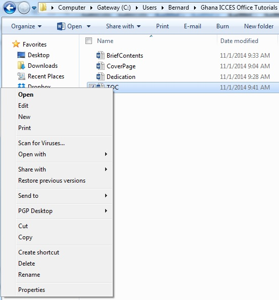

-   **Disk Defragmenter:** Windows includes a **Disk Defragmenter**
    program in the Control Panel (see Figure below). It **scans** the
    files on your hard drive and **rearranges** them so it can read
    them faster. If your computer is running slowly, running Disk
    Defragmenter can help to speed it up.

-   **Disk Cleanup:** Windows also includes a **Disk Cleanup** program
    > in the Control Panel (see Figure on the next page. It scans your
    > computer for **temporary files** and other files that can
    > be deleted. You can then delete the files to free up space on your
    > hard drive.

> 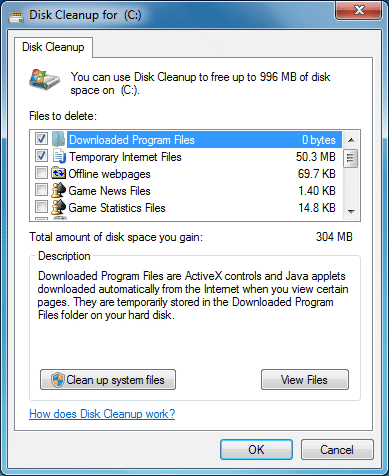

#### Avoiding strain and injury

In addition to keeping your computer healthy, it's important to think
about **your own health**. **Computer ergonomics** is the science of
equipment design and how specific equipment usage and placement can
reduce a user's discomfort and increase productivity.

Using a computer involves a lot of repetitive motions such as **typing**
and using the **mouse**. Over time, these motions can begin to take
their toll on your body, especially your **wrists**, **neck**, and
**back**.

Staring at a monitor for long periods of time can also cause **eye
strain**.

To minimize, or even altogether avoid, these problems, the simplest
solution is to take frequent breaks from work at the computer. Every
hour at least, get up, take a stroll, relax your arms and wrists and
shoulders—**take a break!**

You should also take a few moments to make sure your workspace is
arranged in a comfortable and healthy way. Some equipment is designed
with special attention to ergonomics, such as **ergonomic keyboards**
and **ergonomic chairs**.

#### Correct seating position

-   **Adjust your chair:** Make sure your chair is adjusted to allow you
    to sit in a natural, comfortable position and at a height where your
    eyes are looking slightly **down** at the screen to minimize strain
    on your neck. Use a cushion or pillow if your chair is
    not adjustable. A good office chair is specially designed to
    **support the lower back** and promote good posture (see
    Figure below).

    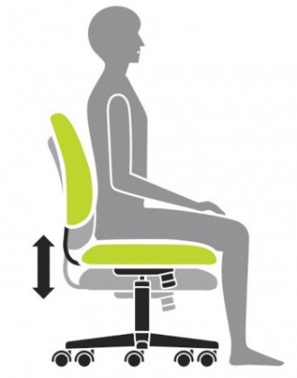

-   **Keep the keyboard at a comfortable height:** Try to place the
    keyboard in a position that allows you to keep your wrists straight
    and relaxed to avoid wrist strain. Many desks have a keyboard tray
    that can keep the keyboard at a better height. You can also buy an
    **ergonomic keyboard** that is designed to minimize wrist strain
    (see Figure below).

    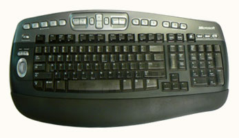

<!-- -->

-   **Keep the mouse close to the keyboard:** If possible, place the
    mouse right next to the keyboard. If the mouse is **too far away**,
    it will be uncomfortable or awkward to reach after a while.

-   **Place the monitor at a comfortable distance:** The ideal position
    for a monitor is **20 to 40 inches** away from your eyes. It should
    also be **at eye level** or **slightly lower**.

-   **Avoid clutter:** The computer area can quickly become
    **cluttered** with papers, computer accessories, and other items. By
    keeping this area as uncluttered as possible, you can improve your
    productivity and prevent strain or injury.

### Chapter 6: Daily, Weekly, Monthly, Quarterly and Annual Maintenance

#### Daily Maintenance

-   **Virus Scan** - A regular virus scan is essential to the safety of
    your computer. We recommend scheduling your anti-virus software to
    run a virus scan once a day.

-   **Data Backups** - We recommend at least daily saving of essential
    files to a CD-R. Backing up data is a simple process with today's CD
    drives and burning software or you can run the backup utility
    provided with Windows

-   **Shut Down** - When you're done using your computer each day, I
    recommend shutting down the system. This saves electricity and wear
    and tear on your system's operating system and hardware. Just doing
    this can extend the life of your computer significantly.

#### Weekly Maintenance

-   **Disk Cleanup** - running system cleanup at least once a week
    deletes unnecessary temp files, temporary internet files and your
    recycle bin freeing  up hard drive space that can slow down
    your computer. You can access System Clean up by clicking on
    **Start &gt; All Programs &gt; Accessories &gt; System Tools &gt;
    Disk Cleanup**.

-   **Disk Defragmenting** - as you create and edit files on your
    computer they get saved on your hard drive. Each file is allocated
    so much space within on location on your hard drive and for large
    files they may take up more space, thus having to take up more than
    one space on the hard drive. Running disk defragmenter at least once
    week will keep your file fragments down and allow your hard drive to
    work more efficiently. You can run disk defragmenter by **Start &gt;
    All Programs &gt; Accessories &gt; System Tools &gt; Disk
    Defragmenter** and then select the drive you want to defragment.

-   **Update Virus Definitions** - This is very important to ensure your
    computer is up to date on the latest virus threats in cyberspace.

-   **Shut Down** - We recommend doing a complete shut down of your
    computer at least once a week when practical. It is very important
    for the operating system to have a complete reboot at least once a
    week to lower operating system degradation.

#### Monthly Maintenance

-   **Windows Updates** - This is a good chance to ensure your operating
    system is running up to date with the latest security patches. You
    can update your Windows Operating System by going to
    *www.update.microsoft.com.*

#### Quarterly Maintenance

**Clean the Computer** - Often overlooked, cleaning your computer vents
of dust and other fuzz is very important. With a brush and vacuum
cleaner or a can of air, you can clean the vents for the power supply
and side vents on the computer.

-   Before cleaning ensure the power is off and follow the instructions
    on the can of air to safely accomplish this task.

-   Be careful not to breathe in suspended dust particles. We recommend
    wearing a dust mask to avoid setting off any allergies.

#### Annual Maintenance

Your local computer repair technician should be scheduled to have the
inside of your computer cleaned, CPU fan checked, and cables and circuit
cards checked for sound connections.

[^1]: A digital object is any object that can be “read” by a computer,
    which means it must be represented in the binary 1s and 0s of
    computer language.
