Lab Setup & Maintenance Handbook
================================

All necessary information on setting up an E-Learning Centre can be found in this handbook.

If you have any queries, please contact Camara. All Camara E-Learning Centres must meet our high standards in
security and safety; equipment will NOT be installed in sub-standard labs.

Layout in Scribus

Camara Education

www.camara.org

## Contents

1. LAB SIZE & SHAPE
   * 1.1 L-Shaped
   * 1.2 U-Shaped
   * 1.3 E-Shaped
   * 1.4 Double U-Shaped
   * 1.5 Accessiblity & Safety
   * 1.6 Minimum Lab Sizes
   * 1.7 Furniture & FIttings
2. INSTALLATION
   * 2.1 Peripharels
   * 2.2 Networking
   * 2.3 Printers
3. POWER & PROTECTION
   * 3.1 Surge Protection
   * 3.2 Cables, Sockets & Trunking
   * 3.3 Backup
4. SECURITY & SAFETY
   * 4.1 Securing the Lab
   * 4.2 Lab Safety
   * 4.3 Inventory & Lab Access
   * 4.4 Ventilation
5. MAINTENANCE
   * 5.1 Safety & Repair
   * 5.2 Troubleshooting
6. COMPUTER PARTS
   * 6.1 RAM
   * 6.2 Hard Drive
   * 6.3 Motherboard
7. CAMARABUNTU
   * 7.1 Introduction
   * 7.2 Navigation
8. PRODUCT LIST
   * 8.1 Product List
9. COMPUTER COMPONENT & INSTALLATION GUIDE
   * 9.1 Introduction
   * 9.2 General Layout
   * 9.3 Components in Detail
   * 9.4 Installing RAM Modules
   * 9.5 Installing Floppy Disk Drive
   * 9.6 Installing IDE Devices
   * 9.7 Installing Expansion Cards
   * 9.8 Installing BIOS/CMOS Battery
   * 9.9 Front & Back Panels
   * 9.10 Connecting Power

## 1. LAB SIZE AND SHAPE
### 1.1 L-Shaped

ADVANTAGES OF AN L-SHAPE

- The teacher can observe each computer screen in the classroom without having to walk around.

- Students can seethe whiteboard without obstruction.

- It enables a lab to be set up in a smaller space

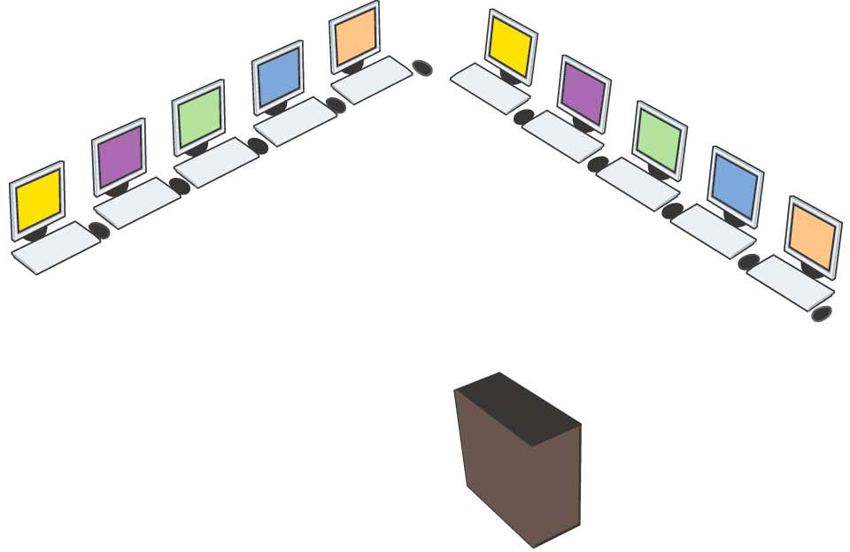

It is important that you correctly measure the room that is proposed will contain the computer lab. Also, note the location of all electrical sockets in the room

### 1.2 U-Shaped

*Camara recommends that all labs be set up in a U-shape.*

ADVANTAGES OF A U-SHAPE

- The teacher can observe each computer screen in the classroom without having to walk around.

- Students can see the whiteboard without obstruction.

- In large classrooms, it maybe useful to have chairs and tables in the middle of the room for the theoretical or discussion sections of the class, so that students are not distracted by the computers.

- This lab arrangement avoids cables in the centre of the room which helps to prevent tripping or other accidents.

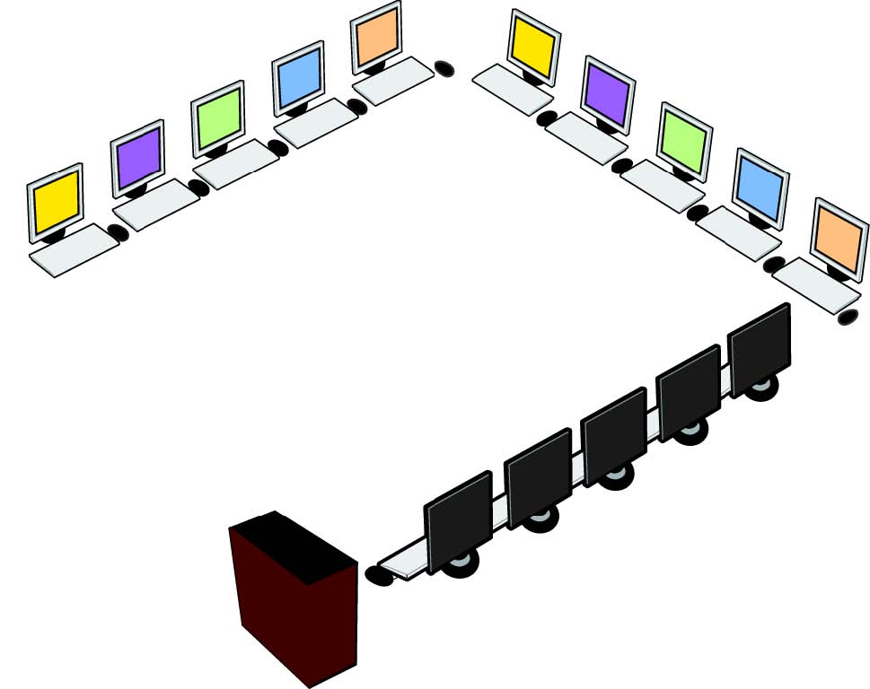

### 1.3 E-Shaped

*In some cases, e.g Polytechnic Colleges, Camaralabs maybe in an E­shape.*

ADVANTAGES OF AN E-SHAPE

- Increases the amount of available space for learning and equipment.

DISADVANTAGES OF AN E-SHAPE

- Difficult to teach in as the teacher does not have full control of the room.

- Cables and wires must be carefully covered with secure trunking to prevent tripping and breakage

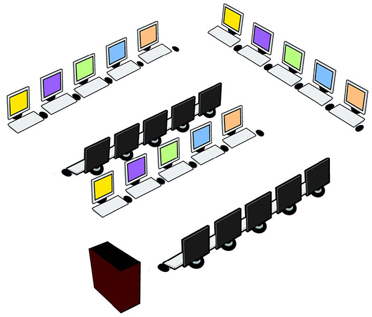

### 1.4 Double U-Shaped

*In some cases, e.g Polytechnic Colleges, Camaralabs maybe in a Double U-shape.*

ADVANTAGES OF A DOUBLE U-SHAPE

- Increases the amount of available space for learning and equipment.

DISADVANTAGES OF A DOUBLE-SHAPE

- Are difficult to teach in as the teacher does not have full control of the room.

- Cables and wires must be carefully covered with secure trunking to prevent tripping and breakage.

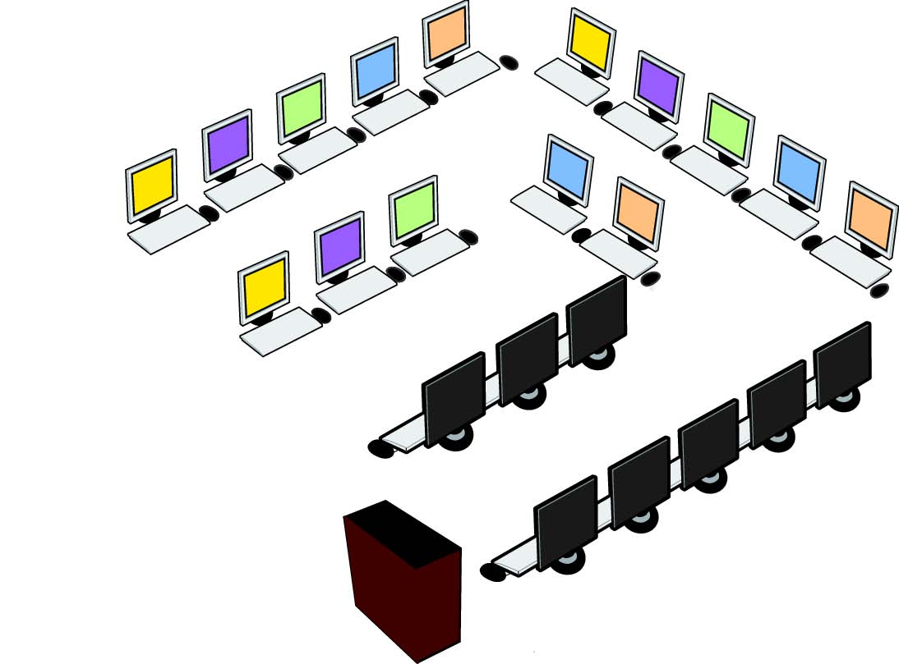

### 1.5 Accessibility & Safety

*ACamara computerlab should be arranged so as to facilitate any student with impaired mobility.*

#### ACCESS FOR PEOPLE WITH MOBILITY IMPAIRMENTS

**Doorway Openings**:  
- at least 81.5 cm (32”) wide

**Work Surfaces**:  
- 76 cm (30”) high  
- 70-75 cm (29”) floor clearance  
- at least 51 cm (20”) deep  
- minimum width of 1.5 cm (36”) to allow leg space for the seated individual

**Aisle width**:  
- 107cm (42“) to 122cm (48”) sufficient to operate a wheelchair.

Ideally, provide at least one adjustable workstation in your computer lab

#### FIRE SAFETY

- The trainer should not leave the class while students remain present.

- All cables should be safely installed inside trunking to avoid impeding exit. Contact your Emergency Fire Control Centre for design advice

Adequate thought and planning in setting up the lab helps to create a safe and productive learning environment

### 1.6 Minimum Lab Sizes

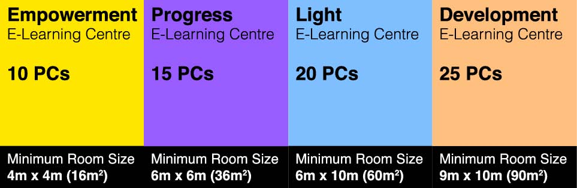

### 1.7 Furniture & Fittings

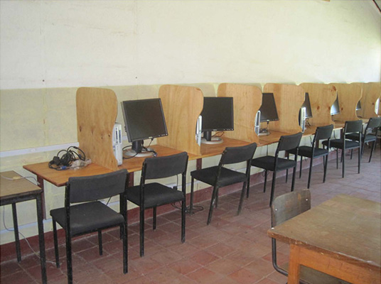

*Camara PCs must be supported on strong, stable and sufficiently large tables, with students using sturdy chairs orbenches.*

Computers should be spaced approximately 90 cm apart - this is to ensure that students are not cramped in the classroom, particularly when students are sharing workstations. Tables should be approximately 70 cm high.

All Labs should have a whiteboard (formica) but NOT a blackboard as chalkdust causes damage to computers.

## 2. INSTALLATION

### 2.1 Peripherals

*Computer peripherals include mice,keyboards, monitors andprinters.*

All devices and peripharles should be pluggedin at bootup. USB drives, headphones, etc. maybe plugged in after boot up.

The **power cable** is connected at the back of the PC. All Power cables are plugged into a surge-protected power bar or UPS (Uninterrupted Power Supply) battery powered power supply unit.

The **mice andkeyboard** are connectedto the PS/2 ports at the back of the computer.

A flashing green light next to the **ethernet** port, when an ethernet cable is connected, indicates an active network connection.

The **monitor** is plugged into a video card port at the back of the computer with a VGA cable. Note: The video card may have a DVI port. If so, a DVI to VGA adapter is required in order to attach a VGA monitor. The adapter must be firmly attached to the computer port.

This section contains essential information to help you set up a Camara computer lab and understand the importance of certain aspects in creating the optimal environment.

### 2.2 Networking

*If yourlab is networked, you may have access to a very large range of extra software, including server-based teaching tools such as Moodle. If an Internet connection is present you may have access to email and the Web at each PC.*

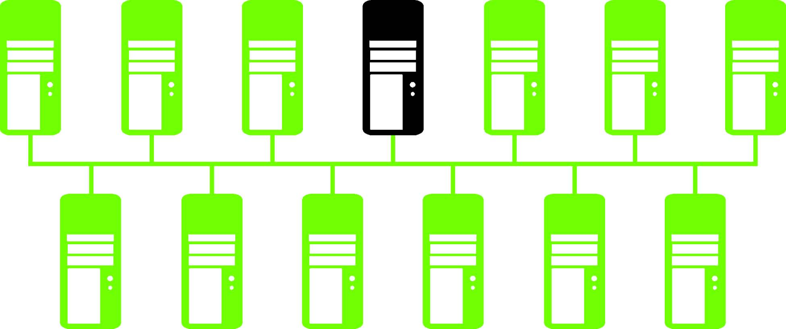

### 2.3 Printers

*It is necessary, before buying a printer, to ensure that is compatible with the installed version of Camarabuntu (Ubuntu).*

Ifa network is present, the printer maybe attached and accessed by all networked computers in the lab.

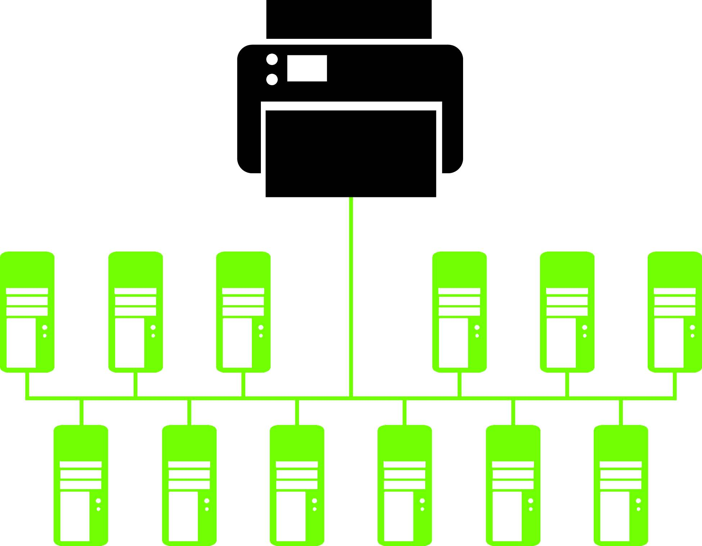

## 3. POWER & PROTECTION

### 3.1 Surge Protection

*All Camara Labs MUST have a surge protection unit installed at the E­-Learning Centre. This will prevent damage to the equipment when there are spikes or drops in power.*

#### UPS - UNINTERRUPTED POWER SUPPLY

Camara recommends that an Uninterrupted Power Supply (UPS) be used with computers and equipment where a loss of power could cause a permanent loss of information; UPS's provide short-term electrical power should the normal supply fail.

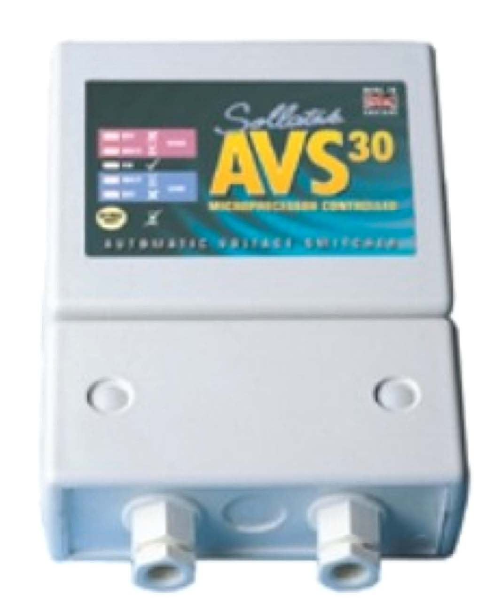

### 3.2 Cables, Sockets & Trunking

*Each Computer-Monitor pair must have one twin socket. For example, a 10 PC lab needs 10 twin sockets for the computers and monitors.You will need additional sockets for networking, wall fans, printers, scanners and projectors.*

#### INSTALLATION

Sockets should be installed below the table line, this will prevent younger students from interfering with them.

All electrical wires should be contained within sealed, insulated trunking. The thickness of the wiring should be 2.5mm or higher. This will prevent shorting due to leaks, loss of current and injury to students and staff.

The thickness of the wires connecting the mains to the surge protection should be between 6-10mm.

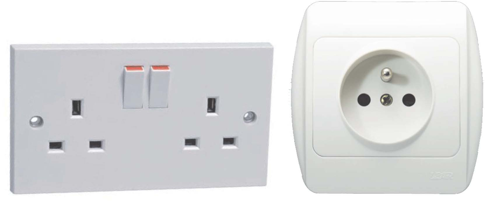

### 3.3 Backup

*It is important to regularly make copies of (or back up) data so that these additional copies can be used to restore information in the event of a data loss.*

Backups can restore a system state following a disaster; you can also restore small numbers of files after they have been accidentally deleted or corrupted.

Consult your Camara Technical Representative.

## 4. SECURITY & SAFETY

### 4.1 Securing the Lab

*It is essential that the computer lab be fully secured. Camara will not install PCs in an insecure location.*

### COMPUTERS LABS MUST HAVE
- A solid steel or grilled door with a strong lock
- Grilled windows (with the bars firmly attached to the wall)
- Solid walls with no gaps or holes
- Sealed and secured roof/ceiling (if the lab is in a building of its own, a ceiling is not essential provided that the roof is sealed and secure). The ceiling should be strong and made of three-ply or stronger, to stop dust and falling objects from entering the room.
- Cemented floors. These can be covered by carpet or another material, as long as it is non-slip and well-maintained (i.e. no torn edges which can cause people to trip).
- Windows that can be opened. Louvres should be placed over the windows to prevent dust and rain from entering the room; this will also allow light to pass through.
- An alarm system will add further protection, but this is not mandatory for receiving Camara computers.

### 4.2 Lab Safety

### REDUCE THE RISK OF DAMAGE TO COMPUTER PERIPHERALS
- No smoking, food, or drink should be permitted in computer labs, as they can damage the equipment and attract insects or rodents.
- Supply garbage bins, and keep workspaces clean and clear of sharp objects and debris.
- Secure monitors, keyboards, mice and audio hubs to prevent removal and theft.
- Attach a small padlock to the back of each PC to prevent internal components, especially RAM, from being stolen.

*The standard user account is camara (password: camara). The administrator’s password should not be disclosed to students.*

### 4.3 Inventory & Lab Access

Camara will supply a full inventory of all equipment supplied upon the completion of any installation. This record is an important document and should be treated as such.

Camara computers are valuable items and access to the lab should only be afforded to appropriate people, the lab should remain locked outside of school hours unless an officially-sanctioned event/training is taking place. Also, a teacher should always
remain in the lab when students are present; this is both for the safety & security of the lab, and the students.

Some computer malfunction may be because of missing internal components. The supplied inventory can be referred to, e.g. to compare the amount of installed RAM in a PC to the amount of RAM originally supplied by Camara (min. 512 MB).

### 4.4 Ventilation

*A computerlab must have good air circulation.*

#### AVOID DAMAGE TO ELECTRONIC COMPONENTS DUE TO OVERHEATING
Computers can generate a lot of heat. Without good air flow it may be difficult for anyone to use the lab for extended periods of time. Camara Labs must be well ventilated as computers are easily damaged by the excess heat.

Classrooms can become quite hot and computers increase the room temperature. In hot regions, rooms must be kept cool by adequate airflow provided by windows and fans, or air conditioning. It is advisable to place thin netting over the windows or louvres to prevent dust from entering the room. This will still allow light and air to pass. Rooms should have fans placed at regular intervals.

Fans may be either wall- or ceiling-mounted, as pictured.

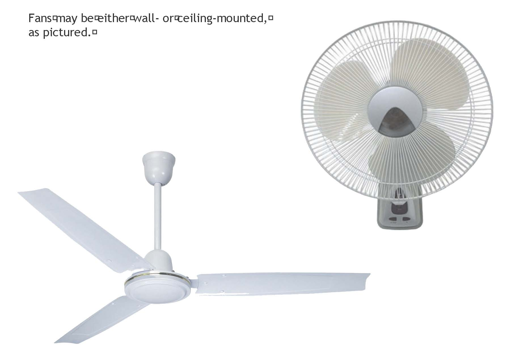

## 5. MAINTENANCE

### 5.1 Safety & Repair

*Only trained individuals should fix faulty equipment. Please contact Camara in the event of any problems.*

All machines should be powered off and disconnected from the mains before being opened for inspection or cleaning. Even small electrical charges or static can cause irreparable damage to equipment.

Computers contain small and valuable parts that are easily removed – often with little visible change to the machine, but rendering the computer completely inoperable. It important that only trusted individuals have access to, or are allowed to open, the
computers.

The school administration and teachers should be familiar with the parts of a computer and conduct regular checks to ensure nothing is missing or taken. Camara will provide you with a full inventory, including parts, when you receive the computers
for your lab.

### 5.2 Troubleshooting

*Here are some tips to guide you if the following situations occur:*

#### KEYBOARD NOT RESPONDING
Press the **Num Lock** key to ensure the keyboard is connected and active. (The corresponding LED light should blink on and off).

## 6. COMPUTER PARTS

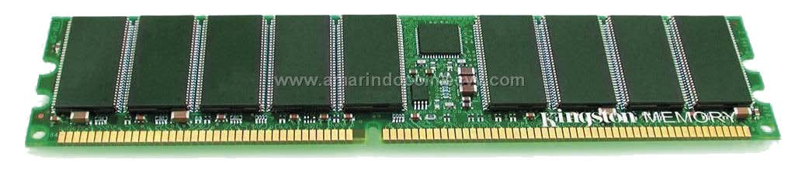
#### RAM
RAM: Random Access Memory. A computer may have multiple RAM sticks. Camara computers have at least 512 MB of RAM (e.g. 1 X 512 MB, 2 X 256 MB). If all the RAM sticks are removed, the computer cannot function and will not turn on. If some, but not all, of the RAM IS removed the computer will operate very slowly.

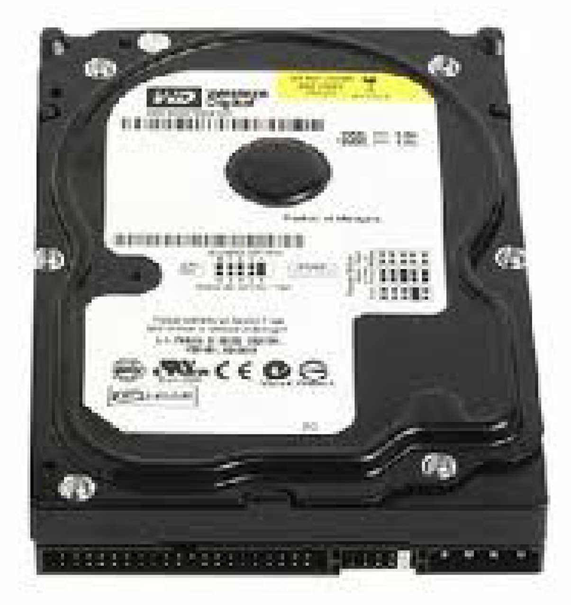
#### Hard Drive
The hard drive stores all of the computer's information; Hard Disk Drives (HDD's) come in a range of sizes – the larger the hard drive the more space there is to store information. Without a hard drive, the computer cannot not operate.

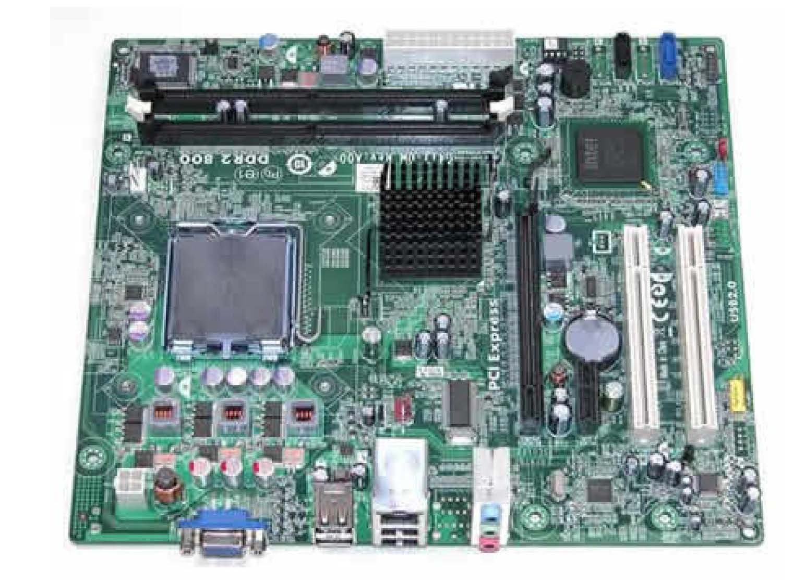
### Motherboard
The motherboard contains all of the components, including the Central Processing Unit (CPU), and all parts of the computer
are connected to it. If the motherboard is damaged, the computer will not work. If the processor is taken out, the computer
will not work. A processor is very difficul and not generally viable, to replace.

## 7. CAMARABUNTU

### 7.1 Introduction

*The type of operating system determines how someone can use the various programs and interface on a computer. Examples of different
operating systems are: Windows 7, Windows XP, Ubuntu Jaunty and Apple’s Snow Leopard.*

The Ubuntu Operating System is Free and Open Source Software (FOSS). This means that you do not need to pay a licence fee to use it. Unlike non open source software, you can also make changes to it and give it to your friends and colleagues without breaking the law.
There are number of other advantages of using Ubuntu:

- It is affected by very few viruses
- It is very stable
- It is takes less time for programs to load and so is faster than many other operating systems.
- You can access thousands of programs and educational tools at no cost.
- You can run many Windows programs on Ubuntu, including Microsoft Office.

### 7.2 Navigation

*For most users, the most substantial difference between Ubuntu and other Operating Systems is the user interface and navigation.*

Ubuntu is simple to navigate and you will notice only small differences between Windows and Ubuntu. After completing Camara training, teachers will be able to use the educational materials and tools to teach students confidently and comfortably.

In the case of any problems, Camara is on hand for ongoing support and guidance. In Camara’s experience, students taught how to use Ubuntu are able to easily adapt to and use other operating systems and programs.

Camara supplies its own version of Ubuntu – Camarabuntu – which includes much educational software and tools. The server provided to each lab holds a large software store, so schools can install programs without Internet access or CDs/DVDs.

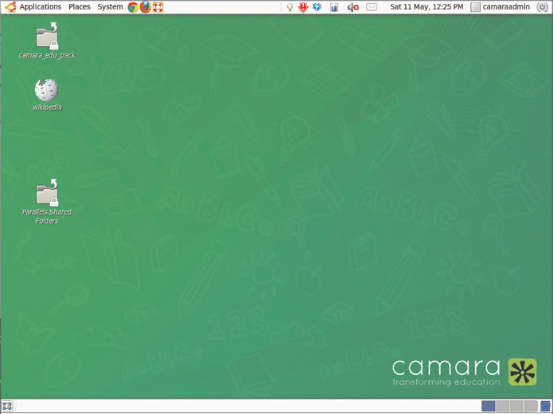

## 8. PRODUCT LIST

### 8.1 Product List

SECURITY
- Steel Doors
- Grilled Windows
- Internal Locks
- External Padlocks
- Three Ply (Ceilings)
- Softboards (Ceilings)
- Nails
- Screws
- Concrete

POWER & PROTECTION
- Surge protection
- UPS (optional)
- Twin sockets
- Twin switch box
- Screws & Nails
- Wood pegs
- Electrical Cable x 2 types
- Trunking Tube
- Lights

VENTILATION
- Steel Doors
- Ceiling Fans
- Wall Fans
- Louvres
- Air Conditioning Units

FURNITURE & FITTINGS
- Timber
- Tables
- Desk
- Chairs
- Whiteboard

## 9. COMPUTER COMPONENT & INSTALLATION GUIDE

### 9.1 Computer Component Introduction

*The components or layout illustrated here may be different from your yours. For specific hardware installation, you may refer to the Quick User’s Guide.*

You can browse any section of this guide, however, if you read the manual from the front to the back, you will find a logical installation progression.

#### SYMBOLS USED IN THIS SECTION

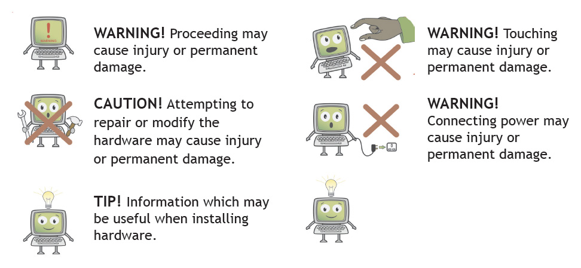

TOOLS NEEDED

For the sake of safety and convenience, have these tools to hand before starting work. A cross- or flat-head screwdriver, can be used for most of the installation.

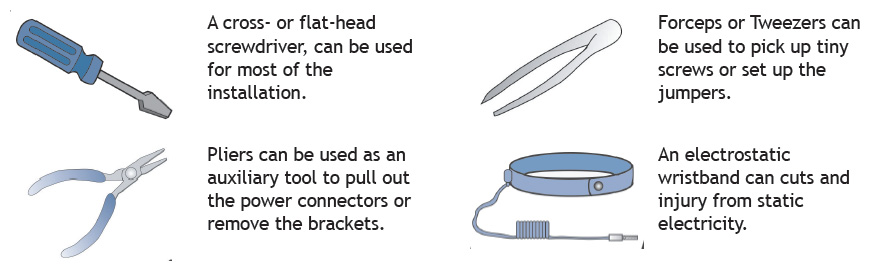

Pliers can be used as an auxiliary tool to pull out the power connectors or remove the brackets. Forceps or Tweezers can be used to pick up tiny screws or set up the jumpers.

An electrostatic wristband can cuts and injury from static electricity.

### 9.2 General Layout

*Below is an example of a typical general installation. The layout of your mainboard may be different from the image below.*

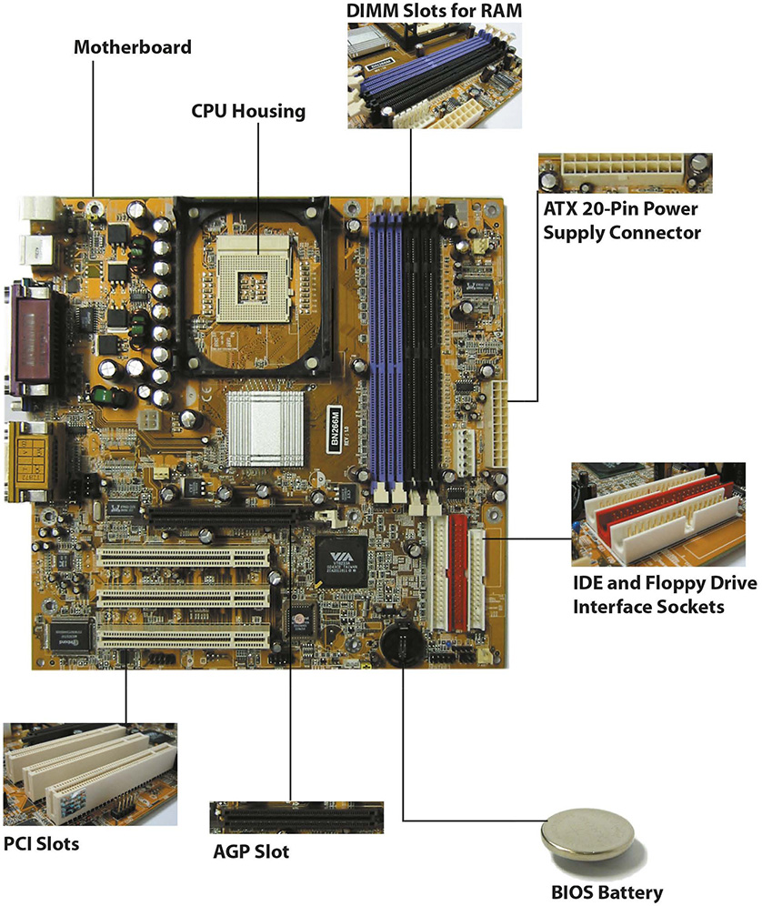

### 9.3 Components in Detail

DIMM/RAM SLOT

The DIMM slot is used for installing RAM modules.

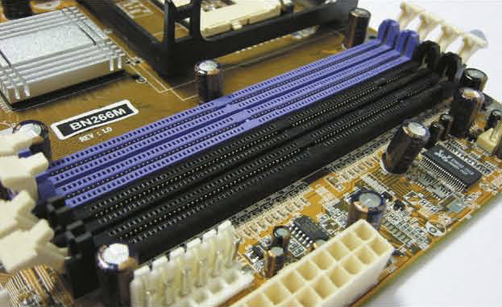

IDE AND FLOPPY DRIVE INTERFACE SOCKETS

These connectors allow the installation of IDE devices, such as Hard & Floppy Disk Drives.

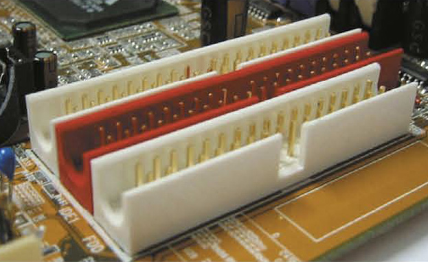

IDE DEVICE CONNECTOR

The connector, or ribbon cable, enables the installation of IDE devices, e.g. CDROM Drive.

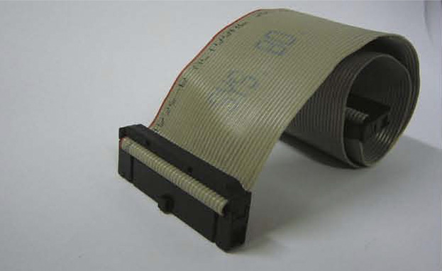

ATX 20-PIN POWER SUPPLY CONNECTOR

This connects the ATX power and provides power to the motherboard.

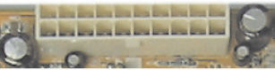

PCI SLOT

This slot is provided for expansion card with PCI interface. Example - an Audio card for dedicated audio control.

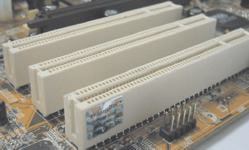

RAM MODULE

Random Access Memory is used when an application, such as a word processor, is in use. The computer temporarily saves the data to the RAM until the user saves the document.

This is why data is lost if the computer is switched off accidentally or improperly.

BIOS BATTERY

The BIOS battery is a standard metal oxide battery.

It does two jobs; first it keeps the computers clock going when it is off; second, it stores information such as RAM size, computer speed and hard drive size.

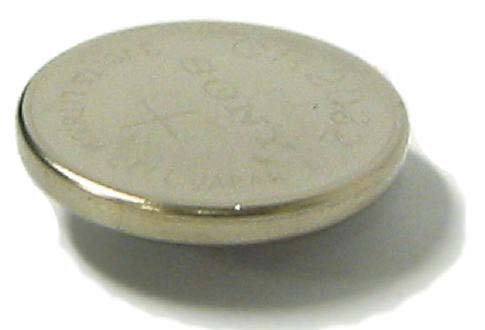

AGP SLOT

The Accelerated Graphics Port is a slot provided for VGA cards with an AGP interface.

These are primarily used for monitors with high display resolutions. They can also allow the computer to be connected to a projector.

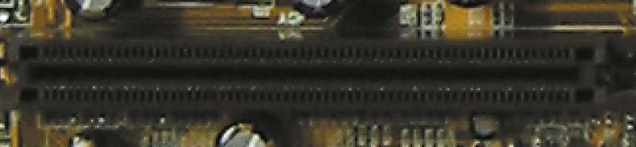

### 9.4 Installing RAM Modules
*We take the DDR (Double Data Rate) RAM modules as an example to show you the installation process. Consult your agent for the proper RAM modules.*

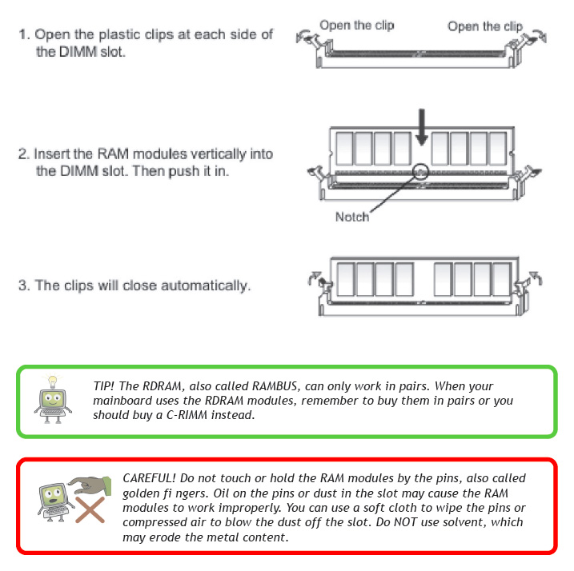

Installing the Floppy Disk Drive

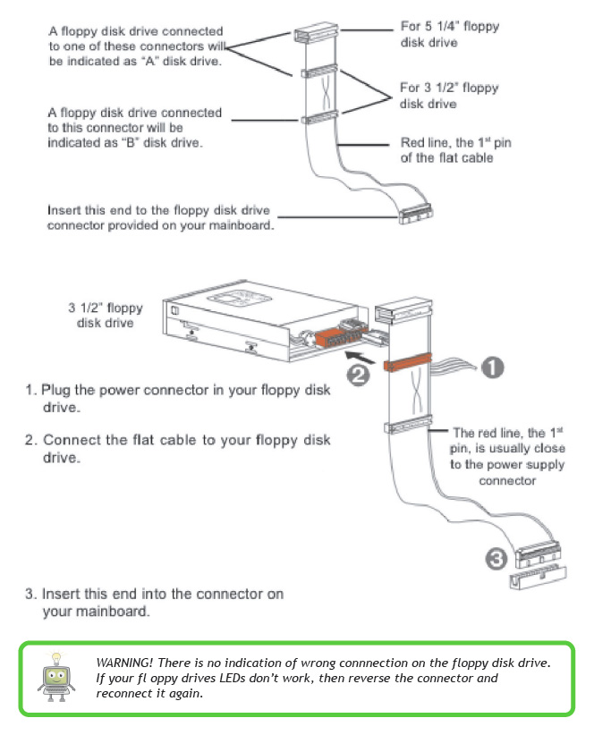

### 9.5 Installing IDE Devices

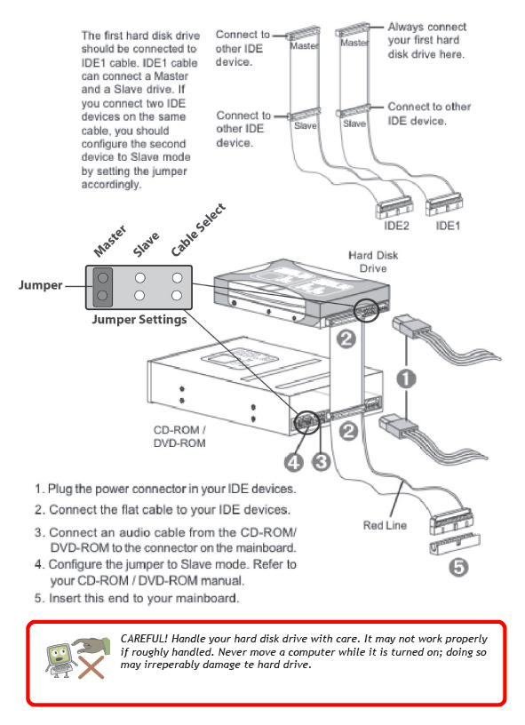

### 9.6 Installing Expansion Cards

INSTRUCTIONS

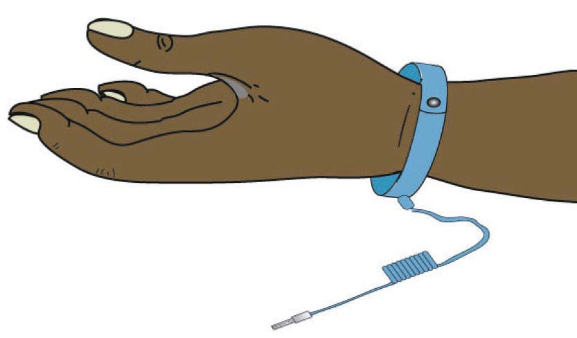

1. Remove the computer case.
2. Remove the corresponding bracket obstructing the expansion card.
3. Locatethe AGP slot onyour mainboard.
4. Put the card directly over the proper slot and press one end of the card into the slot first. Gently but firmly press the other end until it is fully seated in the slot.
5. Secure the card with a bracket screw.
6. Install all other cards and devices and connect all the cables, and then replace the case.

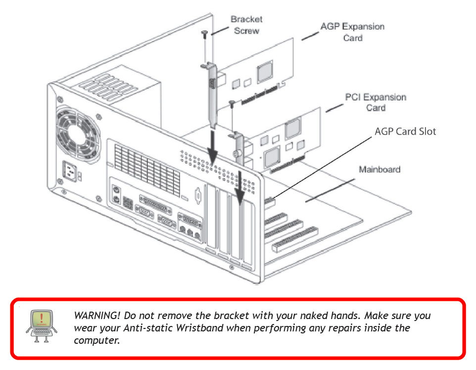

### 9.7 Installing the BIOS/CMOS-Battery

*The CMOS (Complementary Metal-Oxide Semiconductor) battery is located on your computer’s motherboard. It’s similar to that in a handheld calculator.*

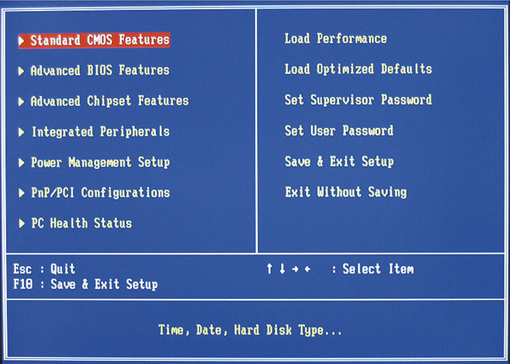

1. GET ACCESS TO THE MOTHERBOARD

   Unplug the computer and disconnect all of the cables. Remove the side or top panel to reveal the motherboard.

2. LOCATE THE BATTERY

   The most common type of CMOS battery is CR2032, a round, silver-colored battery about the size of a US dime coin.

3. REMOVE THE OLD BATTERY

   Next, remove the old battery. Different motherboards have various configurations of clasps that keep the battery clipped to the motherboard. Be careful not to break the retaining clips, or anything else, on the motherboard.

4. INSTALL THE NEW BATTERY

   Now install the new battery. Be sure to put the poles in the same position as the original battery: For a CR2032, the positive pole (marked with a plus sign [+]) should be facing up. Use the clips to hold the battery in place.

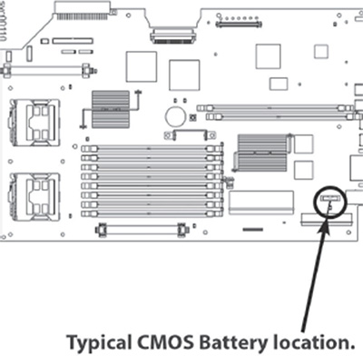

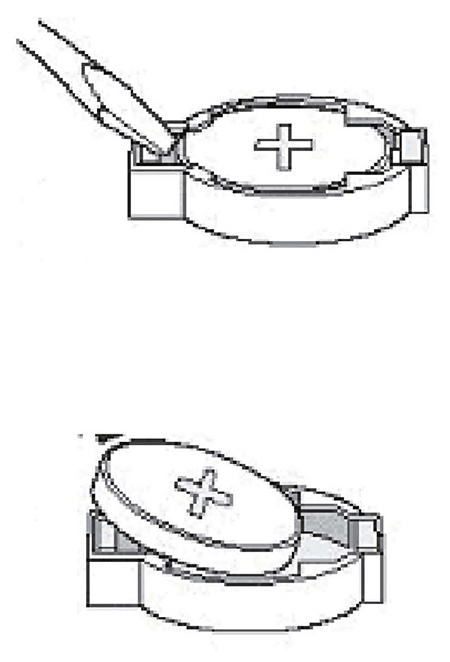

### 9.8 Front & Back Panels

*The font and rear panels on your computer may differ from those illustrated here.*

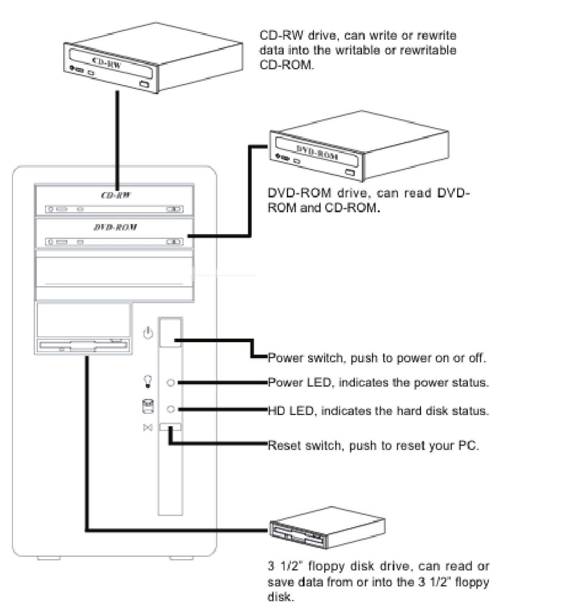

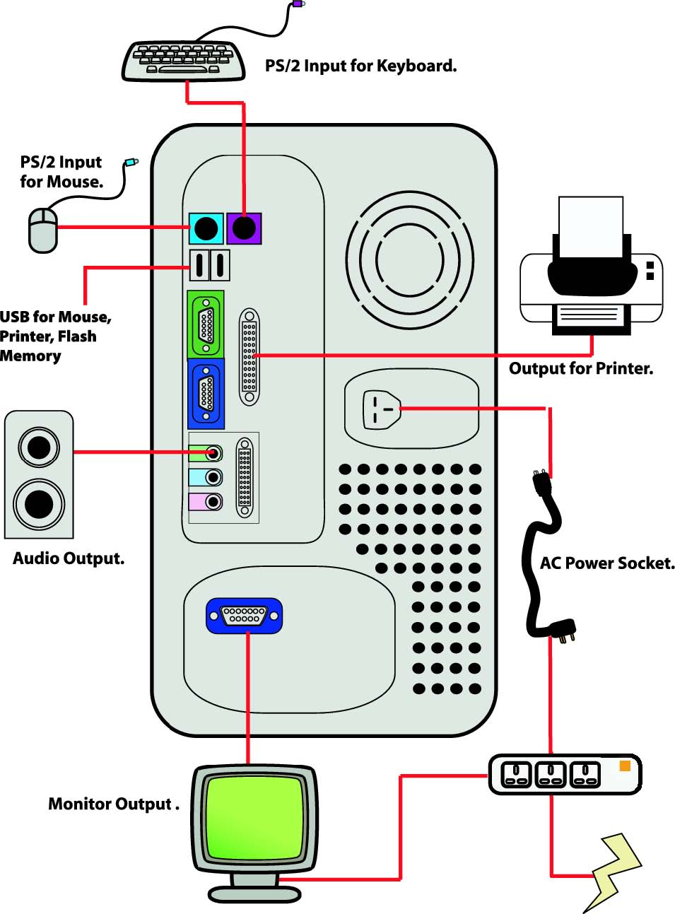

### 9.9 Connecting Power

INSTRUCTIONS

1. Plug the ATX 20-pin power connector in the female receptacle provided on your mainboard.
2. The connector is entirely plugged in securely when you hear the click sound.

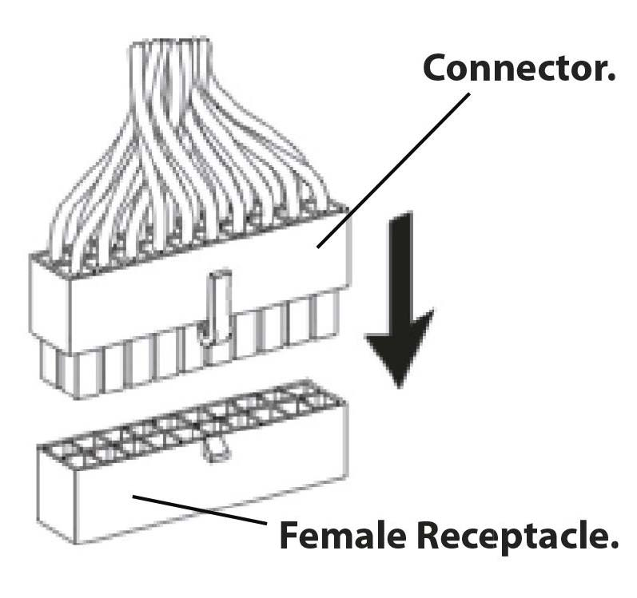

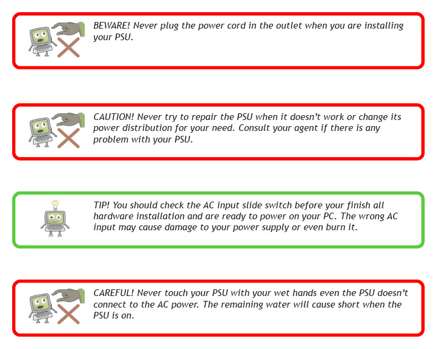

### 9.10 CheckList

Please use this check list to ascertain the status of your proposed lab.
Once all the boxes are ticked, please notify us so that we can verify
that your lab is ready to receive computers.

* [  ] Is there a steel door?
* [  ] Is there a cemented floor?
* [  ] Are there concrete walls?
* [  ] Is there a ceiling?
* [  ] Are there grilled windows?
* [  ] Are there glass windows?
* [  ] Is there adequate ventilation?
* [  ] Is there a whiteboard?
* [  ] Is there power in the lab?
* [  ] Does the lab have surge protection?
* [  ] Are there secure, stable, sufficiently large tables?
* [  ] Are there enough sockets?
