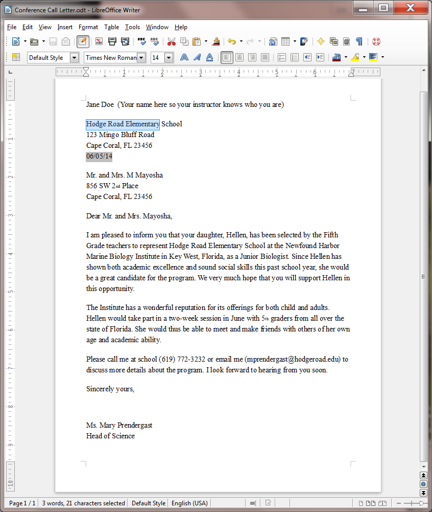

**Lesson 1** Introduction to *WRITER*
=====================================

  ------- ----------------------------------
  **1**   **Introduction to *WRITER***
          
          Writing a Conference Call letter
  ------- ----------------------------------

**LEARNING OUTCOMES**

In this tutorial, along with some helpful hints to bear in mind when
word processing, you will learn the steps required to produce a word
processed document from scratch and carry out basic formatting and
editing functions. These include:

1.  opening and naming a new word processor document

1.  entering and saving a document

1.  updating and simple formatting of a document

1.  checking a document for spelling and grammar errors

1.  printing a document

1.  making a backup copy of a document

**BEFORE YOU BEGIN**

Lesson 1 makes the assumption that you are already familiar with the
*Windows* computing environment, though you may not be an expert in its
use. If you are using a computer in a lab at school, you'll also know:

1.  where to find the computer lab on campus;

1.  how to turn the computer on;

1.  how to log on to the system (using your login name and password).

You also should be familiar with the **W**indows, **I**cons, **M**enus,
and **P**ointers (the so-called **WIMP** interface) with which you
interact with the computer. If not, your instructor will make this clear
to you before you proceed with these tutorials.

Lesson 1 assumes that you have received a copy of the set of *Work Files
for LibreOffice* that accompany these tutorials. These files ideally
should be stored on a Flash drive (USB drive) in three folders named
*Base Files*, *Impress Files*, and *Miscellaneous Files*. You also will
need a fourth folder for the *data files* that you will be creating
while working your way through the tutorials. This fourth folder will be
called *Data Files*.

If you do not have these four folders and files ready, prepare them now
before proceeding with this tutorial.

Here are the steps to take:

> First, **Unzip** the set of **Work Files for LibreOffice** by double
> clicking on the File name on your computer (your instructor will help
> you with this if you are working with a class) and **Extract** them
> onto your flash drive
>
> **Double click** on the **Work Files for LibreOffice** folder to
> **open** it

Now, inside the *Work Files for LibreOffice* folder you need to create a
new, *fourth,* folder called *Data Files.* Here’s how you do this.

> **I**n the **Work Files for LibreOffice folder**, select **New
> Folder** (Fig. 1.1).

Fig. 1.1 Creating a New Folder

The system will create a new folder for you and then wait for you to
give it a name of your choice (Fig. 1.1 above).

> Call the new folder **Data Files**

During the course of these tutorials you will be storing many files in
this Data Files folder.

**1.1 Opening, naming & saving a new *Writer* document**

**Opening a new *Writer* document**

Before you can use *LibreOffice*, you must first open the program. Every
system is slightly different in the steps to open a program, so we’ll
assume that you already have that figured out, or you have someone, such
as your instructor or a friend, who can help you get started.

Fig. 1.2 illustrates the screen you will see when you first open a new
*Writer* document.

Fig. 1.2 New blank *Writer* document (annotated)

Fig. 1.2 illustrates the Ruler Bar, along with the tool for setting *tab
stops* and the tools for setting *indents*—called *indent markers*.

> Check out the tool for setting **Tab stops**; it’s on the same line as
> the **Ruler bar**, but at the **left edge** of the *Writer* window
> (see Fig. 1.2 above)—it’s so small you could easily miss it (and a lot
> of *Writer* users do!)
>
> Make a mental note of the **Indent Markers** too; they’re on the left
> and right sides of the **Ruler** **bar** (Fig. 1.2 again)

**Naming and saving a new *Writer* document**

Here are the steps to save this first *Writer* document on your flash
drive.

> Look at the new document’s **default name** (it’ll be **Untitled1**)
> at the **top left** of the *Writer* window (see Fig. 1.1 above)

The document is given this default name by *LibreOffice* because you
haven't yet given it a name of your own. It is ALWAYS a good idea,
however, to immediately—and thoughtfully –name a new document before you
even enter any data, and then save the document on the drive and in the
folder where you intend to keep it.

> Make sure your Flash drive is inserted in your computer, then, from
> the **File menu**, select **Save As**

*Writer* displays the *Save As* dialog box (Fig. 1.3).

Fig. 1.3 The Save As dialog box

The *Save As* dialog box prompts you, among other things, to

> \(1) select the *location* or disk drive where you want to save the new
> document (in this case your Flash drive or Removable Disk);
>
> \(2) navigate to, and then either create or select, a *folder* on that
> drive in which to save the new document (in this case, your Data Files
> folder);
>
> \(3) type a *name* for the document before clicking on the Save button.

The Save As dialog box thus lists the various locations where your files
can be saved.

> Make sure your **flash drive** is in one of the available **USB
> ports** in the computer then, in the left frame of the **Save As
> dialog box**, click on **Removable Disk** to **open** it (Fig. 1.3 on
> the previous page)
>
> Now, in the list of various folders and files that may be on your
> flash drive, **locate/navigate to** the folder named **Work Files for
> LibreOffice** (you may need your instructor to help you find it on
> your computer this first time) and **double click** on it to **open**
> it

You should now see a list of four folders, including the Data Files
folder you created when you prepared it for use with these tutorials.

> **Double click** to open the **Data Files** folder (see Fig. 1.3
> previous page)

**Creating a new folder on a disk**

Inside the Data Files folder you need to create a new folder to store
all the documents you will create using *Writer*.

> Still in the **Save As** dialog box, click on the **New Folder** icon
> (Fig. 1.4)

Fig. 1.4 The New Folder icon in the Save As dialog box

As you can see, the system immediately creates a New Folder with a
default name highlighted in blue, inviting you to type a name of your
own for the New Folder.

> Type **Writer Documents** for the new folder’s name**,** hit the
> **Enter** key, then **double click** on the folder to **Open** it

*Writer* opens the new folder so that you can save the new document
inside it (Fig. 1.5).

Fig. 1.5 Naming the Conference Call Letter

> In the **File name:** data entry box (Fig. 1.5), type **Conference
> Call Letter** to replace the default name and press **Enter** (or
> click the **Save** button)

The *Save As* option thus allows you to *name* your documents and at the
same time determine the *location* (the folder, on a particular disk) on
which you want to store them.

From now on, you do not need to select *Save As* to save the document
*unless* you want to save a backup or save it in some other location.
Whenever you simply *Save* this particular file, it will be saved with
the name Conference Call Letter in this same folder (Writer Documents)
on your flash drive.

**1.2 Some HELPFUL HINTS WHILE USING *WRITER***

When you are using a computer, the only time you need to hit the Enter
key is *at the end of a paragraph*, whether the paragraph is an empty
line, one word, one line, or several lines.

> Type the following passage (next page) for practice now—remember,
> ***don't*** press the **Enter** key until you get to the end of the
> paragraph[^1]
>
> And though he tried to look properly severe for his students, Fletcher
> Seagull suddenly saw them all as they really were, just for a moment,
> and he more than liked, he loved what he saw. No limits, Jonathan? he
> thought, and he smiled. His race to learn had begun.[^2]
>
> Now press **Enter** at the end of the paragraph

Notice how the word processor took care of the end of each line.

**Removing unwanted Returns (using the Show ¶ option)**

You can have *Writer* show you exactly where, in your document, you hit
the Enter key (say, at the end of paragraphs). The easiest way to do
this is to click on the Show ¶ icon in the *Standard Toolbar* (Fig.
1.6).

> Fig. 1.6 The **Show ¶** icon on the Standard toolbar
>
> Click on the **Show** **¶** tool now

The Show ¶ tool also puts a dot to show wherever there is a space
anywhere in the text.

> Position the cursor immediately before the sentence that begins “**No
> limits, Jonathan?…**”, then hit the **Enter key** twice

Notice the ¶ symbols that show you where you hit the Enter key—one at
the end of the previous line, and the other on the empty line ahead of
the cursor.

> Now remove the **Paragraph marks** you just entered by pressing the
> **Backspace** key **twice**
>
> Finally, click on the **Show ¶** icon in the **Paragraph** **Group**
> of the **Home** **Ribbon** to turn off the paragraph marks and all the
> dots between the words

**Undoing unintended actions**

If you do something you didn't intend, or if you make a mistake, you'll
select *Undo* from the *Standard toolbar* which is located immediately
below the *Menu Bar* (Fig. 1.7). This is a lifesaver that you will use
often!

Fig. 1.7 Undo/Redo tools

> Check out this **Undo** option in the **Standard toolbar** now so you
> can see where to find it

A quicker way to Undo is to use the shortcut **Ctrl-z** on your
keyboard.

**Scrolling through a document**

We need to open a longer document so you can practice different ways of
scrolling.

> From the **File** menu select **Open**, navigate to **USB drive** >
> **Work Files for LibreOffice** > **Miscellaneous Files** >
> **Practice** folder, and **double click** to **open** the document
> called **Term Paper**

Now, with the Term Paper document open on the screen, take a look at the
scroll bars (Fig. 1.8).

Fig. 1.8 The scroll boxes

On the right of the screen you have a *vertical* scroll bar and, inside
it, the *vertical scroll box*. At the bottom of the screen you have a
*horizontal* scroll bar and *horizontal scroll box*.

At either end of the scroll bars are arrows pointing in opposite
directions (left and right, or up and down). Clicking on these arrows
will scroll a document left or right or up and down. Scrolling from left
to right or right to left is simpler than scrolling up or down, since
you only have the width of the page to deal with. But the process is the
same for scrolling up and down, too.

> Try scrolling now from side to side—left to right and back again—by
> clicking on the **scroll arrows** to move the **scroll box** in the
> horizontal **scroll bar**
>
> Try scrolling up and down by clicking on the **scroll arrows** to move
> the **scroll box** in the vertical **scroll bar**

You can scroll a lot faster by positioning the mouse arrow on the scroll
box itself, holding down the left mouse button, and dragging the box
left or right, up or down, in the scroll bars.

> Try this, too

If you click either side of the scroll box *inside* the horizontal or
vertical scroll bars, this causes the document to scroll in jumps from
side to side or up and down.

> Try this as well

You also can scroll and position the cursor very precisely across a line
of text, character by character, or up and down from line to line, by
using the arrow keys on the lower right of the keyboard.

> Try this as well

Finally, yet another vertical scrolling option is available if you have
a mouse with a rubberized wheel between the buttons, as illustrated in
Fig. 1.9.

Fig. 1.9 The scrolling wheel on the mouse

> Try this, too
>
> When you have finished experimenting with the scroll bars, **close**
> (**File** > **Close**) the **Term Paper** document

**Shortcuts or quick keyboard commands**

The quickest way to save your work is to press **Ctrl-s** on the
keyboard. The **Ctrl (Control)** key is in the lower left corner of the
keyboard. Locate it now. You'll be using it a lot as you become more
familiar with the *Office* programs. It is always used in combination
with one or two other keys. **Ctrl-s**, for example, is executed by
holding down the **Ctrl** key and, while holding the **Ctrl** key down,
simultaneously quickly pressing on the “**s**” key.

**Renaming a document**

You will sometimes want to rename a document that you've already saved
on your disk. One way you can do this from the desktop is by
*right-clicking* on the icon for the document you want to rename. Then,
from the *context* *menu* that pops up whenever you right-click on an
object on the screen, select the option to *Rename…*, which highlights
the document’s name so that you can type a new name for it.

To rename a document which you already have open in *Writer*, or in any
other *LibreOffice* application, you would choose *Save As* from the
File menu. This will give you the opportunity to save the document with
a new name of your choice. Bear in mind, though, that when you do this,
the document with the original name will still be on your disk—a second
copy, if you like. If you don't want to keep this copy, you should
delete it right away so as to remove unwanted clutter from your disk
drives.

**1.3 CREATING AND Saving A document**

*Practice makes perfect*

You still should have open the Conference Call Letter, with the Jonathan
Livingstone Seagull quote. You need to clear the Seagull quote from the
document, so here are the steps to remove it.

> In the **Edit** menu choose **Select All** then press the
> **Backspace** key **once** to remove the highlighted text from the
> document

You can also *Select All* using the Quick Keyboard command **Ctrl-a**,
or you can use the mouse (or your finger if you have a touch screen) to
**drag to highlight** the whole paragraph, or you can **quadruple
click** on the paragraph.

Notice that the Backspace key removes all highlighted text. The Del(ete)
key, in this case, does the same.

**Typing the Conference Call letter**

You should now have a blank page with the cursor waiting in the top left
corner, ready for you to type in the Conference Call Letter. Fig. 1.10
on the next page has the full text of the Conference Call letter. The
Figure also shows where all the Paragraph marks (¶) are. This will help
you remember to hit the *Enter* key only where necessary, *not* at the
end of every line. There’s no need to show Paragraph marks in your
version of the document.

As you type, *Writer* will automatically warn you of any spelling or
grammar errors it finds (by underlining them in red or blue on your
screen). This will occur as you type the contents of Fig. 1.10.

Fig. 1.10 First version of the Conference Call Letter

Once you have typed in the whole document and saved it, you should go
back and correct any errors you may have made, and then save the
document again. Remember: when you save a document with the same name as
before, you are *replacing* the earlier version. You *won't* be creating
a second copy.

**1.4 UPDATING AND simple formatting of A document**

Now that your letter is saved on disk, you can make any revisions you
want. Refer back to Fig. 1.10 while you complete the next few sections
of the tutorial.

**Inserting the date**

There is no date in the **Conference Call Letter** in Fig. 1.10. A
letter is incomplete without a date, so here are the steps to have
*Writer* put today's date in the letter.

> Click to position the **insertion point** cursor right **after** **the
> zip code** in the *first* address at the top of the page, then press
> **Enter**

The cursor should now be waiting at the beginning of the next line.

> In the **Insert Menu** > **Fields Menu** click on the **Date** tool
> (Fig. 1.11)

Fig. 1.11 Inserting the Date into a document

As soon as you click on the Date tool, *Writer* immediately inserts
today’s date at the cursor.

There is, however, one problem with the date’s format (all numeric)—it
uses the USA style, with the month first and the day second. Elsewhere
in the world, the date is shown with the day first and the month second.
So, where you have 3/4/2014, is that March 4, 2014, or April 3, 2014.
You really can’t be sure.

Fortunately, *LibreOffice* has a quick way around that problem by
allowing you to select another format for the date which can in no way
be confused. Here’s what you need to do.

> Use the mouse to **right click** on the **date**, and in the **context
> menu** that pops up, select **Fields…**
>
> The **Edit Fields** dialog box comes up, enabling you to select from a
> long list of possible date formats (Fig. 1.12)

Fig. 1.12 Selecting a commonly-recognized date format

Noticed the two options in the Select column for the Date. You can
either choose a Fixed Date, which is the default and inserts the current
date as a fixed value which will not change over time. The second option
is not fixed; Date (not fixed) inserts the date as a variable function;
the date will change each time you open the document in which it is
inserted.

The Conference Call Letter is a one-off letter, so the fixed Date option
is what you want.

> Make sure **Date (Fixed)** is highlighted, then click to select the
> date format **Friday, December 31, 1999** and click on **OK**

Now check the new format for the date; it’s clear what the date is now.

**Adding text to an existing document **

You will most always want to add text to an existing document—make
revisions and so forth; it is an activity which is fundamental to the
whole process of writing. Let's practice now.

There is no limit to the extra details that could be added to the
letter, but for the sake of this exercise you will add just one sentence
to the next to last paragraph to help the parents appreciate what Hellen
will get out of the experience at the Institute.

> Position the **insertion point** cursor so it is at the **END** of the
> **paragraph** which begins "**The institute has a wonderful
> reputation...**"—so after the phrase **“…state of Florida.**”, then
> press the **space bar** and type the sentence:
>
> **She would thus be able to meet and make friends with others of her
> own age and academic ability.**

Read over the sentence you just typed to check for errors. Correct any
you may have made. Before you go on to the next section you should save
what you have done so far.

> Press **Ctrl-s** to save the changes you have made to the letter

**Removing text**

There are several ways of removing text. In a moment you'll learn how to
highlight a block of text in order to move or delete larger sections of
text. But if all you want to do is remove a few words, or a short
sentence, the quickest way is to use the Backspace key.

You are going to remove the second sentence of the second paragraph.
This second sentence begins "I have attended the facility myself...".

> Position the **insertion point** cursor at the beginning of the
> **third** sentence of the **second** paragraph—the sentence that
> begins "**Hellen would take part ...**"
>
> Press the **Backspace** key as many times as is necessary until the
> second sentence of this paragraph is removed from the letter

You'll find the automatic repeat feature of the keyboard (activated by
holding down a key such as the Backspace key) will come in handy for a
delete operation like this.

> Press **Ctrl-s** again to save the changes you just made

**Changing text**

It is often necessary to change a word or words here and there in a
document. The Conference Call Letter overuses the word "program," for
example. The word appears once in the first paragraph and then is used
twice in the final paragraphs. To improve the letter it would be better
to rewrite the first sentence of the second paragraph to read: "The
Institute has a wonderful reputation for its offerings for both children
and adults."

> Place the cursor between the **period (full stop)** and the "**s**” at
> the end of the **first sentence** in the **second** paragraph (right
> at the end of the word "**programs**" but *before* the period (full
> stop))
>
> Use the **Backspace** key to remove the text “**both children and
> adult programs**”
>
> Make sure there is still a **space** after the word “**for**”, then
> type the phrase “**its offerings for both children and adults.**”

Another change you need to make is to the telephone number in the first
sentence of the last paragraph. A common error with numbers is called
transposition, where one accidentally reverses the order of digits. The
number is supposed to be 772–32***32***, not 3223.

> Position the cursor just at the **end** of the **telephone number**,
> press the **Backspace** key **2** times, then type the digits
> "**32**", and press **Ctrl-s**

At this stage your Conference Call Letter should look much the same as
Fig. 1.13.

^Jane\\ Doe^

^Hodge\\ Road\\ Elementary\\ School^

^123\\ Mingo\\ Bluff\\ Road^

^Cape\\ Coral,\\ FL\\ 23456^

^Thursday,\\ June\\ 5,\\ 2014^

^Mr.\\ and\\ Mrs.\\ M\\ Mayosha^

^856\\ SW\\ 2nd\\ Place^

^Cape\\ Coral,\\ FL\\ 23456^

^Dear\\ Mr.\\ and\\ Mrs.\\ Mayosha,^

^I\\ am\\ pleased\\ to\\ inform\\ you\\ that\\ your\\ daughter,\\ Hellen,\\ has\\ been\\ selected\\ by\\ the\\ Fifth\\ Grade\\ teachers\\ to\\ represent\\ Hodge\\ Road\\ Elementary\\ School\\ at\\ the\\ Newfound\\ Harbor\\ Marine\\ Biology\\ Institute\\ in\\ Key\\ West,\\ Florida,\\ as\\ a\\ Junior\\ Biologist.\\ Since\\ Hellen\\ has\\ shown\\ both\\ academic\\ excellence\\ and\\ sound\\ social\\ skills\\ this\\ past\\ school\\ year,\\ she\\ would\\ be\\ a\\ great\\ candidate\\ for\\ the\\ program.\\ We\\ very\\ much\\ hope\\ that\\ you\\ will\\ support\\ Hellen\\ in\\ this\\ opportunity.^

^The\\ Institute\\ has\\ a\\ wonderful\\ reputation\\ for\\ its\\ offerings\\ for\\ both\\ children\\ and\\ adults.\\ Hellen\\ would\\ take\\ part\\ in\\ a\\ two-week\\ session\\ in\\ June\\ with\\ 5th\\ graders\\ from\\ all\\ over\\ the\\ state\\ of\\ Florida.\\ She\\ would\\ thus\\ be\\ able\\ to\\ meet\\ and\\ make\\ friends\\ with\\ others\\ of\\ her\\ own\\ age\\ and\\ academic\\ ability.\\ ^

^Please\\ call\\ me\\ (619)\\ 772-3232\\ or\\ email\\ me\\ (mprendergast@hodgeroad.edu)\\ to\\ discuss\\ more\\ details\\ about\\ the\\ program.\\ I\\ look\\ forward\\ to\\ hearing\\ from\\ you\\ soon.^

^Sincerely\\ yours,^

^Ms.\\ Mary\\ Prendergast^

^Head\\ of\\ Science^

Fig. 1.13 Intermediate update to the Conference Call letter**\
**

**Selecting (highlighting) a block of text**

Let’s take a few minutes to learn about highlighting text in a *Writer*
document. Highlighted text is text that stands out from the rest of the
document because, in the case of *LibreOffice*, the background of the
highlighted text becomes a block of light blue color (Fig. 1.14).

> 

Fig. 1.14 Highlighted text

When you highlight text, you can do things to it (delete it, move it,
copy it, change the margins set for it, change the font, the text style
or color, and so on) without affecting the rest of your document.

*You can highlight a single character...*

> Use the mouse to position the cursor so it is immediately before the
> "**H**" in **“Hodge**" in the address at the top of the letter
>
> Hold down the left mouse button **and keep it down** as you carefully
> drag across just the "**H**" at the beginning of the word so that it
> becomes highlighted

This latter operation is tricky the first few times you try it. If you
drag across more than just the "H", keep your finger on the left mouse
button and drag back until you have just what you want highlighted. You
can select as much or as little of the text as you want. Remember,
*you're in control.*[^3]

> Let go of the left mouse button when just the "**H**" is highlighted
>
> Now click anywhere in the text to remove the highlighting (i.e. to
> deselect the selected text)
>
> Try this a few times on different letters anywhere in the document

*Double clicking to highlight a single word...*

> Position the **I–beam cursor** anywhere over the word "**Elementary**"
> in the **first line of the address** at the **top of the letter** and
> **double click** the left mouse button

The single word "Elementary" should be highlighted on the screen.

> Click anywhere in the text to remove the highlight
>
> Try this on a few more words anywhere in the document till you're
> comfortable with the action

*Triple clicking to quickly highlight a sentence...*

> Position the **cursor** anywhere in the middle of a paragraph and
> **triple** click on the left mouse button
>
> Click anywhere in the text to remove the highlight, then try this
> again on other sentences elsewhere in the document till you're
> comfortable with the action

*Quadruple clicking to quickly highlight an entire paragraph...*

> Position the **cursor** anywhere in the middle of a paragraph and
> **quadruple** click on the left mouse button
>
> Click anywhere in the text to remove the highlight, then try this
> again on another paragraph elsewhere in the document till you're
> comfortable with the action

*You can highlight an extended area (or block) of text...*

> Place the **cursor** right at the **start** of the first paragraph of
> the letter (before the sentence that reads: **I am pleased to inform
> you…** )
>
> Now, while you hold down the **Shift key**, click at the end of the
> last paragraph (after the sentence that reads: **I look forward to
> hearing from you soon.** and notice that the whole paragraph is
> highlighted
>
> Click anywhere in the text to remove the highlighting

*You can quickly highlight an entire document...*

You should be getting the hang of this highlighting by now. You can drag
the mouse to highlight several paragraphs or even an entire document of
several pages. However, dragging through a 50 page document would
quickly become tedious. So *Writer* provides a short cut to select an
entire document—you may recall using this feature earlier in the
tutorial.

> Press **Ctrl-a** (or in the **Edit menu** choose **Select All**)
>
> Simple; now click anywhere in the text to remove the highlighting

**Using the *Writer* Indent Markers**

The letter is nearly ready to be printed. There are just a couple more
changes you need to make.

For example, one style for letter–writing is to indent the first line of
every paragraph ½”. Another is to position the first address (the
address of the sender) so it appears at the top *right* of the first
page, instead of on the left. In this case, the closing signature could
also be aligned on the right side of the page at the end of the letter.

Fig. 1.15 illustrates these final changes you are going to make to the
Conference Call Letter.

> ^Jane\\ Doe^
>
> ^Hodge\\ Road\\ Elementary\\ School^
>
> ^123\\ Mingo\\ Bluff\\ Road^
>
> ^Cape\\ Coral,\\ FL\\ 23456^
>
> ^Thursday,\\ June\\ 5,\\ 2014^
>
> ^Mr.\\ and\\ Mrs.\\ M\\ Mayosha^
>
> ^856\\ SW\\ 2nd\\ Place^
>
> ^Cape\\ Coral,\\ FL\\ 23456^
>
> ^Dear\\ Mr.\\ and\\ Mrs.\\ Mayosha,^
>
> ^I\\ am\\ pleased\\ to\\ inform\\ you\\ that\\ your\\ daughter,\\ Hellen,\\ has\\ been\\ selected\\ by\\ the\\ Fifth\\ Grade\\ teachers\\ to\\ represent\\ Hodge\\ Road\\ Elementary\\ School\\ at\\ the\\ Newfound\\ Harbor\\ Marine\\ Biology\\ Institute\\ in\\ Key\\ West,\\ Florida,\\ as\\ a\\ Junior\\ Biologist.\\ Since\\ Hellen\\ has\\ shown\\ both\\ academic\\ excellence\\ and\\ sound\\ social\\ skills\\ this\\ past\\ school\\ year,\\ she\\ would\\ be\\ a\\ great\\ candidate\\ for\\ the\\ program.\\ We\\ very\\ much\\ hope\\ that\\ you\\ will\\ support\\ Hellen\\ in\\ this\\ opportunity.^
>
> ^The\\ Institute\\ has\\ a\\ wonderful\\ reputation\\ for\\ its\\ offerings\\ for\\ both\\ children\\ and\\ adults.\\ Hellen\\ would\\ take\\ part\\ in\\ a\\ two-week\\ session\\ in\\ June\\ with\\ 5th\\ graders\\ from\\ all\\ over\\ the\\ state\\ of\\ Florida.\\ She\\ would\\ thus\\ be\\ able\\ to\\ meet\\ and\\ make\\ friends\\ with\\ others\\ of\\ her\\ own\\ age\\ and\\ academic\\ ability.\\ ^
>
> ^Please\\ call\\ me\\ (619)\\ 772-3232\\ or\\ email\\ me\\ (mprendergast@hodgeroad.edu)\\ to\\ discuss\\ more\\ details\\ about\\ the\\ program.\\ I\\ look\\ forward\\ to\\ hearing\\ from\\ you\\ soon.^
>
> ^Sincerely\\ yours,^
>
> ^Ms.\\ Mary\\ Prendergast^
>
> ^Head\\ of\\ Science^

Fig. 1.15 The final version of the Conference Call Letter

*Using the Indent Markers*

Indent Markers are used to adjust the first line, and the left and right
margins, of paragraphs—not individual lines, unless a paragraph only has
one line.

The ***tip*** of the mouse pointer is the ***hot spot*** (Fig. 1.16).
Moving small indent markers is a delicate operation; be sure to position
the ***very** **tip*** of the mouse pointer on an indent marker.

Fig. 1.16 The tip of the mouse pointer is the Hot Spot

On the left side of the ruler, at the 0" hash mark, you can see the two
indent markers that are used to set the *First Line Indent* and the
*Left Indent* for paragraphs. On the right side of the ruler you can see
the *Right Indent* marker (Fig. 1.17).

Fig. 1.17 The Indent Markers

In this exercise you will practice using just the First Line Indent
marker and the Left Indent marker. In Lesson 2 you will have plenty of
opportunity to learn about the Hanging Indent and the Right Indent
markers.

Let’s learn how to use the First Line Indent marker now.

> Click to put the cursor anywhere within the **first paragraph** of the
> letter (this tells *Writer* which paragraph of text to reformat)
>
> In the Ruler bar, place the **tip** of the mouse pointer on the
> **First Line Indent marker** (see Fig. 1.17)
>
> Now use the mouse to drag the **First Line Indent marker** across
> **½”** to the **right** (to the **½” hash mark** on the ruler)

Notice that the First Line Indent marker (the upper triangular marker)
and the Left/Hanging Indent marker (the lower triangular marker) moved
*independently* and that only the first line of the paragraph has moved
to the right half an inch (½”).

Next you are going to set the First Line Indent marker for the second
and third paragraphs in the body of the letter.

> First, make sure you can see the whole letter in the window (maximize
> the window if necessary), then click to position the cursor before the
> **first word of the second paragraph** (before “**The Institute…**”)
>
> Now, while holding down the **Shift** key, click at the end of the
> third (last) paragraph (after the words “…**from you soon.**”)

Both the second and third paragraphs of the letter should be
highlighted.

> Now position the **tip** of the mouse arrow on the **First Line Indent
> marker** and slide it to the **right** to the **½” hash mark** on the
> ruler

Notice that the first line margin of each paragraph is now set at ½" and
the rest of each paragraph is set at 0”.

*Practice makes perfect*

If this is the first time you've used these markers you may still feel
uncomfortable working with them, if only because they’re rather small
and may be difficult for you to grab with the mouse pointer. More
practice will cure that.

You are going to use the Left Indent marker to adjust the left margin
for the First Address and the Date at the top of the letter, and then do
the same to the left margin for the sign off at the end of the letter.
Follow these steps carefully.

> Drag to select (highlight) the **First Address** and **Date** lines at
> the top of the letter (the first four lines)
>
> Point at the **Left Indent marker** (the small marker at the bottom of
> the indent markers on the left of the Ruler bar), hold down the
> **left** mouse button and **drag** both the indent markers together
> over to the **4"** hash mark on the ruler
>
> Let go of the mouse button, then click anywhere in the text to
> de-select the highlighted text

The address and date should now be lined up on the new **4"** margin. If
you weren't successful the first time, just go through the steps again
until you get the hang of it.

> Next scroll down to the **end of the letter** if it doesn't show on
> the screen
>
> Select the lines that begin: "**Sincerely yours,**" and that conclude
> with "**Ms. Mary Prendergast**" and “**Head of Science**” (including
> all three of the blank lines in between)
>
> With these lines highlighted, again point at the **Left Indent
> marker**, hold down the **left** mouse button and **drag** both the
> indent markers together over to the **4"** hash mark on the ruler
>
> Press **Ctrl-s** to save this (almost final) version of the document

**1.5 Checking the document for spelling errors**

*LibreOffice* comes with a spelling checker. However, it *cannot* spell
for you—yet! Nor can it correct errors such as the misuse of "to",
"too", and "two"! A spelling checker is not an alternative to
proofreading. You should always proofread your work on the printed page
(in hard copy form) *after* you have run it through the spelling
checker.

**Accessing the spelling checker**

> In the **Standard Toolbar** click on the icon for **Spelling** **and
> Grammar** (Fig. 1.18)

Fig. 1.18 The Spelling and Grammar tool in the Standard toolbar

This will bring up the dialog box shown in Fig. 1.19.

Fig. 1.19 Spelling and Grammar dialog box

The *Writer* spelling and grammar checker is probably already working
for you if those functions are in automatic mode, if you see strange
looking red or blue underlines under some of the words you typed.

If *Writer* highlights a word or phrase, this does not necessarily mean
there is anything wrong with it. You still have to be able to tell if
you have made an error and also know how to correct it.

If you tell the Spelling Checker to check your document, and it has "No
suggestions" for a word highlighted, the dialog box gives you the option
to have the Spelling Checker *Ignore* it (because the word is correct as
is); or *Ignore All* occurrences of the same word in your document
(because you don’t want the Checker to stop for them again); or *Add*
the word *to* the custom dictionary (so it won’t be flagged in future
documents you work on). This is generally useful for proper names.

In the example in Fig. 1.19 on the previous page, the word “Elementary”
has been mistyped and, as you can see, the misspelling was picked up by
the spelling checker and drawn to your attention. To fix the problem,
you just click on the *Correct* button, and *Writer* will fix it on the
spot.

> Using the **Spelling and Grammar...** option in the **Standard**
> **Toolbar**, work your way through the Conference Call Letter
>
> **Correct** any spelling or typing errors you may have made, then
> **Save** your work

In Lesson 2 you will make more extensive use of the *Writer* Spelling
Checker.

**1.6 Printing a first draft of the document**

**Print Preview–ing your work**

It is always useful to preview your work on screen before sending it to
the printer. In *LibreOffice*, you will be able to preview your work in
the Print dialog box before you send it to the printer. Let’s see how
this works.

> From the **File** menu select **Print** (or press **Ctrl-p**)

*Writer* will present you with the Print dialog box which will be
similar to that shown in Fig. 1.20 on the next page (though every
computer has minor variations when it comes to printing).

Fig. 1.20 Typical *Writer* Print dialog box

*What kind of printer are you using?*

If you have a laser printer, the quality is always "Best." But if you
have an inkjet printer, for example, you can choose the quality of
output you require. You select the print quality by clicking on the
Properties button in the Print dialog box (Fig. 1.20 above).

*Printing a range of pages*

With regard to Page Range, the *Print All Pages* option is selected by
default. The Conference Call Letter is only one page long, so you will
by default want to print the entire document. If you wanted to print a
subset of the pages of a long document, say from page 3 to page 6, you
would click the radio button next to *Pages* (see Fig. 1.20 above) and
enter the numbers of the range of pages in the data entry box (ex.
1,3,5-12).

*Setting the number of copies*

*Writer* also asks you how many copies you want to print. As you can see
(Fig. 1.20), the number 1 is already selected by default, and for a
draft copy that is certainly as many as you would normally want.

You are now ready to print the document.

> Click on **OK** in the **Print** dialog box

If all is well with your printer connections and so forth, your printer
will now go ahead and produce a hard copy of your document. Now you
should take the time once again to carefully read over what you have
typed.

If all is well, you are ready to go ahead and print the final version.

**SKILL CONSOLIDATION**

Complete these exercises to reinforce what you have learned in Lesson 1.
This will help you appreciate the usefulness of the word processor for
all your writing tasks.

1\. Use *Writer* to write a letter to someone in your family or to a
friend using the same layout as the Conference Call letter. There must
be at least four paragraphs in the body of the letter. Print out a draft
copy of the story, proof read it, correct any errors, then print out a
final copy of the story. Hand in both copies to your instructor.

2\. Write a letter to a school district superintendent explaining the
details of a field trip that you are planning for your class. Print out
a draft copy of the story, proof read it, correct any errors, then print
out a final copy of the story. Hand in both copies to your instructor.

3\. Write a short story of at least four paragraphs using *Writer*. Set
the right and left margins at 1.5 inches. Print out a draft copy of the
story, proof read it, correct any errors, then print out a final copy of
the story. Hand in both copies to your instructor.

4\. Use *Writer* to type up a paper of your choice. Print out a draft
copy of the paper, proof read it, correct any errors, and then print out
a final copy of the paper. Hand in both copies to your instructor.

5\. Using *Writer*, type a paper of at least four paragraphs explaining
what you have learned so far in tutorial 1. Print out a draft copy of
the paper, proof read it, correct any errors, and then print out a final
copy of the paper. Hand in both copies to your instructor.

6\. Open *Writer* to create a new document. Name the document “A Day at
the Beach” and type at least four paragraphs on this topic. Practice
adding and deleting words, phrases, and whole sentences. Print out a
draft copy of the paper, proof read it, correct any errors, and then
print out a final copy of the paper. Hand in both copies to your
instructor.

7\. Open the document "Conference Call Letter." Change the date so that
it is the current date, save the updated document. Remove all the first
line indents from the paragraphs. Add a paragraph explaining that if
Hellen cannot attend the Institute this year, the offer will be open
again next year. Save the updated document. Print out a draft copy of
the letter, proof read it, correct any errors, then print out a final
copy of the letter. Hand in both copies to your instructor.

[^1]: The lines on your screen may be longer or shorter.

[^2]: From the book "Jonathan Livingston Seagull: a story" by Richard
    Bach. New York, NY: Avon, 1970. And yes, the grammar is correct, so
    don’t worry if it seems odd to you here and there!

[^3]: If you are new to word processing, the secret here is: *don't
    panic*! No matter how much you might think to the contrary, when
    you're working with computers you are in control—as long as you know
    what you're doing. The computer is just a dumb machine designed to
    serve your information processing needs. These tutorials will help
    you make this dumb machine your friend.
