**Lesson 2** More on Word Processing
====================================

  ------- -------------------------------
  **2**   **More on word processing**
          
          Working with larger documents
  ------- -------------------------------

**LEARNING OUTCOMES**

In this tutorial you will review what you learned in Lesson 1*.* Then
you will be introduced to functions of *Writer* that are especially
valuable when working with longer documents*.* Amongst these are the
following:

1.  Inserting page numbers

2.  tools for formatting text

1.  bullets and numbered lists

1.  more on indenting text

1.  creating sections and columns of text

1.  finding and replacing text

1.  moving and copying text within a document

1.  setting off a block of text with a border

1.  adding graphics to a *Writer* document

**Setting up for the tutorial**

If you completed Lesson 1 of these tutorials, you can skip the rest of
this section and proceed directly to the next section (*Continuing with
the tutorial, on the next page*). If you did *not* complete Lesson 1,
then you must do this now, before proceeding with the rest of Lesson 2.

The set of *Work Files for LibreOffice* ideally should be stored on a
Flash drive (USB drive) in three folders named *Base Files*, *Impress
Files*, and *Miscellaneous Files*. You need to create a fourth folder
for the *data files* that you will be creating while working your way
through the tutorials. This fourth folder will be called *Data Files*.

If you do not have these four folders and files ready, prepare them now
before proceeding with this tutorial. Here are the steps to take:

> First, **Unzip** the set of **Work Files for LibreOffice** by double
> clicking on the File name on your computer (your instructor will help
> you with this if you are working with a class) and **Extract** them
> onto your flash drive
>
> **Double click** on the **Work Files for LibreOffice** folder to
> **open** it

Now, inside the *Work Files for LibreOffice* folder you need to create a
new, *fourth,* folder called *Data Files.* Here’s how you do this.

> **I**n the **Work Files for LibreOffice folder**, select **New
> Folder** (Fig. 2.1).

Fig. 2.1 Creating a New Folder

The system will create a new folder for you and then wait for you to
give it a name of your choice (Fig. 2.1 above).

> Call the new folder **Data Files**

During the course of these tutorials you will be storing many files in
this Data Files folder.

**Continuing with the tutorial**

This tutorial is designed to give you practice working with a longer
document since this presents challenges that do not arise when dealing
with documents that are no more than a page or two in length*.* Rather
than have you type in a long paper of your own, the *Work Files for
LibreOffice* come with a document prepared for the exercises in this
tutorial.

> Make sure you have the disk drive (your flash drive) containing your
> **Work Files for LibreOffice** in the computer, and **Open** the
> **LibreOffice** program

The name of the document you will be working with is *Term Paper.* You
will find this document in the Practice folder which is inside the
Miscellaneous Files folder of the *Work Files for LibreOffice.* Here are
the steps to open it.

> From the **File** menu select **Open…**, then, in the **Open dialog
> box** that pops up, scroll if necessary in the **left hand frame** of
> the dialog box in order to locate the **Removable Disk icon**—which is
> your **flash drive**—then **click once** on the icon in order to open
> it
>
> Now, on your flash drive navigate to, and **double click** to open the
> **Work Files for LibreOffice** folder, then **double click** again to
> open the **Miscellaneous Files** folder

There are five folders in the Miscellaneous Files folder: *Alphabet*,
*Merge Documents*, *Other Documents*, *Practice*, and *Templates.* The
document you are going to use for this set of exercises is in the
*Practice* folder.

> **Double click** on the **Practice** folder to open it, then **double
> click** on the document **Term Paper** and wait while *Writer* opens
> it

You are going to make lots of changes to this Term Paper document,
including fixing grammar and spelling errors that have been purposefully
introduced*.* But you do not want to lose this original version of the
Term Paper, so you need to save it somewhere else on your flash drive*.*
The ideal place will be in your Data Files folder amongst your *Writer*
Documents, as you did for Lesson 1.

> In the **File menu** select **Save As**, then, in the **Save As**
> dialog box, scroll if necessary in the **left hand frame** to locate
> the **Removable Disk icon**—which is your **flash drive**—then **click
> once** on the icon to open it
>
> Now navigate to, and **double click** to open the **Work Files for
> LibreOffice** folder, then **double click** again to open the **Data
> Files** folder
>
> Finally, **double click** to open the **Writer Documents** folder and
> click on **Save**

As you are working your way through this tutorial, you can now safely
hit **Ctrl-s** to save your work as you go along*.* Every time you save
the Term Paper document, you will be replacing and updating the version
that is in your Data Files folder*.* The original document, which is in
your Miscellaneous Files folder, will remain untouched.

You are ready to begin work.

**2.1 INSERTING PAGE NUMBERS**

It would be useful to insert page numbers in the Term Paper for easier
reference as you work your way through the remainder of this tutorial*.*
You should insert page numbers in either the header or the footer of
your document*. Writer* takes care of keeping the numbers sequenced as
your page numbering changes.

> First, click in the **header section** of the first page of the Term
> Paper document, **above** the first line (**First Things First**), to
> open the **Header**, then click on the **light blue Header box that
> pops up on the page** (Fig. 2.1)

Fig. 2.2 The Header section on Page 1 of the Term Paper document

This will open a header on every page of the document, which will allow
you to put a page number up there. Notice that the cursor is waiting at
the left hand edge of the header section.

> Next, type the word **Page** followed by a **space**, then in the
> **Insert menu** select **Fields** > **Page Number** (Fig. 2.3)

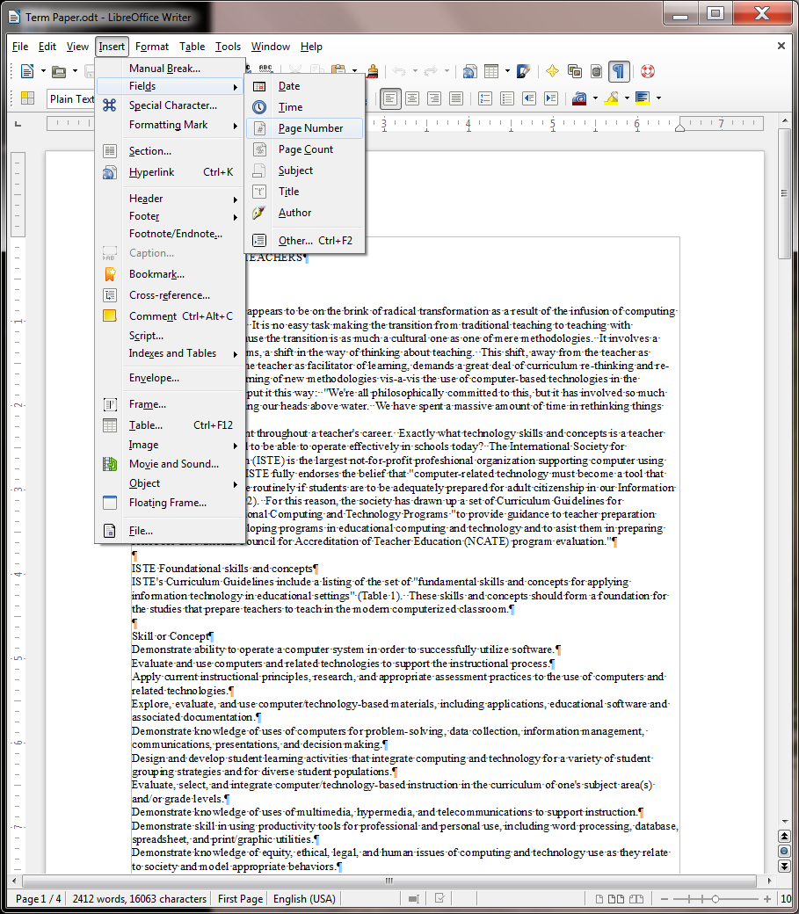

Fig. 2.3 Inserting page numbers into the header of a document

You now have a page number (Page 1) in the header at the top left of the
page (Fig. 2.4).

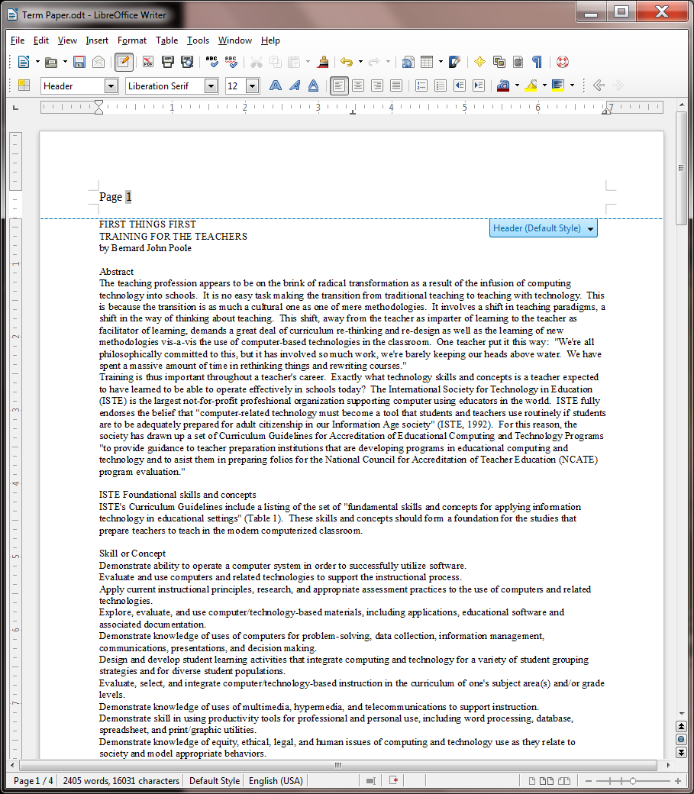

Fig. 2.4 Inserting a page number into the header of a document

Scroll down to pages two, three and four and notice that there is a page
number there, too, with the same format. If there were 200 pages in the
document, every page would now have an appropriate page number in the
same format.

The only other change you’re going to make is to move the page number
over to the *right hand side* of the header. This is simple enough to do
because you only have to do it to the page number on any *one* of the
pages for the change to occur throughout the document.

> First, make sure the cursor is still in the **header** at the top of
> one of the pages

In the *Formatting toolbar* there are four text alignment tools—one for
*left* alignment, another for *center* alignment, another for *right*
alignment, and a fourth for *justified* alignment (where the text is
aligned with the margins on both side of the page) (Fig. 2.5).

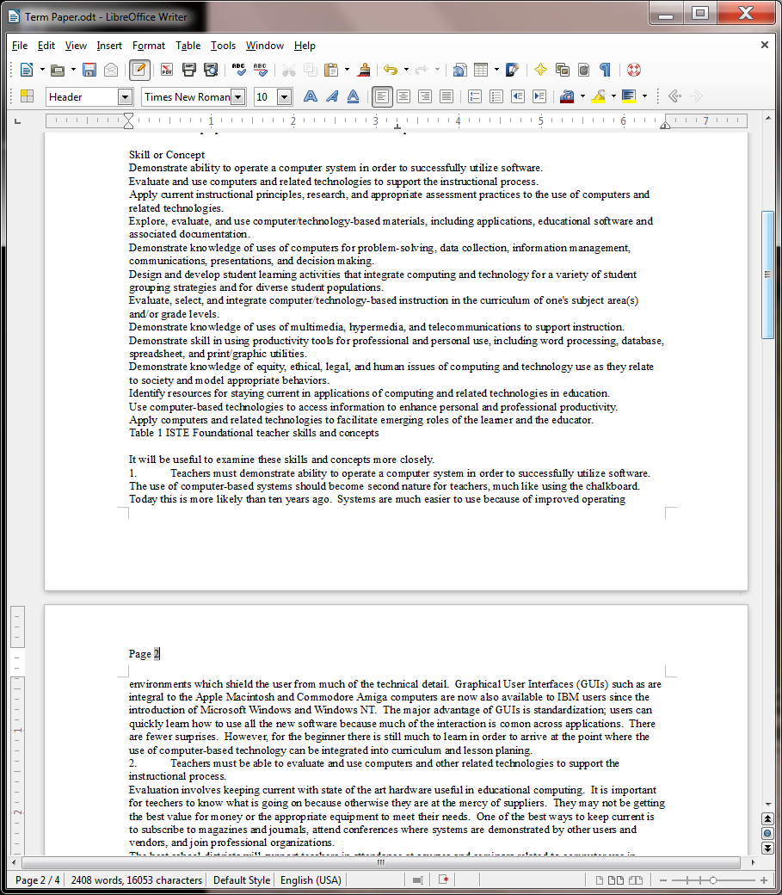

Fig. 2.5 The Text Alignment tools in the Formatting toolbar

> In the **Formatting toolbar** click on the **Right** alignment icon,
> then save your work (**Ctrl-s**)

That’s all there is to it. Now check every page again and make sure the
page numbers there are aligned on the right as well.

If you wanted to start a document at some page number other than 1 you
would click anywhere in the first paragraph of the document, then in the
*Format menu* select *Paragraph…* to bring up the Paragraph dialog box
(Fig. 2.6).

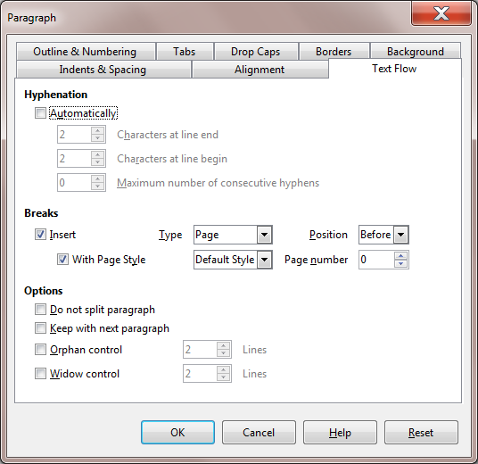

Fig. 2.6 The Paragraph dialog box showing the Text Flow settings

Say you wanted to start the page numbers at page 12 (because your
document is in two parts, for example, the first part being 11 pages
long)*.* In the *Paragraph dialog box > Text Flow > Breaks
options* (check Fig. 2.6 above) you would click in the boxes next to
*Insert* and *With Page Style* and then in the *Page Number* entry box
you’d type the number 12, and click on *OK.* Simple as that!

Another page numbering option, which you will apply to your Term Paper
document here, is to NOT have a page number on the first page of the
document. This is a common practice, especially in longer documents.
Let’s do this now.

> Start by clicking anywhere in **page 1**, then click, in the
> **Formatting** toolbar, on the **Styles and Formatting** icon (Fig.
> 2.7)

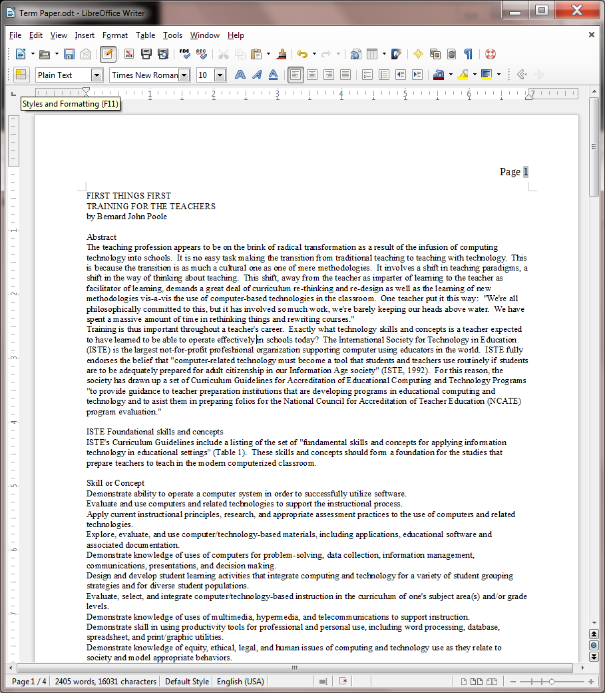

Fig. 2.7 The Styles and Formatting icon in the Formatting toolbar

This brings up the Styles and Formatting dialog box (Fig. 2.8).

Fig. 2.8 The Styles and Formatting dialog box

> In the **Styles and Formatting** dialog box, click on the **Page
> Styles** icon (Fig. 2.8), then, in the list of Page Styles, **double
> click** on **First Page**
>
> **Close** the **Styles and Formatting** dialog box, and scroll through
> the document to check that the page number now appears only on the
> second and subsequent pages—there should be no page number on page 1

Now you’re ready to learn about more tools for formatting text.

**2.2 MORE TOOLS FOR formatting text**

**A word about default settings**

Your installation of *Writer* has default settings for the typical
printed page*.* The *normal margins* are set at 0.79", top and bottom,
left and right*.* The *normal spacing* between lines is single spaced.
The *default alignment* is left (the text is aligned to the left
margin)*.* The *default* number of columns on the page is 1, and the
*default color* of the text is black on a white background. The font
selected for the Term Paper document is Times New Roman and the size of
the characters throughout is 10 point (because that is how it was saved
in the Practice Files folder)*. *

In general, there is no point changing these settings unless they are
unsatisfactory*.* But you can reset any of the format options to meet
your needs*.* The exercises that follow will give you the opportunity to
practice doing this as you reformat the Term Paper document.

**A word about WYSIWYG**

WYSIWYG (computerese, pronounced "wizzywig") is an acronym for "**W**hat
**Y**ou **S**ee **I**s **W**hat **Y**ou **G**et." It is used to describe
computer systems such as the one you are using, where the appearance of
a document on the screen is what you will get on paper when you print it
out*.* As you make formatting changes to your document, they will show
on the screen so that you can visually check the effect of the changes
before printing.

**Setting the margins**

First, you need to reset the margins to 1” all round. The easiest way to
change any of the four margins on a page is in the *Page Style* dialog
box.

> In the **Format menu** select **Page…** to bring up the **Page Style**
> dialog box, then click on the **Page tab** (Fig. 2.9)

Notice that the Page Style dialog will allow you to make various changes
to the page style, including the Paper format (the paper size and
orientation and so forth). All you need to change is the margins.

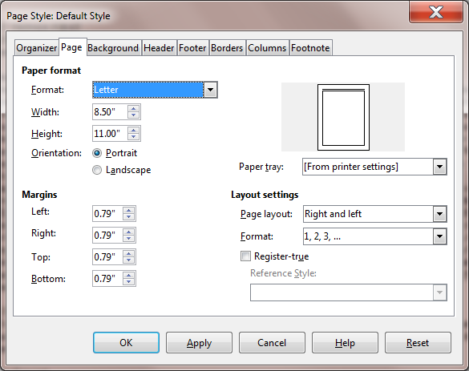

Fig. 2.9 The Page tab in the Page Style dialog box

> Change each of the four **Margins** settings to **1.0”** then click on
> **Apply** and click on **OK**

Remember that you can use the *Page Style dialog box* to change the
margins on your printed page.

**Aligning text**

*Justified text*

When you align text on both margins, called *justified text*, both sides
of your text run flush with the right and left margins*.* Seeing is
believing, so carry out the steps that follow to see the effect of this
option*.* First you need to select the entire document so that you can
set justified alignment from page one to the last page of the
document*.* This takes a second.

> In the **Edit** menu choose **Select All** (or simply press
> **Ctrl-a**) to highlight the entire **Term Paper** document

Remember, if you make a mistake, it’s not a problem! You can *undo*
whatever you did by selecting **Undo** from the **Edit** menu or just
hit **Ctrl-z**)*.* And you can do this multiple times to step back to a
point where you want to resume your work.

> Now, with the entire document highlighted, click on *each* **Text
> Alignment tool** in turn and **scroll up and down** in the document so
> you can see how your text looks each time you change the alignment
>
> You want the final version of the document to be **justified**, so
> finish this exercise by clicking on the icon for **Justified** text
> (aligned on **both margins**—the last of the four alignment icons
> highlighted in the **Formatting toolbar**)
>
> Now click anywhere on the Term Paper document to **deselect** the
> highlighted text, then **Save** this updated version of the **Term
> Paper** in your **LibreOffice Work Files** > **Data Files** >
> **Writer Documents** folder (or simply hit **Ctrl-*s***)

Notice that the margins on both sides of the screen are now aligned to
be flush with the left and right margins except lines that do not reach
all the way across the page (such as the title lines and some of the
lines at the end of paragraphs).

*Centered text*

Centered text stands out on a page and is often used for titles*.* The
following exercise steps you through the process of centering the titles
on the first page of the Term Paper document.

> First, if necessary, scroll all the way back to the beginning of the
> Term Paper document
>
> Now, highlight **all 3** **Title lines** at the top of the first page
> (down to and **including** the author's name)
>
> In the **Formatting toolbar** click on the **Centered** alignment icon
>
> After you have **centered** the title lines, click anywhere in the
> text of the document, then once again **save** your work in progress
> (**Ctrl-s**)

**Choosing font faces**

Font faces come in all shapes and sizes, and you probably have several
dozen available to you on your computer*. Times New Roman* font comes
standard with all computers, so the text displayed on your screen is
almost certainly in this font since the Term Paper document was saved
with this font.

Times New Roman is a *serif* font, which means it has *serifs*.[^1]
Serifs are the small marks (flourishes) used to complete a letter (Fig.
2.10).

Fig. 2.10 Serif (Times) and sans serif (Arial) font faces

A *sans serif* font doesn't have these flourishes, as you can see if you
look closely at a font such as Arial (Fig. 2.10 above).

In general, *serifs* improve readability by increasing the definition of
letters. However, the clean lines of *sans serif* fonts can prove easier
to read in some contexts, especially, for example, with larger font
sizes*.* Sometimes you may need to set off one font against another (as
in these tutorials) so *sans serif* fonts such as Ariel and Comic Sans
MS will often come in handy.

It will be useful for you to practice changing fonts. This will also
give you the opportunity to discover the wide variety of fonts you can
use.

> From the **Edit menu** choose **Select All** (or **Ctrl-a)** to
> highlight the entire **Term Paper** document
>
> In the **Formatting toolbar**, click on the **down arrow** next to the
> Font Name tool (Fig. 2.11 next page) to drop down the list of
> available fonts on your computer
>
> Click on any of the fonts in the **Font** menu and you wil be able to
> see how the font will look if you were to select it for the Term Paper

Do this again for several different fonts*.* Each time, check the
letters carefully to see what type of font you have chosen*.* Is the
font you chose *serif* or *sans serifs*? Do you like any particular
fonts? Which is your favorite font?

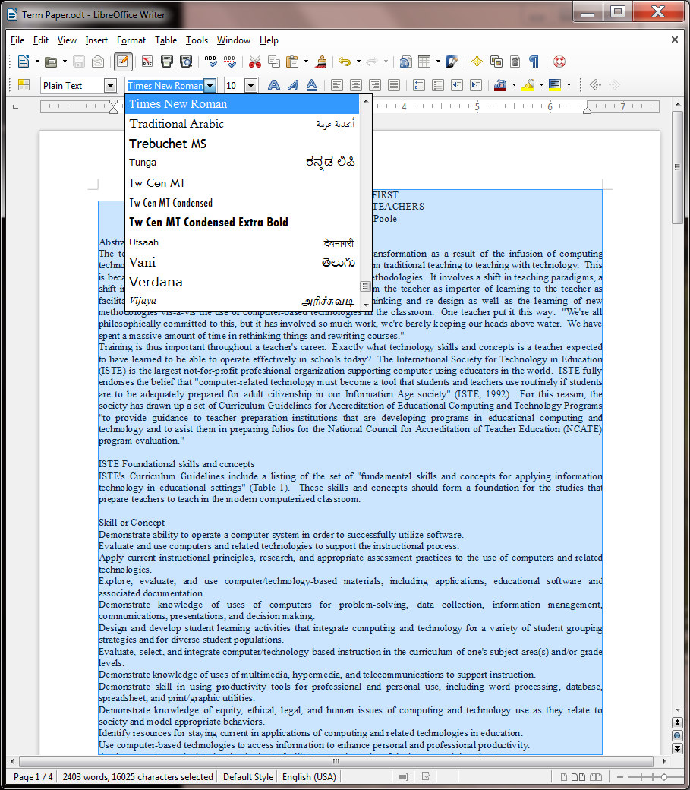

Fig. 2.11 The menu of available fonts

**Very important**: For the sake of this tutorial you need to set the
entire Term Paper document to *Times New Roman* font after you have
finished checking out some of the many fonts available with *Writer.*
This is because the relative sizes of fonts may create variations in the
page numbers of the Term Paper document we’re working with, and this may
affect the directions for the rest of the tutorial.

> **Select All** (**Ctrl-a**) and choose the **Times New Roman** font)
> to return the document to **Times New Roman** font, then **Save**
> (**Ctrl-s**) the document again

Now you are going to choose a different font just for the table on page
1 of the Term Paper document*.* The Table begins about half way down the
page with the header: *Skill or Concept* and ends with the caption:
*Table 1 ISTE Foundational teacher skills and concepts*.

> First, click anywhere in the Term Paper document to **deselect** any
> **highlighted text** and scroll, if necessary, to page 1
>
> Use the **mouse** and drag to select all the items in the table on
> page 1—from the Title: **Skill or Concept** down to the end of the
> caption:**Table 1 ISTE Foundational teacher skills and concepts**
>
> Now select **Arial** as the font for the text in the table, click
> anywhere to **deselect** the table text and **Save** your work
> (**Ctrl-s**) before you move on

**Changing the point size of text**

The size of fonts is measured in points.

9 point is quite small;

12 point is standard;

36 point is quite large.

The smallest font size is 4 point (tiny); the largest possible font size
is 255 point (huge!)*.* The font size for the body of the Term Paper
document can be left at 10 pt*.* But it would be interesting to use a
larger font size for the Title lines and we will also need to reduce the
font size for the text in the Table which will end up on Page 2 after
we’re done with the following exercises*.* Let’s start with the Title
lines.

> Go to the beginning of the **Term Paper** document and highlight the
> **first Title line** on the first page: **FIRST THINGS FIRST**, then
> In the **Formatting toolbar** use the **Font Size** tool to select
> **36 pt** (Fig. 2.12)

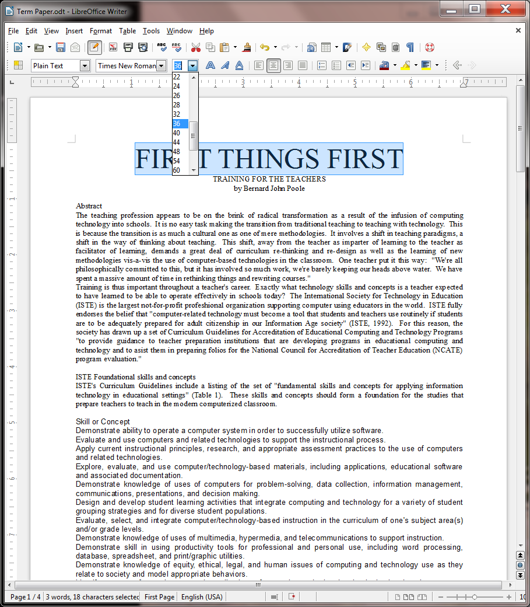

Fig. 2.12 Changing the size of fonts

Now there's a headline for you! Complete this exercise by changing the
size of the remaining Title lines as follows:

> Make the second line of the title (the sub-title) **24** **pt** and
> make the author's name **18 pt** and **Save** your work (**Ctrl-s**)

**Inserting Page Breaks**

It is often the practice to keep an Abstract on a page by itself, ahead
of the main body of a paper*.* So, for this exercise you are going to
set a page break after the Abstract.

> Still on page 1 of the Term Paper, click to position the cursor at the
> beginning of the line: “**ISTE Foundational skills and concepts**”
> (about half way down page 1)
>
> Now, in the **Insert** menu select **Manual** **Break…**

This will bring up the *Insert Break* dialog box (Fig. 2.13).

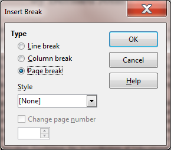

Fig. 2.13 The Insert Break dialog box

> Notice that the **Page Break** option is selected by **default**, so
> click on **OK**
>
> Scroll up and down **between pages 1 and 2** so that you can see how
> the Page Break worked

Notice that *Writer* moves the “ISTE Foundational skills and concepts”
section to a new page following the Abstract*.* Thus the Abstract will
now print on page 1 by itself, following the title lines.

*Practice makes perfect*

Let’s try this again by inserting a Page Break immediately before the
text which follows the Table of ISTE Foundational teacher skills and
concepts*.* Here again are the steps to do this:

> Position the cursor just about **half way down** **page 2** of the
> document, at the beginning of the line that reads “**It will be useful
> to examine**...” (that’s the line that follows the table caption:
> “**Table 1 ISTE Foundational teacher skills and concepts**”)
>
> Insert a **Page Break** here, too (**Insert menu** > **Manual
> Break…** and click on **OK** to accept **Page** **Break**)

One last task before you move on. You are going to increase the font
size of all the text that is now on pages 3 thru 5 of the Term Paper
document.

> Position the cursor at the **top of page 3** (immediately before
> “**It** **will** **be** **useful…**”, then scroll to the last page of
> the document (**page 5**), and hold down the **Shift key** while you
> click at the **end of the Bibliography section**—the end of the Term
> Paper document
>
> Now with the contents of **pages 3-5 highlighted**, change the **font
> size** of the text from 10 to **12**
>
> **Save** your work (**Ctrl-s**)

**Changing the layout of the Skill or Concept table**

There are some formatting changes you need to make to the Skill or
Concept table which is now on Page 2*.* When you are done, it will have
a similar layout to Fig. 2.14.

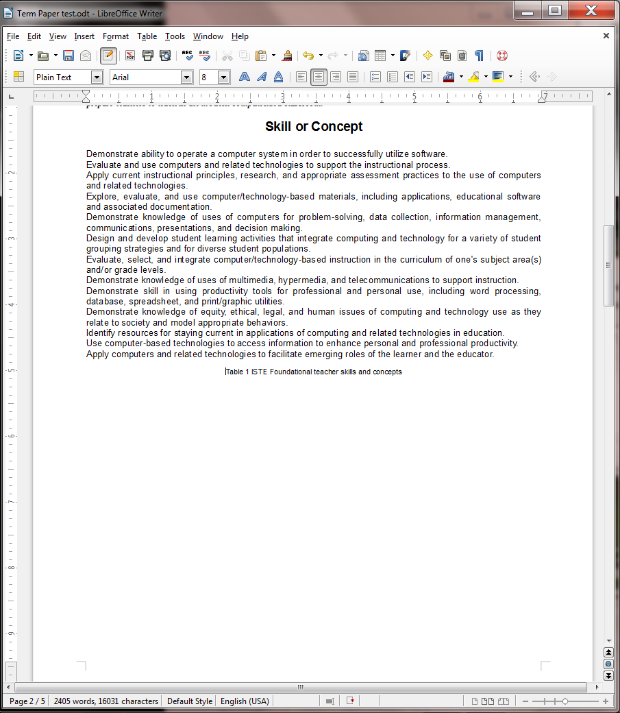

Fig. 2.14 ISTE table after the first set of updates

> Scroll back to **page 2**, if necessary, and highlight the **title**
> of the table (**Skill or Concept**) by **dragging** across it (or
> **triple click** on it)
>
> In the **Formatting** toolbar, click on the **center alignment** icon
>
> With the title of the Table still highlighted, use the **Font Size**
> tool to make **14 pt** the font size of the table **Title**, and,
> still in the **Formatting toolbar**, click on the **Bold** icon (Fig.
> 2.15), then click at the end of the title to put the cursor there and
> hit the **Return/Enter** key **once** to space the table’s contents
> down from the Title line

Fig. 2.15 The Bold icon in the Formatting toolbar

> Now highlight the caption at the end of the table (**Table 1 ISTE
> Foundational teacher skills and concepts**), **center** it and change
> its **font size** to **8 pt**
>
> Finally, click to position the cursor at the beginning of the caption,
> right before **Table 1 ISTE…** and hit the **Return/Enter** key
> **once** to space the caption down from the table

At this point the Skill or Concept table on Page 2 of the Term Paper
document should look like Fig. 2.14 on the previous page.

> **Save** your work (**Ctrl-s**) before you move on

**Spacing before and after paragraphs**

> Make sure that you can still see all of the **Table of ISTE
> Foundational skills and concepts** on **page 2** of the document

Sometimes it is easier to read a list of items if they are slightly
separated one from the other by what is called white space (the parts of
a page where there is no text)*.* Let’s do this next.

> Drag with the mouse to select (highlight) all the items in the
> **BODY** of the table (from **Demonstrate ability...** at the
> beginning of the table to **…roles of the learner and the educator**
> at the end of the table—**NOT** including the caption)
>
> Now, in the **Format menu** select **Paragraph…**, to bring up the
> **Paragraph dialog box** and click on the **Indents & Spacing** tab
> (Fig. 2.16)

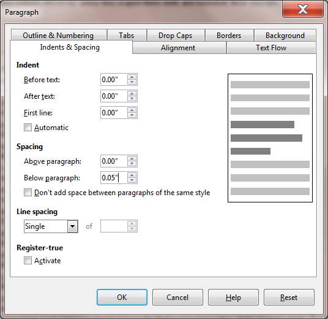

Fig. 2.16 Paragraph dialog box

> Change the **Spacing** > **Below Paragraph:** setting to **0.05”**,
> click on **OK**, then click **anywhere in the text** to remove the
> highlighting (to deselect it) and save your work up to this point
> (**Ctrl-s**)

Notice how much easier it is now to pick out each of the items in the
Skill or Concept table.

**2.3 BULLETS AND NUMBERED LISTS**

**Numbered lists**

For the next exercise you are going to use the Bullets and Numbering
Styles in *Writer* to number each of the items in the Table of ISTE
Foundational Teacher Skills and Concepts on page 2 of the Term Paper
document**.**

You can use any of several numbering and bullet styles. But let’s keep
it simple for now.

> Once again, **highlight** all the items in the **body** of the table
> (from **Demonstrate ability...** to **…roles of the learner and the
> educator**)
>
> In the **Formatting toolbar**, click on the **Numbering On/Off** tool
> to quickly number each of the items in the Table (Fig. 2.17)

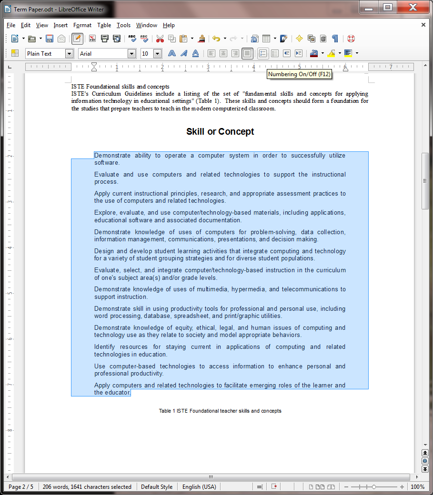

Fig. 2.17 The Numbering On/Off icon in the Formatting toolbar

> Click anywhere to deselect the highlighted Table, then **Save** your
> work again (**Ctrl-s**)

At this stage, the Table should look much like the illustration in Fig.
2.18.

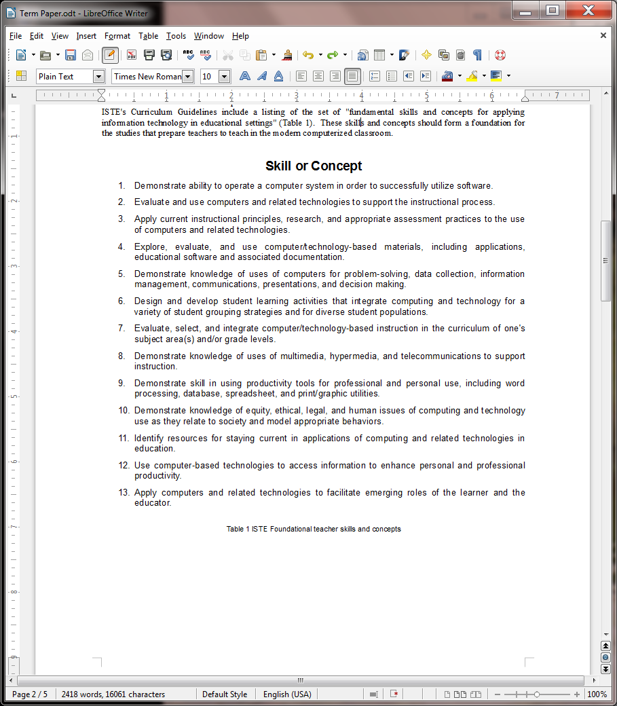

Fig. 2.18 The numbered list of Skills and Concepts

Notice the hanging indents for each item in the table. *Writer* uses a
hanging indent so that the numbers stand out. We’ll return to the
subject of hanging indents later in the lesson, where you will practice
creating them yourself.

You can also start numbering from a number other than 1*.* You would
need to know how to do this, for example, if you broke up a numbered
list into two sections with text in between that is not numbered. If you
wanted to start numbering from a number other than 1, you would do this
by selecting the *Format menu* > *Bullets and Numbering…* and, in the
dialog box that pops up (Fig. 2.19), you would click on the *Options
tab* and, in the *Start at: box* type the starting number you want for
the list of items you are working with.

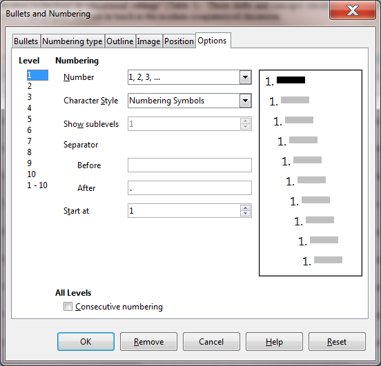

Fig. 2.19 Settings for Customizing a Numbered List

> For our purposes, however, we want to start at **1**, so make sure the
> **Start at:** value is **1** (don’t change a thing) and click on
> **OK**

**Bulleted lists**

If you wanted bullets instead of numbers, you would select the *Bullets
On/Off* tool, which is right next to the *Numbering* tool in the
Formatting toolbar (Fig. 2.20).

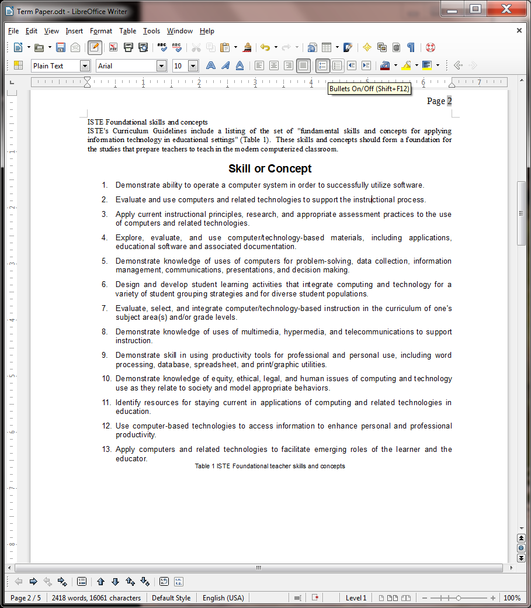

Fig. 2.20 The Bullets On/Off tool in the Formatting toolbar

There are several styles of Bullets that you can choose in
*LibreOffice*, and you can check them out by selecting *Format menu*
> *Bullets and Numbering…* and, in the Bullets and Numbering dialog
box that comes up, you would select one or other of the bullets styles
that show in the Bullets tab (Fig. 2.21).

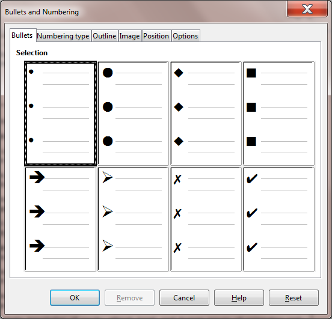

Fig. 2.21 Bullet styles dialog box

> Did you save your work? Hit **Ctrl-s** before you forget…

**2.4 SETTING OFF A BLOCK OF TEXT WITH A BORDER**

The ISTE Table should now be starting to look more like a table! Let’s
make one more update to set off the table as a separate item from the
running text of the Term Paper.

Sometimes, for emphasis or effect, it looks professional to set off a
section of a document with a border or frame.

You are going to do this to the Table of ISTE Foundational Teacher
Skills or Concepts on page 2*.* It will end up looking something like
Fig. 2.22.

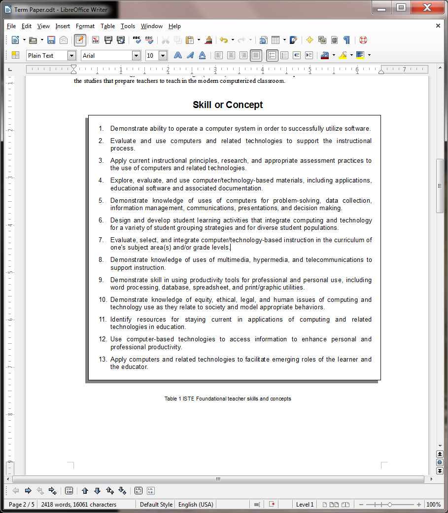

Fig. 2.22 ISTE Table with a border

> Once again highlight the contents of the **body of the Table** (the 13
> numbered Skills and Concepts, ***NOT*** including the centered
> **Table** **Title** (Skill or Concept) at the top, or the centered
> **caption** (Table 1 ISTE, etc.) at the bottom
>
> Now, in the **Format** menu, select **Paragraph…** to bring up the
> **Paragraph dialog box** and click on the **Borders** tab (Fig. 2.23)

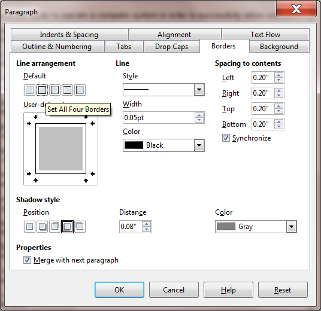

Fig. 2.23 The Borders tab in the Paragraph dialog box

> Use Fig. 2.23 above carefully to make sure you select the correct
> settings for the table Border:
>
> Click on the **2^nd^** **Line arrangement** button to **Set All Four
> Borders**
>
> In the **Spacing to contents** section, make sure each of the values
> is **0.20”**
>
> In the **Shadow style** section select the **4^th^ option** to put the
> shadow at **lower left** of the table
>
> Now click on **OK**, then click **anywhere in the document** to remove
> the highlighting so you can see the effect of the changes you have
> made to the ISTE Table on Page 2 of the Term Paper document—it should
> look much the same as Fig. 2.22 on the previous page
>
> Save your work again (**Ctrl-s**) and take a break!

**2.5 USING TAB STOPS**

**Inserting Tab Stops**

Let’s take a short break from the Term Paper exercise and learn about
Tab Stops in general. No need to close the Term Paper document, though,
because you still have plenty of work to do with it, including setting
some tab stops here and there. To practice using tab stops, you’ll be
using a new blank document.

> From the **File** menu select **New** > **Text Document**, and wait
> while a **Blank *Writer* Text Document** opens

Tabs are very useful for lining up text in columns, as illustrated in
Fig. 2.24.

> Andrew Freshman 186 90.35
>
> Mary Senior 95 85.50
>
> Teresa Sophomore 87 87.90
>
> Bernard Senior 210 100.00
>
> Josephine Junior 123 78.25

Fig. 2.24 Typical columnar organization of data

In the table in Fig. 2.24 the first column has a list of names aligned
*left.* The second column has a list of academic year designations which
are *centered* on the column*.* The third column has whole numbers which
are usually aligned *right.* Finally there is a column of decimal
numbers which are aligned *around the decimal point*.

If you have never used Tab Stops before, you may find them confusing*.*
The exercise that follows will help you understand what Tab Stops are
all about and how they work.

The purpose of Tab Stops is to help you align data, often in *columns*,
like in the table above*.* One thing you should *never* do in a word
processor is try to line data up using the *space bar*; this is a
surefire recipe for getting things out of line because of the way modern
word processors use *relative spacing* for the characters in a line or
on a page*. *

Notice the Tab selector icon at the left edge of the Ruler bar—top left
corner of the *Writer* window. It looks like the capital letter **L**
(Fig. 2.25) because the default tab selector icon is for *left
alignment*.

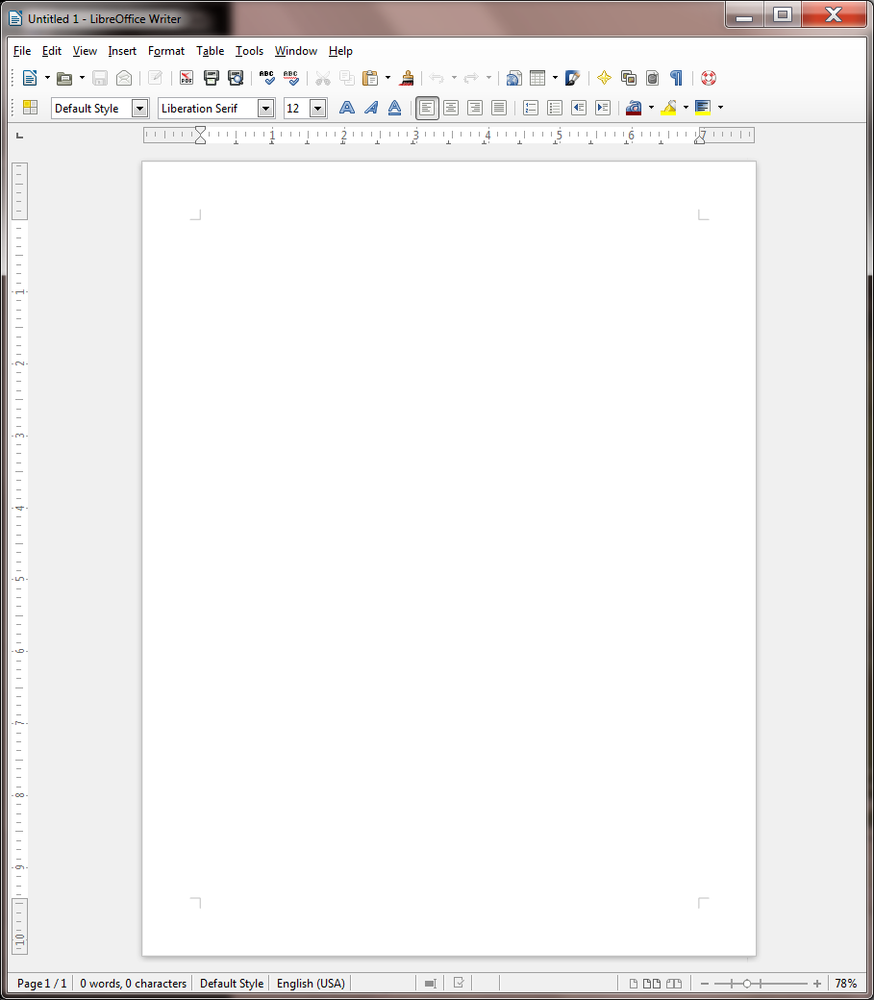

Fig. 2.25 The Tab selector icon to the left of the Ruler bar

This means that, if you click anywhere along the Ruler bar to set a Tab
Stop while this tab icon is selected, a *left Tab Stop* will be set at
that place in the ruler*.* If you use the Tab key on the keyboard to tab
across to that Tab Stop, you will be *left aligned* on it, and any text
you type will proceed from the left of the Tab Stop to the right.

The best way to understand this is, of course, to do it, so here goes.
Put your thinking cap on, OK? First thing you need to do is remove/clear
any existing tab stops that may already be inserted along the Ruler bar
of your blank document. Here’s how you do this.

> In the **Format** menu select **Paragraph…**, then in the **Paragraph
> dialog box** that pops up, click on the **Tabs** tab (Fig. 2.26), and
> click on **Delete all**

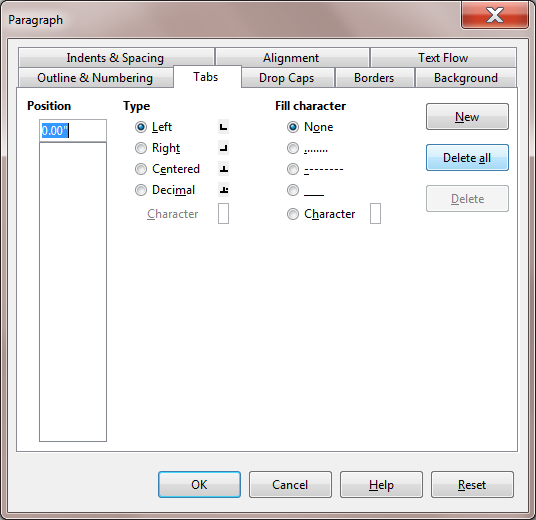

Fig. 2.26 The Tabs/Delete all option in the Paragraph dialog box

You are going to put four different Tab Stops along the Ruler bar*.*
Fig. 2.27 shows the Tab Stops you should end up with for the correct
alignment of the data in the table illustrated in Fig. 2.24 on page 48
above.

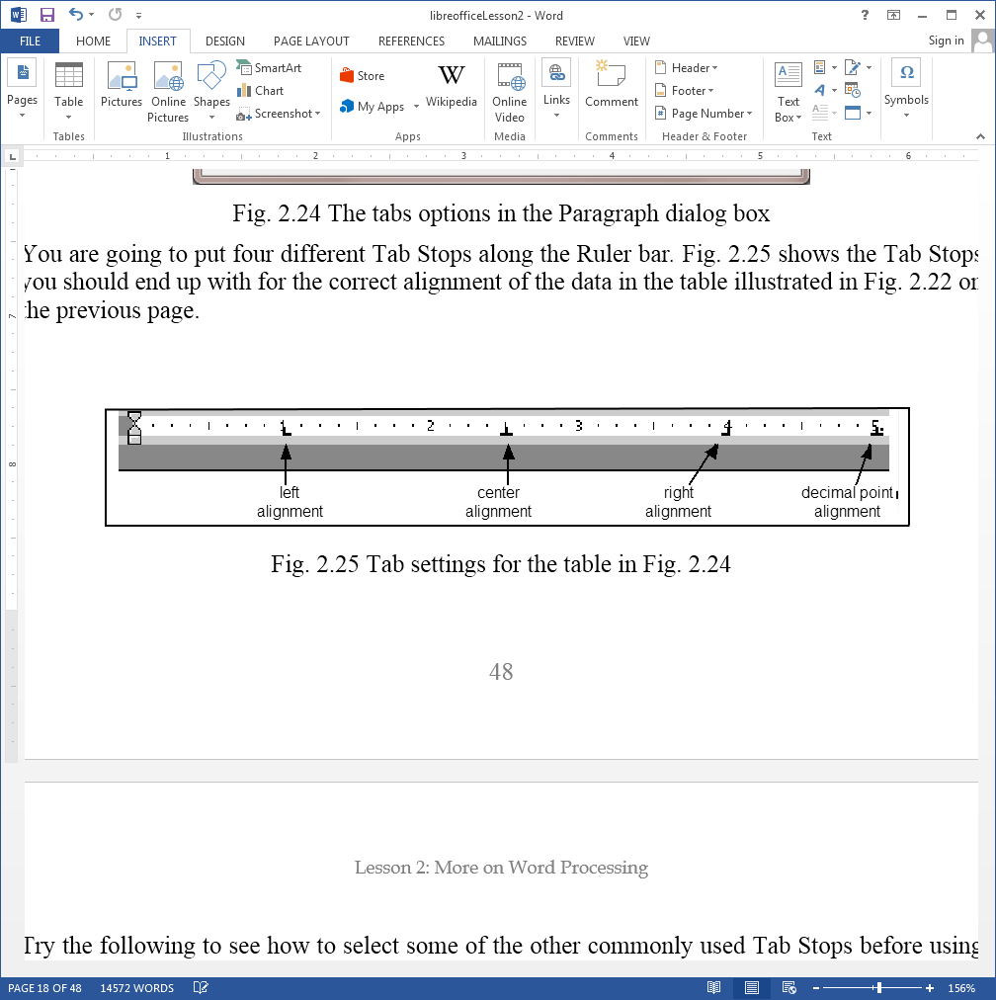

Fig. 2.27 Tab settings for the table in Fig. 2.24 (page 48 above)

Try the following to see how to select some of the commonly used Tab
Stops before using them to align data on a page of text.

> Click **once** on the **Tab icon button** in the top left corner of
> the screen, and you’ll see the icon change to the icon for
> **centering** text on the Tab Stop (it looks like an upside down
> ‘**T**’ and indicates that text aligned on it will be centered on it
> and move to either side of the Tab Stop, left and right, as you
> type)—it’s the second Tab Stop in Fig. 2.27
>
> Click again (a second time) on the **Tab icon button** and you’ll see
> the icon for **right alignment** (this Tab Stop looks like a backwards
> ‘**L**’, indicating that text aligned on it will go to the **left** of
> the tab stop because it’s aligned from the right—if you’ve never used
> Tab Stops before, that must sound confusing, but you’ll see how it
> works in a minute when you complete the exercises that follow)—the
> right alignment Tab Stop is the third one along the ruler in Fig. 2.27
>
> Finally, click again (a third time) on the **Tab icon button** and
> you’ll see the icon for **decimal alignment** (this Tab Stop looks
> like an upside down ‘**T**’ with a dot to denote the decimal
> point—this is for decimal numbers, like dollars and cents, for
> example, and makes sure everything is lined up on the decimal
> point)—check the decimal alignment Tab Stop on the right hand side of
> Fig.2.27

If you continue clicking on the tab icon button, you'll see other Tab
Stops and indent markers*.* You won't need these for this exercise.

Your task is to reproduce the table illustrated in Fig. 2.24 on page 48
above*.* You’ll need to begin by setting the four Tab Stops as they are
illustrated in Fig. 2.26 above.

> Click on the **Tab icon** until you see that the **left** Tab Stop is
> selected, then click once at the **1” hash mark** on the ruler
>
> Click again on the **Tab icon** until you select the **center** Tab
> Stop and click once at the **2 ½ ” hash mark** on the ruler
>
> Click again on the **Tab icon** until you select the **right** Tab
> Stop and click once at the **4” hash mark** on the ruler
>
> Finally, click on the **Tab icon** until you select the **decimal
> alignment** Tab Stop and click once at the **5” hash mark** on the
> ruler

Now, with the Tab Stops in place, you can start to enter the data from
the table in Fig. 2.24 on page 48 above.

> First, make sure the cursor is still waiting at the **left edge** at
> the **top** of the blank page
>
> Hit the **Tab key** to move the cursor across to the first tab, and
> enter the first **name** in the table (**Andrew**—which will be **left
> aligned** on the tab stop)
>
> Hit the **Tab key** again, and enter the **class** that goes with the
> first name (**Freshman**—notice how it is **centered** on the Tab Stop
> as you type it)
>
> Hit the **Tab key** again, and enter the **rating value** that goes
> with the first name (**186**—again notice how it is **right aligned**
> on the Tab Stop)
>
> Hit the **Tab key** again, and enter the **test score** that goes with
> the first name (**90.35**—and notice how the value is **aligned on the
> decimal point**)
>
> Continue in this way until you have entered **all five (5) lines of
> data** in the table

**Removing Tab Stops**

To remove a Tab Stop, you need to position the ***tip*** of the mouse
pointer on the Tab Stop marker and drag the Tab Stop down off the
ruler*.* When you release the mouse button the Tab Stop will be gone*.*
This is tricky to do if you’re not used to it because the Tab Stop is
small and you have to be very careful to use just the *tip* of the mouse
pointer*.* Try this for yourself.

> Position the cursor anywhere on the **first line** of the student
> records, then position **the tip of the mouse pointer** on each of the
> **Tab Stops** one by one and drag the stop down below the ruler, then
> **release the mouse button** to throw it away

This will mess up the layout of the data in that first line, but that’s
OK for now since you’re just practicing.

> Now undo what you just did by pressing **Ctrl-z four times**

You can also remove all the Tab Stops at one time*.* You already did
this at the beginning of this exercise (see Fig. 2.25 on page 49 above),
but here’s a reminder of how you do this.

> Click anywhere on the **first student record** and then **double
> click** on any **one** of the **Tab Stops**

This brings up the Paragraph dialog box.

> Now, in the **Paragraph** dialog box, click on the **Tabs** tab, then
> click on the **Delete All** button

There! All the Tab Stops are gone for that particular student record*.*
To clear the Tab Stops for ALL the student records in one go, simply
highlight all the records (*Ctrl-a*), double click on one of the Tab
Stops in the ruler, and in the Paragraph > Tabs dialog box click on
Delete All.

> Now **Close** the **Untitled** document and **don’t Save** it; this
> was just an opportunity for you to practice how to use **Tab Stops**

**2.6 STYLE OF TEXT AND LINE SPACING **

**Text Styles**

When writing, it is often important to draw attention to certain words
or phrases by adding emphasis to them*.* This can be accomplished by
**boldfacing**, *italicizing*, or *underlining* the text.

These options are available from the appropriate icons in the Formatting
toolbar (Fig. 2.28).

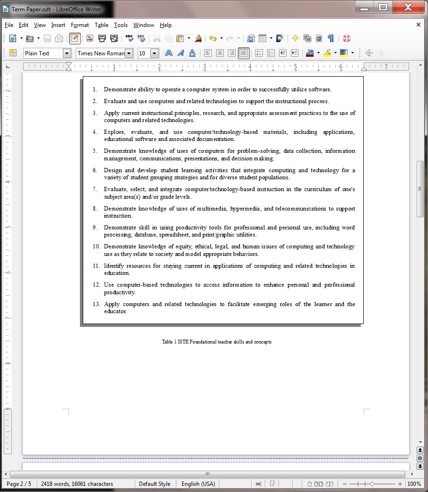

Fig. 2.28 Text style icons in the Formatting toolbar

Alternatively, you can apply the styles using Quick Keyboard cCommands:
*Ctrl-b* for **Boldface**, *Ctrl-I* for *Italics*, and *Ctrl-u* for
*Underline*.

**Boldface**

Titles and sub-titles should stand out on a page*.* Increasing the size
certainly helps*.* Using all capital (uppercase) letters can also add
emphasis and draw the eye of the reader*.* You have seen both of these
techniques applied to the Titles at the top of the first page of the
Term Paper document*.*

**Boldface** also will improve the appearance of the three section
headers (**Abstract**, **ISTE Foundational skills and concepts**, and
**References**) and make them stand out on the page. While you’re at it,
you might as well incease the font size, too.

> Scroll to **Page 1**, highlight the **Abstract** header and make it
> **boldface** (**Ctrl-b**) and increase the **font size** to **14 pt**
>
> Now apply **boldface** and **14 pt font size** to the two other
> section headers (**ISTE Foundational Skills & Concepts** at the top of
> Page 2 and **Bibliography** on page 6)
>
> Save your work (**Ctrl-s**)

*Underline*

On page 2 of the Term Paper document (the page after the Abstract) we
have the table of the 13 ISTE Foundational teacher skills and
concepts*.* Following this table, on pages 3 through 6, each skill or
concept is taken one by one for further explanation.

Your task is to *underline* the *skill or concept at the beginning of
each of the 13 sections* on pages 3 through 6*.* When you do this, you
will underline just the words that describe the skill or concept; do not
include the *number* of the concept—so you’ll underline just the line or
two of words immediately *after* the number that states the skill or
concept*.*

Fig. 2.29 illustrates what you need to do.

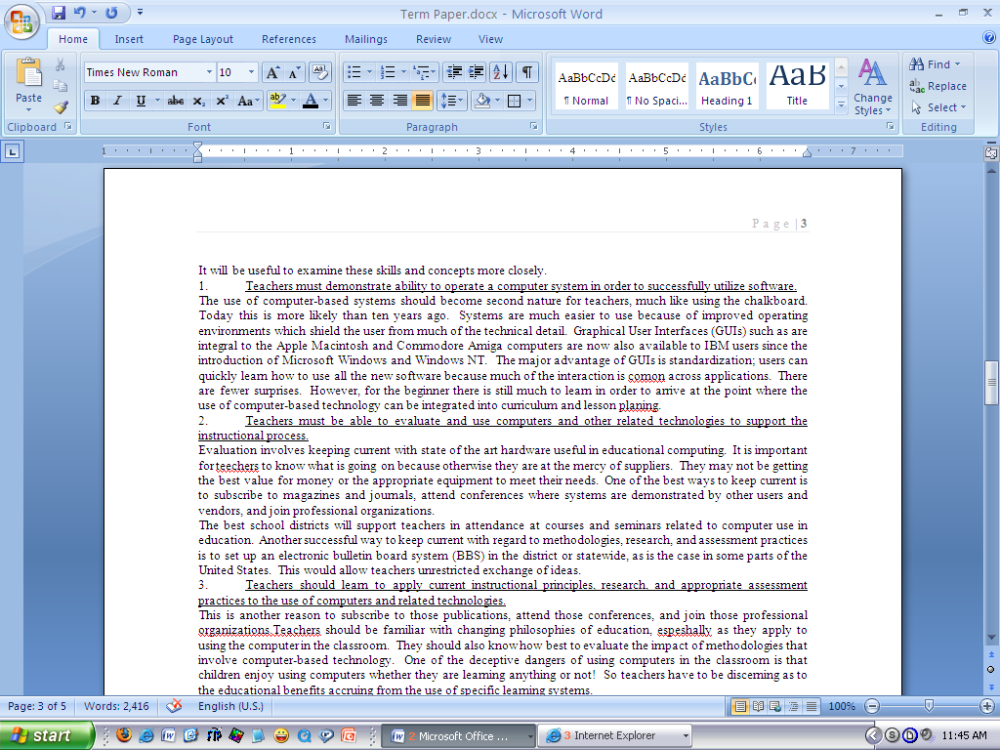

Fig. 2.29 Underline only each of the Skills or Concepts from the Table
on page 2

Here is a step-by-step explanation of how to do the first one.

> Scroll to the beginning of **page 3** and, in the **first** skill or
> concept, click to put the cursor immediately before the **T** of
> "**Teachers...**"
>
> Now hold down the **Shift key** and at the same time click at the end
> of the skill or concept (i.e. **after** the period at the end of the
> word “**...software**.") to highlight the text of the skill or
> concept, and press **Ctrl-u** to underline the skill or concept

That's all there is to it*.* Go ahead now and underline the remaining 12
skill or concept section titles*.* When you have finished this exercise,
the underlined section titles will look as illustrated in Fig. 2.29
above.

> Don’t forget to **save your work** when you’ve finished underlining

*Italics*

Your next task is to *italicize* the author's name on the first page*.*
You can probably figure this out for yourself, but just in case you need
help, here are the steps.

> Select the **author's name** under the title on the first page of the
> Term Paper and press **Ctrl-I**, then **save** your work again

**Line spacing**

Papers may be printed with variable spacing between lines*.* The
following steps show you how to do this in *Writer*.

> Select the entire paper by pressing **Ctrl-a (Select All)**
>
> Now from the **Format** menu select **Paragraph…**, then, in the
> **Paragraph** dialog box click on the **Indents and Spacing** tab
>
> Click on the **arrow** at the end of the **line spacing** box (Fig.
> 2.30) and select **Double** for the spacing option, then click on
> **OK**

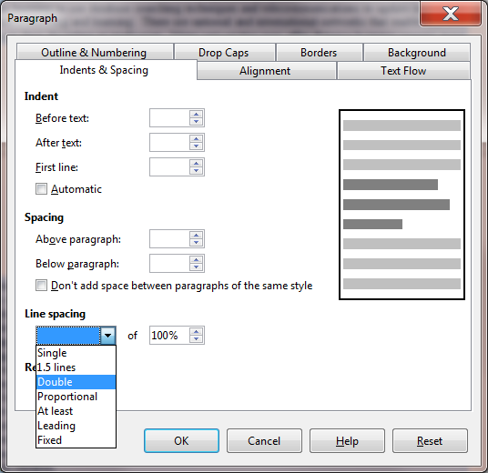

> Fig. 2.30 Line Spacing in the Paragraph dialog box

Your document was set in single spacing when you loaded it from the
*Work Files for LibreOffice.* Double spacing is required for many
written documents and now you know how to do this using *Writer*.

> For the sake of this exercise, however, be sure to return the document
> to **single spacing** (**Ctrl-a** > **Format menu** >
> **Paragraph…** > **Indents and Spacing tab** > **Line spacing**
> > **Single** > **OK**)
>
> Now press **Ctrl-s** to save your work to date

**2.7 INDENTING TEXT**

**Adjusting (moving) the Indent Markers**

You practiced doing this in Lesson 1, but maybe you need more practice
since these indent markers can be tricky to apply.

There are two indent markers on the left side of the Ruler bar, one
above the other, as illustrated in Fig. 2.31. The *First Line Indent*
marker is on top, the *Left/Hanging Indent* marker is on the bottom.

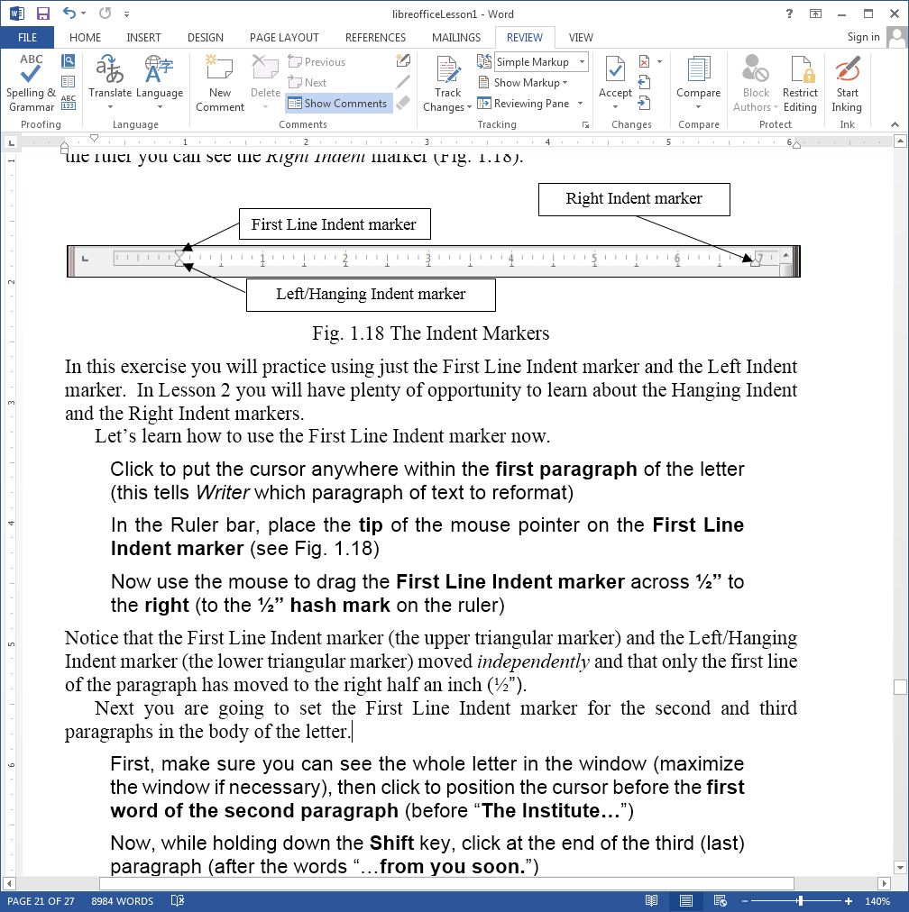

Fig. 2.31 The indent markers in the Ruler bar

The indent markers establish where text is aligned in relation to a
paragraph as a whole*.* The *First line Indent* marker (it looks like an
upside down triangle) is applied only to the first line of a
paragraph*.* The *Left Indent*/*Hanging Indent* marker control the
margin for all the lines *after* the first line in a paragraph.

> Carefully examine **Fig. 2.31** to clearly **identify each indent
> marker** before proceeding with the tutorial
>
> **Tip \#1:** Remember that the ***tip*** of the mouse arrow is the
> ***hot spot**.* Moving the small indent markers is a precise task, so
> be sure to position the ***tip*** of the mouse arrow on the indent
> marker that you want to move.
>
> **Tip \#2:** When you drag on the ***Left/Hanging Indent* marker**
> (Fig. 2.29 above) **both of the markers move together***.* When you
> drag on the **first line indent marker**, which is above them, it
> moves on its own, leaving the First Line/Hanging Indent marker in
> place.

Traditionally, an indent is commonly used for the first line of
paragraphs—where the margin is set *in* a few spaces from the rest of
the paragraph (Fig. 2.32A).

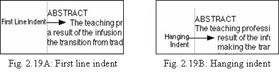

> Fig. 2.32A Fig. 2.32B

Then there is the indent for a list such as a bibliography—where you set
the margin for the first line *back* a few spaces from the rest of the
paragraph*. Writer* refers to this latter indent as a "hanging indent"
because the lines that follow look as if they are hanging off the first
line (Fig. 2.32B).

The Term Paper document that you have open on the screen would benefit
from the use of both types of indent markers.

**Indenting the first line of paragraphs**

Right now in the Term Paper document it is difficult to tell where one
paragraph ends and another begins*.* Let’s indent the first line of the
paragraphs in the Abstract so you can see what a difference this simple
change makes.

> Click at the **beginning** of the **first line** of the **first
> paragraph** of the **Abstract** on **page 1** (immediately ahead of
> the words “**The teaching profession…**” at the beginning of the next
> line after the Abstract header)
>
> Hold down the **Shift key** and click again **at the end** of the
> Abstract, to highlight all the Abstract text
>
> Now, on the **left side** of the Ruler bar at the top of the document,
> position the **tip** of the mouse arrow on the **First Line Indent
> marker** (the upper marker) (see Fig. 2.31 on the previous page), and
> drag this **First Line Indent** **marker** to the **right** a **½
> inch** (to the **½"** hash mark), then click anywhere to remove the
> highlighting

Notice how *Writer* indents only the first line of each of the two
paragraphs in the Abstract*.* This makes it easier to tell where one
paragraph begins and another ends.

Pages 3 through 6 of the Term Paper document have 13 numbered sections
which discuss each of the skills or concepts in the Table on page 2*.*
In the next exercise, you are going to indent the first line of all the
paragraphs on pages 3 through 6*.* Fig. 2.33 illustrates what you need
to do.

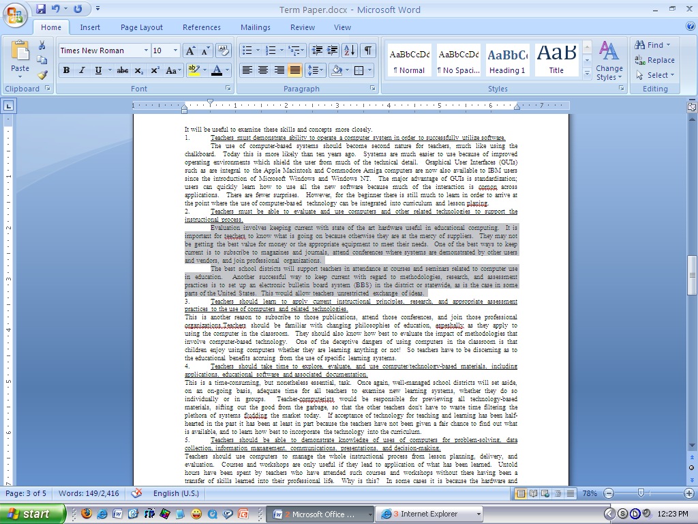

Fig. 2.33 Indenting the First line of paragraphs

Let’s do the first numbered Skill or Concept section together, so you
see what is required.

> Scroll to the top of **Page 3** and position the cursor at the
> beginning of line 3, **immediately before** the sentence that begins:
> “**The use of computer-based systems….**”
>
> Hold down the **Shift** key, and click at the end of the section,
> immediately after the phrase “**lesson planning.**”

This selects all the commentary in the *first* numbered section on page
3.

> Now, in the **Ruler bar**, drag the **First Line Indent marker** over
> to the **right** (to the **½" hash mark**), just as you did for the
> Abstract on page 2

Now on to the second numbered section.

> Position the cursor at the **start** of **line 3** of the second
> numbered section—the sentence that begins: “**Evaluation involves
> keeping current….**”
>
> Hold down the **Shift** key, and click at the end of the section,
> immediately after the phrase “**exchange of ideas.**”

This selects all the commentary in the *second* numbered section on page
3.

> Now, in the **Ruler bar**, drag the **First Line Indent marker** over
> to the **right** (to the **½" hash mark**), just as you just did for
> the previous section
>
> Continue in the same way and change the **First Line Indent** for the
> remaining paragraphs in **sections 3 through 13** on **pages 3 through
> 6** of the **Term Paper** document (but **do not indent** the numbered
> lines that begin each section and **don’t do anything** with the
> **Bibliography** section just yet)

This task won't take you long*.* You might be thinking to yourself: “Why
the heck is the lesson making me do this over and over again?” Well, as
anyone knows, practice makes perfect, and by the time you’re finished
with this tutorial, you’ll feel pretty pleased with what you’ve learned,
so stay with it, OK?

> When you are done with this exercise, hit **Ctrl-s** to save the work
> completed to this point

**Hanging indents**

There are many occasions when it is useful to indent parts of your text
using hanging indents*.* A hanging indent is where the second and
subsequent lines of a paragraph of text are indented to the *right* of
the first line*.* For example, you may want to make a list of points
with a "bullet" at the beginning of each point, like this:

1.  Don't settle down at the computer until you have carefully planned
    what you want to do*.* If you plan ahead you will be sure to do a
    better job and save yourself a whole bunch of time!

or like this:

1.  Don't forget to clean your teeth and make your bed after you've had
    your breakfast every morning!

This is easy to do with the bulleting and numbering tools built into the
word processing software*.* But it is also important to know how to use
the *indent markers* to create hanging indents that do not involve the
use of bullets*.* For example, hanging indents are used when you write a
paper that includes a list of sources cited, as illustrated in Fig.
2.34.

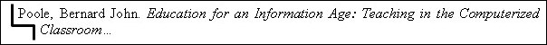

Fig. 2.34 An example of a hanging indent

> Scroll down to the end of the **Term Paper** document

Notice that indentation has not yet been used for the Bibliography
section, but it should be because it is standard practice. Without
hanging indents as illustrated in Fig. 2.34 above, it would be difficult
to determine where one Bibliography entry ends and another begins,
especially in a long list of references*.* So your next task is to tell
*Writer* to use hanging indents for this last section of the paper.

> Highlight all the references by clicking at the beginning of the
> **first reference** (**not** the References header), then hold down
> the **Shift key** and click again after the **last reference**
>
> Position the ***tip*** of the mouse arrow on the **Left Margin/Hanging
> Indent marker** (the lower of the two triangular-shaped markers), and
> drag this **Left Margin/Hanging Indent marker** across **½”** (**4
> hash marks**) to the **right**, then let go of the mouse button

When you let go of the mouse button, the entire References section will
be adjusted ½” to the right.

> Now you need to slide the **First line indent marker back ½”** to the
> **0” hash mark** on the Ruler

When you’re done, your Bibliography section should look like Fig. 2.32B
a couple of pages back (on page 55)*.* Notice how the references are
nicely indented after the first line*.* That's just the way it should
be. To reinforce this skill, you are now going to work your way once
again through pages 3 through 6, creating a hanging indent for each of
the thirteen numbered and underlined skills and concepts. You are going
to apply a hanging indent of just ¼”*.* Let’s do the first one together
so you can see what is required.

Fig. 2.35 on the next page illustrates how each numbered skill or
concept should look when you’re done.

> Use the tip of the mouse pointer to **drag** the **Left Margin/Hanging
> Indent marker** over to the **right** just **2 hash marks** (**¼”**)
> and then grab the **First Line Indent** marker and drag it back to the
> **0” hash mark** on the Ruler bar
>
> Do this again for **section number “2.”**

That’s all there is to it*.* Notice how the hanging indent improves the
appearance of those numbered underlined skills and concepts.

> Complete the same task for the **remaining 12 numbered items on pages
> 3 through 6** so they end up looking like those illustrated in Fig.
> 2.35 on the next page, then **Save** your work when you are done

Fig. 2.35 Hanging indents for the numbered items in the Term Paper

> Position the cursor **anywhere** in the section **number** “**1.**” at
> the **top of page 3**

**2.8 CREATING SECTIONS AND COLUMNS OF TEXT**

Columns are often useful for documents such as class newsletters*.*
Reducing the width of lines of text can make for easier reading*.* In
the exercise that follows, you will create a two-column section within
the Term Paper document*.* The rest of the paper before and after the
two-column section will remain single column. Here are the steps to do
this.

> Scroll to the top of page 3 and position the **insertion point
> cursor** immediately before the text: “**It will be useful to
> examine**…”, then, in the **Insert menu**, click on **Section…** to
> bring up the **Insert Section** dialog box (Fig. 2.36)

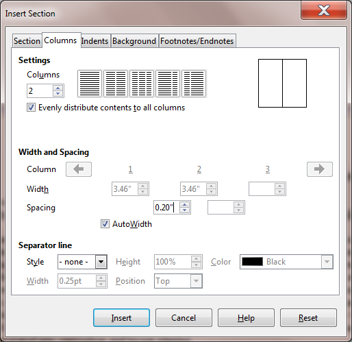

Fig. 2.36 Inserting a Continuous section break

> Click on the **Columns** tab, set the **number of columns** to **2**,
> and increase the **spacing between columns** to **0.20”**, then click
> on the **Insert** button

The next step is tricky, so follow the directions carefully.

> The cursor is still waiting at the **top of Page 3**, before the first
> line which reads: “**It will be useful…**”; make sure it is still
> there
>
> Now, use the **scroll bar** on the **right** of the window, or use the
> **roller** on the **mouse**, to **scroll down** all the way to the
> **end of the last of the teacher skills and concepts** on **Page 6**,
> hold down the **Shift key**, and click immediately after the phrase
> “**professional work with children.**”

The whole section that discusses the 13 Teacher Skills and Concepts
should now be highlighted.

> Careful now; hit **Ctrl-x**—this will **cut** everything that’s
> **highlighted** from the document and save it on the **clipboard**

Page 3 should now look like Fig. 2.37. Notice the two new faint
*bracketed* areas on your screen.

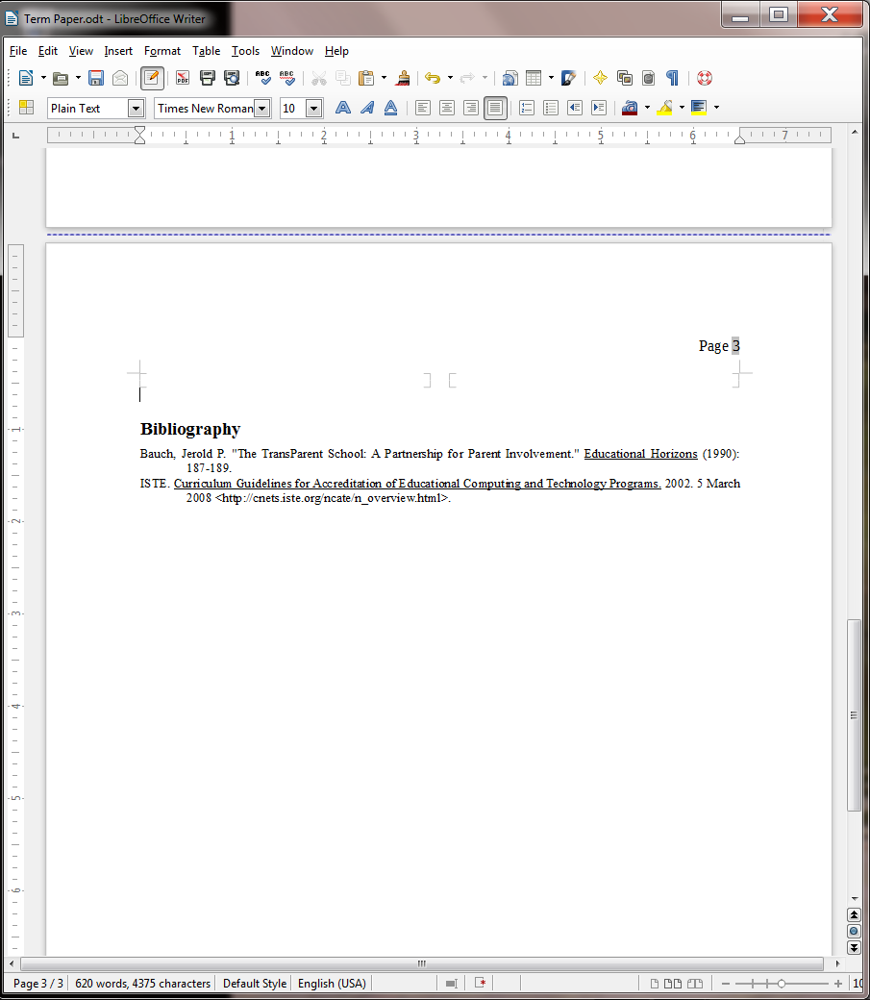

Fig. 2.37 Page 3 after cutting all the Teacher Skills and Concepts
information

You are now going to *Paste* everything from the clipboard into this new
*two-column* section of the Term Paper document.

> First, click to position the cursor **one line up**, **inside** the
> **left bracketed area**, and **Paste** (**Ctrl-v**) the data from the
> clipboard back into the Term Paper Document

If you followed the directions correctly, Page 3 of your document should
now look something like Fig. 2.38.

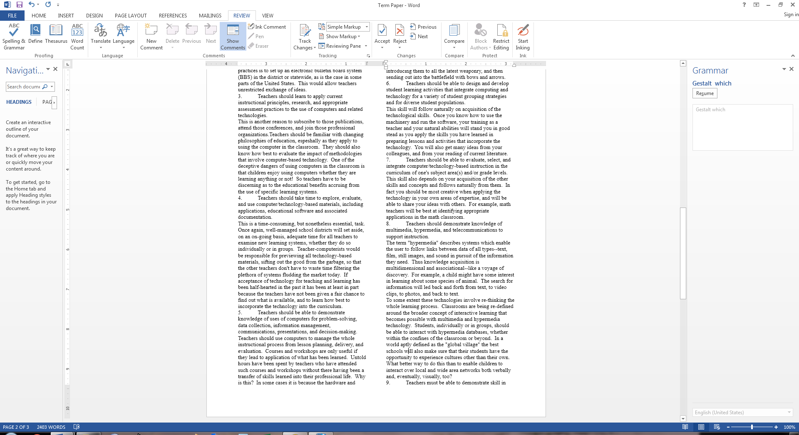

Fig. 2.38 Two-column text

If it does, that’s AWESOME! If it doesn’t, just hit Ctrl-z repeatedly
till you get back to a point where you see where you were at at the
beginning of this section of the tutorial, then try it again. But
hopefully you’re in good shape and we can proceed.

> **Save** your work before going on, then scroll to the **top of Page
> 1** of the Term Paper document, and notice that **Pages 1 and 2** are
> still **single column** text, then scroll down through the document
> **to the end** to take a look at the difference the Columns tool
> makes, and notice also that the **Bibliography** is still **single
> column** as well

So, you have now divided the paper into three sections: Pages 1 and 2
are the first section; Pages 3-6, not including the Bibliography, are
the second section; and the Bibliography is the third section*.* If you
had not inserted the new section at the top of page 3, your *whole*
document (including the Title lines, the Abstract, the ISTE Table, and
the Bibliography section) would be in two column format*.* The section
allows you to control exactly which pieces of a document you want
adjusted in certain ways.

> Scroll down to the **end** of the Term Paper, if you aren’t already
> there

In summary, if you need different formatting for different parts of a
document, you would do so by inserting sections wherever necessary.
*LibreOffice* makes this very easy indeed

The Skill Consolidation exercises at the end of this lesson will provide
you with an opportunity to practice this and other more advanced word
processing features.

**2.9 finding and replacing TEXT**

It is surprising how often the *Writer* Find (Ctrl-f) and Find and
Replace (Ctrl-h) functions come in handy when you are working with
larger documents*.* You may want to find each place in a document where
a certain word or phrase is used and either delete it, or change it, or
correct a misspelling*.* Or you may want to jump quickly to a certain
page because you have to rewrite something or insert a sentence*.* You
could scroll through the document looking for what you want, and you
might even eventually find it! But don’t count on it*.* In any case,
this takes time and there is always the possibility that you might miss
the text in question on a first or second pass.

The *Writer* Find function will swiftly and unerringly locate any
specific text you are looking for.

**Finding a text string**

*A point to ponder before you proceed*

When you are using computers, a **character** is anything that you type
at the keyboard (including numbers, spaces, and punctuation marks)*.* A
**sequence of characters** is often referred to as a "**string**" in
computerese*.* In this sense a **word** is no different than a
**phrase** as far as a computer is concerned; both are
**strings**—sequences of characters.

You are going to add a sentence to the Term Paper document*.* The
proposed new sentence is as follows:

> **Teachers cannot be expected to use computer-based learning systems
> effectively unless they acquire these skills and assimilate these
> concepts.**

The new sentence is to go immediately after the sentence in the document
that begins: "**These skills and concepts should form…**" Now, before
selecting and entering a string of text for a search, you should take a
moment to think about what the string of text should be.

The phrase that marks the point in the document you are trying to find
(“**These skills and concepts**") is long enough to probably be
*unique.* This will more unerringly locate the exact string of text
you’re looking for*.*

Here then are the steps to quickly locate and add the proposed new
sentence (see highlighted text towards the end of the previous page) in
the specified location in the Term Paper document.

It is often easiest to start a search at the beginning of a document if
you are not absolutely sure where the text you want to find occurs.

> In case you are not already there, use the **right** **scroll bar** to
> scroll to the **top of the first page of the paper**, place the
> **insertion point cursor** immediately ahead of the title **FIRST
> THINGS FIRST** at the **top of the paper**, then press **Ctrl-f** to
> activate the **Find** function tools

*Writer* now displays the Find dialog at the bottom of the *Writer*
window (Fig. 2.39).

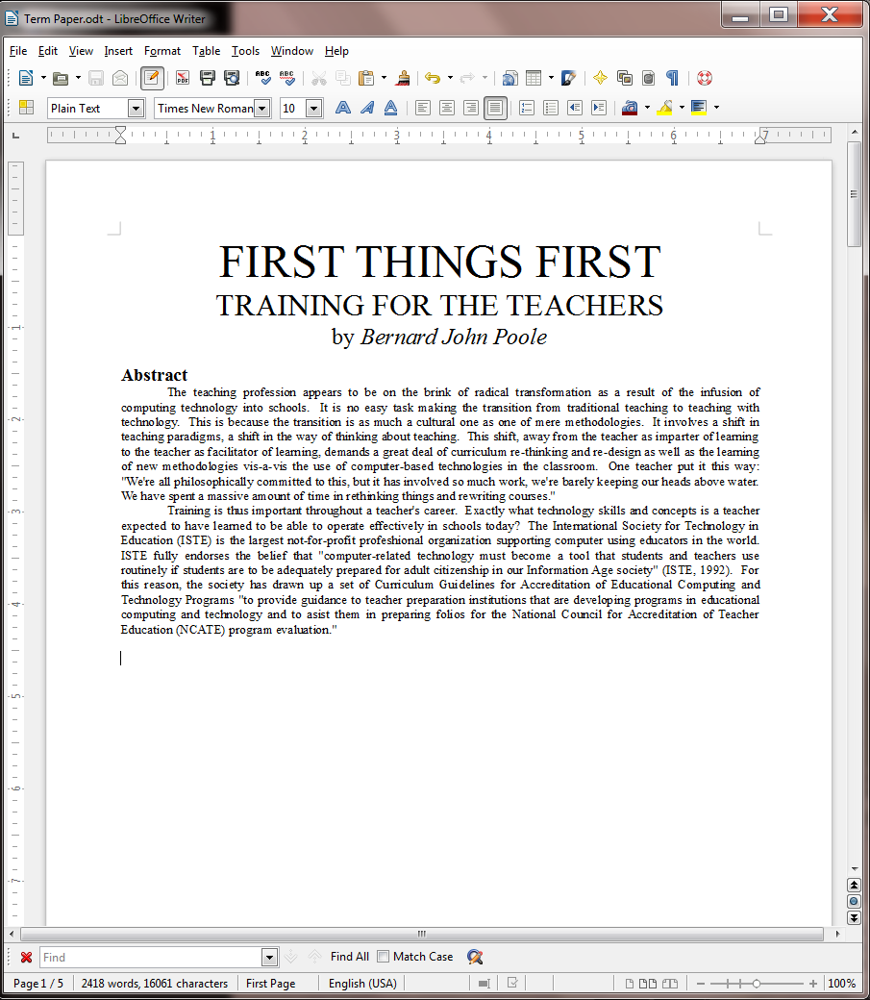

Fig. 2.39 The Find function tools (Ctrl-f)

*Writer* needs you to enter the text for the search*.* To make sure the
phrase is unique, you might as well type "**These skills and concepts**”
as your search text.

> In the **Find dialog box** type **These skills and concepts**
> (including the uppercase “T”) and hit the **Enter/Return** key

Look now at the highlighted phrase in the document and you will see that
this small string of characters is indeed the start of the phrase you’re
looking for.

If you mis-typed the search text so that *Writer* is unable to find it,
the search will conclude with a warning message telling you that the
search was unsuccessful and asking you if you want to try again from the
beginning of the document (Fig. 2.40), and you would try again with a
corrected sequence of characters or another phrase altogether.

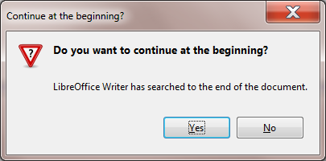

Fig. 2.40 Unsuccessful search

Once the search is successful, the text you have been looking for is
selected (highlighted). You want to insert the new sentence immediately
after the sentence that *Writer* has found for you.

> Click **after the period** at the **end** of the sentence to put the
> insertion point cursor after the phrase "**...teach in the modern
> computerized classroom.**"
>
> Press the space bar to put a space after the period, then type the new
> sentence: **Teachers cannot be expected to use computer-based learning
> systems effectively unless they acquire these skills and assimilate
> these concepts.**
>
> Click anywhere to remove the highlighting, read it over to check for
> errors, then **Save** the changes you have made

**Replacing a multiple occurrence of a text string**

Suppose you have just finished typing the Term Paper into *Writer* and
saved it on your disk. You print a draft copy so that you can read it
over before producing a finished copy. Amongst other edits, you decide
to change the phrase "skills and concepts", which is a phrase that
occurs throughout the paper, with the words "concepts and skills".

Again, you could use your eyes to visually scan through the text on the
screen until you find each occurrence of "skills and concepts" and, each
time you find it, change the phrase to "concepts and skills". But this
would take some time and, anyway, you will be likely to miss some of the
changes.

Alternatively, you can use the Find and Replace option to locate each
occurrence of "skills and concepts" and change it to "concepts and
skills"*.* Follow these steps to use this function now.

> Position the cursor at the **beginning of the Title** at the top of
> Page 1
>
> Press **Ctrl-h** (or from the **Edit** menu select **Find &
> Replace…**)

*Writer* presents the Find and Replace dialog box with the Replace tab
selected in the set of index options (Fig. 2.41).

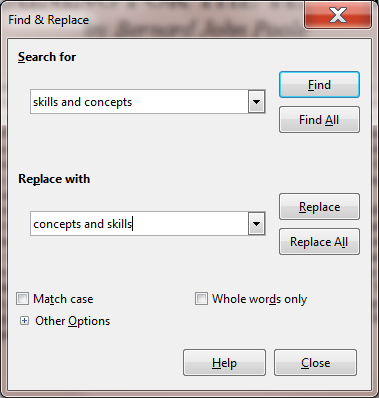

Fig. 2.41 Replace options in the Find and Replace dialog box

> Type **skills and concepts** in the **Search for** box, and **concepts
> and skills** in the **Replace with** box, then click on the **Find**
> button

*Writer* goes to work and highlights the first occurrence of "skills and
concepts"*.* If you cannot see this highlighted phrase on your screen,
it may be because the Find and Replace dialog box is covering it*.* You
can move the window around on the screen by dragging on the light pink
Title bar at the top of the Find and Replace dialog box.

The basic options available to you in the Find and Replace dialog box
are as follows*.* You can:

1.  Click on the button to ***Replace All*** occurrences of the search
    text in the entire document;

1.  click on the button to ***Replace*** only ***the one occurrence***
    of the search string;

1.  click on the button to ***Find*** the next occurrence of the search
    string without changing anything;

2.  click on the button to ***Find All*** occurrences of the search
    string without changing anything.

As a rule of thumb, you should be wary of telling *Writer* to *Replace
All* occurrences of a piece of text unless you are *absolutely* sure you
know what you are doing*.* It is surprising how easy it is to specify a
string of characters that turns out to be not quite what you had in
mind*.* By telling *Writer* to *Replace All* occurrences of a string of
text you might result in your document being peppered with unwanted
changes.

So be careful! Suppose, for example, you told *Writer* to correct a
misspelling where you spelled receive with the "i" before the "e"
("recieve")*.* You specify "ie" as the search text, and innocently tell
*Writer* to replace all occurrences of "ie" with "ei" (because you want
to correct the misspelling of “receive.” Well, as it happens, in the
Term Paper document the character sequence "ie" occurs many times (about
50 times!) in all kinds of innocent words (technologies, belief, etc.)!

Should they *all* be replaced with "ei"? Clearly not*.* Even “cie”
occurs 8 times in the Term Paper, and so on*.* So you have to be careful
(1) to specify the search text that will get you right away the result
you want, and (2) work your way through the document selecting only the
iterations of the string you want to replace*.* In our hypothetical case
you would type the entire incorrectly spelled word "recieve." Then you
could safely tell *Writer* to replace all occurrences of it with the
correctly spelled word “receive.”

Back to our example. As it happens, the search string (“skills and
concepts”) is sufficiently unique for you to go ahead and *Replace All*
occurrences.

> Click on the **Replace All** button

*Writer* may take a few seconds to make the changes, depending on how
fast your Windows computer is*.* Soon you will see a window telling you
how many occurrences of the search string were replaced*.* So… How many
were there? There should have been 10.

> Click on **OK**, then **close** the **Find and Replace** dialog box
> and press **Ctrl-s** to save the changes you have made

In the course of completing this exercise you may have noticed some
spelling and typo errors in the text*.* Later in this lesson you will
use the *Spelling and Grammar* feature to clean up the document*.* The
more you use the word processor, the more you will appreciate the power
of the simple word processing tools such as the ones you have just
learned*.* The best, however, is yet to come.

**2.10 MOVING and copying text within a document**

In Lesson 1 you learned to appreciate the power of a word processor as a
tool for writing because of the ease with which you can edit your
work*.* Now you will learn how to move sections of text from one place
to another within a document. You already practiced doing this when you
used cut and paste to move all those concepts and skills to a special
2-column section of its own.

The ability to move text is crucial to the process of successful
writing*.* Using a traditional typewriter, you would be lucky if you
could get away with doing this by using a pair of scissors and literally
cutting and pasting your document onto new sheets of paper in the
sequence that you required*.* More often than not you might have to
re-type the whole document before you could submit it for others to
read.

The word processor, on the other hand, makes editing tasks such as
moving text around simple and fast*.* You can manipulate the text at
will, trying ideas on the fly, and save different versions until you
decide on the one best version that makes the desired impact you’re
looking for.

Very few, if any, writers write without needing to edit their work*.*
Indeed, you might say that bad writers are the ones who can’t be
bothered to edit at all*.* The word processor takes much of the sting
out of editing*.* Because of this, it literally helps to make you a
better writer by simplifying the essential task of molding your ideas
into nuggets of golden thought.

**Moving text within a document**

As with all the functions of *Writer*, the steps involved in moving text
within a document are simple enough*.* In the Term Paper document you
are going to move a paragraph from one place to another within the
document*.* Here are the steps to do this.

> Once again, make sure the cursor is positioned **at the top of** the
> paper
>
> Use the **Find** function (**Ctrl-f**) to locate the phrase:
> **Training is thus important**

The phrase (in the Abstract on page 1) should be highlighted on your
screen. The next step can be tricky for beginners, so don't be surprised
if you have to try it a couple of times before you get it right.

> Click to position the insertion point cursor **immediately before**
> the word "**Training**"
>
> Scroll down if necessary so you can see the rest of the paragraph,
> then hold down the **Shift Key**, and keep it down, while you click at
> the end of the paragraph

This will highlight the whole paragraph*.* Another, quicker, way to
highlight a paragraph in *LibreOffice* is by triple-clicking on it*.*
Now that the paragraph is selected (highlighted), you need to **cut** it
to the **clipboard**.[^2]

> Press **Ctrl-x** to **Cut** the paragraph out of the Term Paper
> document

Cutting text removes the selected text from the document and transfers
it to the *clipboard.* Once it is on the clipboard you can move it
anywhere you want, either within the same document, or to some other
document altogether.

You are going to move the "**Training is thus...**" paragraph (currently
on the clipboard) to page 6 of the document, immediately after the last
paragraph in the second column of the two-column section you created
earlier in this tutorial.

> Scroll to the end of the document on **page 6** and click to position
> the **cursor** right at the end of the paragraph that ends
> “…**professional work with children.**”
>
> Hit the **Enter** key and then hit **Ctrl-v** (or from the **Edit**
> menu select **Paste**)
>
> With the mouse pointer somewhere on this last paragraph (the one you
> just pasted), change the **font size** to **12 pt**

*Writer* completes the paste process in no time at all by pasting the
section from the clipboard back into the document at the insertion
point*.* Now you have a strong concluding statement before your
Bibliography.

> When you are satisfied that all is well, press **Ctrl-s** again to
> save the changes you have made thus far

**Copying text within a document**

The process of copying text is almost identical to that of moving
text*.* You select the section of text you want to copy, in the same way
as you did when you cut text in the previous exercise*.* But now you
will have *Writer* *copy* the selection without *cutting* it, and then
*paste* a *duplicate* of it somewhere else in the document, leaving the
original text where it is.

For example, let us say you want to copy the title lines of the paper so
that they occur not only at the top of the first page but also at the
top of Page 2*.* The title lines include the two title lines followed by
the author's name—three lines in all*.* Follow these steps to place a
copy of the title lines at the top of Page 2.

> Position the **insertion point** at the top of the paper
>
> Hold down the **Shift key** while you click at the end of the author's
> name (or **drag down** to select all three title lines)
>
> Press **Ctrl-c** to copy the selected text to the clipboard

Notice that the original text is still in place—you haven't *cut* it
from the document*.* All you have done is transfer a copy of the text to
the clipboard.

> Now scroll to the **top of the second page** of the document and click
> to **position the cursor** at the **top** of this **second page**
> (immediately before the section header “**ISTE Foundational skills and
> concepts**”), press the **Enter/Return** key **once** on the keyboard,
> and click in the empty line **above the section header** to put the
> cursor there
>
> Press **Ctrl-v** to paste the **title lines** from the clipboard

*Writer* instantly makes a copy of the titles where the insertion point
cursor is located.

> Press the **Enter/Return** key **once** more to space down after these
> title lines, then **scroll down** to check the effect of the copy
> operation
>
> Press **Ctrl-s** again to save the changes

**2.11 SPELLING AND GRAMMAR CHECKING**

Now would be a good time to check the document for spelling errors and
other typos*.* As you already may have noticed, there are a few errors
that have been intentionally introduced into the document.*.* Before you
begin checking for errors, though, remember that a spelling checker is

> 1\. only as good as the person using it;
>
> 2\. unable to pick up grammar or word choice errors (where the word "to"
> may have been typed, when "too" or "two" was intended);
>
> 3\. may find a problem when there is none (such as an abbreviation it
> doesn't recognize).

You may already have had the experience where you have corrected
someone’s spelling only to have the person retort: "But I ran it through
the spelling checker!!" Be sure, of course, that you know how to spell
the word in question yourself*.* Then, assuming you are right, take
advantage of the situation to tell your friend that a computer is just a
dumb machine—it depends on *people* for its *intelligent* use. Since the
Spelling Checker is only as good as you are, you would be wise to always
have a good dictionary at hand*.* Get into the habit of looking up words
that are new to you when you come across them in your reading.

This will be the case when you are checking the spelling of the Term
Paper document*.* There are quite a few important technical terms in the
document that you may not have come across before*.* Some of them may
not be in the *Writer* dictionary*.* Does this mean you can't check
them? Of course not*.* Look them up in your dictionary so as to extend
your word power*.* Make this a lifelong task.

Time to go ahead and run the document through the Spelling Checker.

> Start by running the document through the **AutoSpellcheck**, using
> the **AutoSpellcheck tool** in the **Standard toolbar**

Don’t trust the AutoChecker, though. You should still run the basic
Spelling and Grammar checker AND proofread the document by reading it
through carefully yourself.

> Put the cursor at the **beginning** of the Term Paper document, then
> in the **Tools** menu click on **Spelling and Grammar…** (or click on
> the **Spelling and Grammar** button in the **Standard toolbar**)

This brings up the Spelling and Grammar dialog box (Fig. 2.42).

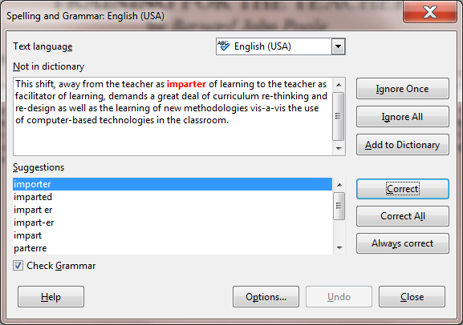

Fig. 2.42 The Spelling and Grammar dialog box

> Now… For each word that is highlighted (in red), choose whether to
> **Ignore** (the suggested error) **Once**, **Ignore All** (further
> occurrences of the same word), **Add** (the word) **to the
> dictionary**, **Correct** (the word to a suggested alternative or to
> one of the suggested correctly spelled versions), or **Correct All**
> (including further occurrences of the same word)
>
> The first “error” found by the system is actually not an error at all
> (“imparter” is a perfectly good word in this context), so you will
> click on the **Ignore once** button because it may be used incorrectly
> later in the document

As you work your way through the document, notice how often the Spelling
and Grammar checker makes sense of what *should* be there and makes
recommendations that are really, really useful*.* You might even be
tempted to think the computer has some kind of intelligence*.* But the
fact is that a lot of spelling and grammar is formal and computable*.*
The computer seems intelligent because it has been programmed by
intelligent humans, like you, so don’t be afraid to make the computer
your friend.

> Press **Ctrl-s** to save the corrected document after you have
> completed the Spelling and Grammar check

**2.12** **ADDING DROP CAPS**

Drops caps are neat, easy to use, tool which helps to set off one
section, or one chapter, of a document from another. You have
undoubtedly read books where the first letter of any section or chapter
is made distinctive like this (Fig. 2.43).

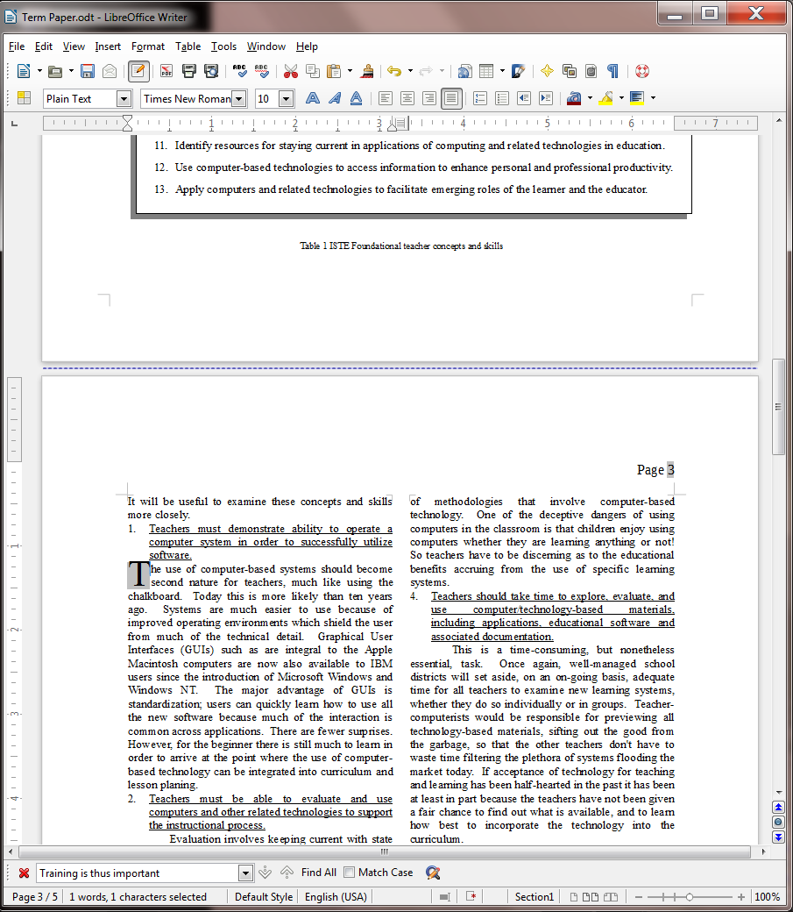

Fig. 2.43 Using Drop Caps to highlight the beginning of a new section of
text

You are going to do this for each of the 13 sections which explain the
various Concepts and Skills that every teacher should have acquired to
be proficient in a modern teaching environment.

> First, position the cursor, in **Column 1** towards the top of **page
> 3**, **after** the **underlined** title of the **first** Teacher
> Concept and Skill, and **immediately before** the phrase “**The use of
> computer-based systems…**” (Fig. 2.44)

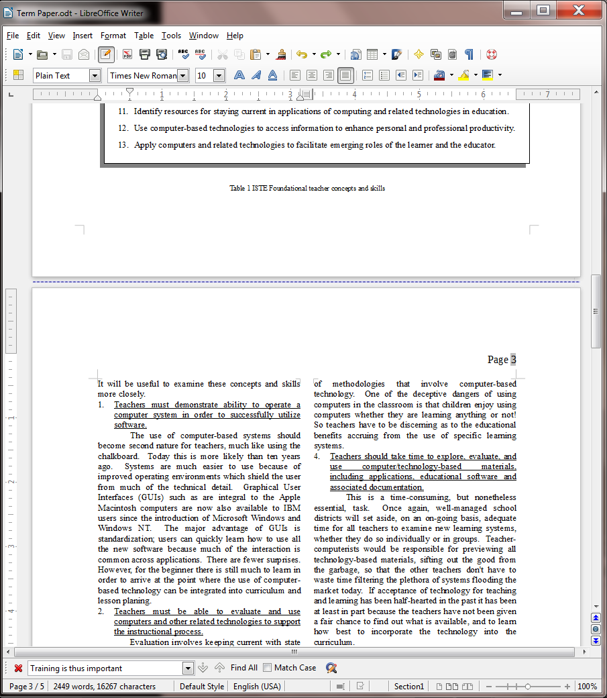

Fig. 2.44 Where to put the first drop cap

> In the **Format** menu > **Paragraph…** dialog box click to put a
> **check mark** in the **Settings** > **Display drop caps** box and
> change the **Lines:** item from **3** to **2** to make the **Drop
> Cap** letter **two lines high**, then click on **OK** (Fig. 2.45)

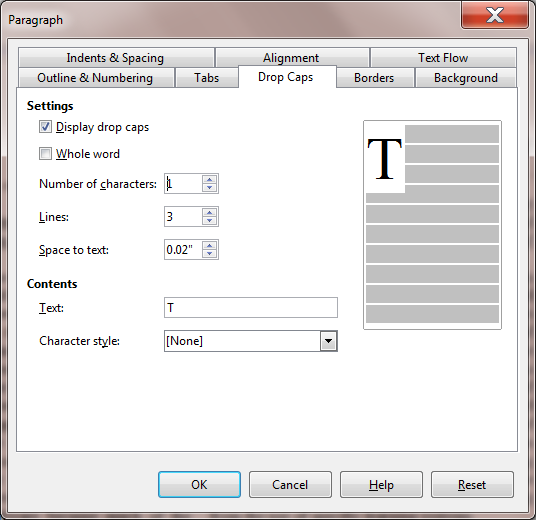

Fig. 2.45 Formatting the drop cap

The drop cap letter for the first Concept or Skill in your Term Paper
document on Page 3 should now look like what you see in Fig. 2.46.

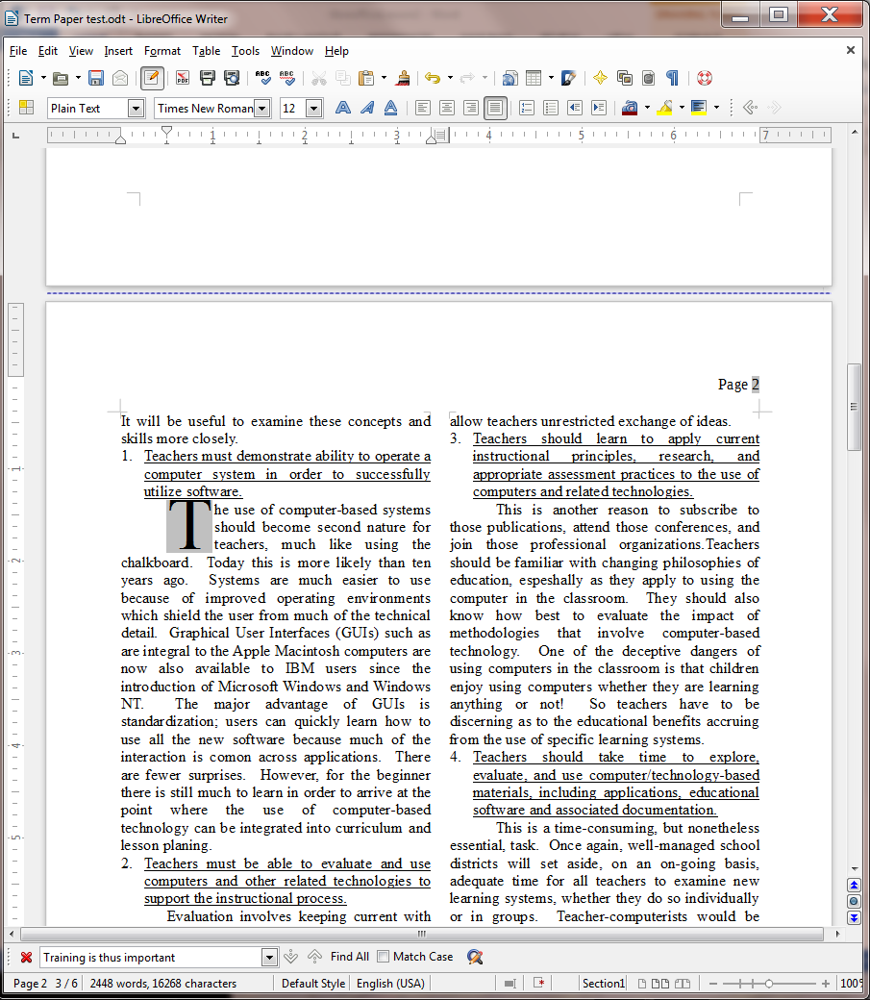

Fig. 2.46 Using Drop Caps

The last thing you need to do is move the Drop Cap letter to the *left
edge* of the column. You need to do this for all the Concepts and Skills
on pages 3 thru 5 of the document, so before you add a Drop Cap to the
first paragraph of the other Concepts and Skills, let’s change the First
Line Indent for all the first paragraphs to 0”.

> Position the cursor anywhere in the **first paragraph** of each of the
> 13 Concepts and Skills sections and, in the **Ruler bar**, each time,
> slide the **First Line Indent marker** back to the **0” hash mark**
>
> Now, for each of the other 12 sections, position the cursor at the
> beginning of the first line of the first paragraph, then, in the
> **Format** menu > **Paragraph…** dialog box (Fig. 2.43 above),
> click to put a **check mark** in the **Settings** > **Display drop
> caps** box and change the **Lines:** item from 3 to **2** to make the
> **Drop Cap** letter **two lines high**, then click on **OK**

The end result for each of the 13 items will look like Fig. 2.47.

Fig. 2.47 The Drop Cap letter aligned on the left margin of the column

**2.13 CREATING A TABLE CONTENTS**

You’re almost done with the tutorial*.* It is sometimes useful to put a
Table of Contents (TOC) at the beginning of a longer document and there
are appropriate ways of doing this*.* You are going to add a TOC on a
page by itself right after the Title page (Page 1)*.*

So the TOC will become Page 2 of the Term Paper document. The following
figure illustrates how the TOC will look when you have completed this
exercise (Fig. 2.48).

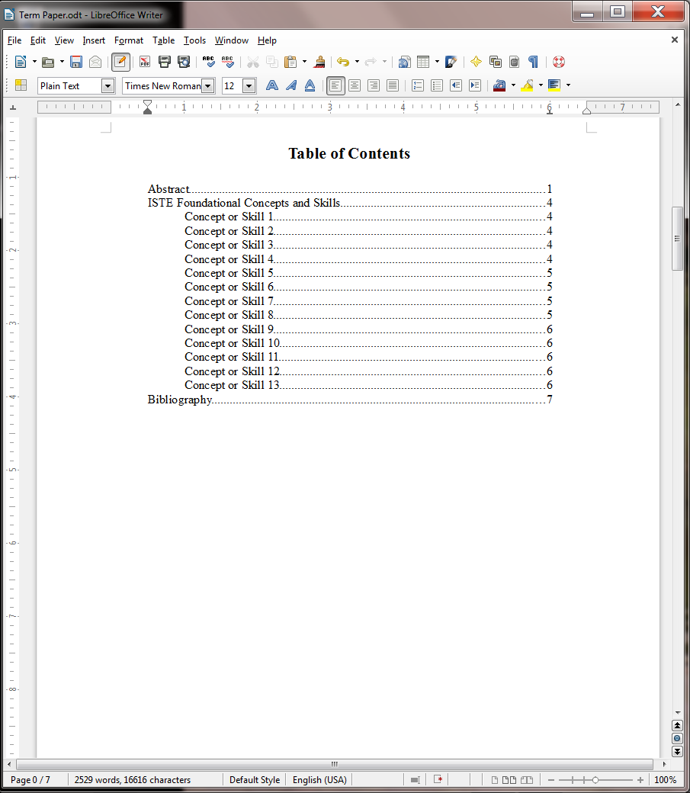

Fig. 2.48 Finished Table of Contents

> Click to put the cursor at the **end of the Abstract** on **Page 1**
>
> In the **Insert menu** select **Manual Break…**, and click on **OK**
> to accept the default **Page Break**

The cursor should now be waiting at the top of the new page (page 2).
Notice that the cursor is indented ½” because that was the indent you
set for the Abstract earlier in this tutorial. You need to change that
back to 0” on the Ruler bar.

> Use the mouse to drag the **First line Indent marker** (the upper of
> the two markers on the left of the Ruler Bar) back to the **0” hash
> mark** on the Ruler
>
> As you see in Fig. 2.48 on the previous page, the title **Table of
> Contents** is **boldface** and **centered** on the page, and it is
> also a **larger font size** than the rest of the text (**16 pt**), so,
> in the **Formatting toolbar** > **Font size** menu, select a font
> size of **16 pt**, click on the **boldface** icon, then click on the
> **center** icon and type **Table of Contents**
>
> Hit **Enter** twice, then click on the boldface icon to **turn off
> boldface**, select **Left justify** for the items that go in the Table
> of Contents and change the font size to **12 pt**
>
> Move the **Left Indent Marker** (the lower of the two indent markers
> on the left of the Ruler bar) to the **½” hash mark** on the ruler,
> then type **Abstract** for the first item in the TOC (Table of
> Contents)

Now you need to set a Tab Stop for the *right edge* of the TOC, where
you want all the page numbers to line up on the right *and* you want
what are called “*dot leaders*” to run across the page to visually
connect the TOC item with its page number (see Fig. 2.48 on the previous
page).

> On the **Tab Stop tool** (over to the far left of the Ruler bar—see
> Fig. 2.48 on the previous page), click **twice** to change the Tab
> stop to **Right Tab**, then click **once** on the **ruler** at the
> **6” hash mark** to place the **Right Tab Stop** there (see Fig. 2.48
> on the previous page again)
>
> Now, with the **tip** of the mouse **pointer** positioned on this
> **Right Tab Stop** at the **6” hash mark**, **double click** on the
> **Tab Stop** to bring up the **Paragraph** dialog box, then click on
> the **Tabs tab** (Fig. 2.49)

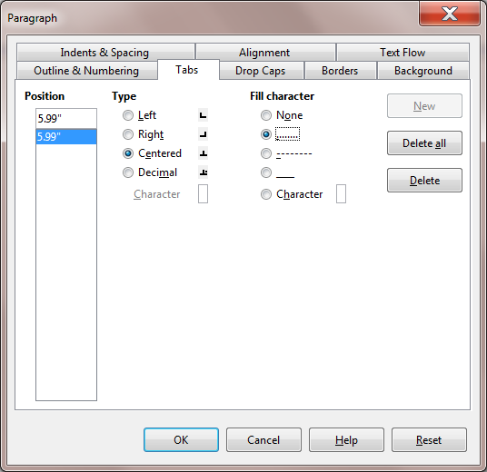

Fig. 2.49 Paragraph/Tabs dialog box

> In the **Leader** section of the dialog box, click in the **radio
> button** next to **…….**, which will give you the **dot leaders** in
> the TOC, then click on the **Set** button**,** and click on **OK**

Dot leaders will now be applied to every item you subsequently type into
the TOC.

> Hit the **Tab key** just **once** to put a line of dots all the way
> across the page as far as the **Right Tab Stop** (these dots are
> called **dot leaders** and they help the eye flow across the page to
> the correct page number relative to the item in the Table of Contents
> to which it refers)
>
> Type the page number **1** and hit **Enter**
>
> Now type up the rest of the TOC as per **Fig. 2.48** on **page 71**,
> moving the **left indent marker** to the **1” hash mark** for the **13
> Concepts or Skills**, and back to the **1/2”** hash mark for the
> **Bibliography** item
>
> **Save** the document when you’re done creating the TOC

*Backing up your Term Paper document*

You should know how to do this by now, but if you need a refresher, here
are the steps.

> Go to **File** > **Save As** > **Navigate to your Work Files for
> LibreOffice** folder > **Data Files** folder > name the document
> **Term Paper Backup** > click on **Save**

*Printing the document*

At some convenient time[^3], print out a draft copy of the entire Term
Paper document*.* Carefully proofread the printed copy of the paper*.*
Have a dictionary handy*.* Any words you don't understand, look them up;
extend your vocabulary*.* Use a pen with some color other than black to
correct any errors you spot that were not picked up by the spelling
checker*.* Go back to the *Writer* document, correct any errors you
find, save the document again, and print a final letter-quality ("Best")
version to present to your instructor.

**SKILL CONSOLIDATION**

Complete as many exercises as you can so as to reinforce what you have
learned in Lesson 2.

1\. Load the document Term Paper onto the Desktop.

1.  Use the Find and Replace function to locate the words "electronic
    bulletin board"

1.  Use the Find and Replace function to replace every occurrence of
    "conferences" with "meetings"

1.  Boldface the title lines at the top of the first page (before
    the Abstract)

1.  Move a complete section of your choice so that it follows the
    section it currently precedes.

2\. Underline the word "computer" wherever it appears in the document
Term Paper, then adjust the line spacing to 1½ for the entire Term Paper
document.

3\. Open up a new word processor document*.* Call the document "Format
Options." Type in a list of at least ten words, and select a different
option for each one: normal, italics, boldface, font size of 14, font
size of 20, centered, underlined, and any combination of these you
want*.* Proof read it, correct any errors, then print out the document.

[^1]: *Sans* is French for "without." So *Sans Serif* refers to fonts
    *without* the extra little flourishes that embellish the characters.

[^2]: Recall that if you click on the right mouse button while pointing
    at an object, *Writer* will bring up a context menu which will allow
    you to access the cut and paste functions.

[^3]: It may not be convenient to run off a copy of the document during
    a lab session when other students in your class may be waiting in
    line for the printer*.* Also, if you are using your own printer at
    home and it’s an inkjet printer, you may want to save ink on the
    draft copy by using the *Quick Print* option in the Print
    Preferences.
