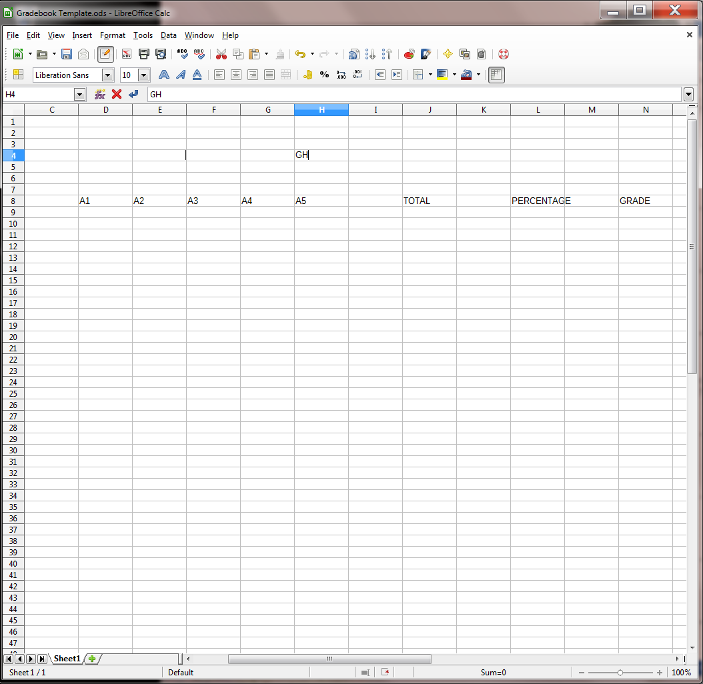

**Lesson 4** Introduction to The *Calc* Spreadsheet
===================================================

  ------- --------------------------------------------
  **4**   **Introduction to the *CALC* spreadsheet**
          
          Preparing a Home Inventory spreadsheet
  ------- --------------------------------------------

**LEARNING OUTCOMES**

This tutorial will help you understand what a spreadsheet is and where a
spreadsheet might come in useful for classroom management. Specifically
you will learn about the following topics.

> • Helpful hints for understanding the basic concepts of a spreadsheet,
> including:
>
> • cells, rows and columns
>
> • cell coordinates
>
> • entering data into a spreadsheet cell
>
> • Setting up labels, including:
>
> • setting column widths
>
> • aligning data in cells
>
> • entering column and row labels
>
> • Creating and copying formulas
>
> • Making changes in a spreadsheet
>
> • inserting rows and columns
>
> • deleting rows and columns
>
> • Producing a printed copy of the contents of a spreadsheet document
>
> • Saving a backup copy of your work
>
> • Appreciating the power of spreadsheet templates

**4.1 GETTING STARTED**

**Setting up for the tutorial**

If you completed Lesson 1 of these tutorials, you can skip the rest of
this section and proceed directly to **Before we begin**, on the next
page. If you did *not* complete Lesson 1, then you must do this now,
before proceeding with the rest of Lesson 4.

The set of *Work Files for LibreOffice* ideally should be stored on a
Flash drive (USB drive) in three folders named *Base Files*, *Impress
Files*, and *Miscellaneous Files*. You need to create a fourth folder
for the *data files* that you will be creating while working your way
through the tutorials. This fourth folder will be called *Data Files*.

Here are the steps to take to prepare these folders now before
proceeding with this tutorial.

> First, **Unzip** the set of **Work Files for LibreOffice** by double
> clicking on the File name on your computer (your instructor will help
> you with this if you are working with a class) and **Extract** them
> onto your flash drive
>
> **Double click** on the **Work Files for LibreOffice** folder to
> **open** it

Now, inside the *Work Files for LibreOffice* folder you need to create a
new, *fourth,* folder called *Data Files.* Here’s how you do this.

> **I**n the **Work Files for LibreOffice folder**, select **New
> Folder** (Fig. 4.1).

Fig. 4.1 Creating a New Folder

The system will create a new folder for you and then wait for you to
give it a name of your choice (Fig. 4.1 above).

> Call the new folder **Data Files**

During the course of these tutorials you will be storing many files in
this Data Files folder.

**Before we begin**

For this lesson it will be good to have a separate folder inside your
Data Files folder for the spreadsheets you’re going to create.

> When you are ready, go to **Start** > **My Computer** > **Your
> USB drive** > **Work Files for LibreOffice** folder > **Data
> Files** folder, and create a new folder called **Spreadsheet
> Documents**

**Some background about spreadsheets**

Fig. 4.1 illustrates a typical spreadsheet for keeping track of an
inventory of items in your home.

Fig. 4.1 Typical spreadsheet for a Home Inventory

As illustrated in Fig. 4.1, a spreadsheet is a grid divided into rows
that run across the spreadsheet from left to right, and columns that run
from top to bottom of the spreadsheet. As with the Word processor, the
best way to learn about the spreadsheet is to build one and work with
it. So here goes.

> Go to **Start** > **All Programs** and open **Microsoft Office
> *Calc***

You should now see on your screen a new *Calc* spreadsheet document
titled **Untitled 1**.

> Put your USB drive containing the **Work Files for LibreOffice** in
> the disk drive
>
> From the **File** menu select **Save As** and navigate to **Work Files
> for LibreOffice** > **Data Files** > **Spreadsheet Documents**
>
> Type **Home Inventory Template** as the name for the new spreadsheet
> and click on the **Save** button

You should now be looking at a screen with the name of your document
(*Home Inventory Template)* at the top of a blank worksheet ready for
you to insert your data.

**4.2 HELPFUL HINTS WHILE USING THE SPREADSHEET**

**A spreadsheet is a grid divided into rows and columns**

The intersection of a column and row is referred to as a cell (Fig.
4.2).

Fig. 4.2 Think of the spreadsheet as a grid divided into rows and
columns

Right now, cell A1 is selected in the top left-hand corner of the
spreadsheet (Fig. 4.4).

> With **cell A1** selected, type the number **2015** in cell **A1** and
> hit **Enter** so you have some data in the spreadsheet for what
> follows

A cell is where information, in the form of either a label, or a number,
or a formula for calculation, will be entered.

-   *Labels* are where you use text (which may or may not be numbers) to
    > describe the data in the columns and rows.

-   *Numbers* are just that—numbers, as in mathematics. Numbers are what
    > spreadsheets are all about.

-   *Formulas* (or *Functions*) are mathematical expressions built into
    > certain cells that instruct the spreadsheet to carry out
    > calculations on specified sets of numbers in the rows and columns.

**Moving around in the spreadsheet**

There are 1,048,576 rows and 16,384 columns in the *Calc* spreadsheet!
That means there are well over 17 billion cells in which you can store
data!

Usually you will use the mouse to select the cell you want to work in by
clicking on the cell. Once you have entered data into a particular cell,
you can use the commands in Table 4.1 to proceed to other related cells.

  ------------------------------------------- -------------------------------------------------------------------
  **Key Pressed**                             **Effect**
  **Tab**                                     Moves selection to the right, to the next cell in the same row
  **Shift-Tab**                               Moves selection to the left, to the previous cell in the same row
  **Arrow keys**                              Move selection one cell in any direction
  **Shift-Enter**                             Moves selection up to the previous cell in the same column
  **Enter**                                   Moves selection down to the next cell in the same column
  **Scroll bars**                             Scroll vertically and horizontally through the spreadsheet
  **Accept button**    Accepts data in a cell but does *not* move to another cell
  **Cancel button**    Cancels data in a cell but does *not* move to another cell
  ------------------------------------------- -------------------------------------------------------------------

Table 4.1 Cell selection commands

> Try out each option now before proceeding—this will help you follow
> later directions
>
> Practise by moving around the spreadsheet—after you have visited
> several cells, end up by clicking on cell **A1** to make it the
> current or active cell.

**Identifying the active cell's coordinates**

Look in the top left hand corner of the *Calc* screen (Fig. 4.2 on the
previous page) to see which cell is the active cell you are in at any
point in time.

> Click on any cell now and look at the **cell's coordinates** in the
> **top left corner** of the spreadsheet window (see Fig. 4.2 previous
> page)

Notice that each cell (a location in the spreadsheet) has an *address*
which begins with a *letter* to indicate the column, followed by a
*number* to indicate the row. For example, G6 identifies the cell at the
intersection of column G, row 6.

> Click on **cell G6** now and look at the **cell's coordinates** in the
> **top left corner**

**Selecting a range (group) of cells**

Table 4.2 lists the methods for selecting a group or range of cells.

  -------------------------------------------------------------------------- --------------------------------------------------------------------------------------------
  **Task**                                                                   **Method**
  To select a **block of cells**                                             Drag from the **first cell** to the **last cell** in the block
  To select an entire **row** of cells (horizontally from left to right)     Click on the **number** (the **row label**) on the left edge of the spreadsheet
  To select an entire **column** of cells (vertically, from top to bottom)   Click in the **letter(s)** of the alphabet (the **column label**) at the top of the column
  To select **several rows**                                                 Drag the **row numbers** on the left edge of the spreadsheet
  To select **several columns**                                              Drag across the **column labels** at the top of the columns
  -------------------------------------------------------------------------- --------------------------------------------------------------------------------------------

Table 4.2 Selecting a group or range group of cells

> Once again, try each of these methods for selecting groups of cells

**Location of the active (selected) cell after entering data into a
cell**

When you type data into a cell, the data appear both in the *cell* you
have selected AND in the *Entry bar* at the top of the spreadsheet. See
how this works for yourself now.

> Click on **cell B1** and type the number **2015**, then look at the
> **Entry bar** above the spreadsheet cells (Fig. 4.3)

Fig. 4.3 The spreadsheet Entry bar

The data are again in both places at once, but they are not yet
*permanently* accepted into the cell. The number *2015* awaits your
acceptance of it into the spreadsheet. The data are displayed in the
cell to give you the opportunity to:

> 1\. check that they are correct before accepting them into the active
> (selected) cell;
>
> 2\. make up your mind whether they should be entered into the spreadsheet
> at all;
>
> 3\. decide which cell you would like to be the active cell next after the
> data have been copied to the currently active cell.

You accept the data by either

-   moving to another cell in the spreadsheet (by clicking on the Enter
    > key or Tab key on the keyboard or by using the mouse to click on
    > some other cell);

or

-   clicking on the Accept **(** **)** icon to
    > the left of the Entry bar.

If you decide *not* to enter the data into the spreadsheet, you would
click on the *Cancel* box () in the Entry bar
(Fig. 4.5) and start over. If, on the other hand, the data are correct,
you would click the Accept button **(****)**,
which also keeps the cell you are working in as the active cell.

> Click the **Accept** button **(****)** now

Notice that the number *2015* in cell B1, as with the number 2015 in
cell A1, is *right justified*, aligned on the right edge of the cell,
which is the correct justification for *numbers* in mathematics.

Alternatively, you may want to proceed to the cell immediately to the
right of the active cell into which the number you just typed will go.
Or you may want to proceed to the cell just below the active cell, or
the cell just above the active cell, and so on.

A short while back you practised moving around the spreadsheet using the
commands listed below in Table 4.1 on page 106. This table also lists
the key(s) to press to tell *Calc* which cell to go to after you accept
the data you have typed into the Entry bar. It might be a good idea, if
you’re new to spreadsheets, to take a few minutes to check out that
table again.

> Practise now by making the cell in which you just typed **2015** the
> active cell (by clicking on it)
>
> Then press each of the keys or key combinations in Table 4.1 (on page
> 106) and verify the result of the action in the spreadsheet each time

**Blanking out a cell or cells in the spreadsheet**

The quickest way to blank out a selected cell or cells is to hit the
Del(ete) key on the keyboard. Let’s try this now.

> Click on the cell holding the data **2015** (**cell A1**) and hit the
> **Del(ete)** key

Now cell A1 is empty. The Delete key saves you having to use the mouse
and menus.

> **Undo** what you just did by pressing **Ctrl-z** (to put back
> **2015** in cell **A1**)

To delete the data in a group of cells you would drag across the cells
to select them—they will become highlighted. Then you’d select Clear
from the Edit menu or hit the Del(ete) key as before.

> Practise this by dragging across Cells **A1** and **B1** and hitting
> the **Del(ete)** key

Bingo. Remember that you can undo the *Delete* operation (or any other
Edit operation) by immediately pressing *Ctrl-z* on the keyboard.

**Editing the data in the Entry bar**

While you are typing in data in the Entry bar you can edit them as if
you are using *Word*. So everything you learned in Lessons 1 and 2 will
apply.

**Editing data after they have been entered into a cell**

If you are past the cell where you have an error and want to make a
correction or change, move back to the cell in question by selecting
(clicking on) it. The data in that cell will be displayed in the Entry
bar at the top of the spreadsheet. Click in the Entry bar (the cursor
will show where you clicked on the text) and then just go ahead and make
any changes you want. Replace the old entry by clicking the Accept
button **(****)** or by selecting another cell in
the spreadsheet.

**4.3 SETTING UP LABELS FOR YOUR HOME INVENTORY TEMPLATE**

When you have completed this section, your Home Inventory Template
should look like Fig. 4.4.

Fig. 4.4 Home Inventory Template

The steps that follow will help you achieve this goal. Follow them
carefully.

> Select cell **A1** and type **Home Inventory**
>
> Check the data in the **Entry bar** to make sure you typed the label
> correctly; correct any errors
>
> Click the **Accept** button **(****)** when you
> are sure all is well (or press one of the other keys—arrow keys,
> Enter/Enter key, Tab key—which accept data into the spreadsheet)

This is an example of a label—which is any text you use to *describe*
the data that are in a spreadsheet. All the column and row headings are
also labels.

Notice that the label “Personal Information” overflowed the cell in
which you typed it. The cell isn’t wide enough, so you need to widen the
A column to allow for the length of this and other Labels describing
information you will later be entering into that column.

> Make sure you have any cell in **column A** selected, then from the
> **Home Ribbon** select the **Cells Group** > **Format** >
> **Column Width**
>
> Type the number **25** in the dialog box that pops up, then click on
> **OK **
>
> While you're at it, click anywhere in **column B** (**Item(s)**) and,
> in the **Home Ribbon** again, select the **Cells Group** >
> **Format** > **Column Width** and adjust the width to **25**, too

Later in this section you'll practise adjusting the width of other
columns.

> Select cell **A3** and type the label **Personal Information:**, then
> press **Enter** to move the cell pointer to cell **A4**
>
> Type the label **Name:** and press **Enter** to move the cell pointer
> to cell **A5**
>
> Next type the label **Address Line 1:** and press **Enter** to move
> the cell pointer to cell **A6**, type the label **Address Line 2:**
> and press **Enter** to move the cell pointer to cell **A7**, type the
> label **Phone:**, then click on the **Accept** button
> **(****)** in the **Entry bar**

At this point you should be thinking about saving the work you have
completed to this point! Since you have already named the document
(*Home Inventory Template*), you can use a quick keyboard shortcut.

> Press **Ctrl-s** to save your work to this point

**Aligning data in spreadsheet cells**

The grade book will look best if the three labels you just entered into
cells A3 to A7 of the spreadsheet are *right aligned* in their
respective cells. Right aligned means that the label is aligned to the
right side of the cell. Unless you tell *Calc* otherwise, the system
will *left align* any data that are regular text (letters of the
alphabet, for example). Likewise, the system will *right align* any data
that are made up of numbers. This makes sense if you look at Fig. 4.5.

Fig. 4.5 Text is left aligned; numbers are right aligned

However, text sometimes looks best when it is right aligned in the cell.
This is the case with the labels about your Personal Information that
you just entered into cells A4 to A7. Here is how you *right align* the
text in these cells.

> Position the spreadsheet cursor on cell **A4**
>
> Hold down the mouse button and drag down to cell **A7**, so that **all
> four cells** are selected (cell **A4** will still be selected even
> though it is not highlighted—it has the heavier border which also
> indicates selection in the spreadsheet)
>
> In the **Home Ribbon** > **Paragraph Group** click on the **Right**
> **Alignment** button

This will right align the cells that you have selected (A4 to A7). Check
this on the screen before you go on.

> Press **Ctrl-s** to save your work so far (this is a good habit to get
> into!)

**Entering the column and row labels**

Now you are going to enter the labels for each of the columns that
eventually will contain the data about your personal possessions (your
home inventory). But notice again that the columns are too narrow for
the text you’ll need to type in these columns. So let’s begin by
widening all the columns from C to H. For now, we’ll make them all a
width of 22 (if necessary we can adjust them again later). You widened
columns on the previous page, so this should be easy for you.

> Use the mouse to click anywhere in **Column C**, then **hold down**
> the **Shift key**, and **keep it down** as you click anywhere in
> **Column H**, so the cells from **C to H** are selected
>
> Go to **Home** > **Cells** > **Format** > **Column Width**
> and, in the dialog box that pops us, enter **22** for the width of all
> the cells from column **C** to column **H**
>
> Now select cell **D9** and enter the label **Purchase Price**, check
> that you have typed the label correctly, then press the **Tab** key
> three times to move to cell **G9** and type the label **Estimated
> Value**
>
> Next select cell **A10** and enter the label **Location**, check that
> you have typed the label correctly, then press the **Tab** key to move
> to the next cell across **to the** **right** and type the label
> **Item(s)**
>
> Do the same thing **six (6)** more times, using the labels **Purchase
> Price** (in cell **C10**), **Price Totals** (in cell **D10**),
> **Condition** (in cell **E10**), **Estimated Value** (in cell
> **F10**), **Est. Value Totals** (in cell **G10**), and **%
> Depreciation** (in cell **H10**), then click the **Accept** button
> **(****)**

Now, before we move on, you need to type in the label in Cell C8 (see
Fig. 4.4 on page 109), which simply explains the meaning of the currency
symbols used in the spreadsheet.

> Select cell **C8**, type **Purchase Information (all values are in
> GHS-Ghanaian Cedi (₵)**, then click the **Accept** button
> **(****)** and press **Ctrl-s** again to save
> your work so far

**Changing the alignment of the column labels**

It would be a good idea at this point to change the alignment of the
column labels in cells A10 to H10 so that they are all *center* aligned.

> Position the mouse over cell **A10**, hold down the mouse button, and
> drag across to cell **H10** before letting go of the mouse button

All the column labels in Row 10 should now be highlighted.

> In the **Home Ribbon** > **Alignment Group** click on the
> **Center** **Alignment** icon

**Adjusting the width of columns**

You’ll recall that in *Calc* the labels (text in general) are aligned on
the left of the column, while numbers are always aligned on the right
(check Fig. 4.7 above if you're still confused about this).

You can simultaneously change the widths of several *adjacent* columns
(columns that are next to each other), provided you want them all to be
the same width. There are a couple of ways to do this. Let’s try both
ways and you decide which is easiest for you.

> First use the mouse pointer to drag across the **column headers** from
> **column** **C** to **column** **H** (Fig. 4.6)

Fig. 4.6 Selecting a set of columns

> From the **Home Ribbon** > **Cells Group** select **Format** >
> **Column Width…** (or simply **right click** on the **column header**
> and, in the **context menu** select **Column Width…**)

This will bring up the Column Width dialog box (Fig. 4.7).

Fig. 4.7 Column Width dialog box

> Type **8.43** in the **Column width:** dialog box and click on **OK**,
> then click anywhere to de-select the columns

All the selected columns (C to H) are now a column width of 8.43.
Simple.

> Before you go on, you need to **restore** the column widths to **22**,
> so hit **Ctrl-z (Undo)** to restore the columns to their previous
> widths

Another way to adjust the width of an adjacent set of columns is by
first selecting (highlighting) the set of columns, as you did for
columns C thru H just now, and then, with the cursor positioned between
any two column headers, drag to the left or the right, as illustrated in
Fig. 4.8.

Fig. 4.8 Adjusting column width by dragging

> Try this for yourself now by selecting (dragging across) **all 6** of
> the columns from **Column C to Column H**, and widening or narrowing
> them as much or as little as you want
>
> Do this a couple more times, widening or narrowing the column width of
> a few ***adjacent*** columns (columns next to each other), each time
> hitting **Ctrl-z** afterwards to restore the columns to their previous
> width, and, before you try again, click anywhere on the spreadsheet to
> remove any highlighted areas

Notice each time how each of the selected columns is the same width as
the others after you’ve dragged to adjust just one of the columns.

You also can simultaneously change the width of several, *non-adjacent*
columns, again provided you want them all to be the same width. You do
this by clicking on the column header of the first column you want to
change, then you would hold down the *Ctrl key* while clicking on the
Column Header of the other columns you want to adjust to the same width.
Then, with the mouse pointer positioned on the *right edge* of any the
selected columns so the pointer becomes a *crosshair* (Fig. 4.8 above),
you would drag to the left or the right. Try this for yourself now.

> Click on any column header (say column C), then hold down the **Ctrl
> key** while you click on any **three** other column headers (E, G, and
> H, for example) to select them, and then position the mouse pointer on
> the **right edge** of any selected column and widen or narrow them as
> much or as little as you want
>
> Click anywhere to **de-select** the columns, then hit **Ctrl-z** to
> undo your work
>
> Do this a couple more times, selecting a column, then holding down the
> **Ctrl key** while select a few other non-adjacent columns (columns
> that are **NOT** next to each other), and **dragging** the **right
> edge** of any **one** of the columns to widen or narrow the column
> width

Let's now change specific column widths so that the Home Inventory
Template ends up looking like the example illustrated in Fig. 4.4 on
page 109. You’re going to start by changing the width of columns C, E
and F so that they are as wide as necessary for the data (descriptive
text) that will go in them.

> Position the mouse pointer on the column header "**C**" at the top of
> the column, hold down the **Ctrl key**, *and keep it down*, while you
> click to select the column header for column **E** and column **F**
> (Fig. 4.9)

> Fig. 4.9 Selecting a non-adjacent set of columns in the spreadsheet
>
> When you have columns **C**, **E** and **F** selected, **let go** of
> the **Ctrl key** and let go of the **mouse button**

All three columns (C, E and F) should now be highlighted.

> From the **Home Ribbon** > **Cells Group** select **Format** >
> **Column Width…** (or simply **right click** on the **column header**
> and, in the **context menu** select **Column Width…**)

This will bring up the Column Width dialog box.

> Type **25** for the **column width**, and click on **OK**, then click
> anywhere to **de-select** the columns

Another way to change Column Widths is to drag with the mouse. Let's try
this.

> Position the mouse pointer in the column headers **between column G
> and column H** so the pointer becomes a **crosshair**
>
> Now drag left or right and notice the **small box** that appears,
> telling you the exact column width (Fig. 4.10); end up with the width
> of **Column B** at **about 18**

Fig. 4.10 Adjusting column width using the mouse

Three columns in the spreadsheet (columns D, G and H) still need
adjustment.

> Position the mouse pointer on the column header "**D**" at the top of
> the column, hold down the **Ctrl key**, *and keep it down*, while you
> click to select the column header for column **G** and column **H**,
> then from the **Home Ribbon** > **Cells Group** select **Format**
> > **Column Width…** and increase the column width to **18**

By now you must feel like you have a pretty good idea about various ways
to change column widths, but before you move on you need to return the
width of Columns C to H to 22.

> Click on the **column header** for **Column C**, then hold down the
> **Shift Key** as you click on the **column header** for **Column H**,
> then from the **Home Ribbon** > **Cells Group** select **Format**
> > **Column Width…** and, in the **Column Width dialog box** enter
> the value **22**

This will bring up the Column Width dialog box.

> Type **25** for the **column width**, and click on **OK**, then click
> anywhere to **de-select** the columns
>
> Press **Ctrl-s** again to save your work (**Home Inventory Template**)
> when you have completed this exercise

**4.4 COMPLETING YOUR HOME INVENTORY SPREADSHEET**

**Changing the name of the template document**

The Home Inventory Template is safely saved on your disk. Now you can
start to use it to build a specific Home Inventory spreadsheet.

As you can see, the template is still on the computer screen after you
have saved a copy of it on your disk. Next you are going to fill it out
with actual rooms, along with the contents of each of the rooms in your
home.

Thus, the template will no longer be a template; it will become the Home
Inventory for a real home. Therefore, the first thing you must do is
Save the spreadsheet with a *different* file name, so that you will not
lose the template you have just created.

It is always a good idea to do this straight away because you might
forget to do it later.

Up until now you have been working with the document you originally
called "Home Inventory Template." Let's say the year is 2015. A good
document name for this spreadsheet would be *Home Inventory 2015*.

> From the **File** menu select **Save As…**
>
> In the **Save As dialog box** navigate to the **Work Files for
> LibreOffice folder** > **Data Files** **folder** >
> **Spreadsheets folder**, type the file name **Home Inventory 2015**,
> then click on **Save**

The new document name will appear at the top of the *Calc* spreadsheet
window.

**Entering data (labels and contents) for each of the rooms in your
home**

When you have completed this section, your Home Inventory spreadsheet
will look like that illustrated in Fig. 4.11 on the next page. Refer
back to this Figure frequently as you work your way through the sections
that follow.

Start by adding the year to the spreadsheet title in cell A1.

> Click on cell **A1** and, in the **data entry bar** add **2015** at
> the end of **Home Inventory** (see cell A1 in the figure above)

You should next fill in the specific Personal Information for your new
Home Inventory.

> In cell **B4** type **your name**, hit the **Enter** key to move the
> selected cell to **B5**, and type the **first line of your home
> address** (make one up if you wish)
>
> Hit **Enter** again to move the selected cell to **B6**, and type the
> **second line of your address** (the town or village you live in, for
> example, along with the Ghana State)
>
> Hit **Enter** again to move the selected cell to **B7**, then type **a
> phone number** (make one up if you want), and click on **Accept
> (****)**

Fig. 4.11 The Completed Home Inventory 2015 spreadsheet

**Entering the names of each of the rooms in your home**

> Now select cell **A11** (this is where the name of the first room will
> go), and type **Living Room**
>
> Hit the **Enter** key **6 times** to move to cell **A18**
>
> Type **Kitchen**, hit **Enter**, move to cell **A25**, and type
> **Bedroom One** Repeat these steps for cells **A32** (type **Bedroom
> Two**), **A39** (type **Bathroom**), and **A46** (type **Other**)

Notice how the room names are all lined up on the *left* of the column
(text is normally left aligned).

**Entering the names of the items in each room**

Your next step will be to enter specific items that you might have in
each room, along with the purchase price and current estimated value of
each item. Check back to Fig. 4.11 above if you have any doubt about
what to do. Bookmark this page, if necessary.

On the next page is a list of the kind of objects you might find in the
rooms of your home. This will help you to come up with ideas for items
to include in your Home Inventory:

> Click in cell **B11** and type the name of an item (furniture, chairs,
> rugs, TV, etc.) you might have in your **living room**
>
> Hit **enter** to go to cell **B12** and enter another living room
> item—and continue until you have entered **any 5** living room items,
> then hit **Ctrl-s** to save your work
>
> Now click in the cell in **Column** **B** that is next to the
> **Kitchen label** in **Column A** (cell **B18**) and type the name of
> an item (Stove, Dishes, etc.) you might have in your **kitchen**, hit
> **enter** to go to the **next cell** **down**, and enter another
> kitchen item—and continue until you have entered **any 5** kitchen
> items
>
> Now click in the cell in **Column** **B** that is next to the
> **Bedroom One label** in **Column A** (cell **B25**) and type the name
> of an item (Stove, Dishes, etc.) you might have in your **kitchen**,
> hit **enter** to go to the **next cell** **down**, and enter another
> kitchen item—and continue until you have entered **any 5** items you
> might find in your bedroom
>
> Do the same for **Bedroom Two** (starting in cell **B32**), the
> **Bathroom** (starting in cell **B39**), and **Other** (starting in
> cell **B46**), then hit **Ctrl-s** to save your work

Next, as you can see if you look at Fig. 4.11 on page 115 above, you
need to enter a *label* for a Sub-total for the Purchase Price and
Estimated Value of each of the items in each of the rooms. Let’s do the
Purchase Price Sub-total labels first.

> Click in cell **C16** and type **Living Room Sub-total**
>
> Click in cell **C23** and type **Kitchen Sub-total**
>
> Click in cell **C30** and type **Bedroom One Sub-total**
>
> Click in cell **C37** and type **Bedroom Two Sub-total**
>
> Click in cell **C44** and type **Bathroom Sub-total**
>
> Click in cell **C51** and type **Other Sub-‘total**
>
> Do the same in **Column F** for the various **Estimated Value
> Sub-total labels** (in cells **F16**, **F23**, **F30**, **F37**,
> **F44**, and **F51**)

You need a couple more labels, one for the sum total of all the purchase
prices, and another for the sum total of all the estimated values.

> Click in cell **C53** and enter the label **Total Purchase Price**,
> then click in **Cell F53** and enter the label **Total Estimated
> Value**
>
> Check all these labels against those illustrated in Fig. 4.11 on page
> 115 and, assuming all is well, **Save** your all your hard work
> (**Ctrl-s**)

**Entering the Purchase Prices and Estimated Values**

Now you need to come up with a *Purchase Price* for each of the items in
your inventory. But before you do that, it’ll be a good idea to define
the format for the cells that will contain currency (monetary) data.

Here are the steps to do this.

> Click on cell **C11**, then in the **Home Ribbon** > **Cells
> Group** > **Format** menu select **Format Cells** (the last item in
> the menu)

This will bring up the Format Cells dialog box (Fig. 4.14).

Fig. 4.14 The Format Cells dialog box

> In the **Format Cells dialog box**, click on the **Number tab** (Fig.
> 4.14 above) and, in the **Category menu** select **Currency**
>
> Leave the default **Decimal places** at **2**, then click on the
> **down arrow** at the end of the **Symbol** box and **scroll in the
> menu all the way down** to the option **GHS** (it’s quite a way down,
> so keep going till you find it), then click on **OK**
>
> Now with **cell C11** still selected, use the mouse pointer to grab
> hold of the **cell’s Fill handle** (the mouse pointer becomes a bold
> “**+**” sign) and drag the Fill handle down to **cell C15** (Fig. 4.15
> on the next page) to **copy** the contents of cell C11 to **all 5
> cells** from **C11** to **C15**

Fig. 4.15 Using the cell’s Fill handle to copy the contents of a cell to
other adjacent cells

While you have this set of 5 GHS formatted cells selected, you can copy
them to the clipboard and then simply paste them into the several other
cells in the Home Inventory spreadsheet where you will soon be entering
currency amounts. Here are the steps to do this. Follow these next
directions carefully so you don’t make a mistake!

> Hold down the **Ctrl key**—**AND KEEP IT DOWN!**—as you click on each
> of the following **11** cells: **C18**, **C25**, **C32**, **C39**,
> **C46**, **F11**, **F18**, **F25**, **F32**, **F39**, and **F46**,
> then hit **Ctrl-V** to **paste** the data from the clipboard to all
> these cells

You won’t see anything in the cells—yet. But soon you’ll be entering
monetary amounts (the purchase prices of the contents of your home) into
these cells, and they will all come up with the GHS symbol and 2 decimal
places—just like that!

But first you have to set the currency format for a few other cells that
will hold the Purchase Price sub-total for each room, and the various
cells that will hold the Estimated Value sub-total for each room (see
Fig. 4.11 on page 115).

> Starting in cell **C16**, type **Living Room sub-total**, then in the
> **Home Ribbon** > **Alignment Group** click on the **Right
> Alignment** icon
>
> Move to cell **C23**, type Kitchen sub-total and right align it, then
> do the same for cells **C30** (**Bedroom One sub-total**), **C37**
> (**Bedroom Two sub-total**), **C44** (**Bathroom sub-total**), and
> **C51** (**Other sub-total**), then save all your hard work
> (**Ctrl-s**)

Now you need to copy these 6 labels into the Estimated Value column.

> Click on cell **C16**, then hold down the **Ctrl key**—**AND KEEP IT
> DOWN!**—as you click on each of the following **6** cells: **F16**,
> **F23**, **F30**, **F37**, **F44**, and **F51**, then hit **Ctrl-V**
> to **paste** the data from the clipboard to all these cells
>
> Again, save all your hard work (**Ctrl-s**)

Now you have to think for yourself and come up with a Purchase Price and
an Estimated (current) Value for all the items in all the rooms of your
home. You can use the same values as are illustrated in Fig. 4.11 on
page 115 if you want.

> Starting in cell **C11**, make up a **Purchase Price** and an
> **Estimated Value** for each of the items in each of the rooms in your
> home inventory list

This is tedious work, but it’s good practice and, in any case, it has to
be done, right? Notice that when you *Accept* the data into each cell,
the value now automatically comes up with the GHS symbol and 2 decimal
places. Neat, huh?

**Entering the Condition of each of the items in each room**

Your next task (in the *Condition* column) is to come up with a
*condition* for each of the items in your inventory.

> Starting in cell **E11**, come up with a condition (either
> **Excellent**, **Good**, or **Fair**) for each of the items in each of
> the rooms in your home inventory list, then once again, save all your
> hard work (**Ctrl-s**)

Before we go on to the next major section of this lesson, there is one
important thing you need to know about spreadsheets such as Calc. If, in
any cell, you ever see \#\#\#\#\#\# signs like this, DO NOT PANIC! The
\#\#\#\#\#\# signs are simply telling you that the column the cell is in
is not wide enough to show all of the data. To fix it, all you have to
do is make the column wider. You already practiced doing this (Home
Ribbon > Cells Group > Format > Column Width and enter a column
width wide enough to show all the data in the column).

> **Remember if you ever see those \#\#\#\#\#\# signs in a cell, they're
> not a problem. They're just an alert to you that you need to make the
> column wider to fit the size of the data.**

**4.5 CREATING AND COPYING FORMULAS**

Functions and Formulas are powerful tools in spreadsheets, tools that
can save you hours of work.

Functions are routines that are built into the *Calc* spreadsheet—in
other words, there’s not much you need to do to set them up and make
them work. You just need to know what the functions do, and then how to
apply them when you think they will serve your purpose. But you do need
to know and understand what they do.

Formulas, on the other hand, are defined by you, the user—in other
words, you have to both know what you’re doing *and* set everything up
yourself.

Formulas will often include the spreadsheet built-in functions as part
of the formula.

Both functions and formulas accomplish the same task: they tell *Calc*
to do some kind of more or less complex calculation for you.

For example, in your home inventory spreadsheet you might want to
calculate a *total value for the set of items in a particular room*, and
the *total value for the contents of the house as a whole*. You might
also want to know the *total estimated value, after time has passed, for
the set of items in a particular room*, and the *total estimated value
for the contents of the house as a whole*. Then you might like to know
what is the *percentage value, after depreciation, of all those items in
your house*—what are they worth now as a percentage of what they were
worth when you originally bought, or otherwise acquired, them.

To do all this, you can program the spreadsheet to execute (carry out) a
formula based on the values in the cells that contain these monetary
values. You can have the spreadsheet add up the numbers in a set of
cells, for example. Or you can have the spreadsheet tell you the average
score in a range of cells, and so on. You can also have the system copy
a formula into other cells.

Let's try a few things along these lines now.

**Creating a formula**

Let's enter a formula and see what it does.

> Select cell **D16**, type **=SUM(C11:C15)**, then click on the
> **Accept** button **(****) **

The "**=**" symbol at the beginning is a clue to *Calc* that what
follows is a *function* or *formula*. So remember this:

> **ALL SPREADSHEET FUNCTIONS AND FORMULAS BEGIN WITH THE EQUALS (=)
> SIGN**

The formula **=SUM(C11:C15)** tells *Calc* to sum (add together) the
monetary values entered in cells **C11** through **C15** and store the
result in cell **D16** (cell D16 is the cell in which you want the
formula to put the result of its calculation—the Total Purchase Price of
the items in your living room).

If this is confusing to you, don’t feel bad. Spreadsheets do
mathematics—they calculate stuff. So in order to use spreadsheets
effectively, you need to understand some (mostly simple) mathematics.

**SUM** is one of many *Calc* built-in functions. It ADDS UP or TOTALS a
series of numbers to produce the required result. We’ll look at other
built-in functions in a moment.

If you typed in the formula correctly and clicked the Accept button
**(****),** you should see that cell D16 contains
the sum of the Purchase Price for all the items in your Living Room.

> Press **Ctrl-s** to save your work

**Copying and pasting formulas**

You already did this (copying and pasting), but in case you weren’t
quite sure what was going on when you followed the directions, here is a
description of what Copying and pasting involves. Fig. 4.16 illustrates
the process.

Fig. 4.16 Copying and Pasting

Now you are going to *copy* the formula from cell *D16* (the formula
that added up, or summed, all the values in cells C11-C15—the Total
Purchase Price for the items in the Living room of your home). Then you
are going to *paste* this formula into the other 11 relevant sub-total
cells in the Home Inventory spreadsheet (go to page 115 and check this
out in Fig. 4.11 once again).

*Copying the formula...*

> Click on cell **D16**, and do **Ctrl-c** to copy the contents of the
> cell to the clipboard

Cell D16 will now have a *blinking border* indicating that this is the
cell from which the formula has been copied to the clipboard.[^1]

*Pasting the formula...*

You are going to paste the formula that you just copied (from cell D16)
into the 11 other cells in your Home Inventory spreadsheet that have
sub-totals of the values for the items in the rooms of your home.

> Hold down the **Ctrl key**—**AND KEEP IT DOWN!**—as you click on each
> of the following **11** cells: **D23**, **D30**, **D37**, **D44**,
> **D51**, **G16**, **G23**, **G30**, **G37**, **G44**, and **G51**,
> then hit **Ctrl-v** to **paste** the data from the clipboard to all
> these cells
>
> Again, save all your hard work (**Ctrl-s**)

Notice that the value in each of the sub-total cells is *correct* for
the set of cells it is concerned with (related to by the formula). In
other words, *Calc* ***automatically*** adjusts the range of cells
***relative*** to the set of cells being totalled.

This is called *Relative referencing*. What does Relative Referencing
mean?

**Relative references**

You might find this a bit tricky to follow, so put on your thinking cap,
OK? The system is copying the formula in cell D16 to all the other cells
in the Home Inventory spreadsheet that need to calculate a sub-total for
the inventory items in a room. In other words, just as the formula in
D16 sums the values stored in cells C11 to C15, so the formula copied to
other sub-total cells will sum the values *relative to* cells C11 to
C15.

Does that make sense? If so, give yourself a pat on the back! If not,
don't despair. Read it over a couple of times. The alternative to a
Relative Reference, by the way, is an Absolute Reference. You will need
to use an Absolute Reference in the next lesson (lesson 5). For now,
let’s keep it simple.

> Press **Ctrl-s** again to save your work so far (are you getting into
> the habit of doing this?)

**Setting up the % Depreciation formula**

The next formula you need will go in the % Depreciation column (column
H) and will calculate the percentage depreciation for each of the items
in each of the rooms in your home. The formula will tell *Calc* to
divide the Estimated Value of an item by the Purchase Price of that same
item, thus telling us the percentage depreciation in value of that item
over time.

> Select cell **H11**, since this is the cell in the **% Depreciation**
> column for the first item in the **Living Room**

The formula you want to create will divide the value you entered into
cell *F11* (which is the *current Estimated Value* for the first item in
the *Living Room*) by the value in cell *C11* (which is the *original
Purchase Price* for that item). Here’s what you need to do.

> Type the formula **=F11/C11** (don’t forget the **“=” sign** which
> tells *Calc* that you are about to type a **formula**) and press
> **Enter**

Hmmm… Notice, in cell H11, that when you divide one number by another
the result is often a fraction. Thus the eventual percentage for each
room’s Percentage (%) Depreciation won't look like a percentage at all.
Instead of, say, 85%, the computer will display 0.85, for example.

**Setting the Cell Attribute for the % Depreciation column**

It would be best to display the percentages as whole numbers (no
fractions) with a % sign after them, like 85%. No doubt you are familiar
with this seeing percentages this way. So you need to add this feature
to the Home Inventory 2015 file.

Follow these steps to format (select attributes for) the values in the
PCNT column so they will eventually look like recognizable percentages.

> Make sure **cell H11** is still selected and, in the **Home Ribbon**
> > **Number Group** click on the **% (Percent)** symbol to change
> the format of the decimal number to a percentage
>
> With **cell H11** still selected, use the mouse pointer to grab hold
> of the cell’s **Fill handle** (the mouse pointer becomes a bold
> “**+**” sign) and drag the **Fill handle** all the way down to **cell
> H53** to **copy (Fill down)** the contents of **cell H11** to **all**
> of the cells in **column H**

Uh oh. You’ll notice that cells H16 and H17 (that do not have any value
associated with them) are coming up with error messages (\#VALUE and
\#DIV/0!). The same is true for cells H23 and H24; H30 and H31, H37 and
H38, H44 and H45, H51, H52, and H53.

Cells H17, H24, H31, H38, H45, and H52 are easy to fix because they do
not have any value associated with them. You just need to *clear* those
cells of the formula that has been copied there.

> Hold down the **Ctrl key**—**AND KEEP IT DOWN!**—as you click on each
> of the following **6** cells: **H17**, **H24**, **H31**, **H38**,
> **H45**, and **H52**, then hit the **Delete key** on the keyboard to
> remove the error formula from these cells

Now you need to fix the problem with the cells that have the error
message (\#VALUE!). This message is telling you that the formula for
these cells is wrong.

> Click on the first of these cells (cell **H16**), then look in the
> **data entry bar** at the formula that is in the cell: **=F16/C16**

F16 and C16 contain *labels*, not *numbers*, so there’s no way you can
do any maths with them. The formula should be G16/D16 (the cells
containing the Purchase Price and the Estimated Value sub-totals). Now
that you know this, it’s easy to fix.

> With cell **H16** selected, type the formula **G16/D16,** hit the
> **Accept button (****)**, then hit **Ctrl-c**
> to **copy** this correct formula to the **clipboard**
>
> Now, with **cell H16** still selected, hold down the **Ctrl
> key**—**AND KEEP IT DOWN!**—as you click on each of the other **6**
> cells that need to be fixed—the cells that still contain the error
> message **\#VALUE!**, namely **H23**, **H30**, **H37**, **H44**,
> **H51**, and **H53**—then hit **Ctrl-v** to paste the corrected
> formula in to each of these cells
>
> Hit **Ctrl-s** to save your work

If you followed all these steps correctly, your Home Inventory
spreadsheet should finally look like the one illustrated in Fig. 4.11 on
page 115. How did you do?

**Checking out the formulas**

It is useful to check out the formulas in the spreadsheet. Sometimes you
may be getting the wrong results and you may need to examine a formula
to see if there is an error. Or you may simply want to know how a
particular value is computed. Like everything else, this is easy enough
to do when you know how.

> In the **Formulas Ribbon** > **Formula Auditing Group** select
> **Show Formulas**

This will display all the formulas in your spreadsheet (Fig. 4.17, for
example, highlights the formulas used to calculate the values in Columns
H, G and elsewhere in the spreadsheet).

Fig. 4.17 Showing formulas in the Home Inventory spreadsheet

> Scroll over if necessary to check out the formulas displayed in **the
> other columns of your spreadsheet**

After you have verified that the formulas are stored correctly relative
to each of the appropriate cells, you should reset the display so you
can see the values, not the formulas, in the cells.

> In the **Formulas Ribbon** > **Formula Auditing Group** click on
> **Show Formulas** again to toggle back to showing the data in the
> cells

Notice that the formulas are hidden once again.

**4.6 MAKING CHANGES TO YOUR HOME INVENTORY SPREADSHEET**

Now that your Home Inventory is complete and saved on your disk, you can
still make changes to it. Perhaps you want to add one or more items to
some of the rooms in your home inventory. This can all be done with
little effort on your part.

**Adding an item to a room (Inserting rows)**

A new item can be added to any room by inserting a row. To insert a
**row** you would select the location ahead of which you want to place
the new row or rows (say before **Row 16**). *Calc* inserts a new row
immediately ahead of the row you have selected. Follow these steps to
try this now.

> Select the whole of **row** **16** by clicking in the **row label**
> (the number **16** at the left edge of the spreadsheet—Fig. 4.18)

Fig. 4.18 Selecting a row

> Now, with the cursor positioned on the **number** of the row **(16)**,
> **right click** and, in the **context menu** that pops up, select
> **Insert**

Immediately *Calc* inserts a new empty row. If you inserted the row in
the wrong place, remember that you can undo what you just did by hitting
Ctrl-z.

Now you must fill the new row with data as in the rest of the
spreadsheet.

> Across **row 16**, fill out another **item** for the living room, a
> **Purchase Price** for the item, the **Condition** of the item, and an
> **Estimated Value**

You will also need to update the formulas in cells D17 and G17 to
include the values for the new item.

> Move, first, to cell **D17** and, in the data entry bar, change the
> formula to **=SUM(C11:C16)**, then click on cell **G17** and, in the
> data entry bar, change the formula to **=SUM(F11:F16)**

You’ll notice that the values in cells D54 and G54 (the grand totals for
the Purchase Price and Estimated Value) have been automatically updated
by *Calc*. After you have updated the formulas you should check to see
that the results in the various cells make sense. Mistakes are always
possible.

> **NEVER ASSUME THAT THE COMPUTER IS GIVING YOU THE CORRECT DATA. THE
> DATA ARE ONLY AS GOOD AS THE PERSON WHO ENTERED THEM—AND THAT PERSON
> IS HUMAN!**

**Inserting columns**

To insert a new column, you would again select where you want to insert
the column—say between columns F and G. *Calc* will insert the new
column(s) to the *left* of the column you select.

> Highlight **column G** by clicking in the **column header** (the
> letter "**G**" at the top of column G in the spreadsheet), then right
> click on the **Column Header** (the letter G) and, in the **context
> menu**, select **Insert**

*Calc* inserts an empty column between column F and G to allow you to
enter a new set of data. The column width is set to be the same as the
column next to which it is inserted. You don’t need a new column in this
spreadsheet, but you now know how to do it if you wanted to.

**Deleting (cutting) rows and columns**

If you need to delete rows or columns from a spreadsheet, you would
select a row or column, or a set of rows or columns, then hit the
*Del(ete)* key to delete them. No need to practise this now. Just
remember where to find this section if you ever need to delete rows or
columns from a spreadsheet.

The beauty of an electronic spreadsheet such as *Calc* is that, even
when you add or delete rows or columns, the system automatically updates
the formulas where appropriate to match the new state of the data.

**Using boldface and other cosmetic tools to highlight cells**

Take a look at again at Fig. 4.11 on page 115 and notice the rows in the
spreadsheet that are highlighted in **boldface**. This draws attention
to those cells and makes them easy to pick out from the mass of other
data in the spreadsheet. Let’s do that to your spreadsheet to finish the
job and give the spreadsheet a more professional look.

> Start with cell **A1**, click on it, then, in the **Home Ribbon** >
> **Font Group**, increase the **font size** to **20**
>
> Next click in cell **A3** and hit **Ctrl-b** to **boldface** the
> phrase **Personal Information:**
>
> Click on the **row label** of **row** **9** (the number **9** at the
> left edge of the spreadsheet) to select the whole row, then hit
> **Ctrl-b** to **boldface** the data (labels) in the relevant cells in
> **row 9**
>
> Now do the same for rows **10**, **17**, **24**, **31**, **38**,
> **45**, **52**, and **54**

There you go. Your spreadsheet should now look very much like the one
illustrated in Fig. 4.11 on page 115. Check it out.

**4.7 PRINTING YOUR HOME INVENTORY**

You are now going to print a "hard copy" of the Home Inventory.
Printouts can be oriented in one of two possible ways: Portrait
orientation (the normal look of a page) or Landscape orientation (where
the page is turned on its side, like a landscape painting. Fig. 4.9
illustrates the difference between the two.

Fig. 4.19 Portrait and Landscape page orientation

Unless you decide otherwise, *Calc* will print the page in the Portrait
orientation (Fig. 4.19 above).

If your Home Inventory is too wide to fit on the 8.5 inch width of
standard paper, you can print the Home Inventory sideways (Landscape
orientation). In fact, this is often the best orientation for a
spreadsheet because of the “shape” of the data which is often set up in
columns across the screen.

> In the **Page Layout Ribbon** > **Page Setup Group**, select
> **Orientation**, and click on **Landscape**

In the Page Setup dialog box you can also tell *Calc* to print or not to
print gridlines, row and column headings and so forth. You can thus
still make changes to the appearance of your spreadsheet on the printed
page. Let’s try this now.

> In the **View Ribbon** > **Show/Hide Group**, click to remove the
> **check mark** in the boxes next to **Headings** (if it’s not already
> removed) and **Gridlines** (again, if it’s not already removed)

This is to tell *Calc* you do *not* want those headings and gridlines in
the first printout.

> Now, in the **File menu** select **Print** to bring up the **Print**
> dialog box (Fig. 4.20)

Fig. 4.20 The Print dialog box

In the print dialog box, you can choose the number of copies you would
like. As a rule, it is best to have the computer print only one copy
(the default number of copies) unless you have a high speed printer,
since it is easier (and cheaper) to make multiple copies using a
photocopier.

Also, if you have an ink jet printer, select *draft quality* or *quick
print* the first time or two, so you don't waste ink (this is not an
option with laser printers since laser printers always print best
quality).

Another tip, if you have control over your own printer, is to recycle
once used paper (clean on one side) for draft copies. You might even
start collecting this, instead of throwing it away. Help save the
planet!

For in the Print dialog box, the radio button for **All** is selected by
default. If you look a little lower in the dialog box (in the **Print
what** section) you’ll see that the radio button for **Active sheet(s)**
is also selected by default (see again Fig. 4.20 on the previous page).

These are the appropriate settings for our Home Inventory spreadsheet.
We’ll check out other options in Lesson 5.

> Click on **OK** to print your **Home Inventory 2015** Home Inventory
> (it should print in **Landscape orientation** ***without* gridlines or
> row and column headings**)

The printer will print the Home Inventory so you can send it to your
instructor. For further reinforcement of the options for printing a
spreadsheet, let’s print the Home Inventory again, but this time we’ll
include the row and column headers and the gridlines using a slightly
different method.

> Select **File menu** > **Print** > **Print Preview**, and click
> on the **Page Setup** button to bring up the Page Setup dialog box
> (Fig. 4.21)

Fig. 4.21 The Page Setup dialog box

As you see, you can set the Page Orientation in this Page Setup dialog
box.

> Make sure the **page orientation** is still **Landscape** for the
> **Home Inventory 2015** printout
>
> Now, in the Page Setup dialog box, click on the **Sheet tab** (Fig.
> 4.22)

Fig. 4.22 The Page Setup dialog box

> Put a **check mark** next to **Gridlines** and next to **Row and
> column headings**, click on **OK**, click on the **Print…** button,
> and wait while the printer does its job
>
> Hand in both copies of the **Home Inventory 2015** to your instructor

**SKILL CONSOLIDATION**

Complete as many of these exercises as you can to reinforce what you
have learned in Lesson 4.

1\. Update Home Inventory 2015 by adding an extra column for another
assignment, quiz, project, or test score and hand in your printout of
the new spreadsheet.

2\. Add two room items, along with their associated values, to the Home
Inventory spreadsheet that you created using this tutorial. Copy and
adjust the relevant formulas where necessary.

3\. Design and create a spreadsheet to handle an **income statement** for
your personal checking account. The income statement will span **one
full year**, from January to December. The leftmost column will contain
a list of **at least six items** that you typically purchase during the
course of a month (Gas, phone bill, etc.). Then the column headers
across the spreadsheet will refer to months in the year. The numbers in
the cells will be the financial amounts (with **\$ signs** and **2
decimal places**) that you spent on each item per month. You will
include columns for the **total** for each item at the end of **each**
**quarter** (Quarter 1 is Jan., Feb., and March, for example) and a
column for the **total** at the end of the year. Then, at the **bottom**
of each column you will have a breakpoint **total** for each of the
**months** (with a row of its own as illustrated below), a **total** for
each of the **Quarters** (with a row of its own as illustrated below),
and a **grand total** for the **whole year** (in the **rightmost cell**
and with a row of its own as illustrated below). As you may have figured
out, there will be 18 columns in the spreadsheet, and at least 10 rows.

> Send the exercise to your instructor as an attachment in email when
> you are done. This could become an ambitious group project if you were
> to add extra features such as weekly data with break points (sub
> totals) and so forth—very useful, too. Here is an illustration of what
> your final Income Statement might look like:

4\. Go to the **Work Files for LibreOffice** > **Miscellaneous Files**
> **Practice** folder and open the Calc spreadsheet file **Ghana
Facts and Figures**. Update the spreadsheet in the following ways:

-   Reduce the **height of Row 24 to 3**, by adding the label **Totals
    in cell B 25**

-   In **Row** **25 Cell B25** type the Label TOTALS; then in **Cells
    C25**, **D25**, **E25**, **G25**, and **I25**, enter the formula to
    **SUM** the numbers in columns **C**, **D**, **E**, **G**, and
    **I**.

-   Make **boldface** the entire contents of **Row 25**

-   Create the correct formula for the columns of empty cells (Columns
    **D**, **F**, **H**, and **J**).

The formulas you will need to create are based on the following:

-   The calculation that will return the correct result for the cells in
    column **D** is **Area (in square kilometers) multiplied by (\*)
    0.3861**

-   The calculation that will return the correct result for the cells in
    column **F** is **Population by Region (column E) divided by the
    National Population (Cell B7)**. Careful! This will need you to use
    an *Absolute reference* for the National Population!

-   The calculation that will return the correct result for the cells in
    column **H** is **Number of Males by Region (column G) divided by
    the Population by Region (Column E)**

-   The calculation that will return the correct result for the cells in
    column **J** is **Number of Females by Region (column I) divided by
    the Population by Region (Column E)**

5\. Get together with one other classmate and brainstorm for ideas about
using the *Calc* spreadsheet. List at least 10 suggestions and describe
briefly (a sentence or two) how you would use each of them in the home
or on the job.

[^1]: Think of the clipboard as a temporary holding area for a single
    set of data. Once something is on the clipboard it can be pasted
    anywhere you want—whether in this spreadsheet, or in another
    spreadsheet, or into some other document altogether, such as a
    *Word* document, a *PowerPoint* document, a *Paint* document, or
    anywhere else on your own computer.
