**Lesson 8** More on Database Use
=================================

  ------- ---------------------------------------
  **8**   **MORE ON DATABASE USE**
          
          Manipulating the Data in the Database
  ------- ---------------------------------------

**LEARNING OUTCOMES**

Lesson 8, after reviewing the basics, will introduce you to the
following additional features of the *Base* database:

> • searching and querying a database
>
> • sorting records
>
> • creating reports
>
> • improving the report (making changes)
>
> • printing reports

**8.1 GETTING STARTED**

**Setting up for the tutorial**

If you completed Lesson 1 of these tutorials, you can skip the rest of
this section and proceed directly to the next section (*Continuing with
the tutorial—next page*). If you did *not* complete Lesson 1, then you
must do this now, before proceeding with the rest of Lesson 8.

The set of *Work Files for LibreOffice* ideally should be stored on a
Flash drive (USB drive) in three folders named *Base Files*, *Impress
Files*, and *Miscellaneous Files*. You need to create a fourth folder
for the *data files* that you will be creating while working your way
through the tutorials. This fourth folder will be called *Data Files*.

Here are the steps to prepare these folders now before proceeding with
this tutorial.

> First, **Unzip** the set of **Work Files for LibreOffice** by **double
> clicking** on the File name on your computer (your instructor will
> help you with this if you are working with a class) and **Extract**
> them onto your flash drive
>
> **Double click** on the **Work Files for LibreOffice** folder to
> **open** it

Now, inside the *Work Files for LibreOffice* folder you need to create a
new, *fourth,* folder called *Data Files.* Here’s how you do this.

> **I**n the **Work Files for LibreOffice folder**, select **New
> Folder** (Fig. 8.1).

Fig. 8.1 Creating a New Folder

The system will create a new folder for you and then wait for you to
give it a name of your choice (Fig. 8.1 above).

> Call the new folder **Data Files**

During the course of these tutorials you will be storing many files in
this Data Files folder.

**Continuing with the tutorial**

> Make sure you have your **Work Files for LibreOffice** available on
> your computer, then **Open *LibreOffice*** and, from the **File
> menu,** select **Open**

*Base* will display the **Open** dialog box.

> Navigate to your **USB Drive** > **Work Files for LibreOffice**
> > **Base Files** folder

You are going to work first with a database similar to the one you
created in Lesson 6. The database, called *Students 2014*, has been
prepared for you to use with this tutorial in order to standardize the
directions that follow.

> In the **Base Files** folder open the **Students 2014** database
>
> In the **left frame** of the **Students 2014** *Base* window, click on
> the **Forms icon**, then, in the **Forms** section, **double click**
> to open the **Students 2014 Form**

You should see the Forms View of the Students 2014 database, as
illustrated in Fig. 8.2.

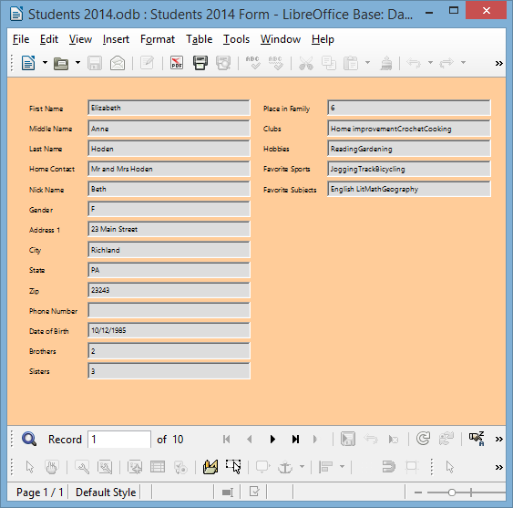

Fig. 8.2 The Forms View of the Students 2014 database

**8.2 REVIEWING THE BASICS**

Let's start with terminology.

A *database* is a document which contains a set of records. Each record
is made up of one or more fields, and each field may or may not contain
entries.

For example, a database of movie titles might have records for a few
thousand movies. Each record will have fields for the movie title, the
director, the producer, the star(s), and so on. A particular entry for
the Movie Title field might be "Star Wars."

**Viewing the data in the database**

When you first open an existing database, it is generally best to open a
*Forms View* of the database because you can easily view the contents of
an entire record on the screen, thus showing you what all the records
basically contain.

In the Forms View, as you can see, the data for one complete record is
shown in the Form. Notice the database navigation tools at the bottom of
the Form window (Fig. 8.3).

Fig. 8.3 Navigation tools in the *Base* database

Look them over now to re-familiarize yourself with how they work.

> Now, **close** the **Student 2014 Form** and, in the **Database
> frame**, switch to **Tables**, and, in the **Tables** section,
> **double click** on **Student 2014 Table** to open it

This Table view (Fig. 8.4) shows the records across the screen in rows
and columns much like the Spreadsheets you learned to use in Lessons 4
and 5.

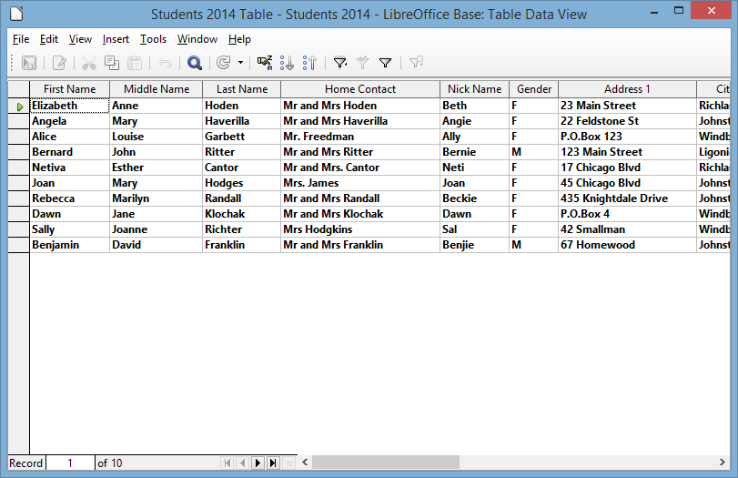

Fig. 8.4 Viewing records in the Table view

**Adding a record to the database**

You can add a new record to the database any time you want. After you’ve
added the record you can tell *Base* to sort everything into a specific
order whenever you need to do so. You will learn how to do this in a
later section of this tutorial (8.4 SORTING RECORDS).

You are going to add a couple of new records now. It’s easiest to do
this in the Forms view of the database.

> **Close** the **Student 2014 Table**, in the left frame select
> **Forms**, and **double click** to open the **Student 2014 Form**,
> then click on the **New** button in the toolbar at the **bottom** of
> the **Form window** (Fig. 8.5)

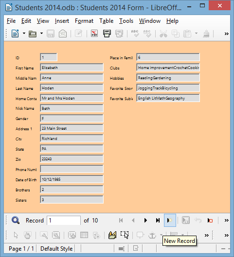

Fig. 8.5 The New button in the Records Group of the Home Ribbon

This will open up a set of empty fields for the new record (Fig. 8.6)

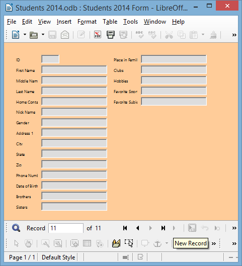

Fig. 8.6 Entering data for a new record

> Enter the data for this **new** record, then add data for at least one
> other new record (**two records in all**), pressing the **Tab** key
> after you type the data for each field

You can put any data in the new records you are adding because you’ll
delete them in a bit. If no data is *required* for a particular field,
you can even skip a field (such as the last four fields), by simply
pressing Tab without entering any data.

**Clearing a field in a record**

You cannot clear entries from a field that has been defined as
*requiring* data of some kind in the field. If you try to clear data
from these fields (in our database the *First Name* through the *Home
Contact* fields, for example) you will get a warning from *Base* telling
you that you cannot have a *null value* in these fields.

> Use the **navigation tools** (see Fig. 8.3 on page 227) to go back to
> the **first** of the records you added just now
>
> In the **first** of the records you added just now, in the **Nick
> Name** field, **double click** in the ***entry box*** (not on the
> field name) to **highlight** the **Nick Name entry**, then press
> **Ctrl-x** on the keyboard to **cut** the data in the Nick Name field
>
> Next go to the **second** of the records you added a moment ago, click
> in the **Clubs** field ***entry box*** and again select the data in
> the **Clubs** field, then press **Ctrl-x** on the keyboard to **cut**
> the data in the **Clubs** field

Notice that this does not delete the field or the record; it simply
clears the selected *data* in the field. The field is still there, so
new data can be entered at any time.

**Deleting (clearing) a record, or a set of records**

> Locate one of the records you just added, then in the **Form
> Navigation toolbar** (Fig. 8.7), select **Delete Record**

Fig. 8.7 Deleting a Record

*Base* immediately displays a warning dialog box (Fig. 8.8) to tell you
that if you go ahead you will permanently lose the data in the record.

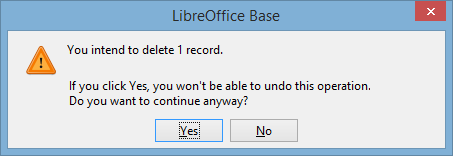

Fig. 8.8 Delete Record warning prompt

> Click on **Yes** to delete the selected record

Notice that this removes the record entirely.

**Changing the data in a field**

Suppose some data gets entered incorrectly—through misspelling or a
typo. Let's say you needed to update a nickname in a student's record.
To change it you would do the following.

> Locate the record in which you want to make the change (for this
> exercise select any record you like)
>
> Click in the entry box for the **field data** that needs to be changed
> (use any entry in the **Nick Name** field), then change it to some
> other nick name in the same way you would in a word processor

All of the exercises in this section were by way of recapitulating what
you learned in Lesson 6. Now let’s move on to learn some more advanced
features of the *Base* database.

**8.3 searching and querying a DATABASE**

This is a powerful function of the *Base* database. You can find
anything in the database if you know what to do.

All you have to do is give *Base* any set of characters as the key for a
search of the database, and the system will find that set of characters,
if it exists, even if it is just a part (a subset) of a larger word or
phrase. There are several ways you can do this.

But first you need to open another, larger, database.

> **Close** the **Students 2014 Form**, then **Close** the **Students
> 2014** database, and from the **File** menu select **Open**

The USB drive containing your *Work Files for LibreOffice* should still
be in a USB port on your computer.

> On your **USB drive** > **Work Files for LibreOffice** > **Base
> Files** folder open the **Birds** database
>
> In the **Database** objects menu on the **left side** of the database
> window, click on **Forms** and, in the **Forms section**, open the
> **Birds** **Form** (Fig. 8.9)

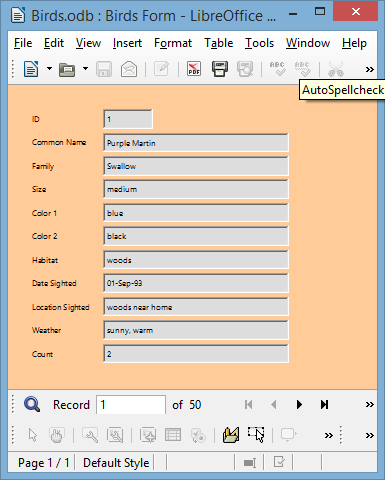

Fig. 8.9 Bird Sightings Form

**Finding a single record using data from a specific field**

You often may need to locate and display the contents of one particular
record, or set of records, based on data from one specific field. The
Find function, which is in the Home Ribbon > Find Group, is the
*Base* command to do this. It works much the same as when you use the
Find command in the word processor, which you learned about in Lesson 2.

Suppose, for example, you wanted to find the record for the bird with
the Common Name *Northern Oriole*. Here is how you do this.

> In the **Form Navigation toolbar** at the **bottom** of the **Form
> window**, click on the **Find Record tool**—it looks like a spy glass
> (Fig. 8.10)

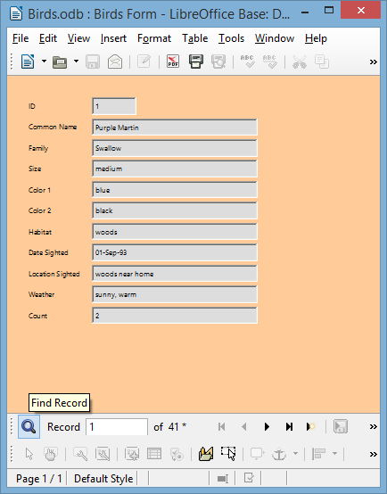

Fig. 8.10 The Find Record tool in the Form Navigation toolbar

*LibreOffice* now displays the Record Search dialog box (Fig. 8.11).

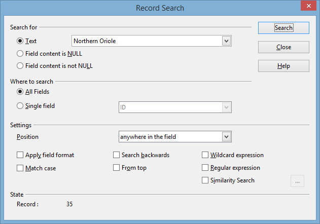

Fig. 8.11 The Record Search dialog box

You need to indicate what data you want to be found in the *Birds*
database by typing in a search string (which for our search will be
*Northern Oriole*).

> In the **Search for** entry box type **Northern Oriole** (or
> **northern oriole**—if you don’t check the “**Match Case**” box,
> *Base* doesn't care whether you use upper or lower case letters)

Before clicking on the *Search* button, you need to identify where you
want to search (All Fields). You also need to indicate if you want to
match the data in a whole field or part of a field.

> Click to check the **radio button** next to **All Fields**, and leave
> the selection for **anywhere in the field**, and there’s **no need
> to** **match case**
>
> Now click on **Search**, and notice that the **number 35** appears in
> the **lower left** hand corner of the search window, indicating that
> the **Northern Oriole** is **record \#35** in the database

The record(s) you find with a Find request are called the "found set".
As you see, *Base* quickly locates the record containing the name
"Northern Oriole." The record is displayed in the *Birds Form window*.

Of course, if you typed *Northern Oriole* incorrectly, *Base* would tell
you that the search item was not found (Fig. 8.12).

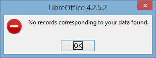

Fig. 8.12 Warning message after unsuccessful search of the database

> **Close** the **Find and Replace** dialog box, then in the **Home
> Ribbon** > **Views** menu, select **Table View** to see the records
> following the **Northern** **Oriole** record

**Finding two or more records based on data from a single field**

Next, let’s search on criteria which will find more than one record. You
want to find any bird with the primary color (*Color1*) that has any
shade of black in its plumage.

> **Close** the **Record Search** dialog box
>
> In the **Birds** **Form**, click to put the cursor anywhere in the
> **Color1** field
>
> In the **Form Navigation toolbar** at the **bottom** of the **Form
> window**, click on the **Find Record tool** and, if it’s not already
> the color you want, in the **Search for** > **Text** box, type the
> word **Black**, and in the **Where to search** > **Single field**
> box, make sure **Color 1** is selected, and in the **Settings** >
> **Position** box select the option for **Anywhere in the field**
>
> Click on **Search**, then move the **Record Search dialog box** out of
> the way, if necessary, so you can see the contents of the record

The search finds the first of *11 records* where a bird in the database
has the color “black” or even “blackish” in its plumage.

> To see the data in the next record, click on **Search** again, and so
> on
>
> See if you can count **11 records** of birds with the color **black**
> or **blackish** in the plumage?

To see a listing of *just those 11 records* that result from a search
such as this, you must use a filter.

**Using the AutoFilter**

In general, filtering is best done in the Table view of the database.
The exercise that follows will use *LibreOffice*’s *AutoFilter* tool to
select the set of birds whose habitat is “marshes.”

> **Close** the **Record Search** dialog box and **close** the **Birds**
> **Form** then, in the **Database frame** (Fig. 8.13), click on
> **Tables** and, in the **Tables section**, **double click** on the
> **Birds** **Table**

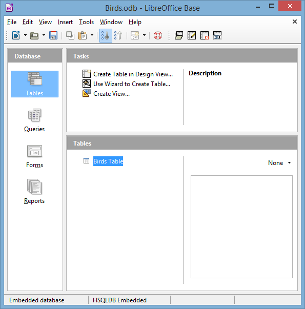

Fig. 8.13 The Database Tables object > Birds Table

> In the **Birds table**, scroll to the **right** to locate the
> **Habitat** column (Fig. 8.14)

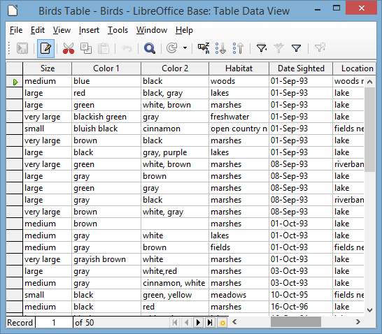

Fig. 8.14 The Birds Table view showing the Habitat column

> Now click, in the **Habitat column**, on the first **Marshes entry**
> you see (there’s one in the **third entry** in the Habitat column),
> then, in the **Tables toolbar** at the top of the **Birds table**,
> click on the **AutoFilter tool** (Fig. 8. 15)

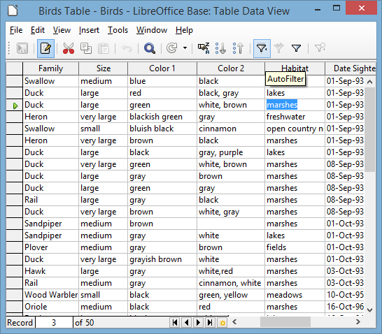

Fig. 8.15 Using the AutoFilter tool to find all the birds that have a
Marshes Habitat

This tells *Base* that you want to filter by selection the set of birds
that live among marshes.

*Base* now displays a list of 15 birds in the database that live in
marshes (Fig. 8.16).

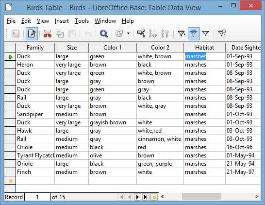

Fig. 8.16 The found set of filtered records

> To go back to viewing **all the records** in the database, click the
> **Reset Filter/Sort** icon on the toolbar (Fig. 8.17)

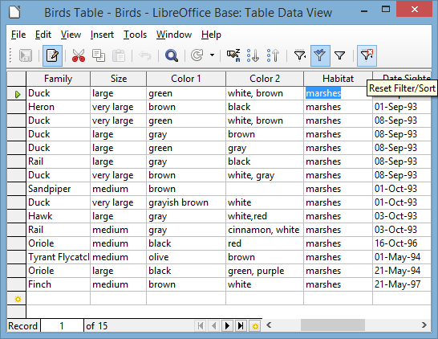

Fig. 8.17 Reset Filter/Sort tool in the Table Data toolbar

**Using the Standard Filter**

You also can filter records using *LibreOffice*’s Standard Filter. You
need this, for example, if you need to select a set of records based on
more than one criterion.

Let’s say you want to find all the records in which the birds have
either the color “black” or a combination of “black” and some other
color in their plumage. This involves filtering based on both the Color
1 and Color 2 fields.

> In the **Table Data toolbar**, click on the **Standard Filter tool**
> (Fig. 8.18)

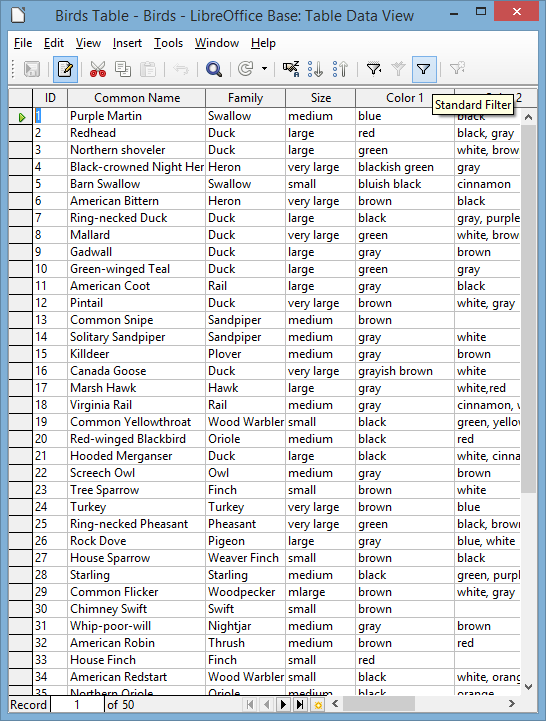

Fig. 8.18 The Standard Filter tool

When you click on the Standard filter tool, *LibreOffice* presents the
Standard Filter dialog box, in which you have the opportunity to set 2
or more criteria for the filter (Fig. 8.19).

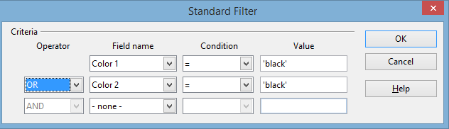

Fig. 8.19 The Standard Filter dialog box

> In the *first* **Field Name** box, click on the **down arrow** to
> **show all the fields** in the Birds database and click on **Color
> 1**, leave the **equals sign** (=) in the **Condition** box, then type
> **‘black’** in the **Value** box
>
> In the *second* **Field Name** box, click on the **down arrow** to
> **show all the fields** in the Birds database and click on **Color
> 2**, then **step back** to the **Operator** box, click on the **down
> arrow** and select **OR** for the operator, then leave the **equals
> sign** (=) in the **Condition** box, and type **‘black’** in the
> **Value** box

These criteria that you have selected should find all the database
records in which the birds have either the color “black” or a
combination of “black” and some other color in their plumage. Let’s see.

> In the **Standard Filter** dialog box, click on **OK**

Now look at the set of records that the filter found (Fig. 8.20).

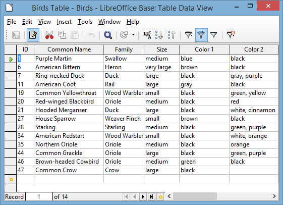

Fig. 8.20 Result of a Standard Filter of the Birds database

Check out the Color1 and Color 2 fields in the Found Set of 14 birds.
One or other of them has the color ‘black’ somewhere in their plumage.

This might seem like a silly exercise. Maybe it wouldn’t take you long
to find the 12 records out of the 50 records in the database. Wouldn’t
take you a minute or two to do that, right? But suppose you have 500
records, or 5000 records, or, as is common in school districts in large
cities, 500,000 records or more. The larger the database, the more you
need tools such as these filter tools—and the Sort tools in the next
section—to help you quickly find the data you need.

> Click again on the **Reset Filter** icon (Fig. 8.17 page 235 above)
> before proceeding to the next section in the tutorial

**8.4 sorting records**

The three major advantages of an electronic, digital data storage system
over a manual, paper-based filing system are these:

> 1\. Digital, electronically stored data with its easy ability to quickly
> access the data you need in any of multiple formats and the easy ability
> to organize it in any of multiple ways, provides more or less instant
> *organizational flexibility—*using filtering and sorting, for
> example—which helps you cope with the inevitable *complexity* that
> increases as the sheer amount of data grows.
>
> 2\. Digital, electronically stored data *saves* *space*—physical space,
> that is. You don’t need a filing cabinet, or oodles of filing cabinets
> in a storage room, or, for some companies, a whole building for a data
> repository. For teachers, like you and me, all we need is a few
> gigabytes of storage on a USB drive, which we can carry on a car key
> chain or in a pocket (provided we’re careful to backup all the data on
> another computer in the office or at home).
>
> 3\. Digital, electronically stored data increases the speed of data
> access and thus *saves* *time*.

When we use old-fashioned filing cabinets to store data, we usually come
up with some kind of organization. So we put labels on the drawers in
the cabinets and labels on the folders inside the drawers. This
organization is often based on numeric or alphabetic sequencing. The
purpose, of course, is to enable us to quickly find what we have stored
in the appropriate folder in the appropriate drawer.

This is a good system as long as we have no cause to frequently change
the organization we have set up. It also assumes that space and time are
not at a premium in our day to day operations. Unfortunately, coping
with change, making good use of space, and saving time are factors
critical to our productivity. So we should welcome any system which
helps us cope with change and optimizes our use of space and time.

Today, using state of the art technology, we can electronically store
the equivalent of the Library of Congress in a shoe box. And we can now
access any specific item in that "box" in a few thousandths of a second.
What is more, software such as *Base* makes it possible for you to
organize that data more or less on the fly by sorting it any which way
you want.

**Sorting on a single field**

Take, for example, the Birds database that is on your desktop at this
time. As you can see, the names of the birds (in the Common Name field)
are not sorted in any particular order. In fact, the database is sorted
based on the *ID* field (which is the Primary Key for the relational
database).

So the ordering is numerical rather than alphabetical. It would
therefore be time consuming, if not well-nigh impossible—especially if
the database were very large—for you to visually scan the database to
find the record for a particular bird.

This is why *Base* makes available the *Find Record*, *Filter Records*,
and *Sort Records* functions accessible in the Form Navigation toolbar.
We’ve looked at the *Find Record* and *Filter Records* functions. Now
let’s check out the *Sort Records* function.

What if you wanted to print out a report listing all the birds in
alphabetical order by name of bird? You would have to begin by
organizing the records alphabetically on the bird names. Fortunately
*Base* has a set of *Sort* tools that enable you to complete this
operation with the greatest of ease. Fig. 8.21 illustrates where you
will find this set of Sort tools.

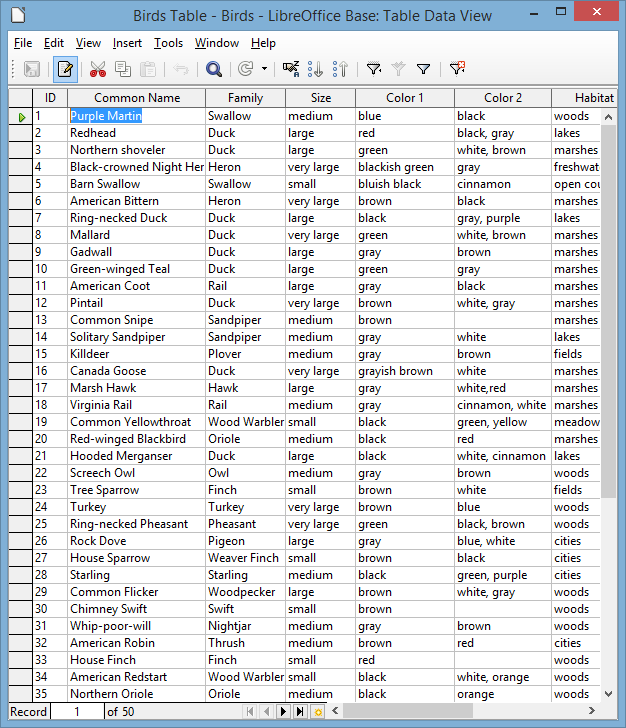

Fig. 8.21 The *Base* Sort tools in the Table Data toolbar

You can best see the results of a sort if you are in the Table view of
the database, which is the view you should have on your screen from the
previous exercise.

> Click to put the cursor in any cell in the **Common Name** field, then
> click on the **Sort Ascending** button (Fig. 8.22)

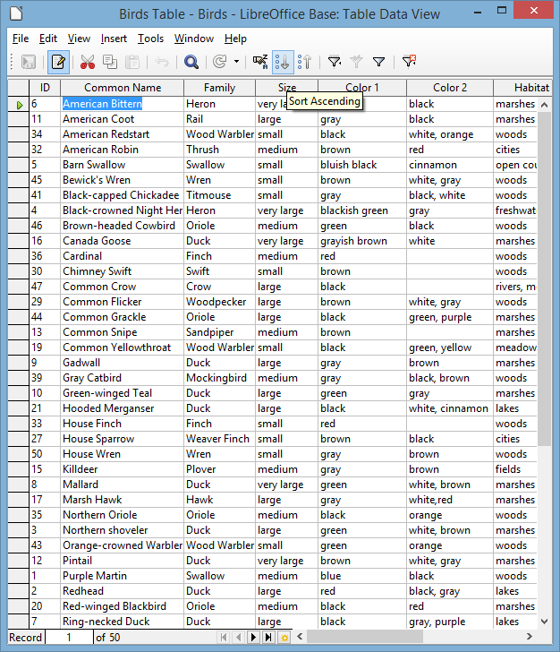

Fig. 8.22 The Sort Ascending tool

Immediately *Base* sorts the records *alphabetically* on the Common Name
field, with the American Bittern at the top of the list, and so on.
There are three basic sorting options depending on the type of data in
the field you are using as the basis, or key, for the sort:

> • If your sort request is based on a *Text field* such as Common Name
> or Location Sighted, the sort will be *alphabetical* and can be either
> Ascending (A to Z) or Descending (Z to A).
>
> • If you are sorting on a Number field such as the Count field, the
> sort will be *numerical* and you again would be able to sort in
> Ascending (low number to high number) or Descending (high number to
> low number) order.
>
> • Finally, if you are sorting on a Date field such as Date Sighted,
> the sort will be *chronological* and you would be able to sort in
> Ascending (chronological) or Descending (reverse chronological) order.

Let’s do another quick sort for practice—which, as we know so well,
makes perfect.

> Click to position the cursor anywhere in the **ID column**, then click
> on the **Sort Ascending** tool (see Fig. 8.22 above) and immediately
> *LibreOffice* sorts the data **based on the ID field**, with the value
> 1 at the top and the value 50 at the bottom—and the data that goes
> with each ID is, of course, sorted along with it

As you see, basic sorting of a database is simple.

**8.5 CREATING QUERIES AND REPORTS**

In the next sections you will continue to work with the *Birds*
database.

**Initial definition of the layout or report**

You are going to create a layout, or report, which will list all members
of the Duck family sighted during the reporting period covered by the
database. The fields in the report will include the Common Name (of the
bird), Family, Date Sighted and Count fields.

Bear in mind that most databases have many fields. If there are more
field names in a report layout than can fit across the screen or page,
the names simply wrap around, creating two or more lines, if necessary,
in the top section (the Header) of the layout.

This can make for untidy, not to say confusing, reports. The columnar
report you are about to work with will not have this problem because you
will be using only a small selection of the fields in the database (just
4 to be exact), but it is good to be aware of the problem should the
occasion arise where you want to create a report that uses many fields.

You can get around this problem is various ways, the simplest of which
is to change the font to one which requires less space, or reduce the
size of the font you want to use, or lay out the fields in some format
other than tabular (like a Table or spreadsheet). You might also
consider whether you really need all the fields that you have selected
for the report. Often, simpler is better. Simple reports are more likely
to make the desired impact on the reader.

**Creating a Query**

You need to start by using a *Query* to tell the Birds database exactly
which data you want to use for the Report. You want to select only the
birds in the *Duck* family for the Report. Once you have created the
Query, it will be a simple matter to create the Report. Here are the
steps to create the Query.

> The **Birds Table** should still be **open** on your screen; **close**
> it, since you’ll be using the **Queries** Database object for this
> exercise
>
> In the **Database frame** at left, click on the **Queries** icon,
> then, in the **Tasks** section, click on **Use Wizard to Create
> Query…** (Fig. 8.23)
>
> 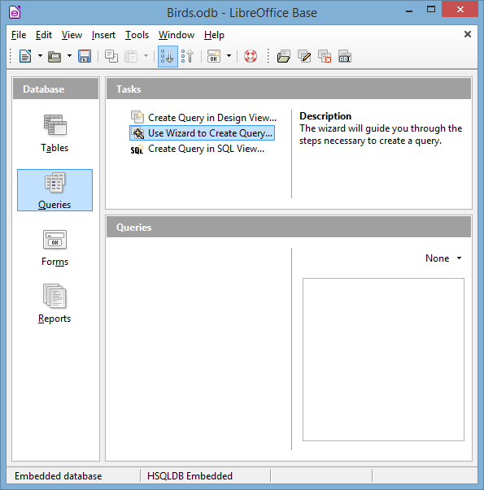
>
> Fig. 8.23 Using a Wizard to create a Query
>
> *LibreOffice* now presents the familiar Wizard window, asking you
> (Step 1) to select the fields that will be involved in the Query (Fig.
> 8.24)

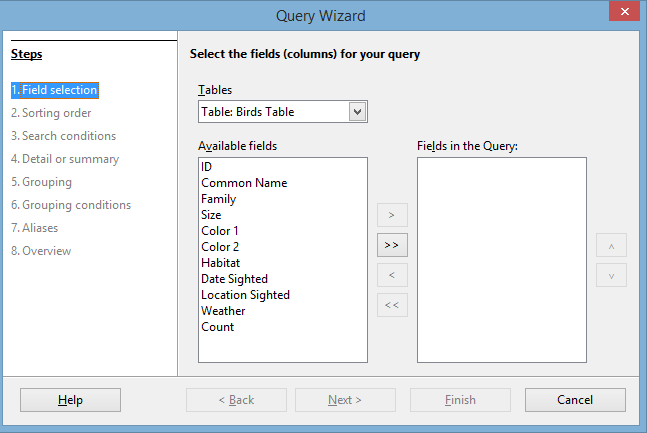

Fig. 8.24 Step 1 of the Query Wizard

Notice that the fields are all coming from the *Table: Birds Table* in
the Birds *Base* database.

> **Double click**, in turn, on **Common Name**, **Family**, **Date
> Sighted**, and **Count** fields to move them across to the **Fields in
> the Query** box, then click on the **Next >** button

The next step in the Wizard, Step 2, asks you if you want to sort the
data. There’s no need to do this—the query will take care of selecting
out the data you need.

> Click on **Next >** to proceed to **Step 3**

In Step 3 you’re going to *Select the search conditions* for the Query
(Fig. 8.25).

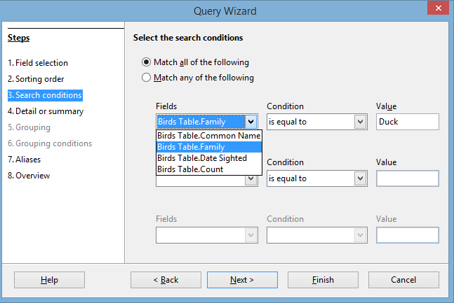

Fig. 8.25 Selecting the search conditions for the Query

In Step 1 you selected the *Fields* for the Query, and now you must
select a *subset* from the family field for the *Report* you will build
in the next exercise, a report which is based on the Query you are
creating right now.

> Click on the **down arrow** in the **first Fields box** and, in the
> **drop down menu** of Fields, select **Birds Table.Family**, leave the
> **Condition** as **is Equal to** and, in the **Value** box, type the
> entry **Duck** (we want every type of Duck—and only Ducks— in our
> report), then click on **Next >**
>
> In the next step of the Wizard—**Step 4**—**Detailed query** is the
> default and that’s what you want, so click on **Next >** again
>
> **Steps 5 and 6** are **greyed out** because you don’t need them for
> this query, nor do you need to change the field names in **Step 7
> (Aliases)**, so click on **Next >** once again

Step 8 presents an overview of what should go into the Query that is
going to determine the contents of the upcoming Report. The Title the
Report will be *Count of Ducks Sighted*.

> So, in this last step of the Wizard, change the **Name of the Query**
> to **Query\_Count of Ducks**, leave the default to **Display Query**
> when you finish this exercise so that you can check that the Query has
> successfully produced the **Found Set** of data you want for the
> report, then quickly read through the **Overview** section to see if
> what you have done in the previous steps makes sense
>
> When you’re ready, click on **Finish**

Quickly, *Base* uses the Query to produce a display of the *Found Set*
(Fig. 8. 26)

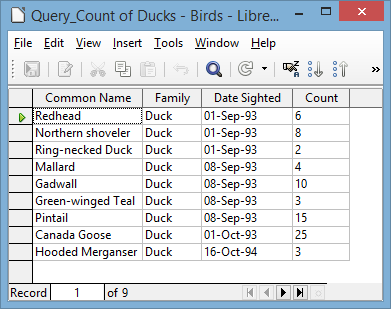

Fig. 8.26 The Query\_Count of Ducks Found Set

What you see on your screen should be the same as in Fig. 8.26—9
records, all of them from the *Duck family*, showing their Common Name,
Date Sighted, and Count. Now you’re ready to go ahead and create the
*Count of Ducks Sighted* Report.

**Creating a Report based on the Query**

> **Close** the **Query\_Count of Ducks** window and, in the **Birds
> database** **window**, in the **Database frame** at left, click on the
> **Reports** icon then, in the **Tasks section** click on **Use Wizard
> to Create Report…** (Fig. 8.27)

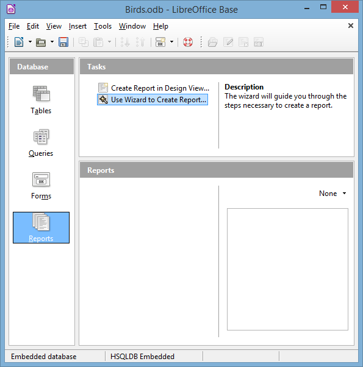

Fig. 8.27 Selecting the Wizard to create the report

This will bring up the Report Wizard dialog box (Fig. 8.28).

Fig. 8.28 The Report Wizard dialog box

> In **Step 1** of the **Report Wizard**, in the **Tables or Queries**
> data box, leave the default **Query: Query\_Count of Ducks** as the
> source for the report’s data (Fig. 8.28 above)
>
> Then, in the list of **Available fields**, click on the **double
> arrow** (see Fig. 8.28 on previous page) to move all **four fields**
> to the **Fields in report** box (Fig. 8.29), then click on **Next
> >**

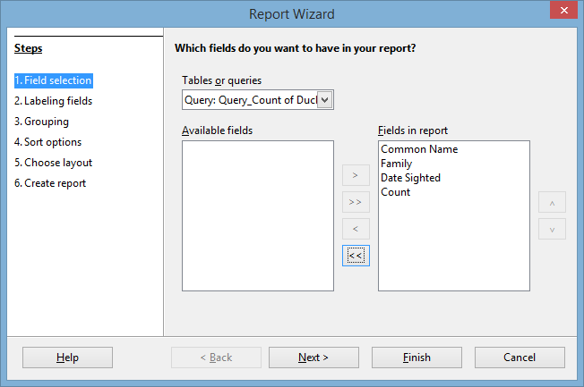

Fig. 8.29 Selecting the Fields for the report

This brings up Step 2 of the Report Wizard, where you are asked to
decide how you want to label the fields for the report (Fig. 8.30)

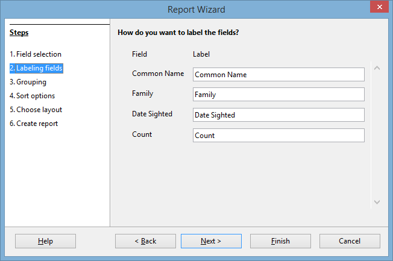

Fig. 8.30 Step 2 of the Report Wizard

> The labels are fine as they are, so click on **Next >**

In Step 3 of the Report Wizard you are asked if you want to add grouping
levels (Fig. 8.31).

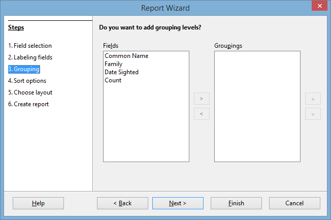

Fig. 8.31 Step 3 of the Report Wizard

> Again there is no need to add grouping levels, so click on **Next
> >**
>
> In **Step 4** you are asked if you want to **sort** the data in the
> database prior to producing the report, but you already sorted the
> data in an earlier exercise based on the **Common Name field**, and
> again, for practice, based on the **ID field**, so click on **Next
> >** to proceed to **Step 5** of the Report Wizard, where you are
> asked how you want to layout the data in the Report (Fig. 8.32)

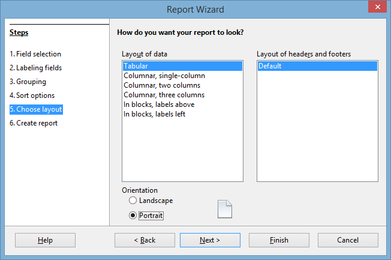

Fig. 8.32 Step 5 of the Report Wizard

> **Tabular layout** is like a spreadsheet, where you have column
> headers with the data for each column listed below each of the
> headers, as in a Table, which is the default layout you want, so leave
> **Tabular** as the **Layout of data** option
>
> You have four (4) fields in the report, and you can fit them across
> the **Portrait-oriented** page, so click on the **radio button** next
> to **Portrait** for the **Orientation** (Fig. 8.32 above), then click
> on **Next >** to proceed to Step 6 (Fig. 8.33)

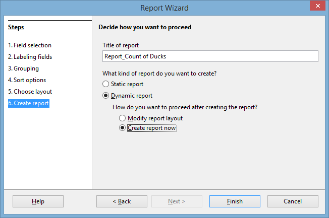

Fig. 8.33 Step 6 of the Report Wizard (Create Report)

> In the **Title of report box** type the title: **Report\_Count of
> Ducks**
>
> You want the report to be **Dynamic** so that the report will reflect
> changes to the data at a later date should the data in the database
> change, which is likely over time, so make sure the **radio button**
> next to **Dynamic** is checked (Fig. 8.33 above)
>
> You also want to go ahead and have *LibreOffice* create the report
> after you click on Finish, so click on the **radio button** next to
> **Create report now** (Fig. 8.33 previous page), then click on
> **Finish**

On the screen you should now see a rough and ready version of the report
with column headers and, underneath them, the data for each column from
the Found Set of Duck records (Fig. 8.34).

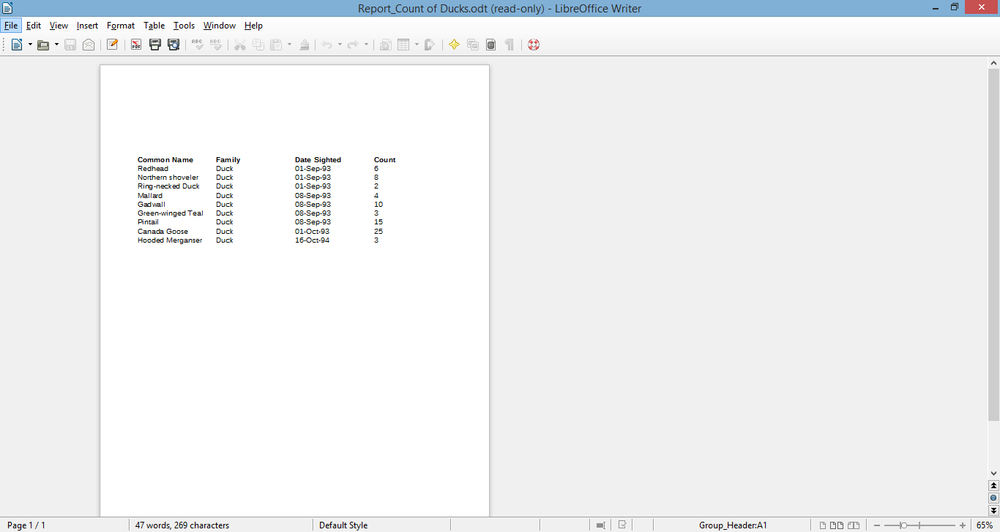

Fig. 8.34 Rough and ready version of the Count of Ducks report

Notice (Fig. 8.34 above) that the report is initially *read-only*—you
can’t actually interact with it and make any changes to it as is. There
are a couple of ways that you can work on the design of the report to
make it more meaningful and visually appealing. The first is to use the
Report Builder.

> **Close** the **Read-only** version of the report then, in the **Birds
> database** top level window (Fig. 8.35), make sure the **Reports**
> object is selected in the left hand **Database frame**, and **right
> click**, in the **Reports** section, on the **Report\_Count of Ducks**
> report to bring up the **context menu** (Fig. 8.35)

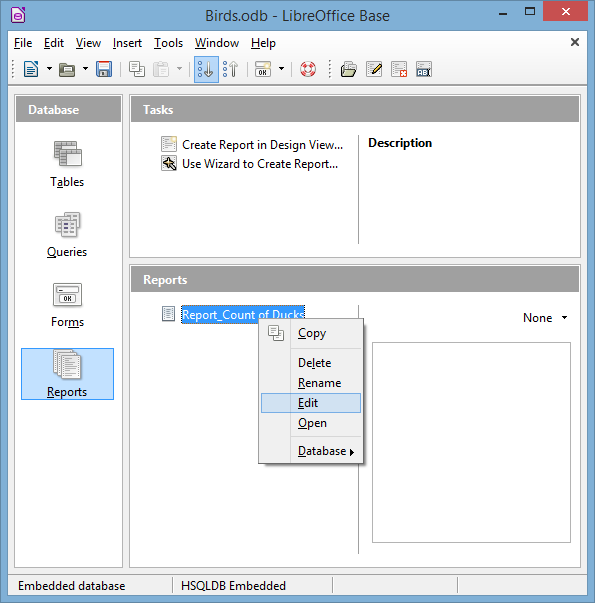

Fig. 8.35 The context menu for the Report\_Count of Ducks

> In the **context menu** select **Edit**, which brings up the **Count
> of Ducks report** in the **Report Builder** (Fig. 8.36)

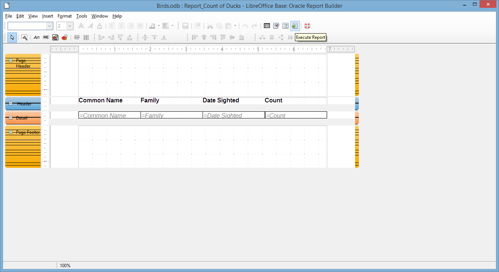

Fig. 8.36 *LibreOffice* Report Builder

The Report Builder has all the tools you need to work with the report
and eventually come up with a layout and design that is both meaningful
and pleasing to the eye. The report is essentially a *Writer* document
that contains the data from the database. If you were to use the Report
Builder to complete the design of the report, you would switch back and
forth from the Report Builder to the work-in-progress *Writer* document
by clicking on the *Execute Report icon* in the Standard toolbar, as
illustrated in Fig. 8.36 above. Let’s try this now.

> In the **Standard toolbar**, click on the **Execute Report** icon to
> quickly bring up the rough and ready version again, which still looks
> much the same as Fig. 8.34 on page 246

However, depending on the version of *LibreOffice* you have installed on
your computer, the Report Builder is unfortunately not necessarily the
best tool to use to complete the design of the report. For this reason,
you would be as well advised to work directly with the rough-and-ready
version, using the tools that you have already learned about in
*LibreOffice Writer* in Lessons 1, 2, 3 and 7 of these tutorials.

> The rough-and-ready version of the report should be open on your
> screen, and in order to edit the report click, in the **Standard
> toolbar**, on the **Edit File** icon (Fig. 8.37)

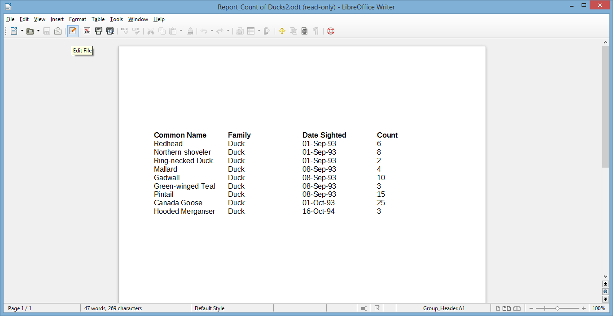

Fig. 8.37 The Edit File icon in the Standard toolbar

Your goal now is to work with the report until you can create something
close to the version displayed in Fig. 8.38.

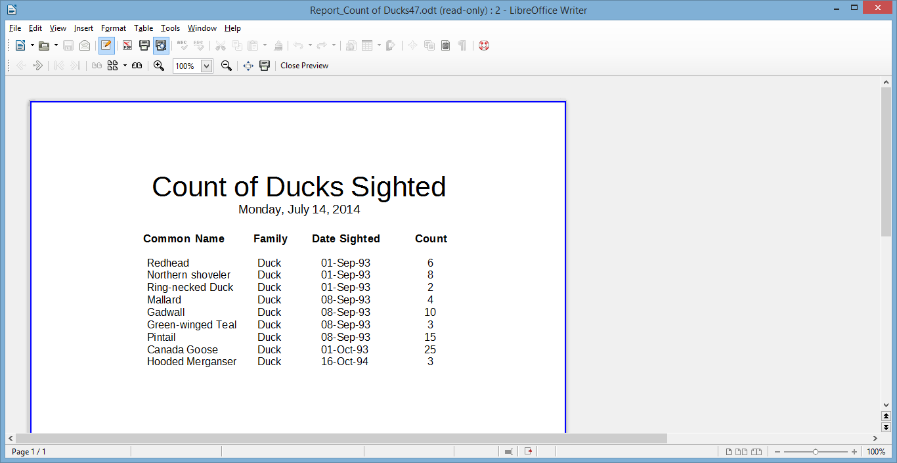

Fig. 8.38 The final version of the Count of Ducks Sighted Report

Here are some tips to help you along the way. But bear in mind that
trial and error is the only way to end up with a final satisfactory
outcome, so be patient and don’t give up until you have something
resembling the report in Fig. 8.38.

The column headers move independently of the data that is listed in each
column. Let’s start with the Column Headers. Fig. 8.39 shows a close up
of what is involved with moving headers in the report.

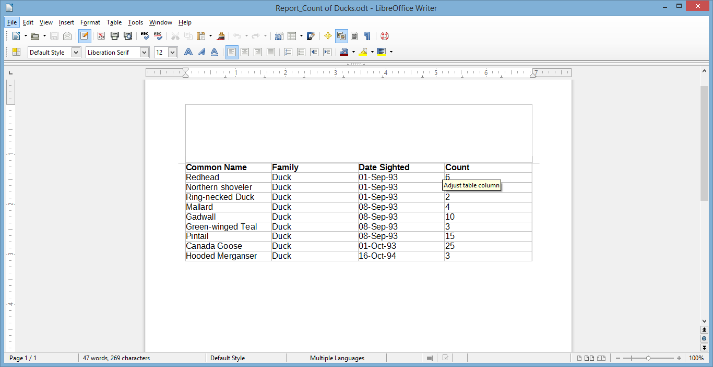

Fig. 8.39 Adjusting the position of headers in the report

> Position the **tip** of the mouse pointer on the vertical line that
> divides the Count field from the Date Sighted field (the pointer
> becomes a **cross hair**), hold down the **left mouse button**, and
> slide the **Count header** to the **right** an inch or so (Fig. 8.40)

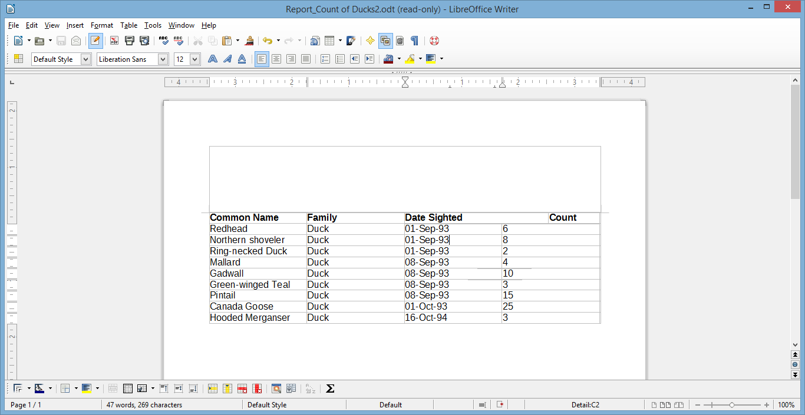

Fig. 8.40 The Count header moved over to the right

> Now position the **tip** of the mouse pointer on the vertical line to
> the immediate left of the data in the **Count column** (the pointer
> becomes a **cross hair**), hold down the **left mouse button**, and
> slide the **set of data** to the **right** until it is more or less
> **centered** under the **Count column header** (Fig. 8.41)

Fig. 8.41 The Count *data set* centered under the Count column header

> Now do the same with the **Common Name**, **Family**, and **Date
> Sighted** headers and data sets till you have them laid out much the
> same as illustrated in Fig. 8.38 on page 248
>
> Go to **File** > **Page Preview** to see how the page will look at
> this stage (it should look like Fig. 8.42), then click on **Close
> Preview** to continue working on the report design

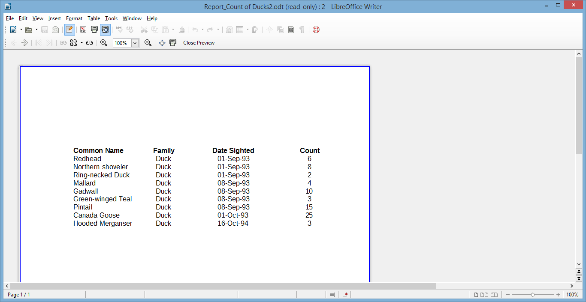

Fig. 8.42 Report after adjusting the column headers and data sets

All that remains is the report header, where you are going to insert a
Title and the date (see Fig. 8.38 on page 248).

> Click anywhere in the **Header area** above the column headers (see
> Fig. 8.43 below—look carefully, and you’ll see the cursor flicking on
> and off in the top left corner of the header), then, in the **Standard
> toolbar**, change the **font** to **Liberation Sans**, the **font
> size** to **32 pt**, and click on the **Center** icon to center the
> title (Fig. 8.43)

Fig. 8.43 Creating the title for the report

Go ahead and type the report title: **Count of Ducks Sighted**, hit the
**Enter** key to move the cursor to a **new line**, change the **font
size** to **14 pt**, and go to **Insert** > **Fields** > **Date**,
then do **File** > **Page Preview** to check out the final product

If all went well, your report should now look very much like that
illustrated in Fig. 8.38 on page 248. There are many more changes you
could make to the report, such as adding graphics (maybe a picture of
some ducks on a pond, for example) or background colors, and the like.
If the report spanned several pages, you would almost certainly want to
include page numbers (*Insert > Fields > Page Number*, which you
learned about in Lesson 2). This is just an introduction to the topic of
creating queries and reports. It is now up to you to extend your skills
beyond these tutorials. Practice makes perfect, as you know so well.

> **8.6 PRINTING REPORTS**

Once you have prepared the new report, it is a straightforward process
to print the report. The command to do this is the same as you have used
to print any other documents from within Microsoft *Office*, whether you
have been working in Word Processing or the Spreadsheet.

> You should still be in the **Page Preview window**, so click on the
> **Print** button in the **Standard toolbar** (Fig. 8.44) to print the
> **Count of Ducks Sighted** report

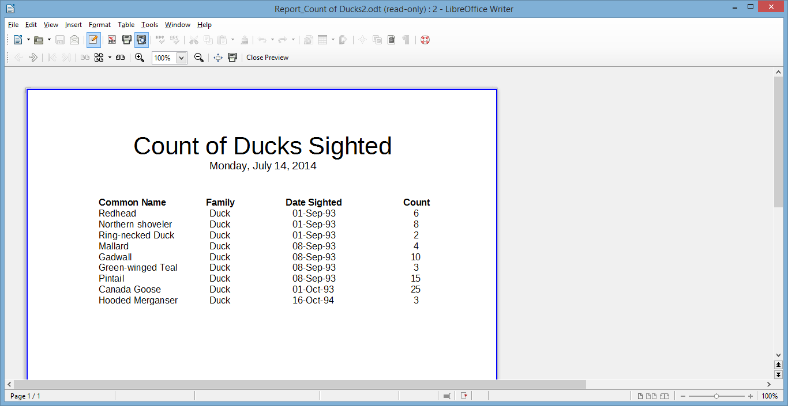

Fig. 8.44 The Print icon in the Standard toolbar

Remove the report from the printer and take a closer look at its
contents. Notice that the only records in the report are those relating
to ducks in the Family field. These are just a small subset of records
drawn from the larger Birds database.

**SKILL CONSOLIDATION**

Complete as many of these exercises as you can to reinforce what you
learned in Lesson 8.

1\. Work with a group of your colleagues or classmates to specify and
create a series of reports to accompany a database of student data such
as the Roster Template database that you created in Lesson 6. Save the
template with the set of reports.

2\. From the Work Files for *LibreOffice* folder on your USB drive, open
the Roster 2008 database onto the Desktop.

> • Add a record
>
> • Change the address and phone \# in an existing field
>
> • Arrange the records chronologically on date of birth

3\. Create a new database (do not use a database you already created) on
any topic of your choosing.

> • Design the fields (at least 10) to be included in the database
>
> • Save the empty database document
>
> • Add at least 20 records
>
> • Save the database document again
>
> • Prepare a report using just 5 of the fields in the database
>
> • Save the database with the report and send the database to your
> professor as an attachment in email

4\. Open the Birds database (in the Practice folder on your Work Disk)
onto the Desktop.

> • Find all the birds that have *blue*, *grey*, *green*, or *olive* in
> their *Color1* plumage
>
> • Arrange (Sort) the birds in *descending order* (reverse alphabetical
> order—from Z to A)—the *Birds*, not the Colors!
>
> • Prepare a report using just the following 5 fields in the database:
> *Common Name*, *Family*, *Color1*, *Habitat*, *Count*
>
> • Save the *Birds* database with the report and send the database to
> your professor as an attachment in email
