**Lesson 10** *IMPRESS* Beyond the Basics
=========================================

  -------- --------------------------------------------
  **10**   ***IMPRESS* beyond the basics**
           
           Making interactive, non-linear slide shows
  -------- --------------------------------------------

**LEARNING OUTCOMES**

In this tutorial you will be introduced to the basics of non-linear
interactive *Impress* slide shows, along with some more advanced
formatting and impact-enhancing tools. Amongst the skills you will learn
are:

-   Creating and using Master Pages to add slide controls to presentations
-   Using hidden slides
-   Formatting and enhancing graphics
-   Inserting sounds, clip art, movies, and hyperlinks

**BEFORE YOU BEGIN**

**Setting up for the tutorial**

If you completed Lesson 1 of these tutorials, you can skip the rest of
this section and proceed directly to the next section (*10.1 Creating a
Master Page…—next page*). If you did *not* complete Lesson 1, then you
must do this now, before proceeding with the rest of Lesson 10.

The set of *Work Files for LibreOffice* ideally should be stored on a
Flash drive (USB drive) in three folders named *Base Files*, *Impress
Files*, and *Miscellaneous Files*. You need to create a fourth folder
for the *data files* that you will be creating while working your way
through the tutorials. This fourth folder will be called *Data Files*.

Here are the steps to prepare these folders now before proceeding with
this tutorial.

> First, **Unzip** the set of **Work Files for LibreOffice** by **double
> clicking** on the File name on your computer (your instructor will
> help you with this if you are working with a class) and **Extract**
> them onto your flash drive
>
> **Double click** on the **Work Files for LibreOffice** folder to
> **open** it

Now, inside the *Work Files for LibreOffice* folder you need to create a
new, *fourth,* folder called *Data Files.* Here’s how you do this.

> **I**n the **Work Files for LibreOffice folder**, select **New
> Folder** (Fig. 10.1).

Fig. 10.1 Creating a New Folder

The system will create a new folder for you and then wait for you to
give it a name of your choice (Fig. 10.1 above).

> Call the new folder **Data Files**

During the course of these tutorials you will be storing many files in
this Data Files folder.

**10.1** **CREATING** **A MASTER PAGE** **TO ADD** **SLIDE**
**CONTROLS** **TO AN EXISTING PRESENTATION**

**Creating Slide Controls**

Slide Controls (otherwise known, in *LibreOffice* speak, as
*Interaction…*) are buttons or objects that you insert onto a slide or
slides to tell *Impress*, by clicking on them, to advance from one slide
to the next slide, or to the previous slide, or to the first slide, and
so on (Fig. 10.2).

Fig. 10.2 Interaction options

Creating a standard set of Slide Controls is simple enough. The best way
to do this is to create a *Master Page Template* which has on it the set
of Slide Control buttons that you’ll be able to use for any presentation
that you’ll be building, whether now or in the future.

> **Open** a **new** *LibreOffice* **Presentation** document, and go to
> **File** > **Save As…** (Fig. 10.3)

Fig. 10.3 Saving a Master Page Template

> In the **Save As** dialog box, navigate to your **USB drive** >
> **LibreOffice Work Files** > **Data Files** > **Impress
> Documents**
>
> Click on the **down arrow** at the end of the **Save as type:** data
> entry box (Fig. 10.3 above) and, in the **menu of file types** that
> pops up, select **ODF Presentation Template (.otp)**
>
> Name the new document **Slide Controls Template** and click on
> **Save**

In the new *Impress* presentation document you want to start with a
**Blank Slide** layout.

> Select the **Blank Slide layout** in the menu of **Layout templates**
> on the **right** of the ***Impress* window** (Fig. 10.4)

Fig. 10.4 Selecting the Blank Slide layout

Now you’ll use two of the *Basic Shapes* in the Drawing Toolbar (Fig.
10.3 above) to create a set of Slide Control buttons. You’ll end up with
something like the set of Slide Control buttons illustrated on the
*left* in Fig. 10.5.

Fig. 10.5 Different Slide Control styles for a typical presentation

The set of Slide Controls on the *right*, which uses one of the *Block
Arrows* in the Drawing toolbar, is another example of what you can do.
Creating these Slide Controls is simple enough, though can be
time-consuming because of the detail involved. Like all design, it
involves your creative skills, and doing it will enhance those creative
skills, so let’s get on with it.

> In the drawing tools set of **Basic Shapes**, click **once** on the
> **Rectangle,** **Rounded tool** and slide the pointer—which changes
> into a **plus sign (+)**—onto the slide (Fig. 10.6)

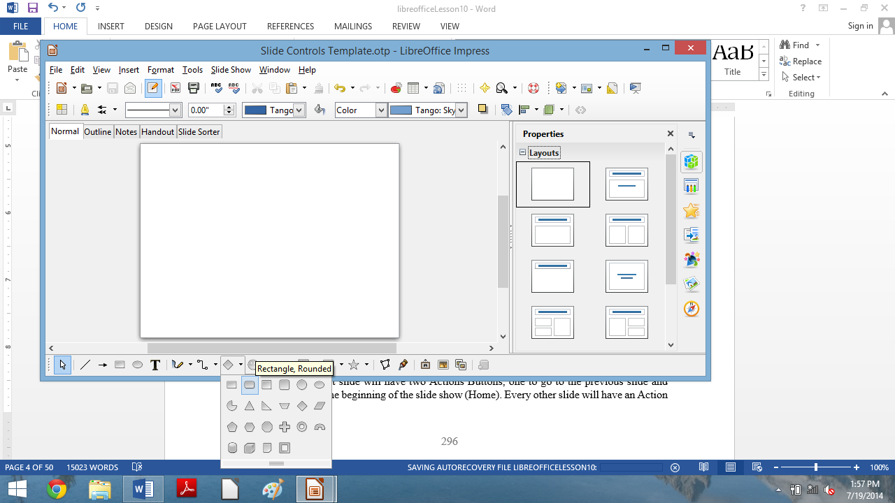

Fig. 10.6 Rounded Rectangle tool in the set of Basic Shapes

> **Drag** with the pointer to draw a **rounded rectangle** near the
> **bottom center** of the blank slide (Fig. 10.7)

Fig. 10.7 Rounded rectangle

> Now select any **color** to **Fill** the **Area** of the rectangle
> with some contrasting **color** for the **border** (see Fig. 10.6
> above)
>
> Next, in the drawing tools set of **Basic Shapes**, click on the
> **Isosceles Triangle tool** (Fig. 10.5 previous page) and **drag**
> with the pointer to draw a **small triangle inside the rounded
> rectangle shape** then use the **Rotate** tool to rotate the
> **triangle to the right 90 degrees** (Fig. 10.8)

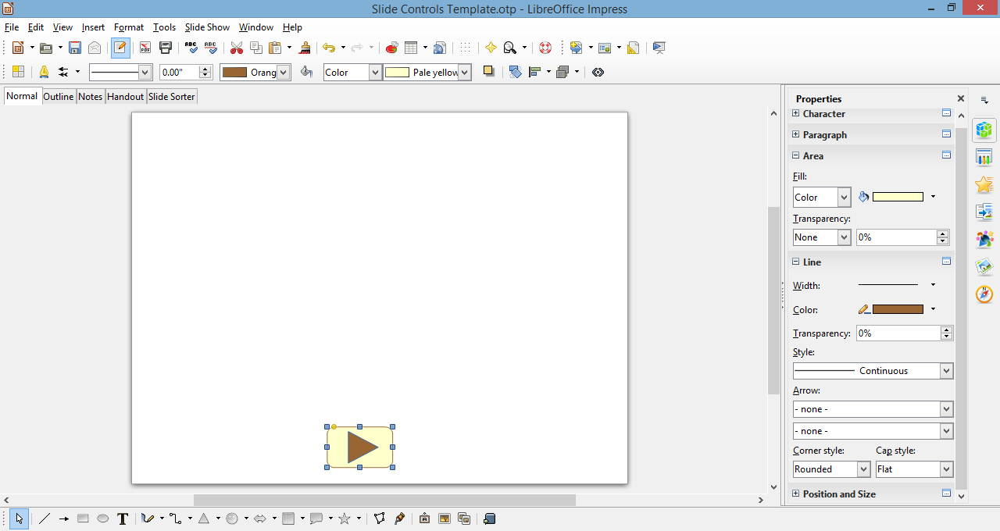

Fig. 10.8 The Triangle shape inside the Rectangle shape

Get the idea? If you’ve been successfully following along, you now know
how to create any buttons you want. Feel free to create your own set of
Slide Controls illustrated on the left in Fig. 10.4 on the previous
page. But for the sake of this exercise (and maybe your sanity!), the
author has completed the two sets of four buttons and saved them, with
the name *Slide Controls Template*, in the *Impress* Documents folder as
a *Master Page Template* so that you can use them for the exercises that
follow.

**Adding slide controls to an existing presentation**

For the sake of uniformity, you are going to work with a version of the
*Screenbeans* presentation you may have developed in Lesson 9 and which
has been recreated especially for this tutorial.

> In the *Impress* **File** **menu** click on **Open**
>
> Navigate on your USB drive to the **Work Files** **for LibreOffice**
> > **Impress Files** folder, then **double click** on the file
> **Problems and Solutions** to open it

You’ll be making changes to the Problems and Solutions presentation, and
since you may want to have a friend work through this tutorial at a
later date, it’ll be a good idea to save the version you are going to
work on in the Impress Documents folder in your Data Files folder, thus
preserving the original version.

> Go to **File** > **Save As…**, navigate on your USB drive to the
> **Work Files** **for LibreOffice** > **Data Files** > **Impress
> Documents** folder, then click on **Save**

You're going to put Slide Controls on each of the slides in the
*Problems and Solutions* presentation. The Title slide will have two
Slide Controls—one to go to the next slide and another to go to the last
slide. The last slide will also have two Slide Controls—one to go to the
previous slide and another to go back to the beginning of the slide
show. Every other slide will have all four of the Slide Controls.

Fig. 10.9 shows you how the Title slide will look after you've added the
Slide Controls.

Fig. 10.9 The Slide Controls on the Title slide

The Slide Controls are waiting for you to copy them from the Slide
Controls Template *Master Page*, so you need to open that file first.

> Navigate on your USB drive to the **Work Files** **for LibreOffice**
> > **Data Files** > **Impress Documents** > **Master Page
> Templates** folder, then **double click** on **Slide Controls
> Template** to open it

For the Problems and Solutions Title slide you want just the last two of
the Slide Controls—to go to the next slide and to go to the last slide
(Fig. 10.10).

Fig. 10.10 Selecting and copying the Slide Controls

> Make sure you have the **Slide Controls Template Title Slide** in
> **Normal View**, then, in the **Drawing toolbar**, click on the
> **Select tool** (Fig. 10.10 above)
>
> Now **drag with the mouse** to select just the **last two** of the set
> of Slide Controls **on the left** (see Fig. 10.10 above), then hit
> **Ctrl-c** to **copy** those two Slide Controls to the **clipboard**
>
> **Switch back** to the **Problems and Solutions** presentation, which
> is already open on your screen, and hit **Ctrl-v** to **paste** the
> **Slide Controls** from the **clipboard** onto the **Title slide,**
> then use the **arrow keys** on the keyboard to **move** the **Controls
> to the right** so that they end up in the **lower right hand corner**
> of the **Title slide** (see Fig. 10.9 on the previous page)

You can adjust the size of the Slide Controls any time you want by
clicking on them and dragging on the *handles*.

> If the **Slide Controls** looks too large or too small to you, go
> ahead now and click on them, grab one of the **handles** and **adjust
> the size** to your satisfaction
>
> **Save** the presentation when you’re satisfied everything looks OK on
> the Title slide

You should now see two professional-looking Slide Controls on the
*Problems and Solutions* Title slide. We’ll test them shortly. First,
though, you’re going to put *all four* of the Slide Control tools on the
next *seven* slides.

> As you did before, click on the **Select tool** in the **Drawing
> toolbar** and **drag around *all four*** of the **Slide Control
> buttons** to put the **green handles** around them (Fig. 10.11)

Fig. 10.11 Selecting and copying the four Slide Controls

> Now **right click** on the **selected Slide Controls** and, in the
> **context menu** that pops up, select **copy** to copy the **Slide
> Controls** to the **clipboard**
>
> In **Slide Sorter View**, **double click** on **slide \#2** to bring
> it up in **Normal View**, and hit **Ctrl-v** to **paste** the **copy**
> of the **four Slide Controls** from the **clipboard** onto **slide
> \#2**
>
> **Don’t click on the Slide Controls**—you want the **small green
> handles** to stay around them; again use the **arrow keys** on the
> keyboard to **slide** the **Controls** into position, this time in the
> **lower left hand corner** of **Slide \#2** (Fig. 10.12)

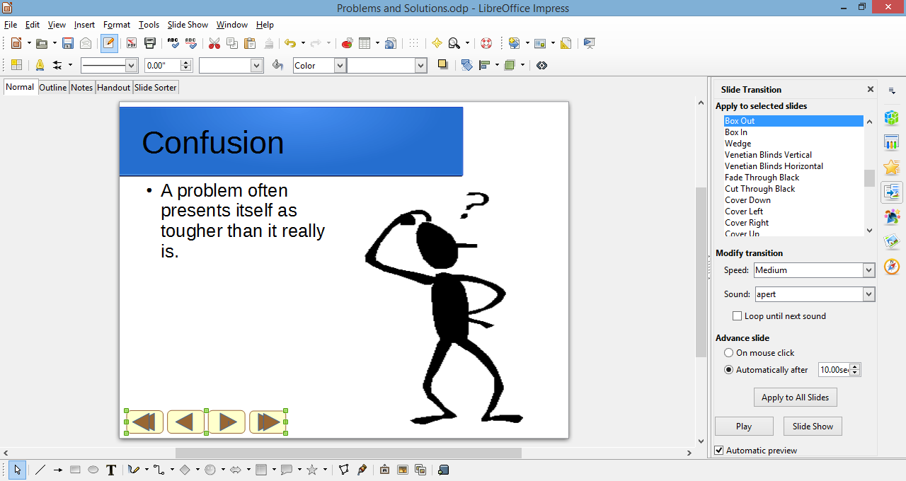

Fig. 10.12 Position the Slide Controls in the lower left hand corner of
slide \#2

**Copying the** **Slide Controls to other slides**

Next, you're going to put the four Slide Controls on each of the next
seven slides. You already have them on the clipboard, so all you have to
do is paste them as a group, slide by slide.

> In the **Slide Sorter View**, double click on **slide \#3** to bring
> it up in **Normal View**, and press **Ctrl-v** to **paste** the
> buttons onto the **third slide**

Notice that the buttons are pasted into the exact same place as where
you positioned them on the previous slide (Slide \#2).

> Now go to each of the **remaining six (6) slides** in the presentation
> and do the same
>
> Better **Save** your work to this point, then **switch** back to
> **Slide Sorter View** to see how everything looks—should be much like
> Fig. 10.13

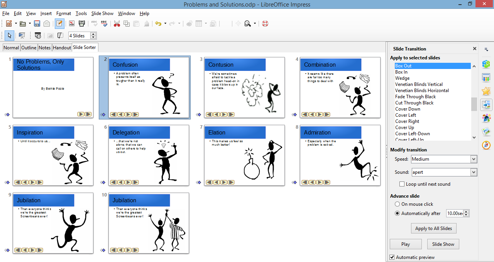

Fig. 10.13 All the slides now have the Slide Controls

**Adding an Acknowledgements slide**

The Problems and Solutions presentation is missing one final slide—the
Acknowledgements slide, which should accompany any presentation where
you use information or audio-visual material that is not your own.
Adding a new slide to a presentation is easy.

> First, you want the **Acknowledgements slide** to be that **last
> slide** in the show, so, in the **Slide Sorter View**, **right click**
> immediately **after** the **thumbnail** for **slide \#10** to bring up
> the small **New Slide** dialog box
>
> Click on the **New Slide** dialog box to start a **new slide**
> (**Slide \#11**)

The layout for the new slide, as you can see, is the same as the layout
for the previous 8 slides, namely a Two Content layout. But for the
Acknowledgements slide it will be best if it is a Title slide layout.

> In the **Slide Sorter View**, make sure **Slide \#11** is selected,
> then click on the **Properties icon** at the top of the **set of
> design icons** on the **extreme left side** of the Problems and
> Solutions presentation window (Fig. 10.14) to bring up the **Layout
> menu** and,
>
> in the **Layout menu**, select the **Title, Content slide** layout

Fig. 10.14 Selecting the Title, Content slide layout

You’ve just pasted the four Slide Controls onto each of the previous 7
slides, so the buttons are still available on the clipboard for you to
paste onto the new last slide.

> Switch to the **Normal View** for **slide \#10**, the last slide in
> the show, and hit **Ctrl-v** to paste the **four** **Slide Controls**
> here, too

As it happens, the set of buttons is slightly different on this last
slide. You still want the Slide Control to go back to the *Go to
previous slide*, and you need the Slide Control that returns you to the
beginning—the *Go to first* *slide* Control. But you don’t need a button
to go to the *next slide;* nor do you need a button to go to the *last
slide*; the Acknowledgements slide is already the last slide in the
show.

> So…, first click anywhere on the slide (but **NOT** on the Slide
> Controls) to **deselect** the Slide Controls, then click on the
> **Select tool** in the **Drawing toolbar** and **drag around** the
> **two rightmost Slide Controls** to put the **green handles** around
> **just the two of them** (Fig. 10.15), then hit the **Del(ete)** key

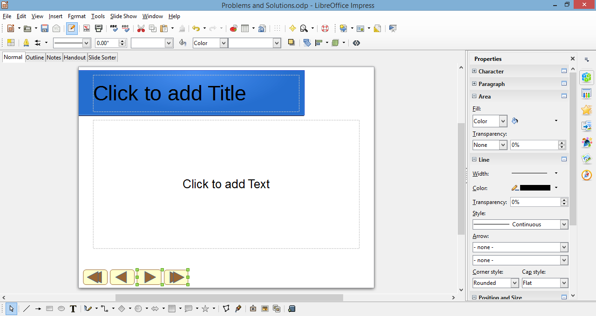

Fig. 10.15 Selecting just the two rightmost Slide Controls

> Better **save** your hard work (**Ctrl-s**)

Now all you need to do is type the text onto this Acknowledgements
slide.

> Click where you see “**Click to add Title**” and, in the **Title
> box**, type **Acknowledgements**
>
> Next, c
>
> lick in the **Click to add Text** box and, by way of Acknowledgements,
> **type the** **text** you see in Fig. 10.16

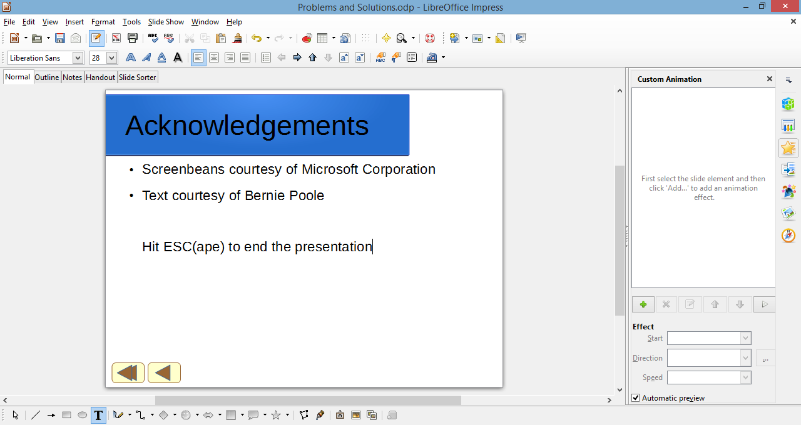

Fig. 10.16 Final version of the Acknowledgements slide

> After you type the line: “Text Courtesy of Bernie Poole” hit
> **Enter**, then hit the **backspace** key to get rid of the bullet,
> press **Enter** again, hit **backspace** to get rid of the bullet,
> then type the last line: “Hit Esc(ape) to end the presentation”
>
> Finally, **drag across** the **three** **lines of text** to
> **highlight** them and, in the **Formatting toolbar**, change the
> **Font Size** to **28**
>
> Hit **Ctrl-s** to **save** this (almost final) version of the
> **Problems and Solutions** presentation

Your show is almost ready, but first you have to learn about hidden
slides.

**10.2** **USING HIDDEN SLIDES**

Hidden Slides are slides that will be bypassed, unseen by the user as he
or she clicks through a presentation, *except* when the user clicks on a
*Slide Control* that specifically sends them to the Hidden Slide.

Here are the steps to create a Slide Control on one slide which will
take the user to a specific Hidden Slide in the Screenbeans slide show.

> In the **Slide Sorter View**, **double click** on **Slide \#2** (the
> **Confusion** slide) to open it in **Normal View**
>
> Click to position the cursor **right at the end of the text** that you
> typed in the slide’s **text placeholder** (after the words **…tougher
> than it really is**)
>
> Hit **Enter** to go to a new line, then type **If you’d like to read a
> quote about problem-solving, click here: **
>
> In the **Slide Sorter View**, **right click** between **Slide \#2**
> and **Slide \#3** and click on **New Slide** in the **New Slide dialog
> box** to insert a new slide (which will now become the new Slide \#3)

Immediately, *Impress* inserts a new empty slide right after the second
slide in the show.

> Now, you want this to be a **Title slide layout**, so, still in the
> **Slide Sorter View**, and with the **new Slide \#3 selected**, click
> on the **Properties** icon to bring up the **menu of slide layouts**
> and click on the **Title slide** layout

You want this new slide to be a Hidden Slide.

> In the **Slide View toolbar** click on the icon to **Hide Slide**
> (Fig. 10.17)

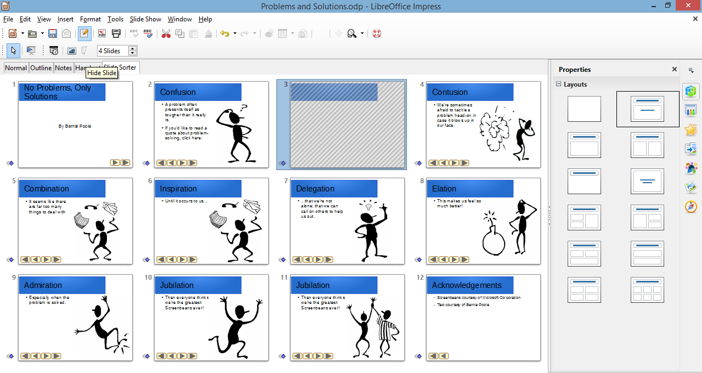

Fig. 10.17 The Hide Slide icon in the Slide View toolbar

Notice that now, in the Slide Sorter View, Slide \#3 is screened out,
which indicates that this is a Hidden Slide (Fig. 10.17).

> Click in the **Title placeholder** on the new slide (where it says
> Click to add Title), and type the following quotation (including the
> quotes): **“Quality is in the details.”** then **drag** across the
> quote to highlight it and change the **font size** to **48**
>
> Click in the **subtitle placeholder** on the new slide (immediately
> below the Title placeholder) and type the following: **Bernie Poole,
> Esq.**

The Hidden Slide with the quote is now complete. But it’s hidden, so you
have to give *Impress* (and the user) a way to find it by creating a new
*Slide Control* that links to it.

> In the **Slide Sorter View**, double click on **Slide \#2** (the
> **Confusion** slide) to make it the active slide in **Normal View**
>
> In the **Drawing toolbar** click on the **Block Arrows** icon and, in
> the **Block Arrows menu**, select the **Notched Right Arrow** shape

Notice that the arrow pointer changes to a **cross hair
(****)**.

> Without clicking the mouse button, roll the **mouse cursor** up over
> the slide and
>
> position the cross hair **after the colon** at the end of "**If you’d
> like to read a quote about problem-solving, click here: "** (Fig.
> 10.18), then hold down the **left mouse button** and drag to create
> the **Slide Control** button that you are going to use to link to
> **slide \#3—the hidden slide**

Fig. 10.18 Placement of the Slide Control linking to the hidden slide
(slide \#3)

> Let go of the mouse button when you're done—you can adjust the
> **size** and **position** of the button if you want by clicking on it
> and then dragging on the **handles** around the button
>
> Now **right click** on the **new button** and, in the **context menu**
> that pops up, select **Interaction…**
>
> In the **Interaction dialog box**, click on the **down arrow** at the
> end of the **Action at mouse click data box** (Fig. 10.19) and, in the
> **drop down menu**, select **Go to page or object**, then in the
> **list of slides** that is displayed, click to select **Slide 3**,
> then click on **OK**

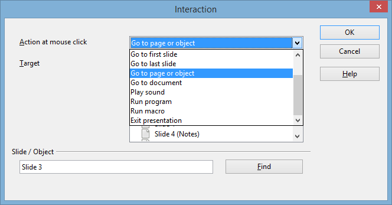

Fig. 10.19 Linking the new Slide Control to the hidden slide

This new Slide Control provides a link from slide \#2 to the hidden
slide \#3. When you run the show shortly and get to slide \#2, if you
click on this Slide Control, you will go to slide \#3. But if you do
*not* click on this Slide Control, slide \#3 will be bypassed because it
is a hidden slide.

You have to do one more thing to complete the content on the hidden
slide (slide \#3). You need to put a Slide Control on slide \#3 to go to
the next slide (slide \#4). Can you remember how to do it yourself? If
so, go ahead; but if you need help, here are the steps to follow:

> In the **Slide Sorter View**, double click on **slide \#2** to bring
> up the slide in **Normal View**, then, in the **Drawing toolbar**, c
>
> lick on the **Select tool** and drag to select the **third** of the
> **four Slide Controls** (the Slide Control to go to the **next
> slide**), right click on it, then, in the context menu that pops up,
> select **Copy** the Slide Control to the clipboard
>
> Next, in the **Slide Sorter View**, **double click** on **slide \#3**
> to bring up the slide in **Normal View**, and press **Ctrl-v** to
> **paste** the **Slide Control** onto the **hidden slide**
>
> Then, **while the button is still selected**, **drag** on the **green
> handles** to make the Slide Control **about twice its size** and use
> the **arrow keys** to move it over to the **lower right corner** of
> the slide (Fig. 10.20)

Fig. 10.20 The repositioned and resized Slide Control on the Hidden
Slide

> **Right click** on the **new Slide Control** and, in the **context
> menu**, select **Interaction…** > **Go to next slide**
>
> **Save** all the good work you’ve done so far, then **Run** the
> **Problems and Solutions slide show** from the **start** (**Slide Show
> menu** > **Start from first slide**), trying out every slide,
> including the Slide Controls that you just created for the Hidden
> Slide

**10.3** **ANIMATION SCHEMES**

*Impress* Animation is a way of bringing objects, such as text and
pictures, to life on the screen, controlling and sequencing how text and
other slide objects emerge onto the screen during a presentation—sliding
in from the right or left, or fading in, and so forth. Let's try some of
the *Impress* Animations now, using the Screenbean figures as our
models.

> The Screenbean figure must be **selected** in order to apply
> animations and other effects to it, so, in the **Slide Sorter View**,
> click on the **thumbnail** for **slide** **\#2** (the slide with the
> **Confused** **Screenbean**) and click to **select** the **Screenbean
> figure** (you’ll see the green handles around it)
>
> **Right click** on the **Confused Screenbean figure** and, in the
> **context menu** that pops up, select **Custom Animation**

This brings up the Custom Animation pane on the right side of the
*Impress* window (Fig. 10.21).

Fig. 10.21 The Custom Animation pane

> Click on the **green plus sign/cross** to bring up a **menu of**
> built-in *LibreOffice* **animations** (Fig. 10.22)

Fig. 10.22 *LibreOffice* Animations dialog box

> For the Screenbean figure on **Slide \#2**, in the **menu of**
> built-in *LibreOffice* **animations**, select the first option:
> **Appear**, click on **OK**, then, in the **Effect** **section** >
> **Start entry box**, select **After Previous** (Fig. 10.23)

Fig. 10.23 Effect section > Start data entry menu

> To check out the animation, go to the **Slide Show menu** > **Start
> from current Slide** and watch as *Impress* gives you a demo of the
> effect
>
> In the **Slide Sorter View**, switch to **Slide \#4** and take a few
> minutes to preview a few other **animations** to get a feel for what
> is available
>
> When you are done experimenting, go from **Slide \#4 to Slide \#10**
> and, for each Screenbean figure, select any one of the **Animations**
> you like, then, in the **Effect Appear** section, select the option to
> **Start** > **After** **Previous**
>
> When you are done selecting animations for all the Screenbean figures,
> **Save** the presentation, then go to the **Slide Show** menu >
> **Start from current Slide** to check out the Problems and Solutions
> presentation once again

Pretty cool. So *Impress* makes it easy for you to experiment with
different schemes, try them out, remove them if you don’t like them, and
start over—all part of the design process.

> In the **File** menu select **Close**

You can change any sequence, and you can also sequence the items to come
onto the screen all at once, and so forth. There will be occasions when
you will want to alter the sequence because, for example, you may decide
that you want to talk about one topic ahead of another. Also, you may
want the presentation to be presented as a running display in a
conference room or in the lobby of a building.

Bear in mind that it’s not a good idea to apply Animation Schemes
everywhere, on all the slides. Animations are best used sparingly, to
highlight specific ideas, or to spice things up in a presentation. But
too much spice can overwhelm a presentation and take away from its
enjoyment or effectiveness.

**10.4 Interactive** ***IMPRESS* AT WORK**

Let’s start by looking at an example of an interactive *Impress*
presentation.

> You should still have the **Work Files** **for LibreOffice** folder
> available in the USB port on your computer, so
>
> in the **File** menu select **Open**
>
> Navigate (Browse) on your computer to your **USB drive** > **Work
> Files for LibreOffice** > **Impress Files** folder, then **double
> click** to open the **Mammal** **Test** presentation

You’re going to examine the *Mammal Test* interactive presentation which
has been prepared for you and which will demonstrate the various
features of what makes a presentation interactive and non-linear.

> In the **Slide Show menu** select **Start from first Slide** to view
> the presentation
>
> Follow the directions to move through the slides—be sure to **click on
> the** **answers** when indicated
>
> **Answer at least one question *incorrectly*** so you can see how the
> presentation takes you back to re-answer a question should you get it
> wrong
>
> Make sure your speakers are turned up so you can hear the **sound**,
> and notice the **clip art** and **animations** that are added to this
> show

**Features to look** **for in the demonstration presentation**

*General layout of an interactive* *presentation used for assessing
knowledge*

Think of a test in your classroom. You start with a title on your test,
so the students know what subject matter the test is on and who wrote
it. Then you have an introduction, which might further define the
subject matter for the test. Alternatively, if used as a review, the
introduction might summarize the concept being tested.

A good interactive slide show thus begins with a *title* and an
*introduction slide* (Fig. 10.24).

Fig. 10.24 Title and Introduction Slides

You then move to the set of directions which tell the user how to
complete the test. The test questions follow right on after the
directions.

An effective interactive slide show should have a *directions slide*
because a good teacher never assumes that all the students know how to
take a particular test. After the directions come the *question slides*,
which contain the questions themselves and the options for answers (Fig.
10.25).

Fig. 10.25 Directions and Question One Slide

An interactive *Impress* presentation has the same elements as any
*Impress* presentation, with one significant difference: it has
*question slides* and *feedback slides*. In your class, you grade papers
and return them, giving the students feedback on their answers.

So, in the Mammal Test slide show, we have *feedback* slides that tell
the user "You're Right" or "Sorry. Try Again." (Fig. 10.26).

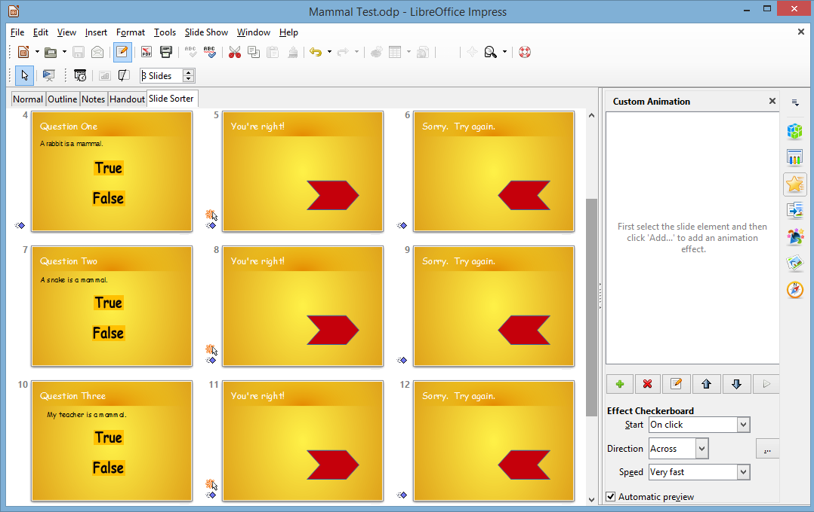

Fig. 10.26 Question and Feedback Slides

Lastly, in an interactive *Impress* presentation it's appropriate to
have a *concluding slide* which tells the students they’re done,
followed by an *Acknowledgements* slide (Fig. 10.27).

Fig. 10.27 Ending and Acknowledgment Slides

In this way, you set good precedent for citing sources, and you also
clue your audience to the fact that it's over! We'll talk more about the
layout of an interactive *Impress* slide show as you begin creating your
own.

**Slide Controls and Hyperlinks**

In order to move outside the linear box of traditional *Impress*
presentations, we've used *Slide Controls* and *Hyperlinks*. Slide
Controls are the buttons that control your progress from slide to slide
as you work through the presentation. In the case of the Mammal Test
presentation, they let you either move on to the next question or
re-answer the previous one.

An *Impress* hyperlink, on the other hand, links you directly to a
location outside the presentation; if you are on the Web, the hyperlink
takes you from one Web site to another, or from a website to your email
program. If you are in an *Impress* presentation, the hyperlink might
take you from a slide to your E-mail program, or from a slide in your
presentation to a page on the Web.

Notice the transitions and animations in the Mammal Test presentation.
The presentation has a simple, clean style—no excessive bells and
whistles; just enough to keep the users’ attention.

So much for an overview of using an interactive *Impress* presentation.
It's time to create your own interactive quiz.

> Click anywhere to **exit** the slide show, then **close** (**File**
> > **Close**) the **Mammal Test** presentation when you are ready to
> continue with the tutorial

**10.5 BUILDING** **AN INTERACTIVE, NON-LINEAR PRESENTATION**

You are going to use *Impress* to prepare a Class Test about the U.S.
states and capitals, which will give you the experience to prepare more
detailed interactive tests on your own.

> **Open** ***LibreOffice*** and go to **Create** > **Impress
> Presentation** to start a new slide show

You should always immediately save a new document; this allows you to
give the document a name, as well as the opportunity to save it in a
location you want on your disk drive (so that can more easily find it
again later!).

> Go to **File** > **Save** **As** and, in the Save As dialog box,
> navigate to your **USB** **Drive** > **Work Files for LibreOffice**
> > **Data Files** > **Impress** **Documents** folder
>
> Give the new presentation the name **States and Capitals Quiz**, and
> click on **Save**

It is usually a good idea to create the text outline for your slides
before you select a template for your design theme, slide transitions,
animations and so forth. This is because different templates have
different slide layouts (bigger title boxes, less room for bulleted
lists, and so on). So you will want to get a feel for what will be the
text on each slide, before you proceed with design considerations.

This brings to mind a good rule of thumb when creating anything that is
designed to provide information for the purpose of effective
communication: *Substance Before Style!* Or, to put it another way,
*Content Counts!* Keep this in mind when developing any *Impress*
presentation.

get to work

**Title slide, Intro slide and Directions slide**

Fig. 10.28 a-c illustrates the content you will be entering for the
first three slidesFollow the directions on the next page to complete
this first part of the exercise.

> Fig. 10.28a Content for Slide 1

> Fig. 10.28b Content for Slide 2

> Fig. 10.28c Content for Slide 3

For this presentation you’ll enter the text directly onto each slide
using the *Normal View* (Fig. 10.29).

Fig. 10.29 Enter the text directly onto the slide

Entering data directly onto slides can be tricky because you have to be
careful how you use the *Enter* and *Tab* keys, so follow the directions
carefully.

> The default layout for the first slide in any new *Impress* show is
> always a Title slide.
>
> In **Normal View**, click inside the **Title box** (Fig. 10.29 above)
> and type **U.S. States and Capitals Quiz**, then hit **Ctrl-Enter** to
> move the **cursor** down to the **sub-title** box
>
> Hit the **backspace** key to get rid of the **bullet**, in the
> formatting toolbar click on the **Center alignment** icon, then type,
> **By** \_\_\_\_\_\_ (type your name in the blank)

The sub-title *By \_\_\_\_\_\_\_* (your name) should now be in the
sub-title box of your first slide.

> Now, in the **Insert menu** select **Date and Time…** to bring up the
> **Date and Time dialog box** (Fig. 10.30)

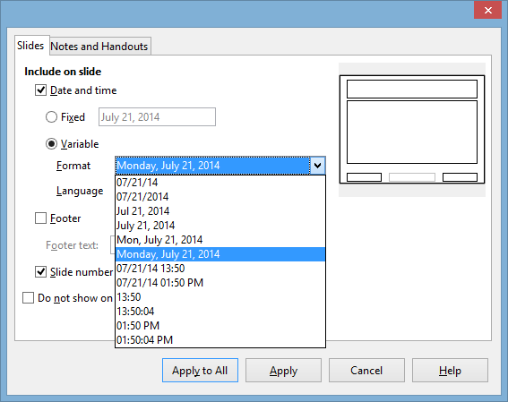

Fig. 10.30 The Date and Time dialog box

> In the **Date & Time dialog box**, click to put a **check mark** next
> to **Date and Time**, then click on the **radio button** next to
> **Variable** and, in the drop down menu of **date/time formats**,
> select the format indicated in Fig. 10.30
>
> Click to put a **check mark** next to **Page number**, then click on
> **Apply to All**
>
> In **Slide Sorter View**, right click immediately to the **right** of
> **Slide \#1**, **right click** on the mouse, and then click on the
> **New Slide button** that pops up to start a **new slide**

The default Slide Layout for the first slide in a presentation is *Title
slide*, but you want a different, *Title, Content*, layout for Slide
\#2.

> R**ight click** on the **new slide** and, in the **context menu** that
> pops up, select **Slide Layout** to bring up the menu of **Slide
> Layouts** in the pane on the **right side** of the *Impress* window
>
> You want the **Title, Content** layout for Slide \#2 and subsequent
> slides, so, in the **menu of Slide Layouts**, click on the
> **thumbnail** for **Title, Content** layout

**Get to know the Keyboard Shortcuts**

Notice that *Ctrl-Enter* moves the cursor to the next text box on a
slide. You hit *Enter* only when you want to advance to the next line
*inside* the text box where you’re typing text.

> Continue to type the information for the **next 2 slides** (see **Fig.
> 10.28b** and **10.28c** above on pages 298 and 299)

As you just did for the previous two slides, press *Ctrl-Enter* to move
from one text box to the next (for example, from a slide's Title box to
the Text box that has its bulleted list).

Get used to using these keyboard shortcuts rather than clicking in each
textbox. For the more experienced user, *Keyboard Shortcuts* are a
faster way to go.

**Question and Feedback slides**

Next you are going to type the 5 Question and Feedback slides—Slides 4-8
(Fig. 10.31a and b).

Fig. 10.31a Content for Slides 4, 5 and 6

Fig. 10.31b Content for Slides 7 and 8

If you are an experienced user of the Microsoft *Office* programs such
as *Word*, and if you already have completed the introductory *Impress*
tutorial (Lesson 9), you should be able to carry out the following tasks
without step-by-step help. However, in case you need guidance, here are
the directions for the first test question slide.

> Click on the tab for **Normal View**, then, with the cursor waiting in
> the **Title box** for **slide \#4**, in the **Formatting toolbar**
> click on the **Left alignment** icon
>
> Now type the title **Question One**, then hit **Ctrl-Enter** to skip
> to the **text box** below the Title box

You need to remove the Bullet at the beginning of the new line. This is
simple enough.

> Before you start typing the first question (*Which is the capital of
> Texas?*), in the **Formatting toolbar** click **once** on the
> **Bullets On/Off icon** (Fig. 10.32) to **remove the Bullet** at the
> beginning of the line, then type the question: **Which is the capital
> of Texas?**

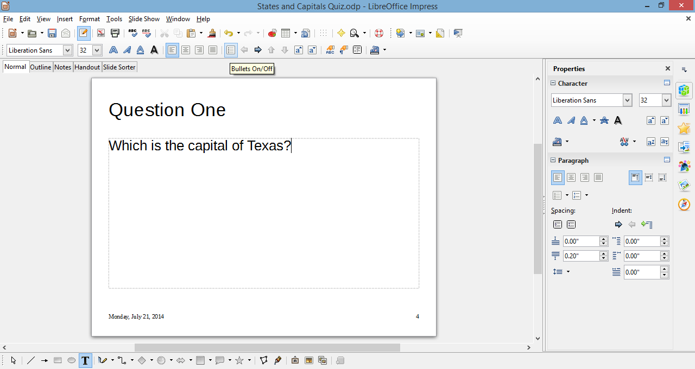

Fig. 10.32 The Bullets on/off icon in the Formatting toolbar

> Follow the same directions to complete the entries now for **slides
> \#5 and \#6**, then **Save** your work

Now that the Titles and Questions are on the question slides, you next
need to type the content for the two feedback slides (see slides 7 and 8
in Fig. 10.31b on the previous page).

> Click on the **Slide Sorter View**, **right click** after Slide \#6
> and click on the small dialog box to start a **New Slide** (**Slide
> \#7**), then **double click** on the new slide to **open** it in
> **Normal View**

You need to change the *layout* of the feedback slides, because all you
need on them for now is a *Title box*. Fortunately, *Impress* has a
layout called *Title Only*.

> In the **Slide** **Layout menu** on the right side of the window,
> select the layout for **Title Only**
>
> Now go ahead and, in the **Title box** for **slide \#7**, type
> **You’re Right!**
>
> Create a **new slide** **\#8**, which will again have a **Title Only**
> layout, and, in the **Title box** for **slide \#8**, type **Sorry. Try
> again.**

Next, you must place a copy of these two feedback slides after each of
the other question slides. Copy and Paste is the easiest way to do this.

> In **Slide Sorter View**, click on **slide \#7**, hold down the
> **Shift key** and at the same time click on **slide** **\#8** to
> **select both slides at once**, then hit **Ctrl-c** on the keyboard to
> **copy** these two slides to the **clipboard**
>
> Now, with **slides \#7 and \#8** on the **clipboard**, click between
> **slides \#4 and \#5** and hit **Ctrl-v** to **paste** the two answer
> slides **between them**; so what was slide \#5—**Question Two—**will
> be bumped to **slide \#7** (Fig. 10.33)

Fig. 10.33 The full set of Question and Answer slides

> Do the same thing to **Paste** the answer slides right after what will
> now be **slide \#7**, then **Save** your work once more before going
> on

The States and Capitals Quiz *Impress* now has 12 slides—the three
introductory slides and the nine question and answer slides.

For any *Impress* show, it is important to have a slide that signals the
end of the main body of content (such as the end of testing in the case
of our show). *Impress* presentations shouldn’t end abruptly. Also, it
is important to give credit where credit is due.

So, at the conclusion to most any slide show you should include an
Acknowledgements slide. These are your next two tasks.

> Create **two new slides** (Slide \#13 and Slide \#14); **Slide \#13**
> will be **Title Only** layout and **Slide \#14** will be **Title,
> Content** layout
>
> Type the content for **slides** **\#13 and** **\#14** as illustrated
> in Fig. 10.34, then **Save** your work again

> Fig. 10.34 End of Test and Acknowledgement Slides

**10.6 MAKING THE PRESENTATION INTERACTIVE**

You are now going to tackle the two trickiest steps in this lesson. They
are:

1.  Creating four hyperlinking Slide Controls on each of the three
    *Question slides* which the user will click on to indicate his or
    her answer to the question.

2.  3.  Creating a Slide Control on each of the six *Feedback slides*
    that will hyperlink to the appropriate Question slide.

4.  

**Creating Text Objects for the Slide Controls on the Question slides**

A Text Object is text that has been converted into a *LibreOffice*
Object so that it can be used as a hyperlink and can also be animated,
just the same as any image.

Let’s do the first Question slide together (Slide \#4), and then you’ll
know what to do for the other two question slides (Slides \#7 and \#10).

> In **Slide Sorter View**, **double click** on **Slide \#4**
> (**Question One**) to **open** it in **Normal View**
>
> In the **Drawing toolbar** at the bottom of the window, click on the
> **Rectangle tool** to select it, then draw a **rectangle** about
> **½”** below the Question and **centered** on the slide (Fig. 10.35)

Fig. 10.35 Draw a rectangle about ½” below the Question

> With the **rectangle** still **selected**, hit **Ctrl-c** to copy it,
> then hit **Ctrl-v** to paste the copy back onto the slide (for reasons
> best known to itself, *LibreOffice* pastes the copy directly on top of
> the original, so you’re not aware of anything having been done—but the
> copy is there!)
>
> Use the **arrow keys** on the keyboard to slide the copy down below
> the original, so that now you have **two identical rectangles** on the
> slide (Fig. 10.36)

Fig. 10.36 The two identical rectangles on Slide \#4

> Now use the **Select tool** (left end of the Drawing toolbar) to
> **drag** to **select both rectangles**, hit **Ctrl-c** to copy them,
> then hit **Ctrl-v** to paste the copies back onto the slide, and use
> the **arrow keys** to slide the copies down below the originals, so
> that now you have **four identical rectangles** on the slide (Fig.
> 10.37)

Fig. 10.37 The four rectangles ready for processing into Text Objects

At this stage it will be a considerable time saver if you copy the four
rectangle shapes and paste them onto the other two Question slides—Slide
\#7 and Slide \#10.

> Use the **Select tool** again to **drag** to **select all four
> rectangles**, and hit **Ctrl-c** to copy them
>
> In **Slide Sorter View**, **double click** on **Slide \#7** to
> **open** it in **Normal View** and **paste** the **four rectangles**
> directly onto the slide
>
> Do the same for **Slide \#10**, then **Save** your work

Now for the conversion of the Rectangles into Text objects. We’ll do
this together for Slide \#4, then you can follow the same steps yourself
to convert the rectangles on Slide \#7 and Slide \#10.

1.  In **Slide Sorter View**, **double click** on **Slide \#7** to
    **open** it in **Normal View**, then **double click** on the **first
    rectangle** and type the first Answer: **Houston**

2.  **Double click** on **Houston** to **highlight** it and, in the
    **Text formatting** toolbar, **increase** the **Font Size to 28 pt**

3.  Next, **double click** on the **second rectangle** and type the
    second Answer: **Dallas**, then **double click** on **Dallas** to
    **highlight** it and, in the **Text formatting** toolbar,
    **increase** the **Font Size** to **28 pt**

4.  Next, **double click** on the **third rectangle** and type the third
    Answer: **San Antonio**, then d**ouble click** on **San Antonio** to
    **highlight** it and, in the **Text formatting** toolbar,
    **increase** the **Font Size** to **28 pt**

5.  Finally, **double click** on the **fourth rectangle** and type the
    fourth Answer: **Austin**, then **Double click** on **Austin** to
    **highlight** it and, in the **Text formatting** toolbar,
    **increase** the **Font Size** to **28 pt**

> Better **Save** your work again, then follow the five (5) steps above
> to enter the Answers for Slides \#7 and \#10

The answers for Slide \#7 are as follows:

**California**

**Alaska**

**Texas**

**Rhode Island**

The answers for Slide \#10 are as follows:

**Hawaii**

**Florida**

**California**

**Mississippi**

Over to you. Don’t forget to save your work when you’re done.

**Linking the Text Objects to the appropriate Feedback Slides**

Now you must revisit each of the four *Answers* on the three Question
slides to tell *Impress* which slide the Answer should *link* to after
it is clicked. This is where it gets tricky. If the answer the student
chooses for each question is *correct*, the link must send him or her to
the *You’re Right!* Slide, and move on to the next question; if the
answer is *incorrect*, it must send him or her to the *Sorry. Try
again.* Slide, and return him or her back to the original question to
try again.

If you’ve never done anything like this before, the best way to
understand the process is to *do* it. So here goes!

> In **Slide Sorter View**, **double click** on **Slide \#4**
> (**Question One**) to open it in **Normal View**, then **right click**
> on the **Houston** button and, in the **Context menu**, select
> **Interaction…**

This brings up the Interaction dialog box (Fig. 10.38).

Fig. 10.38 The Interaction dialog box

Houston, the first possible answer, is the *wrong* answer; it is NOT the
capital of Texas. So we want the student to be linked to the feedback
slide that says the answer is *wrong*.

> In the **Action at mouse click** entry box, click on the **down
> arrow** to bring up the **menu of options** and select the option to
> **Go to page or object**, then click on **Slide 6** and click **OK**
>
> Repeat these steps for the answers **Dallas** and **San Antonio**
> (also wrong answers)
>
> Now, highlight **Austin** (the correct answer)

Since Austin is in fact the capital of Texas, we want to link that
answer to Slide \#5, the feedback slide that states that the correct
answer has been selected.

> **Right click** on the **Austin** button and, in the **context menu**,
> select **Interaction…** and hyperlink to **Slide 5**

Now you need to put a Slide Control button on each of the Answer slides
(Slides 5 and 6).

> With **Slide 5** selected in **Normal View**, in the **Drawing
> toolbar** at the bottom of the window click on the **Block Arrows**
> icon to bring up the **set of Block Arrow shapes** and click to select
> the **Chevron shape** (Fig. 10.39)

Fig. 10.39 The Chevron shape in the set of Block Arrows shapes

> Now draw a nice big **Chevron shape** towards the **right side** of
> the slide (Fig. 10.40)

Fig. 10.40 The Slide Control on Slide 5

> Right click on the **Chevron shape** and, in the **context menu**,
> select the **Area tab** (Fig. 10. 41)

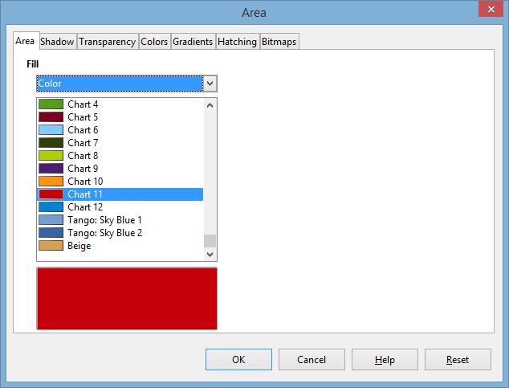

Fig. 10.41 Choosing a Color for the Slide Control

> Click on the **Area tab** and, in the drop down **menu of**
> **colors**, select any color you like for the Chevron shaped **Slide
> Control**

Next you need to put a chevron-shaped button on the Wrong answer slide
(Slide \#6). Easiest way to do this is to copy and paste the button you
just created for Slide \#5.

> On **Slide \#5**, **click** on the **Slide Control** to select it and
> hit **Ctrl-c**, switch to **Slide \#6** and hit **Ctrl-v** to paste
> the button onto **Slide \#6**

You want this Wrong answer button to point *back* to Question One, so
you need to flip it horizontally.

> Right click on the **Slide Control** and, in the **context** **menu**,
> select **Flip** > **Horizontally**, then **Save** your work before
> you proceed

Now you need to select the correct hyperlink for these two new buttons.
For the button on the correct answer slide (Slide \#5) you want to send
the student on to the next question (Question Two), which is slide \#7;
but for the button on the wrong answer slide (Slide \#6) you want to
send the user back to Question One (Slide \#4).

> On **Slide \#5**, **right click** on the **Chevron shaped Slide
> Control** and, in the context menu, select **Interaction…** and
> hyperlink to **Slide 7**
>
> On **Slide \#6**, **right click** on the **Chevron shaped Slide
> Control** and, in the context menu, select **Interaction…** and
> hyperlink to **Slide 4**

Time to make sure each answer on the *Question One* slide, and each
button on the Answer slides is correctly *hyperlinked* by testing each
of them in turn.

> With **Slide 4** selected in **Normal View**, in the **Slide Show
> menu** select **Start from current Slide**, then click on each of the
> **True buttons** one-by-one, make sure it sends you to the **correct
> Answer slide**, then make sure the **chevron-shaped Slide Control** on
> each of the answer slides sends the user forward or back to the
> **correct question**

Everything OK? If not, fix any errors—hopefully there won’t be any, but
you never know. Breathe a sigh of relief if all went according to plan.

> Now, follow these same series of steps (if you need help, the
> directions start on Page 320 above) to **activate the Slide Controls**
> with **hyperlinks** for **Slides 7 thru 9** (where the correct answer
> is **Alaska**), and **Slides 10 thru 12** (where the correct answer is
> **Hawaii**)

**Adding Slide Controls to the remaining slides (Slides 1 thru 3 and
Slides 13 and 14)**

You’re going to need Slide Controls on Slides 1 thru 3, and also on
Slides 13 and 14. You should be good at this now, but just in case here
are the steps you need to take.

> In **Slide Sorter View**, **double click** on **Slide \#1** to open it
> in **Normal View**, then, in the **Drawing toolbar** > **Block
> Arrows** icon, click on the **Chevron shape**
>
> Draw a **small Chevron** in the **lower right corner** of the **Slide
> window** (Fig. 10.42)

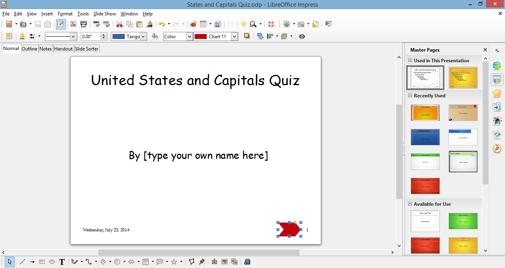

Fig. 10.42 Slide Control to go the Next Slide

> **Right click** on the button, then, in the **context menu**, select
> **Interaction…** and select the **Action at** **mouse click** option
> to **Go to next slide**
>
> While you’re at it, hit **Ctrl-c** to **copy** the **Slide Control**
> to the **clipboard**

That’s all you need on the first slide. But you need the **same** button
on Slides 2, 3, 13, and 14. Fortunately, you have it copied to the
clipboard, so…

> In **Slide Sorter View**, **double click** on **Slide \#2** and
> **paste** the Slide Control onto the slide
>
> Do the same for **Slides 3, 13 and 14**

On Slides 2, 3, and 14 you need a second Control button to *Go to
previous slide*.

> In **Slide Sorter View**, **double click** on **Slide \#2** again,
> **right click** on the **Slide Control** in the **lower right
> corner**, **copy** it, then **paste** it (**Ctrl-v**)
>
> **Right click** on the **Slide Control** again, and, in the **context
> menu** select the option to **Flip** > **Horizontally**, then use
> the **arrow keys** on the keyboard to slide this second Slide Control
> **to the left** (Fig. 10. 43)

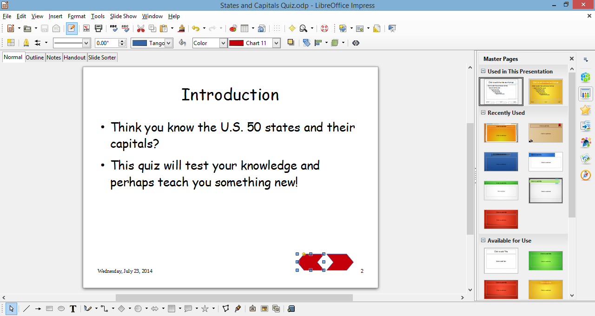

Fig. 10.43 The second Slide Control button in position on Slide \#2

> **Right click** on this second **Slide Control**, **copy** it, then
> **paste** it (**Ctrl-v**) onto **Slides 3 and 14**

Hope you’re doing OK, still. Hey, for some people, this is their idea of
fun! I hope you feel the same. One last task at this stage of the
Tutorial. The last slide, Slide \#14, has a Slide Control to go to the
next slide, but there is no next slide. So you have to change the
*Action on mouse click* to *Exit Presentation*.

> In **Slide Sorter View**, **double click** on **Slide \#14** if it is
> not already in **Normal View**, **right click** on the ***rightmost***
> **Slide Control** in the **lower right corner**, select Interaction...
> from the pop up context menu, and change the **Action on mouse click**
> option to **Exit presentation**
>
> **Save** your work before you proceed (and maybe take a break…)

**Making the Text Object backgrounds invisible**

On Slides 4, 7, and 10, those Blue rectangles behind the multiple choice
answers are unnecessary. It’s easy enough to get rid of them at this
stage, though they were necessary while you were developing the Text
Objects and hyperlinking them. Let’s make them invisible now.

> In **Slide Sorter View**, **double click** on **Slide \#4** and
> **right click** anywhere on the **first blue rectangle**, then, in the
> context menu, select **Line…** to bring up the **Line dialog box**
> (Fig. 10.44)

Fig. 10.44 The Line dialog box

> In the **Style drop down menu**, select **– none –** to **remove** the
> border around the rectangle shape, then click on OK
>
> Still on **Slide \#4,** **right click** anywhere on the **first blue
> rectangle**, then, in the context menu, select **Area…** to bring up
> the **Area dialog box** (Fig. 10.45)

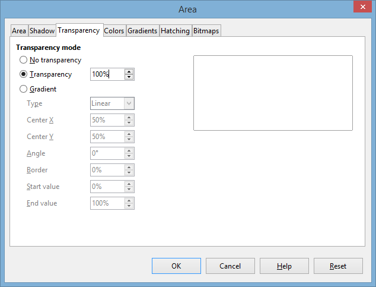

Fig. 10.45 The Area dialog box

> In the **Area dialog box**, click on the **Transparency tab**, then in
> the **Transparency mode** section make sure the **radio button** next
> to **Transparency** is checked, and set the **Transparency
> percentage** to **100%**, then click on **OK**

Cool. Houston now appears as just plain old text, but it’s actually a
Text Object which holds a hyperlink (Fig. 10.46)

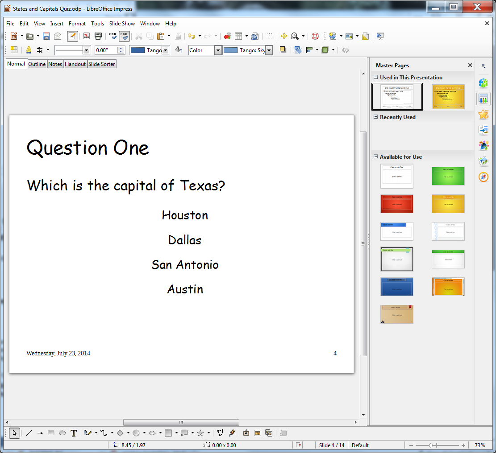

Fig. 10.46 Text Objects with invisible backgrounds

> Now do the same thing to the **other 11 Text Object multiple choice
> answers** on **Slides 4, 7, and 10**, then **Save** your work when
> you’re done

**Forcing the user to click on a Slide Control to advance to another
slide**

For the feedback slides such as the one illustrated in Fig. 10.30 above,
we must make sure that the user can only proceed from one slide to
another by clicking a Slide Control. As it is, when the user clicks the
mouse anywhere on the slide, the show will advance to the next slide
whether it’s supposed to go there or not.

So here’s how you give the user no option but to click on a Slide
Control in order to proceed.

> In the **Slide Sorter View**, hit **Ctrl-a** to select all the slides,
> then in the **Slide Show** menu select **Slide Show Settings…** to
> bring up the **Slide Show Settings dialog box** (Fig. 10.47)
>
> 
>
> Fig. 10.47 The Slide Show Settings dialog box
>
> Check **only** the **Radio buttons** next to **Range** > **All
> slides** and **Type** > **Default**, then, in the **Options**
> section, make sure you only have **check marks** next to **Mouse
> pointer visible** and **Animations allowed**—NOTHING else should be
> checked!
>
> **Save** your work again

You should test the work you’ve done to this point to make sure it works
the way you want it to.

> Go to **Slide Show menu** > **Start from first Slide** and answer
> each question **incorrectly** first, then watch as the **Text Object**
> **hyperlink** takes you to the **Wrong Answer** feedback slide
>
> Test all the **Text Object answers** to make sure the hyperlinks you
> put on them work appropriately; also test to make sure that when you
> click anywhere on the slide, **other than on the Slide Control**, the
> show doesn’t go anywhere

Give yourself a round of applause if everything worked correctly.

If, on the other hand, a hyperlink or Slide Control doesn’t work, don’t
panic. You can remove a Slide Control by simply *right clicking* on it
and selecting *Cut* from the context menu. Then

follow the steps above again carefully, and you should be able to
straighten things out.

**10.7 FORMATTING YOUR PRESENTATION**

**Selecting a Master Page**

*LibreOffice* makes it easy to select a background, font type and style,
and color scheme for your presentation. All these features are combined
into what *Impress* calls a Master Page.

Earlier we mentioned that you could start your new presentation by
picking the Master Page before even typing in the text. Well, as we
already discussed, sometimes it is best to wait to select a Master Page
until you have an idea of where text should be on the slides and how
much text is on each slide. Some Master Pages, for example, have
graphics that take more space on the slide than others and might make it
hard to read your text.

> In the **Slide Sorter View**, hit **Ctrl-a** to **select all** the
> slides, then click on the **Master Pages icon** on the **right edge**
> of the *Impress* window (Fig. 10.48)

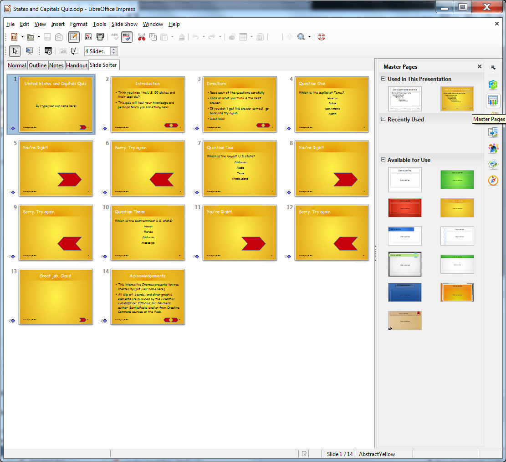

> Fig. 10.48 The Master Pages icon

C

> lick on any of the **Master Page** **icons** in the menu and wait as
> *Impress* **propagates** the design to **all the slides** in the
> **Slide Sorter View**
>
> **Preview** several of the available Master Pages before deciding
> which one you’d like to use

The Master Page chosen for the demonstration show, which is used in the
illustrations below, is called *AbstractYellow* and has the advantage of
needing little or no adjustments to be made to the slides after the
Master Page is applied. But feel free to use whichever of the Master
Pages you want for your presentation.[^1]

> When you’ve decided which **Master Page** you want,
>
> **Save** the presentation

**Tips on color choices for printing**

Lesson 9 covered the topic of printing *Impress* presentations, but this
is a good time to mention editing your background for how it will appear
on paper. Many of the Master Pages are attractive to look at; however,
when you print handouts or slides in black ink, the dark backgrounds
make some text hard to read. So, if you plan to print out your show,
choose a *lighter background* for all the slides. Then, when you are
ready to print, in the *Print Settings* section, click on the *Color
button* and, in the *Color* options, select *Grayscale*. This reduces
the background to more or less plain white with black text, making it
easier to read than color. It will also save a lot of money on the ink
cartridges for the printer!

**Applying different Master Pages to certain slides in a show**

Most of the time, we want our show to look the same on every slide. But
if you do need to vary the Master Page on different slides, here's what
you do. Let's say, for example, that you want a different Master Page
for the first slide and the last slide.

> Change your view to **Slide Sorter View**, click on the first slide
> and then hold down the **Ctrl** button as you click on the **last**
> slide to select just those two slides
>
> Click on one of the **Master Page thumbnails** to **Live Preview** it;
> do this for a few themes that look good to you and, when you’ve made
> up your mind, click on **your chosen Master Page** to select it, and
> **Save** the presentation again

Notice that only those slides you selected have that specific Master
Page. You can do this for just one slide or several slides. You’re the
boss! You may be thinking that your slide show looks hideous right now.
That’s OK; you can change everything and anything once you have the text
for each slide in place. You can change the text, too. With *Impress*
(or computer apps in general) nothing is chiseled in stone until you say
so! And even then, you can still change your mind.

What you need, above all, when working with a computer app such as
*Impress* is PATIENCE. If you’re always in a hurry, you’d better be
either *very talented* or *lucky* to do good work. But if you’re
patient, *Impress* will help you to do the best job you’re capable of
doing, that’s for sure.

**Creating customized, self-designed Master Page Templates**

For most users, the Master Pages provided by *Impress* are more than
sufficient to meet their design needs. Other Master Pages can be
accessed online. But if you prefer to create your own background, or
wish to create a *standard Master Page* for your school or class, you
can save whatever you create as a Master Page Template—a subject we
already discussed earlier in the tutorial.

**10.8 INSERTING CLIP ART AND OTHER CONTENT**

*Impress* has simplified the process of inserting pictures, clip art,
tables, Fontwork graphics, sound and movie clips, and charts. You
learned about this in Lesson 9, but it will be good to review what you
learned. You’ll also learn in this section how to insert a clickable
e-mail address.

**Inserting Clip Art**

> In the **Slide Sorter View**, **double** **click** on **Slide \#2**
> (**Introduction**)
>
> Click on the **Properties** button on the **left edge** of the
> *Impress* window and, in the **Slide Layout** menu, click to select
> the **Two Content** layout

Slide two should now have the bulleted text on the left, with a box on
the right for different types of content, including text and so forth
(Fig. 10.49).

Fig. 10.49 Slide Two: Two Content slide layout

> Click on the **lower left** Content Selector tool (the **Insert
> Pictures** tool—Fig. 10.52 above)

When you click on the *Insert Pictures* tool, the *Insert* *Image*
dialog box will pop up on the screen.

> On your **USB drive**, navigate to the **Work Files for LibreOffice**
> > **Miscellaneous Files** > **Practice** folder,
> **double-click** on the **US States** image and watch it upload to the
> slide (Fig. 10.50)
>
> 
>
> Fig. 10.50 Clip art accessed from the web and inserted onto a slide

Sometimes you will need to resize your clip art if it appears too small
or too large to fit into your presentation. This is easy enough to do.

> If necessary, click **once** on the clip art to select it, then
>
> click on a **corner** **handle** and drag **diagonally** left, right,
> up, or down to enlarge or shrink the image
>
> When everything looks good on the slide,
>
> **Save** the presentation

**Inserting other pictures or pictures of your own**

*A word about Copyright*

The simple rule (law) about Copyright © is this: *If you can see it,
it’s copyrighted*.

In other words, if you didn’t create it yourself, and you see it out
there for the taking, you should get permission from the author of the
work if you intend to use it, especially if you intend to use it for
*profit*.

Like everything in the law, however, it’s open to interpretation. So, if
teachers want to use an image they’ve found ‘out there’ to give added
meaning or emphasis to something they’re trying to help their students
learn, they are not *obliged* to seek permission from the owner of the
art because there is no question that they are using the image for
profit (though the owner would undoubtedly be delighted to know their
work was being used in this way).

Once you are comfortable locating and placing clip art into your show,
try finding pictures and other graphics online. It is simple to insert
onto a slide a digital picture that you’ve saved on your computer.

Let’s try this now. If you have a digital picture of your own that you’d
like to use for this exercise, feel free to do so. If you do not have a
picture of your own, you can use a picture of the author which is saved
in the *Work Files for LibreOffice*.

> First select **slide** **\#1**—the **Title slide**—in the **Home
> Ribbon** > **Slides Group** click on the **Layout tool**, and in
> the menu of **Layouts** click on the **Two Content** slide layout,
> then, on the **right side** of the slide window, click on the **Insert
> Image** tool once again
>
> Now navigate, on your **USB drive**, to the **Work Files for
> LibreOffice** > **Miscellaneous** **Files** > **Practice**
> folder, and **double click** on **Prof Poole**

The picture will quickly appear on the slide (Fig. 10.51), with the
handles around it so that you can move it to where you want on the slide
and resize it to fit the space where you want it to go.

Fig. 10.51 The Title slide with the picture of the author inserted onto
it

**Inserting sound**

> First, make sure you have your computer **Speakers** turned on (not
> muted) so that you can hear the sounds you are about to try out

In the U.S. States and Capitals show, we want to give our students a
reward for getting each answer correct. So, we’re going to insert
applause onto every *You’re Right!* slide.

> Open **Slide \#5** (the first **You’re Right!** slide) in the **Normal
> View**, then click on the **Slide Transition** icon on the **right
> edge** of the ***Impress* window** (Fig. 10.52)

Fig. 10.52 The Sound menu

> **In the Slide Transition dialog**, select any **Transition** you want
> (try out a few of them to see what you like), then click on the **down
> arrow** at the end of the **Sound entry box** and select the Sound
> called **Applause**
>
> Now scroll to **slides \#8 and \#11** and repeat the above steps
> (**inserting** the **Applause** sound)

You should now have applause on each of your positive feedback slides.

> **Save** the presentation with your new sound effects

A caveat (warning) about sound. Like any bell or whistle, it’s easy to
get carried away with sounds. Stay focused on the purpose of your show
and your audience’s needs. A kindergarten class will welcomes lots of
sounds. For a presentation to the Board of Education, a more
professional approach may be required!

*Inserting a negative feedback sound*

Now you need to insert a sound on each of the *Sorry. Try again.* slides
(slides \#6, \#9, and \#12). To vary things up, we’ll use an image to go
with each sound.

The images have been saved for you and you’ll find them on your USB
drive in the *Work Files for LibreOffice*.

> Start by opening **Slide\#6** in **Normal View**, then navigate to
> your **USB drive** > **Work Files for LibreOffice** >
> **Miscellaneous Files** > **Practice** folder and **double click**
> on the file called **Falling Downstairs** to **Insert** it onto
> **slide \#6**
>
> **Slide** the **image** anywhere **over** **to the left** **of the
> Slide Control**

Now for the animation to go with the picture.

> **Right click** on the **Falling Downstairs image** and, in the
> **context menu**, select **Custom Animation**, click on **green**
> towards the bottom of the **Custom Animation pane** and, in the
> **Animation dialog box**, select the **Bounce** animation (Fig. 10.53)

Fig. 10.53 The Animation dialog box

> Do the same thing for **Slide \#9** and **Slide \#12**
>
> For **Slide \#9** use the image called **Bomb** (**USB drive** >
> **Work Files for LibreOffice** > **Miscellaneous Files** >
> **Practice** folder); and for **Slide \#12** use the image called
> **Explosion** (**USB drive** > **Work Files for LibreOffice** >
> **Miscellaneous Files** > **Practice** folder again)
>
> **Save** your work

**Inserting Videos or Animations**

Inserting movies (or video) is just as easy as inserting clip art or
sounds. Whether it’s an animated clip or a short video clip, the steps
are the same.

> Open **Slide \#13** (**Great Job, Class!**) in **Normal View**

You could go to the web to search for video and clip art examples to use
on the slide, but for convenience sake you will find the animated image
you need in the Work Files for LibreOffice.

> Go to the **Insert Ribbon** > **Images** **Group** and click to
> select **Pictures…**
>
> Navigate to your **USB drive** > **Work Files for LibreOffice**
> > **Miscellaneous Files** > **Practice** folder and **double
> click** on the file called **Excited\_man** to **Insert** it onto
> **Slide \#13**
>
> Feel free to **grab the image** (**not** on the handles) and **move
> it** to wherever on the slide looks good to you—and **grab the
> handles** if you want to **resize** the image

When you are done, your slide will look something like that illustrated
in Fig. 10.54.

Fig. 10.54 Final look of the Conclusion slide

> **Save** the presentation before moving on to the last task

Keep in mind, as always, that moderation with content such as clip art,
sounds, and movies is key. Your topic (the *Function*), not the style
(the *Form*) of your show, must always be the main focus.

**10.9 SOME FINAL THOUGHTS ABOUT PRESENTATIONS**

Think you're ready to make some engaging and relevant interactive
*Impress* shows? Before you jump in, consider the following suggestions.

It's inevitable: *Impress* is so easy to use and fun to play with that
every beginning user from ages 6 to 96 wants to use all the tricks and
tools available. Yet, always remember the golden rule: Substance before
Style. Garbage, no matter how colorfully arrayed and beautifully
orchestrated, is still garbage.

Keep your focus on the content, then use only those tools that are
appropriate for your audience and task. Got a group of sleepy students
that don't seem thrilled about photosynthesis? Sure, throw in lots of
sound and moving text. But for test-taking and concept review, make the
presentation simple, clean, and succinct.

Next, remember the three secrets to creating an *Impress* presentation:
plan, plan, and plan? This is even more vital in the interactive show,
when one bookmark linking the wrong answer (My teacher is NOT a mammal.)
could have unexpected consequences. Some of us learn better when we can
visualize our task, so you may want to sketch out your ideas on paper or
on a *Writer* document until you feel comfortable with this new testing
method.

Lastly, just because you've created your presentation doesn't mean
you've finished. After planning a presentation and creating the show,
you need to spend time practicing using it. Take the test yourself.
Dummy-proof your show as much as your grade-level dictates (more Slide
Control on the introductory slides for example for younger children).
The beauty of all digital content such as an *Impress* presentation is
that it is easy to fix problems you may find, easy to update, easy to
improve, easy to maintain. So take the trouble to fine-tune your work
when you see that it needs further work.

**SKILL CONSOLIDATION**

1\. Prepare an interactive presentation that introduces yourself to your
class at the start of a new school year. Have five silly questions about
your education, hobbies, family, etc. Students will enjoy learning about
you and will have a great introduction into your class. Use any graphics
and sounds you like. Be sure to have a Title slide, an Intro slide, and
an Acknowledgements slide.

2\. Prepare an interactive presentation that reviews a basic concept that
must be memorized in your class (times tables, grammar rules, Spanish
vocabulary, periodic table). Have five questions related to the topic.
Depending on your class, have the presentation on a classroom computer,
E-mail it to your students to study with from home, or run it in the
computer lab. Use any graphics and sounds you like. Be sure to have a
Title slide, an Intro slide, and an Acknowledgements slide.

3\. Modify the steps in this chapter and teach your students how to make
an interactive *Impress* presentation. Have them create a quiz on a
hobby or sport of their choosing. This not only teaches them advanced
computer skills, but it helps them synthesize and organize information.
The hyperlink and Slide Control steps require clear organization skills
and logical thinking, great practise for real classroom learning. Use
any graphics and sounds you like. Be sure to have a Title slide, an
Intro slide, and an Acknowledgements slide.

4\. Prepare a presentation that works like an Internet scavenger hunt.
Choose your own topic (say, Dinosaurs). Come up with five questions
related to the topic. On each of the five Question slides, make each
question a hyperlink to a Web site with the answer on it. Then have four
possible answers to each question, only one of which is correct. Follow
the steps in this chapter to make the presentation interactive. For each
question you will need two hidden slides with the answer, one Correct
and the other Incorrect. After the title slide, you will have an
introductory slide which explains to the student how to proceed with the
exercise. Thus, your *Impress* will have 18 slides in all—a Title slide,
an Introductory slide, 15 Question and Answer slides, and an
Acknowledgements slide. Students will have to search the linked sites
for the information, requiring more sophisticated thinking skills than
simply memorizing facts. As in the lesson (US States and Capitals), when
the student clicks on an answer, the slide sends them to a hidden slide
which indicates whether the answer is right or wrong. If the answer is
wrong, a button on that slide sends the student back to the question
slide. If the answer is correct, a button sends the student to the next
Question slide in the presentation. Use any graphics and sounds you
like.

[^1]: *LibreOffice* maintains a website where you can access, as well as
    contribute your own, [Master Page
    Templates](../customXml/item1.xml).
