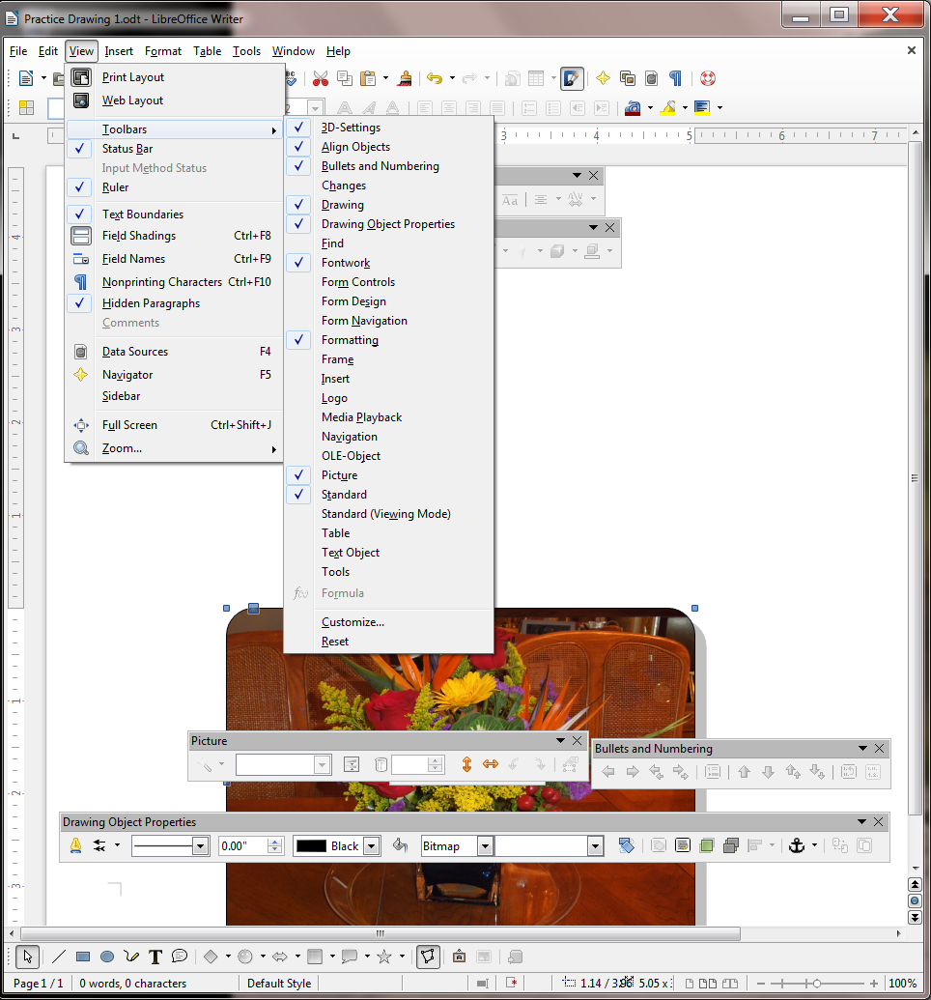
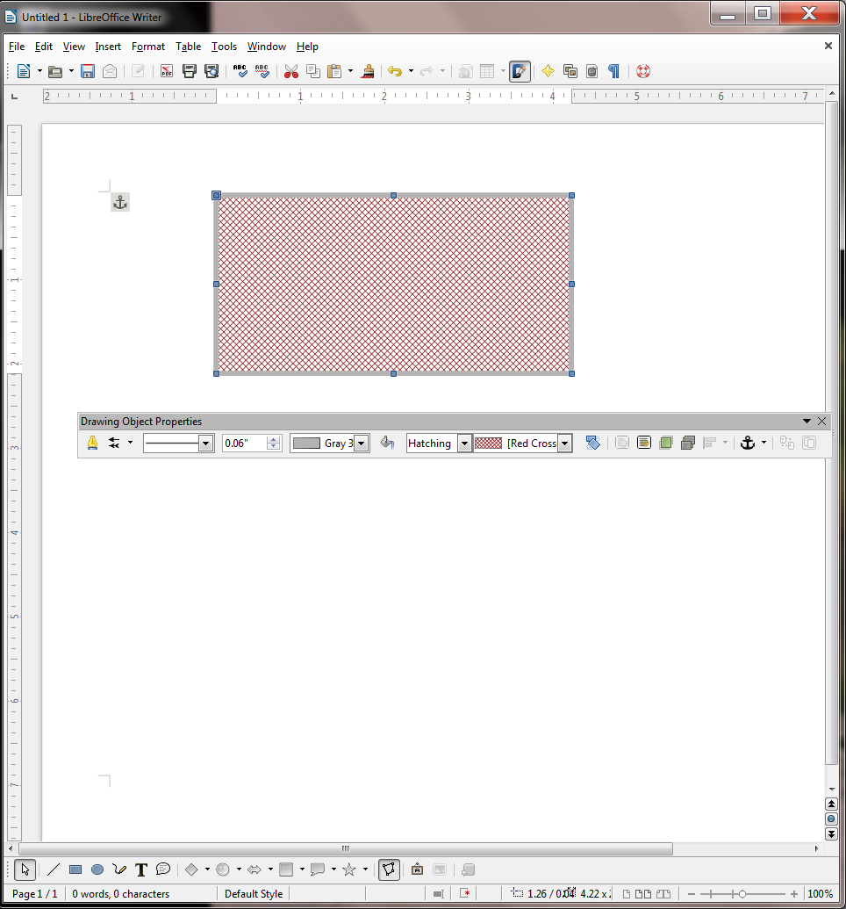
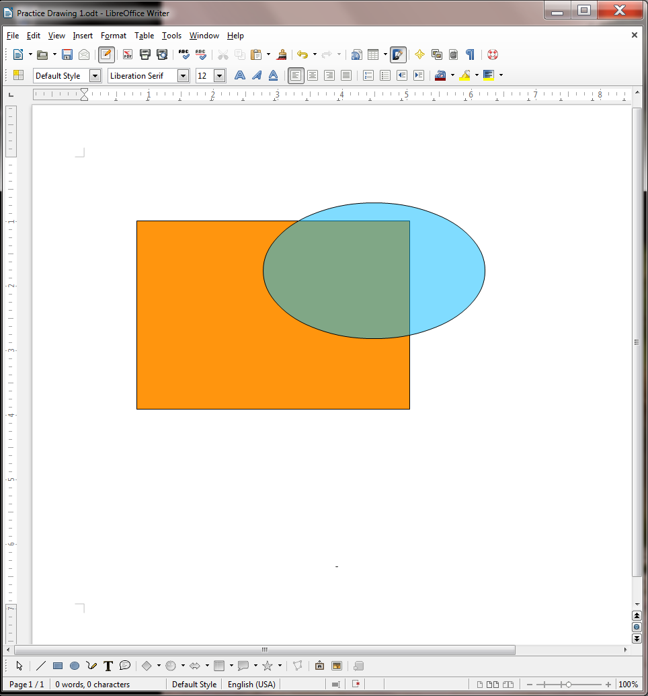
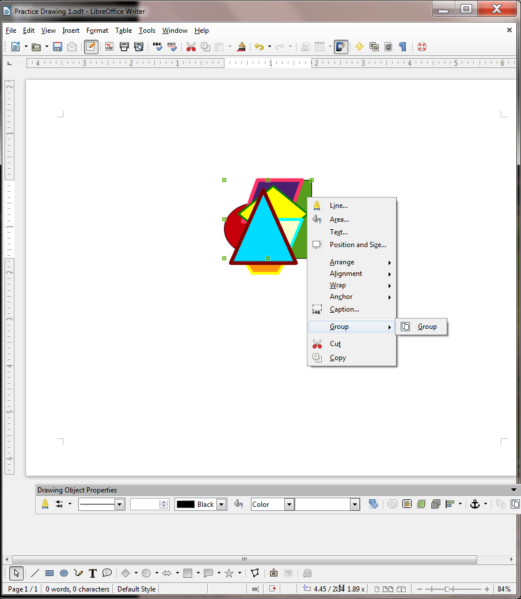
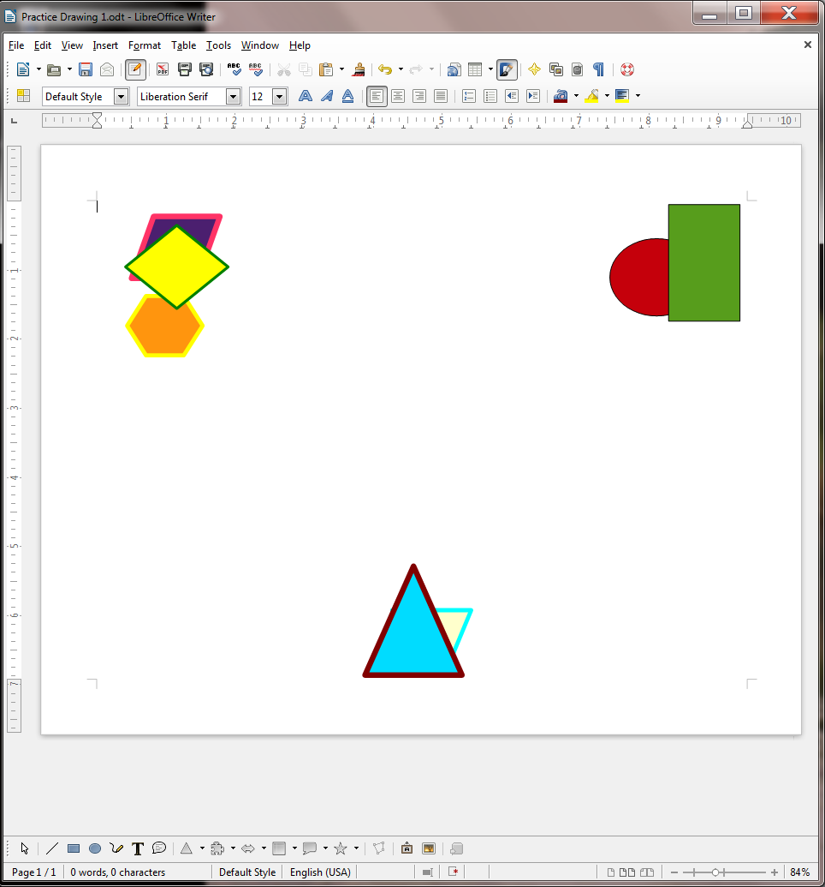
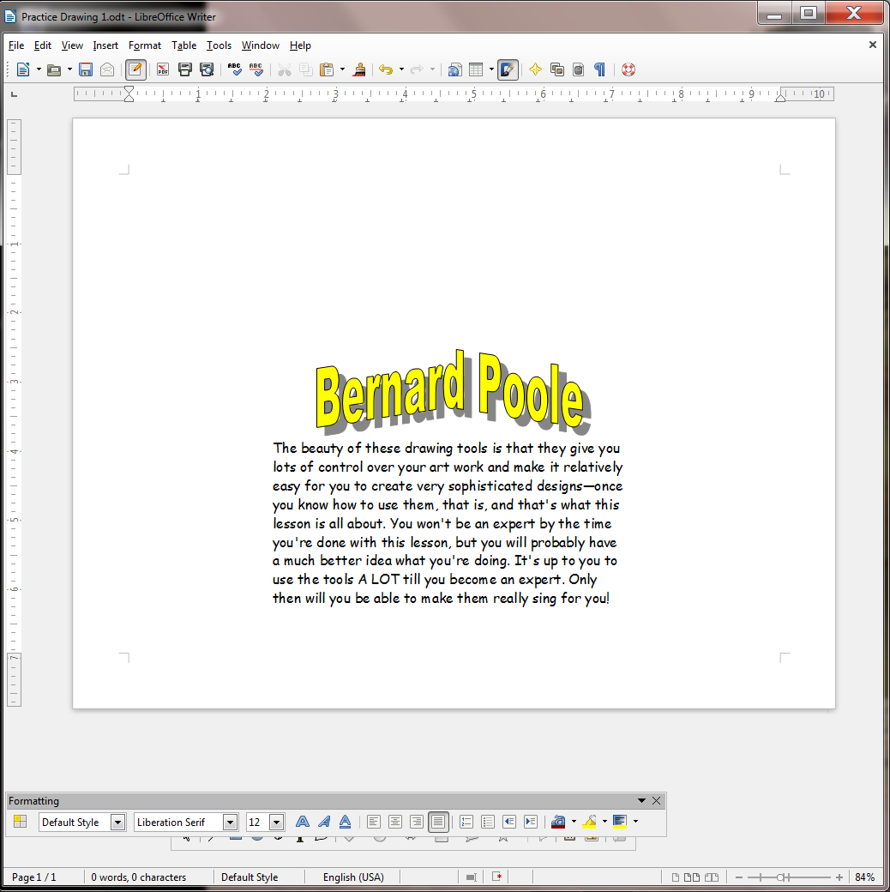

**Lesson 3** THE *LIBREOFFICE* DRAWING TOOLS
============================================

  ------- -------------------------------------
  **3**   **The *LIBREOFFICE* Drawing Tools**
  ------- -------------------------------------

**LEARNING OUTCOMES**

Lesson 3 will cover the following:

-   Drawing, moving, rotating, resizing, and otherwise editing simple
    shapes and lines

-   AutoShapes

-   Selecting one or more objects at once—overlapping, ordering,
    aligning, and rotating objects

-   Using colors, patterns, and other visual effects

-   Grouping and ordering objects

-   Using Fontwork

**3.1 GETTING STARTED**

**Setting up for the tutorial**

If you completed Lesson 1 of these tutorials, you can skip the rest of
this section and proceed directly to the next section (*Continuing with
the tutorial, on the next page*). If you did *not* complete Lesson 1,
then you must do this now, before proceeding with the rest of Lesson 3.

The set of *Work Files for LibreOffice* ideally should be stored on a
Flash drive (USB drive) in three folders named *Base Files*, *Impress
Files*, and *Miscellaneous Files*. You need to create a fourth folder
for the *data files* that you will be creating while working your way
through the tutorials. This fourth folder will be called *Data Files*.

Here are the steps to take to prepare these folders now before
proceeding with this tutorial.

> First, **Unzip** the set of **Work Files for LibreOffice** by double
> clicking on the File name on your computer (your instructor will help
> you with this if you are working with a class) and **Extract** them
> onto your flash drive
>
> **Double click** on the **Work Files for LibreOffice** folder to
> **open** it and, in the **Work Files for LibreOffice folder**, select
> **New Folder** (Fig. 3.1)

Fig. 3.1 Creating a New Folder

The system will create a new folder and then wait for you to give it a
name of your choice (Fig. 3.1 above).

> Call the new folder **Data Files**

**Continuing with the tutorial**

This tutorial is designed to give you practice working with the drawing
tools that are built into the various *LibreOffice* applications,
including *Writer*. Drawings that you create in one *LibreOffice*
application such as *Writer*, can be easily copied and pasted into other
*LibreOffice* applications, such as *Impress* or *Calc*.

For this lesson it will be useful to have a separate folder, inside your
Data Files folder, for all the drawing-based documents you’re going to
create.

> On your computer, go to your **USB drive (Removable Disk)** >
> **Work Files for LibreOffice** > **Data Files** folder, and, in the
> dialog box, click on **New folder** and name the new folder **Drawing
> Documents**

**3.2 OVERVIEW OF THE *LIBREOFFICE* DRAWING TOOLS**

In this lesson you will learn about many of the more frequently used,
and indispensable, drawing tools, all of which are accessed in the
*View* menu > *Toolbars* option (Fig. 3.2).

Fig. 3.2 The Toolbars you need for this lesson

**Overview of the tools for working with Lines and Shapes**

If you are drawing lines and shapes you’ll use the tools in the
*Drawing* toolbar (Fig. 3.3).

Fig. 3.3 The set of lines and basic shapes in the Drawing toolbar

Aside from basic lines and shapes, the Drawing toolbar provides *symbol*
shapes, *callout* shapes, *block arrow* shapes, *flowchart* shapes, and
*star* shapes.

In order to work with those lines and shapes—change the line or border
color or the area style or filling of a shape, rotate the shape, and so
on—you’ll use the tools in the *Drawing Object Properties* toolbar (Fig.
3.4).

Fig. 3.4 Working with existing lines and shapes

**Grouping and Aligning objects on the page**

When using the drawing tools to create shapes and other objects, you may
well want to align some or all of them and perhaps group them together
so that they become one object. To do this you would use the *Select*
tool in the Drawing toolbar to select or “gather” the objects you want
to group together. Having done that, you would then select from the
several *alignment tools* available in the Align Objects toolbar to
align them according to your design (Fig. 3.5).

Fig. 3.5 Aligning selected groups of objects on the page

If you wanted to convert several objects into a single object, you would
use the *Group/Ungroup* tools to “combine” them as one. This is very
useful when you have a complex set of objects (perhaps an architectural
drawing, for example) that you need to move around *en bloc* on the
page, or transfer to another page or another document, and so forth.

**Working with your own Pictures**

If, on the other hand, you are working with a *picture* that you already
have stored on your disk—such as a photograph or a diagram or a
chart—you’ll use the *Picture* toolbar (Fig. 3.6).

Fig. 3.6 The set of tools for working with photographs and other
prepared images

The Picture tools enable you to create *watermarks*, for example,
convert a picture to *grayscale*, make adjustments to *color density*,
*brightness*, and *contrast*, adjust the *transparency* of a picture,
and *rotate* and *flip* it in various ways.

**Bullets and Numbering**

In *Writer* you will sometimes have lists of items in your document. If
you want to use bullets or have a numbered list, or if you needed to
create different levels, or change the level of a list item; or if you
needed to adjust the numbering of the list, you would use the Bullets
and Numbering toolbar (Fig. 3.7).

Fig. 3.7 The Bullets and Numbering toolbar

**Fontwork**

*LibreOffice* lets you create eye-catching text-based graphics, which
can come in handy when you want to create signs, posters, and displays
of various kinds. You’ll find this toolbar, called *Fontwork*, in the
View > Toolbars menu, too (Fig. 3.8).

Fig. 3.8 Fontwork toolbar with a Fontwork example

**3D-Settings**

Any shape you draw can be rendered as a 3-dimensional (3D) object, a
process called *extrusion*. Fig. 3.9 shows the 3D-Settings toolbar, also
accessed from the View > Toolbars menu.

Fig. 3.9 The 3D-Settings toolbar with example of an extruded puzzle
shape

**Changing the Page Orientation**

In *Writer* there are two possible orientations for a page—*Portrait*
and *Landscape* (Fig. 3.10).

Fig. 3.10 Portrait or Landscape page orientation

You want Landscape orientation for most of the exercises that follow.
The default in *LibreOffice* is Page Orientation, but here is how you
select one or the other.

> From the **Format menu** select **Page…**, in the **Page dialog box**
> click on the **Page tab,** then in the **Paper format** section click
> on the radio button to select **Landscape** (Fig. 3.11)

Fig. 3.11 Selecting Portrait or Landscape Page Orientation

Landscape orientation turns the page on its side. This mirrors the
orientation of the computer screen and often makes it easier for you
when you are working with drawing objects, though there will be many
occasions when you will want to work in Portrait orientation, too.

**Using the Zoom tool**

The Zoom tool lets you zoom in on a page (so you can check out the
details) or zoom out (so you can see the big picture of a page or the
document as a whole).

While using the *LibreOffice* drawing tools, you will often want to zoom
*in* on an object you are working on, and it is also useful at times to
zoom *out* so you can check out the big picture. For this reason it is
good to know where to find the Zoom tools (Fig. 3.12 on the next page).

As you can see in Fig. 3.12, you can Zoom in and out using the various
selections in the *View menu > Zoom…* options. Alternatively, you can
Zoom in and out very discretely using the *slider* in the Status bar at
the *bottom right* of the *Writer* page (check the second illustration
in Fig. 3.12).

> Try out each of these **Zoom options** now to see how they work
>
> When you’re done, make sure you leave the Zoom setting at **100%**

In the sections that follow, you will practice zooming in and out of the
pages you are working on, and you also will use most of the tools in the
various drawing toolbars.

Time to get to work.

> 

Fig. 3.12 The Zoom tools

**3.3 drawing, moving, ROTATING, resizing, and otherwise editing basic
shapes and lines**

Let’s start by learning how to use the basic drawing tools to work with
simple shapes and lines.

> In the **View menu** > **Toolbars** **menu** click on the
> **Drawing** option to bring the **Drawing toolbar** onto the *Writer*
> screen (Fig. 3.13)

Fig. 3.13 Drawing toolbar (annotated)

Look at the bottom of your *Writer* screen, which is where the Drawing
toolbar is located.

> Slide your mouse pointer along the toolbar and read the descriptions
> about each of the drawing tools (Fig. 3.13 above summarizes the
> sections of tools)

As you can see, there are *dozens* of shapes to choose from, including
the simplest shapes such as lines, rectangles, ellipses, and freeform
lines, which you will practice using in this section of the tutorial.

> In the **Drawing toolbar**, click on the **Rectangle** shape (Fig.
> 3.13 above)

Immediately, *LibreOffice Writer* brings up the Drawing Object
Properties toolbar, which offers a range of options (*Object
Properties*) for the rectangle you want to draw even before you’ve drawn
it (Fig. 3.14)!

Fig. 3.14 The Drawing Object Properties toolbar

Because the Drawing tool bar and Drawing Object Properties toolbar pop
up at the bottom of the *Writer* window, it will be easiest to complete
the exercises that follow if you *zoom out* on the page. This will allow
you to view the whole page on the screen without the toolbars getting in
the way.

> Use the **zoom** slider in the **lower right corner** of the
> *LibreOffice* window (Fig. 3.15 and see Fig.12 on the previous page)
> to **zoom out** to **at least 84%** (the first hash mark to the **left
> of center** in the slider)

Fig. 3.15 The *LibreOffice* Zoom tool set at 84%

There, now you can see what you're doing. You could, if you wanted to,
move the toolbars (by grabbing them with the mouse pointer and dragging)
to the top of the window, amongst the other toolbars, or even to either
side of the page, but it is convenient to leave them where they are for
now.

> Go ahead and draw a **rectangle** of any size or shape on the page

Notice that the rectangle has a set of *handles* around it, which allow
you to change the shape of the rectangle on the fly by grabbing any
handle and dragging on it (Fig. 3.16).

Fig. 3.16 The set of handles around shapes and other images

You’re working with a rectangle, so you won’t need the simple line or
arrow tools at the left of the toolbar. But you may want to have a
different size (thickness), color, or style of *border* on the
rectangle.

> With the rectangle selected (it has the **handles** around it), in the
> **Drawing Object Properties toolbar**, take a look at the various
> tools for working with drawing objects (Fig. 3.17)

Fig. 3.17 The Drawing Object Properties toolbar (annotated)

Let’s quickly check out each of these tools. Refer to the illustration
above (Fig. 3.17) as you read the sections that follow.

**Line Style**

A line can be continuous, or it can be dashed or dotted in different
ways. The same applies to the border around a rectangle or any other
shape.

> With the **rectangle selected** (it has the **handles** around it),
> try out each of these **Line Styles** before proceeding with the
> tutorial

**Line Width**

A line can be thick or thin—or even invisible! The same applies to the
border around a rectangle or any other shape.

> With the **rectangle selected** (it has the **handles** around it),
> try out some **border thicknesses** as well as the **0 (zero)
> thickness** option before proceeding with the tutorial

**Line Color**

A line or border can be any color. The same applies to the border around
a rectangle or any other shape.

> With the **rectangle selected** (it has the **handles** around it),
> try out some of the **border** **Color options** before proceeding
> with the tutorial

**Area**

The Area tool gives you access to all the various options when it comes
to filling a shape with color, or creating a shadow on the shape, and so
forth.

> With the **rectangle selected** (it has the **handles** around it),
> take a look at each of these **Area options**, and try some of them
> for yourself before proceeding with the tutorial

**Area Style / Filling**

As you probably noticed when you checked out the Area tool above, the
area of a shape (inside area, not including the border) can be filled
with a range of colors, but it can also be filled with several *Styles*
of fill, such as Gradients, Hatching, and Bitmap (Fig. 3.18).

Fig. 3.18 Gradients, Hatching, and Bitmap options for Area Style /
Filling

> With the **rectangle selected** (it has the **handles** around it),
> try out each of these **Area Style / Filling options** before
> proceeding with the tutorial—have fun with it!

**Drawing lines**

Let's start with drawing lines.

> In the **Drawing toolbar** (at the bottom of the *Writer* window)
> click on the **line** **tool** to select it, then use the mouse to
> draw a straight **line** anywhere **on the page**

It doesn’t get any simpler than that.

**Working with lines**

Complete the following tasks to learn how to work with different styles
of lines.

> Click anywhere **off** the line you just drew and notice that the
> **handles** (little squares) at each end of the line **disappear**;
> the *LibreOffice* Drawing toolbar also disappears because it is only
> useful as long as a drawing object is selected

So… You can only edit or move a drawing object of any kind if the
handles are showing. The handles indicate that the object is *selected*.
Clicking ON the object selects it; clicking OFF the object deselects it.

> Position the mouse pointer anywhere **on** the
> line and notice how the cursor changes to a **crosshair** ( ), which
> tells you that the mouse is correctly positioned on the line so that
> when you click the mouse it will select the line
>
> Click anywhere **on** the line now, and notice that the **handles**
> (little squares) **reappear** at each end, and both the **Drawing
> toolbar** and the **Drawing Object Properties toolbar** *reappear*,
> waiting for you to decide what you want to do with the selected
> Drawing object (the selected line)

Now, with the handles showing, you can edit the line you just drew.

> Work your way across the **Drawing Object Properties toolbar**; try
> out the **Line Styles**, the **Line Widths**, and the **Line Color**

These are all the options you have when it comes to a simple line. Take
your time; have fun with it and make yourself familiar with the various
options available.

> When you are done checking out all the different design options for
> the line, hit the **Backspace** key or the **Del** key to delete the
> line from the page

**Working with rectangles and ellipses**

Creating and editing lines is simple enough. How about shapes such as
rectangles and ellipses—or squares and circles?

> In the **Drawing toolbar** click on the **ellipse (oval)** tool, and
> use the mouse to **draw** the **ellipse (oval)** object on the page

Notice the small handles that surround the shape, which you use to
change the object’s shape.

> Grab any of the **handles** and **stretch** them this way and that to
> change the shape; notice that the **corner handles** allow you to
> stretch the shape **diagonally** as well as **up, down, left, or
> right**—whereas the **handles at the middle of each side** only allow
> you to stretch the shape **up, down, left, or right**

**Rotating Objects**

To rotate an object that you have drawn on the screen, you need to use
the *Rotate* tool in the *Drawing Object Properties* toolbar (Fig.
3.19).

Fig. 3.19 Rotating a shape

Let’s try this now.

> First, click on the Oval object to select it, then, in the **Drawing
> Object Properties** toolbar, use the mouse to click on the **Rotate
> tool** (see Fig. 3.19 previous page)

This changes the appearance of the ellipse shape into an object that can
be rotated on a central axis (Fig. 3. 20).

Fig. 3.20 A drawing object that can be rotated

Notice that the handles have changed from a *blue* color to a *red*
color and that in the *center* of the ellipse there is a *focal point*
around which the ellipse object can rotate (Fig. 3.20 above).

> Position the mouse pointer on any of the ***corner*** **red handles**
> (Fig. 3.20 above) and **drag** in a clockwise or counter-clockwise
> circular motion to **rotate** the object
>
> Now position the mouse pointer on any of the ***side*** **red
> handles** and **drag** in a clockwise or counter-clockwise circular
> motion to again **rotate** the object

Notice that the *side handles* allow rotation of the shape from side to
side or up and down; whereas the *corner handles* allow full rotation of
the object on the screen. Take a couple of minutes to check out these
*Rotation* tools in the Drawing Object Properties toolbar.

> While you have the shape selected, in the **Drawing Object Properties
> toolbar**, some of the **Line Styles**, **Widths**, and **Colors**
>
> Also try out some of the **Area Style / Filling** **options**,
> including **Gradients**, **Hatching**, and **Bitmaps**
>
> When you are done checking out these **Drawing Object Properties
> tools**, hit the **Backspace** key or the **Del** key to delete the
> shape from the page

As you see, there are dozens—well, actually thousands at least—of
different options that you can apply to any shape that you draw on the
screen.

**Drawing a perfect square or circle**

Drawing rectangles and ellipses is easy. What about drawing a square or
a circle? If you want to draw a “perfect” square or a “perfect” circle,
you just hold down the *Shift key* at the same time as you draw with the
rectangle tool or the ellipse tool. Try this now.

> In the **Drawing toolbar** select either the **Rectangle** or **Oval**
> tool, hold down the **Shift** key, and draw the shape in any size

Notice that the shape will always be a perfect square or circle *as long
as you hold down the Shift key*. After you’ve drawn the square, if you
let go of the Shift key you can then go ahead and use the handles to
make the rectangle no longer square or to change the circle to an
ellipse.

> Try this now—**let go of the Shift key** and change the shape of your
> circle or rectangle

So the shape will always be a perfect circle or square as long as you
hold down the Shift key. Remember this neat trick. It’ll work with other
software, too.

**Moving drawing objects**

Creating lines and other shapes is simple enough. But once you have an
object drawn, how about editing it and moving it around on the page? To
do either of these things, the line or rectangle or ellipse or other
drawing object must first be selected (which means clicking on it so
that you can see the handles around it). First let’s practice moving an
object around on the page without changing its shape.

> Click on the **object you have on the screen** to select it (you see
> the handles around the shape), slide the mouse pointer over the object
> and notice that the pointer changes to a **crosshair** any time the
> pointer is **anywhere within the perimeter** of the object or **on**
> the object if it’s a simple line—the crosshair tells you that you can
> move or edit the object
>
> Now, hold down the **left mouse button** and **drag** to move the
> object anywhere you like on the page

**Resizing drawing objects**

How about resizing drawing objects—changing their size and shape? To do
this, once again the line or rectangle or other drawing object must
first be selected so you can see the handles.

> Make sure the **object** from the previous exercise is still
> selected—you should be able to see the handles around it

If you want to change the *size* of the object without losing the
object’s *shape*, you must use a combination of the Shift key and one of
the four *corner* handles (not the 4 handles in the middle of each
side). Try this first.

> Hold down the **Shift** key, then position the mouse pointer on one of
> the small handles in any **corner** of the shape (***not*** one of the
> 4 handles in the middle of each side or the rotate handle), hold down
> the **left mouse button** and **drag** in or out to stretch or squeeze
> the object you have on the screen

Notice that the object keeps its basic shape; when you hold down the
Shift key only the size changes. If you're not concerned about
distorting the object’s shape you can drag on any of the handles without
holding down the Shift key. Try this now.

> Position the mouse pointer on any of the white handles, hold down the
> **left mouse button** and **drag** to stretch or squeeze the ellipse
> anyway you want

The same thing applies to irregular shapes such as polygons in general
or freeform drawings like squiggly lines (yes, there’s a squiggly line
tool, too! It’s called the *Freeform Line* tool). When you click on the
shape, it shows the handles around it. By holding down the Shift key and
grabbing one of the handles in the corners, you can make the shape
smaller or larger *without otherwise distorting it*. By grabbing any of
the handles around the shape *without* simultaneously pressing the Shift
key, you can distort the shape by making it thinner or fatter, taller or
shorter—whatever.

Try this now.

> Make sure the **object you have on the screen** is **selected**—you
> should be able to see the handles around it—then hit the **Backspace**
> key or the **Del(ete)** key to delete it
>
> In the **Drawing toolbar** select the **Freeform Line** tool (Fig.
> 3.21), then **write (scribble) your name** anywhere on the page

Fig. 3.21 The Freeform Line tool

> With your name (the object on the page) highlighted, hold the
> **Shift** key down, then position the mouse pointer on any of the
> **corner** handles, hold down the **left mouse button** and **drag**
> to stretch or squeeze the object anyway you want—it will keep its
> basic shape; only the **size** of your name will change
>
> Now try it again, but this time without holding the **Shift** key, and
> notice the **difference**—use all the handles and notice the
> difference there, too, between using the **corner handles** or the
> **handles at the middle of each side**
>
> When you are done playing around with your signature, hit the
> **Backspace** key to delete it from the page

**Editing (changing) straight lines or arrows**

First of all, an arrow
is a type of line, except that it has an arrow head on one end or on
both ends. You can draw an arrow by clicking on the Arrow Style tool in
the Drawing Object Properties toolbar (Fig. 3.22).

Fig. 3.22 The Line tool and the Arrow Style tool in the Drawing Objects
toolbar

> Click on the **Arrow Style** tool, select any style, then **draw an
> arrow** on the page

If you want an arrowhead on both ends of the line, you need to bring up
the Line dialog box. There are two ways to do this.

> Either click, at the **left end** of the **Drawing Object Properties
> toolbar**, on the small yellow **Line tool** (see Fig. 3.20 on the
> previous page)
>
> Or you can position the **mouse pointer** anywhere along the **arrow
> line** (you’ll see the pointer change to a **crosshair**), hold down
> the **right mouse button** and, in the **context menu** that pops up,
> select the first item: **Line…** to bring up the **Line dialog box**
> (Fig. 3.23)

Fig. 3.23 Changing the Arrow Style in the Line dialog box

> Now, towards the **top right** of the dialog box, click on the down
> arrow to drop down the menu of **Arrow End Styles** (see Fig. 3.23
> above) and select the same **arrowhead** as you selected for the arrow
> you just drew on the page

Notice that the Line dialog box also lets you put a shadow on the line
or arrow object you’ve drawn, or you can change the color, size, and
shape.

Editing a straight line or a straight line arrow works a little
differently than solid shapes such as ellipses, polygons, and so forth,
since you only have two handles to worry about—one at either end of the
line or arrow. You use either of the handles to lengthen or shorten the
line. You also can drag on either handle to rotate it from either end.
Let’s try this now.

> Grab hold of the **handle** at either end of the line or arrow, and
> **drag the handle** in or out, up or down, from side to side, so you
> can get a feel for how to change its **length** and **orientation**
>
> **Clear** the **Page** of any drawing objects when you are done

**3.4 OTHER DRAWING shapes**

There is a wide selection of predefined shapes that you can use to
create your drawings. These shapes are accessed from the Drawing toolbar
(Fig. 3.24).

Fig. 3.24 Drawing toolbar (annotated)

Specifically, there are Basic Shapes like rectangles, ellipses,
triangles, cylinders, and so forth, most of which would take you quite a
while to create from scratch by hand—unless you’re a talented artist, of
course.

Then there are shapes designed to help you draw Block Arrows, and shapes
to help you create Flowcharts—very useful for planning diagrams. If you
want to add “speech” to characters in a diagram, there is a nice
selection of Callouts you can use. Finally, when you want to create
certificates and such, you can use the Stars and Banners shapes.

For the next exercise, when you have finished the exercise, you are
going to Save the file in your Drawing Documents folder (in the Data
Files folder) so that you can later send it to your instructor as an
attachment in email. So let’s save the blank document you have open on
your screen now before we proceed.

> In the **File** **menu** select **Save As…**, navigate to your **USB
> (Removable) disk** > **Work Files for LibreOffice** > **Data
> Files folder** > **Drawing Documents**, name the file **Practice
> Drawing 1**, and hit **Save**
>
> Now, in the **Drawing toolbar** at the bottom of your *Writer* page,
> spend a few minutes checking out the many sets of shapes available to
> you
>
> When you are ready, complete the following exercises—draw each of the
> shapes **small enough** so you can fit them all on the page **without
> overlapping** and ***don’t delete any of them*** because you’re going
> to send the file to your instructor when you have completed Lesson 3

When you are done with this particular exercise, your page will look
something like (though obviously not exactly the same as) Fig. 3.25.

Fig. 3.25

> Draw at least **three** **Basic Shapes** (line, rectangle, ellipse,
> freeform shape, triangle, hexagon, cube, etc., etc.)
>
> Draw at least **three** **Block Arrows**
>
> Draw at least **three** **Flowcharting Shapes**
>
> Draw at least **three** **Callouts**
>
> Draw at least **three** **Stars or Banners**
>
> Now use the tools in the **Drawing Object Properties toolbar** to add
> **Line Styles and Line Colors** to lines and the borders of the
> various shapes
>
> **Fill** the **Areas** of **shapes** with a mix of **colors**,
> **gradients**, and **bitmaps**
>
> **Save** the file (**Practice Drawing 1**), then **Close** the
> document (later in the lesson you’ll be sending it **as an attachment
> in email** to your instructor)

Now you are ready for the next exercise.

**3.5 using colors, patterns, and other visual effects**

**Transparencies**

As you have already learned, the *Writer* drawing tools give you lots of
control over colors, patterns, gradients and other visual effects, such
as shadows and 3-D. Let's take a closer look at some of these tools,
starting with transparencies.

> You need a new document for this next drawing exercise, so in the
> **File** **menu** select **Save As…**, navigate to your **USB
> (Removable) disk** > **Work Files for LibreOffice** > **Data
> Files folder** > **Drawing Documents**, name the file **Practice
> Drawing 2**, and hit **Save**
>
> Start by drawing a **rectangle** on the blank page and give it an
> **Area Fill color** of your choice, then draw an **ellipse** that
> **overlaps** the rectangle and which has a **different Area Fill
> color** than the rectangle—something like Fig. 3.26

Fig. 3.26 One shape overlapping another

The ellipse, being opaque (a solid color), hides part of the rectangle.
But you can adjust the *Transparency* of the Area Fill Color of a
drawing object such as the ellipse in this case, thus allowing a drawing
object that is hidden behind it to show through. Let's try this.

> With the ellipse selected, in the **Drawing Object Properties
> toolbar** click on the **Area** tool to bring up the **Area dialog
> box** (Fig. 3.27)

Fig. 3.27 Settings for a semi-transparent shape

> Now, in the **Area** **dialog box** click on the **Transparency tab**,
> then click, in the **Transparency mode** section, on the **radio
> button** next to **Transparency** (Fig. 3.24 on the previous page) so
> that you will have a **50% transparency** for the selected object (the
> ellipse), then click on **OK**

The ellipse shape now looks like a piece of glass or transparent plastic
or sheer material, partially revealing the object that is behind it Fig.
3.28.

Fig 3.28 The transparent ellipse

Neat, huh? Notice that you can also add gradients to the transparent
shape. Try this now.

> With the ellipse still selected, in the **Drawing Object Properties
> toolbar** click on the **Area** tool to bring up the **Area dialog
> box**, click on the **radio button** next to **Gradient** and then
> select the **Type** of gradient you want from the **drop down list**

**Area Fill Effects**

Other than plain colors, there are different *gradients* you can use to
fill shapes with smoothly graded shades of color; there also is a small
selection of *hatching* fills; and you can fill shapes with *bitmaps*
that come with *LibreOffice*. Now let’s check out a couple of other
useful *Area Fill* tools along these lines.

*Filling Shapes with Imported Pictures*

Bitmaps are essentially digital images, and can include any picture you
want—pictures that you may have taken yourself, for example, or which
you might find amongst collections of pictures and other art work that
are freely available on the web.

> Click on the **ellipse** shape to select it, and hit the
> **Backspace/Del(ete)** key to remove it from the page, then click on
> the **rectangle** shape to select it
>
> In the **Drawing Object Properties toolbar** click on the **Area**
> button to bring up the **Area dialog box**
>
> Click on the **Import** button

The Import button brings up the *Import dialog box*, which is
essentially the Open button for the operating system you’re using on
your computer—Windows, Mac OS or otherwise.

> In the **Import dialog box**, navigate to your **USB (Removable)
> disk** > **Work Files for LibreOffice** > **Miscellaneous Files
> folder** > **Practice folder**, then double click on the file named
> **Bouquet**

Immediately the Bouquet picture is uploaded to the rectangle shape on
the *Writer* page (Fig. 3.29).

Fig. 3.29 Filling a shape with a picture imported from your disk

> Depending on the shape of your rectangle, the image may be
> **distorted**, so use the **handles** to stretch the rectangle one way
> or another till it looks OK
>
> In the **Drawing Object Properties toolbar** click on the **Area
> Tool** to bring up the **Area dialog box** (Fig. 3.30), and in the
> **Fill section** scroll to the bottom of the list of bitmaps

Fig. 3.30 Adding a picture to the set of bitmaps in the Area dialog box

Notice that the Bouquet picture has now been added to the set of bitmaps
(Fig. 3.30 above), which means you no longer need to *Import* it again
from your disk. You’ll be able to easily use it again whether in
*Writer*, *Draw*, or any of the other *LibreOffice* applications.

> You do not want to **Tile** the picture inside the rectangle and you
> do want it to **Fit**, so in the **Area dialog box**, **remove** the
> **check mark** next to **Tile** and put a **check mark** in the
> **Autofit** box

**Rounding corners and applying a Shadow effect on images**

*LibreOffice* provides drawing tools to round off the corners of images
and apply shadow effects. Both are easy enough to use, once you know
how. Let’s round the corners of the picture first.

> **Right click** on the **Bouquet** **picture** to bring up its
> **context menu** (Fig. 3.31)

> Fig. 3.31 The picture object’s context menu
>
> Click on the **Position and Size…** menu item (Fig. 3.31 above) to
> bring up the **Position and size dialog box**
>
> Now click on the **Slant and Corner Radius** tab and increase the
> **Corner radius** setting to **0.20”** and click on **OK** (Fig. 3.32)

Fig. 3.32 The Position and size dialog box

Next you need to create a shadow effect on the image.

> **Right click** again on the **Bouquet** **picture** to bring up its
> **context menu** (Fig. 3.31 on the previous page) and this time click
> on the **Area…** menu item, then in the **Area dialog box** click on
> the **Shadow tab** (Fig. 3.33) and, in the **Properties section**
> click to put a **check mark** next to **Use Shadow** and, in the drop
> down menu of Colors, select **Light Grey**

Fig. 3.33 The Shadow tab in the Area dialog box

The final version of the Bouquet image should look like Fig. 3.34.

Fig. 3.34 Final version of the Bouquet picture

> **Save** the file (still **Practice Drawing 2**) before proceeding
> with the tutorial—(later in the lesson you’ll be sending it to your
> instructor), and **delete** the **Bouquet picture object** from the
> page

**3D Effects**

All that remains in this section is to try out the various 3-D Effect
tools. These are located in the *3D-Settings toolbar* which is accessed
from the *View > Toolbars* menu.

> You need a new name for this next drawing exercise, so in the **File**
> **menu** select **Save As…**, navigate to your **USB (Removable)
> disk** > **Work Files for LibreOffice** > **Data Files folder**
> > **Drawing Documents**, name the file **Practice Drawing 3**, and
> hit **Save**
>
> In the **Drawing toolbar** > **Symbol Shapes** draw a **Puzzle
> symbol** about **3” square** on the page
>
> Select any **border color** for the Puzzle **shape** and any
> **gradient** for the **fill**, then in the **View menu** >
> **Toolbars menu** select **3D-Settings** to bring up the **3D-Settings
> toolbar** (Fig. 3.35 on the next page)
>
> In the **3D-Settings toolbar**, click on the **Extrusion On/Off** tool
> to **turn on Extrusion**

Fig. 3.35 Draw a Puzzle shape on the page

Extrusion is just another word for the process of making a shaped
object, such as a rod or a tube—or a puzzle shape—by forcing a material
into a mold. On the computer, all this molding and modeling work is
digital and is done using mathematics.

Notice the 3d-Settings toolbar now comes to life with the various 3D
(digital extrusion) tools now available for you to use on the selected
object—the Puzzle shape—which has also been transformed into a basic 3D
image (Fig. 3.36).

Fig. 3.36 The 3D-Settings toolbar (annotated)

Notice, too, the tools for tilting the image in various directions;
tools for adjusting the depth or direction of the 3D modeling; and the
tools for controlling the light source on the image, the surface
texture, and color.

> Your turn; with the **Puzzle shape selected**, take a few minutes now
> to try out **each of** **the various 3D-settings tools** to see how
> they work and to see what effect they have on the object

Very simple, very effective, very impressive. Actually, if you were
aware of the math that is necessary to create these 3-D effects, you’d
be very impressed indeed!

> **Save** the file (still **Practice Drawing 3**) before proceeding
> with the tutorial, then **delete** the **3D Puzzle** object

The more artistic you are, the more skillfully you will be able to apply
these effects. But even if you don’t think you are artistic, you’ll be
surprised what you can come up with.

**3.6 GROUPING, ordering, and aligning objects**

You've probably noticed that when you put one shape, or drawing object,
on top of another, it stays there, overlapping the other shape, as with
the ellipse and rectangle shapes in the previous exercises.

With the Drawing Tools, every object you create is always a separate
entity from the other objects on the page, even if they overlap.
However, you can *group* objects together if you want, as we'll see in a
moment. When you group them, they effectively become one object for as
long as they are grouped. But you also can *ungroup* them whenever you
please. This is because all the drawing objects are like pieces of a
jigsaw puzzle or a deck of cards. You can group the jigsaw pieces by
fitting them together, or you can group the cards in a deck by gathering
them into a pack of cards--or you can ungroup them by scattering them to
the winds. Let's see how this works in *LibreOffice*.

> You need a new name for this next drawing exercise, so in the **File**
> **menu** select **Save As…**, navigate to your **USB (Removable)
> disk** > **Work Files for LibreOffice** > **Data Files folder**
> > **Drawing Documents**, name the file **Practice Drawing 4**, and
> hit **Save**

You are going to draw seven different shapes, one on top of the other,
each with a different border color and fill color or gradient. You’ll
end up with something like Fig. 3.37.

Fig 3.37 Shapes layered on top of one another

> In the **Drawing toolbar** click on the **ellipse tool**, draw an
> **ellipse** (no more than **about 2” in diameter**) on the page and
> fill it with a **basic color** of your choice
>
> Next, in the **Drawing toolbar** click on the **rectangle tool**, draw
> a rectangle (no more than **about 2” square**) on the page so that it
> **overlaps** the ellipse and fill it with a **basic color** of your
> choice
>
> Now, in the **Drawing toolbar** click on the **hexagon tool**, draw a
> hexagon (no more than **about 1” on any side**) on the page so that it
> overlaps the ellipse and/or the rectangle, but **doesn't actually
> hide** either the **ellipse** or the **rectangle**—make sure you can
> still see at least a piece of **all three shapes** and fill the
> hexagon with a **basic color** of your choice
>
> Now use the **Line Width** tool to increase the thickness (**weight**)
> of the hexagon’s border to at least **0.06”**, and use the **Line
> Color tool** to select a **different** **color** for the border
>
> Repeat the same steps to draw and fill (using colors or gradients)
> both the Border and the Fill area of a **parallelogram**[^1],
> **trapezoid**, **diamond**, and **triangle** (again making sure none
> of the objects actually hides any of the others completely—you should
> be able to see a piece of all seven (7) shapes when you're done, as
> illustrated in Fig. 3.37 on the previous page)

So now you should have on your page (screen) seven different shapes with
seven different fill colors and various other effects. The reason you
need to be able to see at least a piece of each shape is to make it
easier for you to do the next exercise.

> **Save** the contents of the page (**Practice Drawing 4**)

**Grouping drawing objects **

> You need a new name for this next drawing exercise, so in the **File**
> **menu** select **Save As…**, navigate to your **USB (Removable)
> disk** > **Work Files for LibreOffice** > **Data Files folder**
> > **Drawing Documents**, name the file **Practice Drawing 5**, and
> hit **Save**

Right now, all the objects are separate—ungrouped. Let's group them into
three groups.

> First, click anywhere **off** **all the shapes** so that none of them
> is selected
>
> Now use the mouse, and hold the **Shift** key down, and click on the
> **ellipse** shape and the **rectangle** shape
>
> Now, **right click** on the selected shapes (the ellipse and the
> rectangle should both have handles around them) and, in the **context
> menu** that pops up, select the **Group** > **Group** option (Fig.
> 3.38)

Fig. 3.38 Grouping objects together

Check your drawings now and notice that the ellipse and rectangle shapes
have just one common set of handles. Now you can treat them as one
object and move them around on the screen as one object, independently
of the other objects.

> Grab the **rectangle shape** with the mouse and slide it over to the
> **right edge** of the page—notice that the ellipse goes right along
> with it because they are now grouped together

Complete the following steps to create groups of the other objects.

> Again, click anywhere **off** **all the shapes** so that none of them
> is selected
>
> Using the mouse, and holding the **Shift** key down, click on the
> **trapezoid** shape and the **Triangle** shape, **right click** on the
> selected shapes and, in the context menu select the **Group** >
> **Group** option
>
> Next, slide the **trapezoid and triangle shapes** up towards the **top
> center** of the page and click anywhere **off** **all the shapes** so
> that none of them is selected
>
> Using the mouse, and holding the **Shift** key down, click on the
> remaining 3 independent shapes: the **hexagon** shape, the
> **parallelogram** shape, and the **diamond** shape, **right click** on
> the selected shapes and, in the context menu select the **Group** >
> **Group** option
>
> Slide this final group of shapes down towards the **left center** of
> the page

Your page should look something like Fig. 3.39 when you’re done.

Fig. 3.39 Three separate groups of shapes

> Check your drawings, click on **each group in turn**, and **slide them
> around** on the page

Notice that each group now has just one set of handles and that they
move as a group. You can even rotate them as a group.

> Try this now by clicking on any of the three groups, click in the
> **Drawing Object Properties toolbar** on the **Rotate tool**, and
> **rotate** the grouped shapes any way you want

This is often very useful when you create a complicated drawing using
several objects, like lines and shapes, and you want to move them around
a few items at a time, or all together or rotate them as one object or
as several specific objects, and so on. Just group them all together,
and Bob's your uncle! You'll have another chance to practice this when
you do the Skill Consolidation exercises at the end of the lesson.

**Resizing objects**

This is easy.

> Click on any of **the shapes** to select a group and grab hold of one
> of the corner handles and drag in to make the group smaller
>
> Do the same thing to reduce the size of the other two groups, then
> drag the ellipse and rectangle group to the **top right corner** of
> the page, the trapezoid and triangle to the **lower center**, and the
> hexagon, diamond and parallelogram to the **top left corner**

Your drawing should now look something like Fig. 3.40.

> 

Fig. 3.40 Resized grouped sets of objects

> **Save** the contents of the page (**Practice Drawing 5**)

**Ungrouping objects**

This is easy, too.

> You need a new name for this next drawing exercise, so in the **File**
> **menu** select **Save As…**, navigate to your **USB (Removable)
> disk** > **Work Files for LibreOffice** > **Data Files folder**
> > **Drawing Documents**, name the file **Practice Drawing 6**, and
> hit **Save**
>
> First, click anywhere **off** **all the shapes** so that none of them
> is selected
>
> Click on the **ellipse-rectangle** shape, right click on it and, from
> the context menu, select **Grouping** > **Ungroup**

Look at the ellipse and rectangle shapes now and notice that all the
handles for each shape have reappeared.

> Now click anywhere **off** the **ellipse-rectangle shapes** so that
> neither of them is selected, then click on **just the ellipse shape**
> and notice that it is now independent of the rectangle shape
>
> Move the **ellipse** shape away from the **rectangle** shape so there
> is **no longer any overlap**
>
> Repeat this to **ungroup** **all** the other objects—be sure to
> ungroup them all for the sake of the following exercises, then move
> each of the shapes away from each other so there is **no longer any
> overlap anywhere**—you should now have 7 separate shapes spread out on
> the page

**Ordering the drawing objects**

The order of the shapes right now should still be the same as the order
in which you created them. So the rectangle is in the back, the ellipse
on top of the rectangle, and so forth. Think of the objects as layered
one of top of the other—even if they aren't actually touching. But
because you’ve moved them all around, they may no longer all be touching
each other. So let’s slide them all back on top of each other in the
middle of the page so you can see how the ordering function works.

> Rearrange all the shapes so they are **overlapping** each other again
> in the center of the page (something like in Fig. 3.41)
>
> 
>
> Fig. 3.41 Drawing objects layered on top of each other

Notice how they are all still layered in the order that you originally
created them, so the first shape you created (the ellipse) is still on
the bottom and the last shape you created (in Fig. 3.38 it’s the
triangle) is still on top.

You can move (re-order) objects backward or forward in the layers. Time
to try this out; then you'll see how it works.

> Click to select the **top** shape first (the triangle), **right
> click** on it, then from the **context menu** select **Arrange** >
> **Send Backward**

This drops the top shape back behind the next shape down in the pile of
shapes (or deck, if you think of the shapes as a deck of cards). The
trapezoid should now be on top.

> Select the new **top** shape again, **right click** on it, then from
> the **context menu** select **Arrange** > **Send to Back**

Now the top shape (the trapezoid) is moved all the way to the bottom of
the deck. You can bring objects forward or send them back, either one
layer at a time, or all the way forward or all the way back in one go.

> Try this now with **several** of the objects, using **each one of the
> Order options** till you get the hang of it, then **Save** the file
> (**Practice Drawing 6**) when you’re ready to move on

**Aligning Drawing objects**

No doubt your page now looks like a work of abstract art! One last task
remains in this section of the tutorial. You need to take a moment to
check out the *LibreOffice* Align tools, which make it easy for you to
*Align* an object or a set of objects (shapes) in the space that
contains them. To practice this you can use the set of 7 shapes you were
working with in the previous exercise.

> At the **left hand end** of the **Drawing toolbar**, click on the
> **Select** tool, then use the mouse pointer to **drag** from **outside
> the top left** of the 7 shapes **down across** all the shapes to the
> **bottom right**

You should now see a single set of handles around the 7 shapes as a
whole.

> Using the mouse pointer again, grab any of the **handles** and
> **drag** to make the **set of shapes** as big as you can to **fill the
> page**

When you’re done “stretching” the shapes, your page might look something
like Fig. 3.42.

Fig. 3.42 The 7 shapes stretched to fill the page

> In the **View menu** > **Toolbars menu**, click to select the
> **Align Objects toolbar** (Fig. 3.43)

Fig. 3.43 The Align Objects toolbar

> Now, with all the shapes still selected, click on **each of the
> tools** in the **Align Objects toolbar** and watch as the shapes are
> all aligned, *in relation to the set of shapes as a whole*, **to the
> left**, **horizontally centered**, **to the right**, **to the top**,
> **vertically centered**, and **to the bottom**
>
> **Save** the file (**Practice Drawing 6**) when you’re ready to move
> on, then clear **all the shapes** off the page

**3.7 Using the Textbox tool and *Fontwork***

**Using the Textbox tool**

It will be easiest to start over with a new *Writer* document for this
part of the tutorial.

> In the **File menu** select **Close** to close **Practice Drawing 6**,
> then in the **File** **menu** select **Save As…**, navigate to your
> **USB (Removable) disk** > **Work Files for LibreOffice** >
> **Data Files folder** > **Drawing Documents**, name the file
> **Practice Drawing 7**, and hit **Save**
>
> In the **Drawing toolbar** click on the **Text tool**, then drag with
> the mouse pointer to create a **textbox** on the page (Fig. 3.44)

Fig. 3.44 The Textbox tool in the Drawing toolbar

> Type (or copy and paste) into the text box **the following text**:
>
> The beauty of these drawing tools is that they give you lots of
> control over your art work and make it relatively easy for you to
> create very sophisticated designs—once you know how to use them, that
> is, and that's what this lesson is all about. You won't be an expert
> by the time you're done with this lesson, but you will probably have a
> much better idea what you're doing. It's up to you to use the tools A
> LOT till you become an expert. Only then will you be able to make them
> really sing for you!
>
> Play with the **handles**, **stretch** the **Text box** up and down
> and from side to side and notice that you can make the Text Box any
> shape you want to fit the contents you have put inside it
>
> Now, with the **tip** of the mouse pointer anywhere on the outside
> border (**but NOT on one of the handles**) hold down the **left mouse
> button** and **drag** the **text box** to the right or left or up or
> down—you decide where its final position will be on the page
>
> **Save** your work (**Practice Drawing 7**)

Everyone needs to know how to do handle layout skills such as this,
where you have a piece of writing in a text box and where you need to
lay it out on a page. You will undoubtedly be putting together handouts,
or maybe you’ll produce a magazine or, even better, you will supervise
others producing a magazine under your direction.

For example, the text box is a useful tool for explaining the contents
of diagrams, as illustrated in Fig. 3.45.

Fig. 3.45 Using text boxes to explain components of a handout or
illustration

**Using the *Fontwork* tool**

*Fontwork* is a set of graphic fonts that add a touch of flair or pizazz
to your text. The best way to see what this involves is to try it for
yourself.

> Click to put the cursor at the **beginning** of the text in the **Text
> Box** (before the words **The beauty of these drawing tools…**), hit
> **Enter twice** to move the text **down two lines**, then click at the
> **top left** just inside the text box to put the cursor there
>
> In the **View menu** > **Toolbars menu**, click on **Fontwork** to
> bring up the **Fontwork toolbar**, then in the **Fontwork toolbar**
> click on the **Fontwork Gallery icon** (see Fig. 3.46)

Fig. 3.46 The Fontwork toolbar

This brings up the Fontwork Gallery from which you can choose whichever
style of font graphics appeals to you.

> Take a look at the various **Fontwork** **styles** in the Fontwork
> Gallery, then select one that you like by **double clicking** on it
> (you can easily change it later if you change your mind)

The *Fontwork* you selected pops up on the screen.

> **Double click** on the Fontwork image and you’ll see the boldface
> word **Fontwork** in the middle of the fontwork design (Fig. 3.47)

Fig. 3.47 Fontwork design before processing

> Use the **backspace key** to remove the boldface word **Fontwork**
> from the middle of the design and in its place type your **First and
> Last name**, then click **anywhere on the page** and your name will
> become the text for the Fontwork design
>
> Click on **your name** and you’ll see **handles** appear around the
> edges of the Fontwork design

Now you can use the Fontwork toolbar to make changes to the Fontwork
design of your name.

> Try out some of the tools in the Fontwork toolbar now to see what
> effect they have on the design of your name and when you see something
> that looks good to you, grab any of the handles and reduce the size of
> the Fontwork text till it can fit inside the space you made for it in
> the textbox on the page
>
> With the **tip** of the mouse pointer, click on the **edge** of the
> box, hold down the **left** mouse button, and drag your name so that
> it’s **centered** in the box over the paragraph of text

Fig. 3.48 shows how your name might look when you are done.

Fig. 3.48 Fontwork example

Using the Fontwork tools, and with very little effort on your part, you
can create class handouts, banners, certificates, and other visual
materials which can be eye-catching, tasteful, and, above all,
instructive.

There are a couple of other things you need to learn about the Fontwork
tools.

> **Click** again on the **Fontwork** of **your name**, then right click
> on your name and, from the context menu, select the **Area…** tool
>
> In the **Area dialog box**, click to select any **Fill color** for
> your name, try out some **shadow effects** and **gradients**

Have fun with it; see what you can come up with. Enjoy!

> **Save** the final version of this exercise (**Practice Drawing 7**)

**SKILL CONSOLIDATION**

Complete as many exercises as you can so as to reinforce what you have
learned in Lesson 3.

1\. Make a list of at least 10 handouts or other documents that are
relevant to the school environment for the creation of which you would
use the drawing tools.

2\. Team up with a group of your classmates and use the *Writer* drawing
tools to create at least 5 of the documents from the list you drew up in
Exercise 1. Save them on disk.

3\. Open a new blank page and in Page Setup select **Landscape**
orientation. Complete the following tasks:

-   Start a new page and draw a perfect square, fill it with color, and
    make the line color the same as the fill color.

-   Draw a perfect circle, fill it with a different color from the
    square, and make the line color the same as the fill color.

-   Move the circle on top of the square and adjust the size of the
    circle so it fits exactly inside the square where the border of the
    circle touches the border of the square at four points, north,
    south, east, and west.

-   Group the circle and the square, then rotate the grouped object 45
    degrees, so that the shape resembles a diamond.

-   Use the AutoShape of an Octagon to draw an octagon large enough to
    completely cover the diamond, fill it with a different color from
    either the square or the circle, and make the line color the same as
    the fill color.

-   Move the Octagon shape to the back. Select all the objects and
    center them on the page. Group the objects.

-   Use Word Art to write the following title for the drawing: inside a
    Square inside an Octagon. Save the drawing with the name **Geometric
    Shapes**.

4\. Open a new blank page and in Page Setup select **Landscape**
orientation. Draw a picture of a house (yours if you want), including
the following items (with colors and effects of your choosing):

-   Draw the house itself with at least two windows and a front door and
    a separate roof (you'll need to use the freeform drawing tool for
    the angled roof so that you can fill it with color and a pattern).
    The roof must have shingles, the walls must be of brick or siding
    (unless you want to draw a log cabin!).

-   A front lawn with shrubs and flowers here and there

-   At least two trees

-   The sky with a couple of clouds scudding by…

-   Save the drawing with the name **House**.

5\. Open a new blank page and in Page Setup select **Landscape**
orientation. Draw a picture of a technology-ready classroom. Use clip
art, if you want, for the objects in the classroom, including the items
in the list that follows (with colors and effects of your choosing).
Arrange the desks and so forth according to your own concept of the
ideal classroom. Save the drawing with the name **House**.

-   Desks for 20 students

-   At least 6 computer workstations (position them so the teacher can
    easily see the screens)

-   A desk for the teacher

-   A separate computer workstation for the teacher

-   A reading center

-   Any other items you would want to include in your ideal classroom.

6\. Use the AutoShapes menu to draw at least ten (10) Basic Shapes and
use an associated Callout to name each of them. Fit everything on one
side of an 8 ½" by 11" page. Use either Portrait or Landscape
orientation. Color the shapes, fonts and callouts with Fill Colors, Font
Colors, and Line Colors.

7\. Open a new blank page and in Page Setup select **Landscape**
orientation. Then complete the following tasks:

-   In the top left corner of the page, draw a self-portrait as best you
    can, using colors and so forth

-   Add a callout that looks like it's coming from your mind (see
    figure below)

-   Select all the parts of your drawing and group them together as one
    object

-   Copy the object, then duplicate it 8 times as illustrated in the
    figure below

-   In the callouts, add the text of any story you like

-   Save the strip cartoon with the name **Strip Cartoon**

[^1]: Slide your mouse pointer over the shapes in the **Drawing
    toolbar** and the system will tell you which is a parallelogram or
    trapezoid, etc.
