**Lesson 5** More on the Use of THE SPREADSHEET
===============================================

  ------- -----------------------------------------
  **5**   **MORE ON THE USE OF the spreadsheet**
          
          Making changes to existing spreadsheets
  ------- -----------------------------------------

**LEARNING OUTCOMES**

In this tutorial you will have the opportunity to learn the following.

1.  Updating an existing spreadsheet

1.  Making changes to the look of a spreadsheet

1.  Using the *LibreOffice* LOOKUP function

1.  Creating charts based on spreadsheet data

1.  Printing the updated spreadsheet

**5.1 GETTING STARTED**

**Setting up for the tutorial**

If you completed Lesson 1 of these tutorials, you can skip the rest of
this section and proceed directly to the next section (*Continuing with
the tutorial, on the next page*). If you did *not* complete Lesson 1,
then you must do this now, before proceeding with the rest of Lesson 5.

The set of *Work Files for LibreOffice* ideally should be stored on a
Flash drive (USB drive) in three folders named *Base Files*, *Impress
Files*, and *Miscellaneous Files*. You need to create a fourth folder
for the *data files* that you will be creating while working your way
through the tutorials. This fourth folder will be called *Data Files*.

Here are the steps to prepare these folders now before proceeding with
this tutorial.

> First, **Unzip** the set of **Work Files for LibreOffice** by **double
> clicking** on the File name on your computer (your instructor will
> help you with this if you are working with a class) and **Extract**
> them onto your flash drive
>
> **Double click** on the **Work Files for LibreOffice** folder to
> **open** it

Now, inside the *Work Files for LibreOffice* folder you need to create a
new, *fourth,* folder called *Data Files.* Here’s how you do this.

> **I**n the **Work Files for LibreOffice folder**, select **New
> Folder** (Fig. 5.1).

Fig. 5.1 Creating a New Folder

The system will create a new folder for you and then wait for you to
give it a name of your choice (Fig. 5.1 above).

> Call the new folder **Data Files**

During the course of these tutorials you will be storing many files in
this Data Files folder.

**Continuing with the tutorial**

You're going to work with a Gradebook very similar to the one you
created in Lesson 4. For the sake of uniformity, and to avoid confusion,
you're going to use a Grades Template and a Gradebook specially prepared
for use with this lesson.

You will work on the Gradebook first.

> By now you should know the steps to open a document, so go to your
> **Work Files for LibreOffice** > **Miscellaneous Files** >
> **Other Documents** folder and **Open** the **Gradebook** spreadsheet
>
> Go to **File** > **Save As**, then navigate to your **USB drive**
> > **Work Files for LibreOffice** > **Data Files** >
> **Spreadsheet Documents** folder and **Save** the **Gradebook** there

**5.2 RECAPITULATION AND REINFORCEMENT**

The following sections give you an opportunity to refresh your memory of
the basic spreadsheet skills you learned in Lesson 4.

**Moving from cell to cell in the spreadsheet**

In Lesson 4, you learned some of the more useful commands for moving
around in the *Calc* spreadsheet (check Lesson 4, page 105, 106).

In *Calc* spreadsheet terminology, the cell that is selected (surrounded
by a heavier border) is called the current (or active) cell. Take a
moment now to reacquaint yourself with the methods for changing the
position of the currently active cell.

> The **arrow keys** move the **current cell** to the **adjacent cell**
> left, right, above, or below the current cell—press all four of the
> arrow keys a few times, and watch how the current cell moves around
>
> The **TAB key (forward)** and the **Shift-TAB command (back)** also
> move the cursor to the adjacent cell, but only in a **horizontal**
> (right or left) direction—try these two commands now.
>
> The **RETURN key (forward)** and the **Shift-RETURN command (back)**
> also move the cursor to the adjacent cell, but only in a **vertical**
> (up or down) direction—try these two commands now
>
> Use the **scroll bars** when you want to move around the spreadsheet
> without changing the location of the current cell—try this, too

**More cell selection commands**

*Selecting sets of cells in a spreadsheet*

You occasionally may want to highlight all the cells in the
spreadsheet—in order to change a font, the font size, or the overall
cell background, for example. Here's how you do this.

> Click in the **small box** right **above** the **Row headings** and to
> the **left** of the **Column headings** (Fig. 5.2)

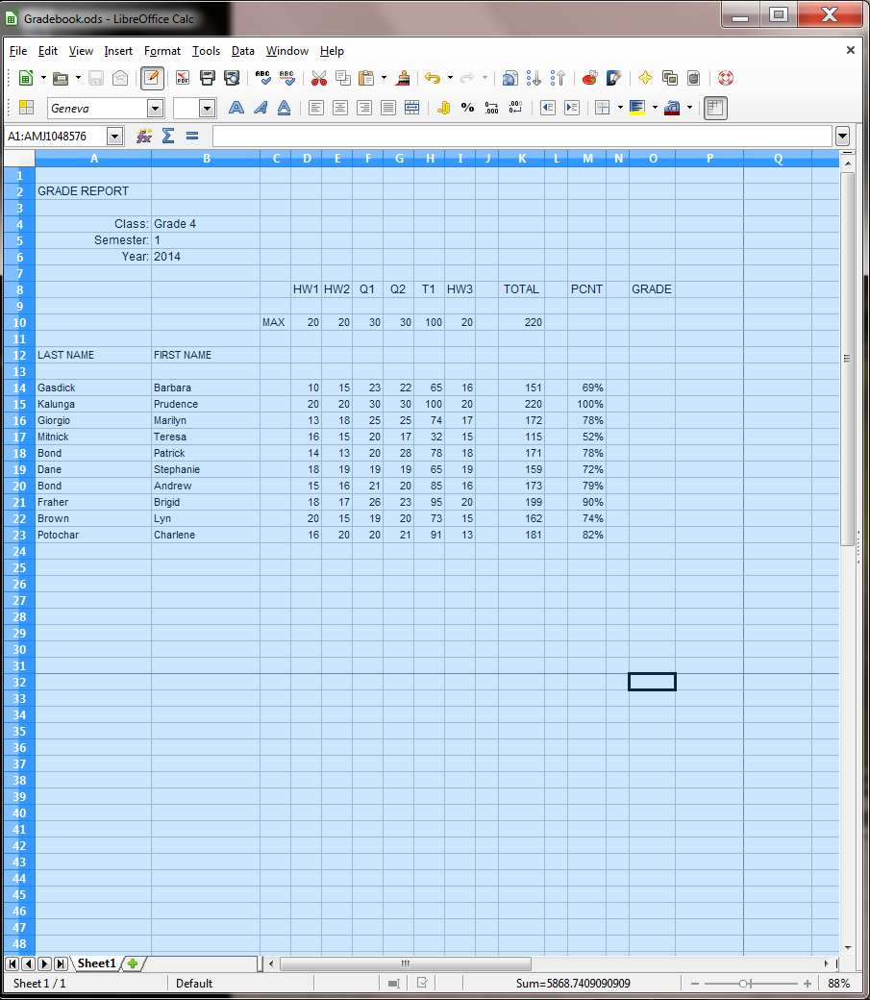

Fig. 5.2 Selecting an entire spreadsheet

The entire spreadsheet is now highlighted. However, perhaps you want to
select only the cells that you're working in. There are a couple of ways
to do this.

> Click anywhere in the spreadsheet to **de-select** the selected cells
>
> Now, starting at **cell A1**, use the mouse to **drag diagonally
> down** from cell **A1** to cell **O24**

That's one way. Here’s another way of doing the same thing.

> Click anywhere to **de-select** the selected cells then click in cell
> **A1**, hold down the **Shift** key, and click in cell **O24**

The same set of cells is selected. The *Shift key* is very useful for
selecting an especially large range of *cells* in *Calc*, or a range of
*text* in *Writer*, or even a range of *slides* in *Impress*, which
you'll learn about soon enough. Dragging with the mouse can get tedious
and error prone when you have to select hundreds or thousands of
adjacent cells, dozens of pages, or scores of slides. Remember this
*Shift key* trick.

*Going to a specific cell anywhere in a spreadsheet*

If you are working in a large spreadsheet (consisting of thousands of
cells, say) and you know the approximate coordinates of a cell you want
to find, it is sometimes quicker to let *Calc* find the cell for you.
The following simple steps will show you how to make the cell that
intersects *Column AJ and Row 423*—a location quite deep inside the
spreadsheet—the current (or selected) cell.

> Click again in the **small box** right **above** the **Row headings**
> and to the **left** of the **Column headings** (Fig. 5.1 on the
> previous page), type **AJ423** (you can use either upper case (AJ) or
> lower case (aj) for the column coordinate), then click on **OK**

There you go! Remember that the first (alphabetic) coordinate (AJ) is
always the column; the second (numerical) coordinate is always the Row.

> Click again in the **small box** right **above** the **Row headings**
> and to the **left** of the **Column headings** (Fig. 5.2 on the
> previous page), then type **A1**, and click on **OK**

You are now back at the first cell (A1) in the spreadsheet. Some of the
options for moving about the spreadsheet are considerably slower than
others, which is why you should take the time to familiarize yourself
with *all* the different methods for moving around the spreadsheet,
especially if you become a regular user of *Calc*.

**5.3 Updating an existing spreadsheet**

The Gradebook would benefit from some cosmetic changes, such as the
following.

> 1\. There should be **double lines** to set off different parts of the
> spreadsheet. It is often useful, for example, to include extra space
> (but not too much space) between the headings above the columns of data
> and the data itself, and also before summary totals at the bottom of
> columns of data.
>
> 2\. It would be useful to include **more formulas** to increase the
> information content of the spreadsheet. For example, you could add a
> formula that calculates an *average* for each of the sets of grades so
> that your students can see where they stand in relation to the rest of
> the class on any particular assignment or test. A *highest score* and
> *lowest score* for each set of grades would also be useful.
>
> 3\. It would be a good idea to **protect cells** containing data that you
> consider especially important. Protecting cells prevents you or someone
> else from accidentally losing or changing cell contents. It takes time
> to put together spreadsheet templates and other documents. Some cells
> will contain functions that are tricky to figure out. Protecting them
> will make it difficult to lose your work.
>
> 4\. Finally, *Calc* can do some of the thinking for you if you include a
> **LOOKUP Table** to figure out the *Letter grades* for your students
> based on their percentage score at the end of a reporting period.

Let's deal with these problems one at a time. In this section you'll
learn how to handle the first three improvements. Later in the lesson
you’ll have the opportunity to learn how to create and use the LOOKUP
function.

**Dividing up the spreadsheet to make it easier to read**

After you have fixed change \#1, the Gradebook will look similar to Fig.
5.3.

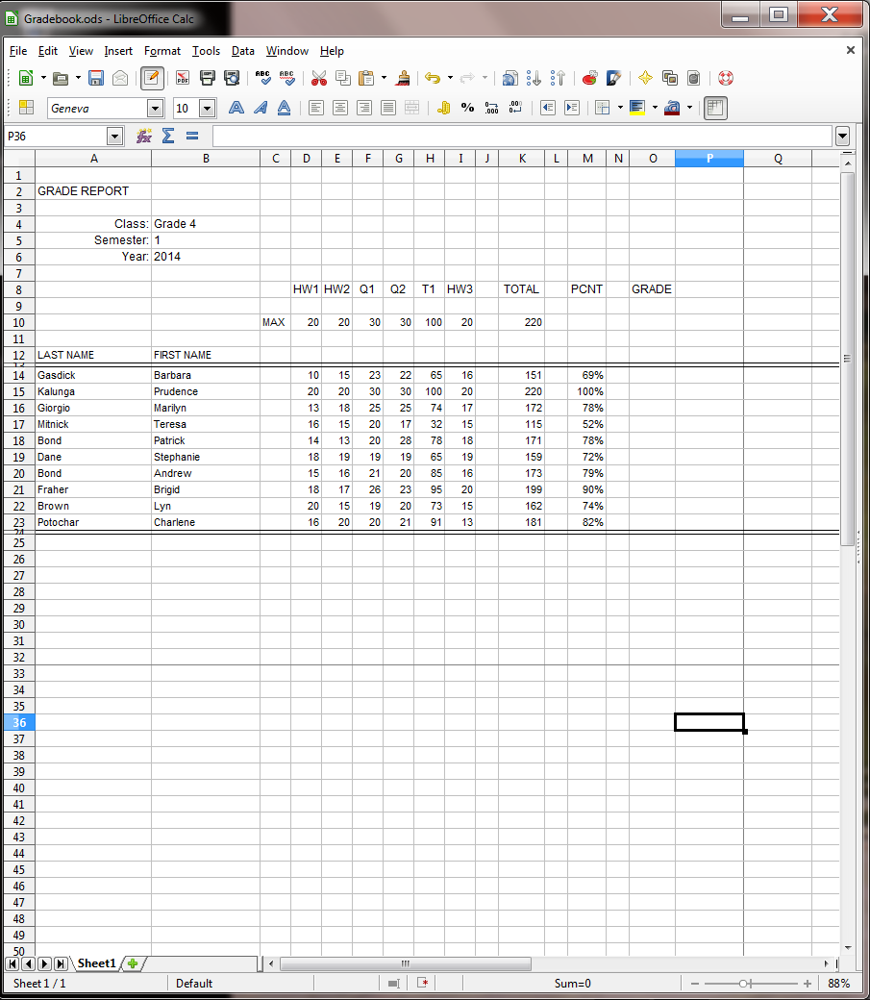

Fig. 5.3 Gradebook after update \#1

Breaks between sections of a spreadsheet help the eye locate important
data when scanning the page, whether on screen or on paper. In *Calc*,
the easiest way to do this is to use an extra row or column at the point
where you want to create a division between different parts of the
spreadsheet, and then put a *border* along the edges of the empty row
and also *reduce the width* of the inserted row or column so it appears
as a double line (Fig. 5.3 above).

Here are steps to update the spreadsheet along these lines.

> On the left edge of the screen, in **row** **13**, click on the **row
> number (13)** to select the entire empty row

First you want to put a border around the set of cells in Row 13.

> **Right click** on the **Row number 13** and, in the context menu,
> select **Format Cells...**
>
> In the **Format Cells** dialog box click on the **Borders** tab, then
> click on the tool to **Set Outer Border Only** (Fig. 5.4), and click
> **OK**

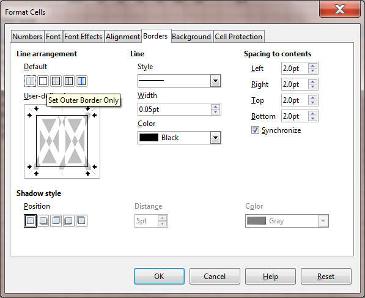

Fig. 5.4 Putting a border around a row of cells

Now you want to reduce the *row height* so the whole row looks like a
double line separating Rows 12 and 14.

> **Right click** again on the **Row Number** **13** and, in the context
> menu, select **Row Height...**, then in the **Row Height** dialog box
> type the value **0.05”** to replace the default height, and click
> **OK**

You need to create a similar dividing line after Row 23, which holds the
data for the last student.

> **Right click** on **Row number 24** and, in the context menu, select
> **Format Cells...**, then in the **Format Cells** dialog box click on
> the **Borders** tab, then click on the **Set outer border only** tool
> (Fig. 5.4), and click **OK**
>
> **Right click** on **Row Number** **24** and, in the context menu,
> select **Row Height...**, then in the **Row Height** dialog box type
> **0.05”**, in the **Shadow style** section click on the **first (no
> shadow)** button, and click **OK**, then **save** your work
> (**Ctrl-s**)

**Adding functions to the spreadsheet**

*Calc* comes with many built-in functions. Let’s look at some of these
built-in functions so that you know how to find them when you need them.

> Start this exercise by clicking in cell **A1**, then, in the **Formula
> Bar**, click on the **Function Wizard** tool (Fig. 5.5)

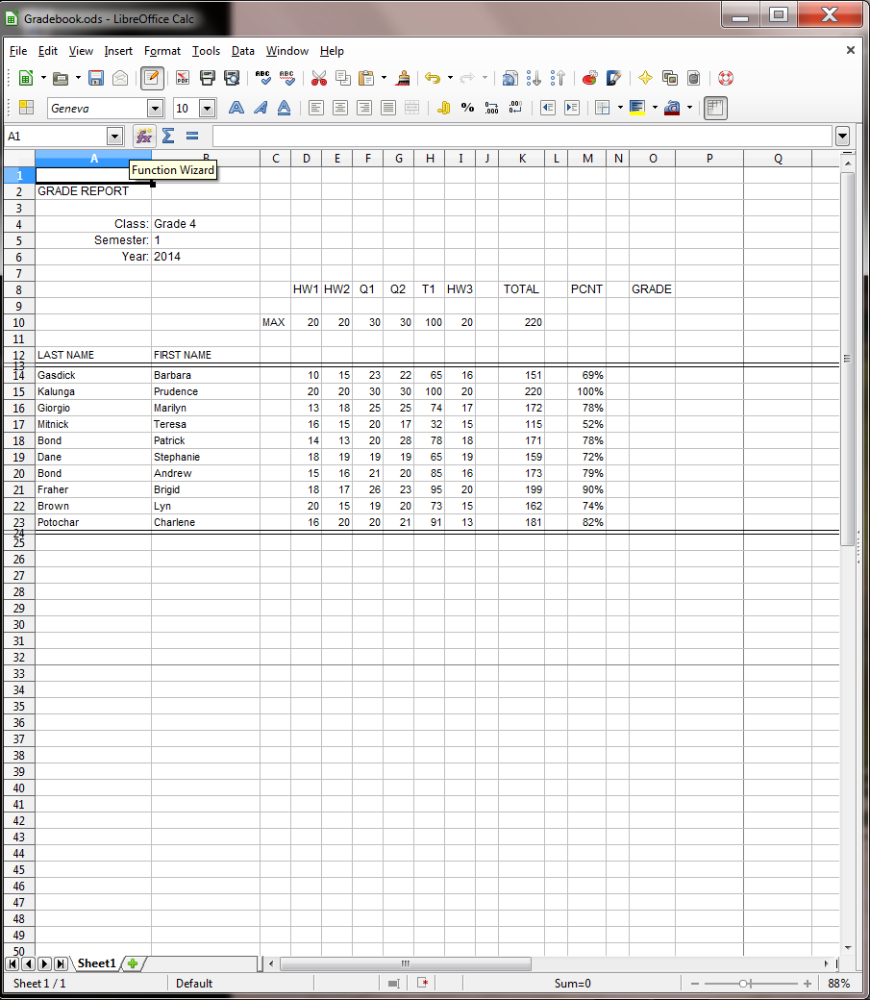

Fig. 5.5 The Function Wizard tool in the Formula Bar

> Clicking on the **Function Wizard tool** will bring up the **Function
> Wizard dialog box** (Fig. 5.6)

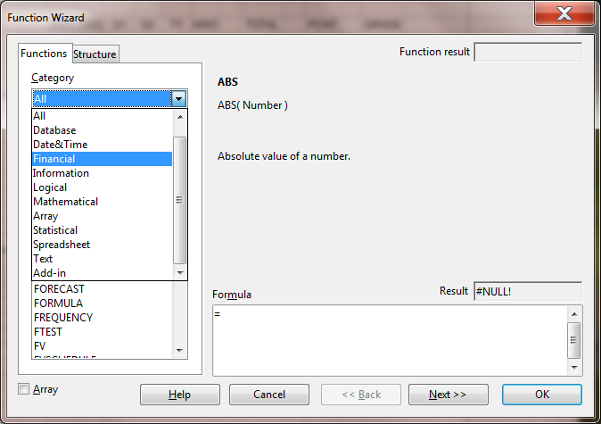

Fig. 5.6 The Function Wizard dialog box

> In the **Category** **section**, click on the **down arrow** to bring
> up the various **Categories of Functions** available in *LibreOffice*
>
> Select the **Financial** category (Fig. 5.6), then, in the **Function
> section** of the dialog box, check out the **several dozen Financial
> functions** available to you there
>
> Do the same with the *Calc* **Database**, **Date&Time**,
> **Information**, **Logical**, **Mathematical**, **Statistical**,
> **Spreadsheet**, and **Text** sets of **built-in Functions**
>
> Click on the **Cancel** button to close the **Function Wizard** dialog
> box

You are going to add three new functions to the Gradebook: the
*Average*, the *Max*, and the *Min* functions. Let’s start with the
*Average* function, which will calculate the *average score* for a set
of student scores.

**Calculating an average for each of the Grade columns **

In Row 25 of the Gradebook spreadsheet, at the bottom of each of the
columns that contain scores for homework, etc., you are going to put the
value representing the *average* of the scores for each of the columns,
as illustrated in Fig. 5.7.

Fig. 5.7 Average scores for each column

Notice, in Fig. 5.7, that cell B25, right under the column of first
names, has the row label *Average*. You need to put the same cell entry
in your Gradebook.

> Select cell **B25**, type the label **Average**, and press **Tab**
> **twice** to move to cell **D25**

**A word about automatic calculation**

When **Auto**matic **Calc**ulation is switched on, *Calc* immediately
carries out any calculations that are necessary when you make any
changes to the data in the spreadsheet.

With automatic calculation, you don't have to remember to do this. If
*Automatic Calculation* is not already on by default, it will be good
for you to turn it on, so here’s how you do this.

> In the **Tools menu** > **Cell Contents…**, check, in the **Cell
> Contents sub menu**, that there is a **check mark** next to
> **AutoCalculate** (Fig. 5.8)

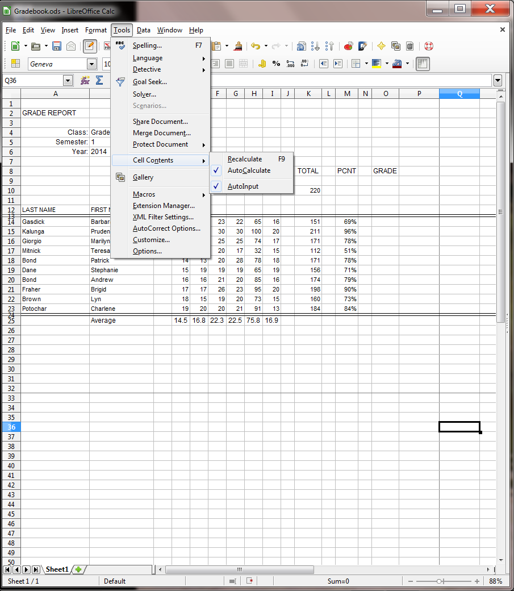

Fig. 5.8 Automatic Calculation

*Back to the task at hand*

An average is computed by *adding* (SUMming) the set of scores for an
assignment or test, and then *dividing the total by the number of scores
in the set*. You *could* put together this formula yourself, of course.
If you know what the formula would be for the first column of scores,
write it in the box below. Remember, a function or formula always begins
with the equals (=) sign.

Check the footnote below to see if you got the answer right[^1]. But
since *Calc* has a built-in Average function, you may as well use it.
Here are the steps to include the Average function in your spreadsheet.

> Make sure cell **D25** is still selected (the cell under the first
> column of scores), then click on the **Function Wizard (*fx) ***icon
> in the **data entry** bar and, in the **Function Wizard dialog box**,
> from the list of **Categories**, select the **Statistical** category
> (Fig. 5.9) and, from the list of **Statistical functions**, **double
> click** on the **AVERAGE** function to select it

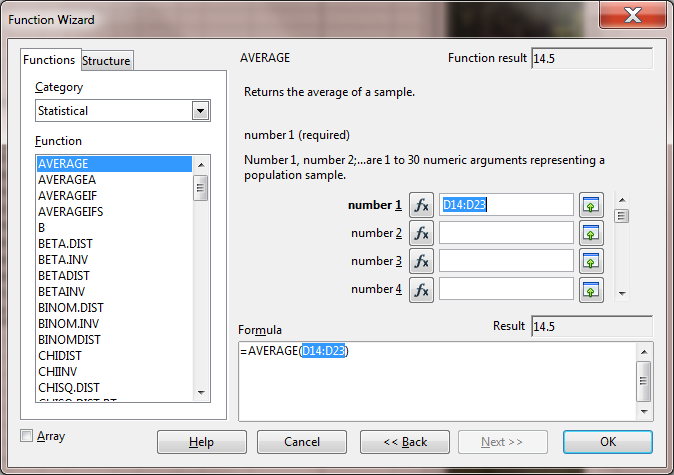

Fig. 5.9 The Insert Function dialog box showing the Statistical category
of Functions

*Calc* pastes the function into the Formula area of the dialog box,
followed by a set of empty brackets. The brackets are for the set of
cells that contain the scores that are to be averaged. Notice that the
cursor is waiting between the brackets for you to select that set of
cells.

> Type **D14:D23** (Fig. 5.9) then click on **OK**

Alternatively, you could use the mouse to drag down the set of cells
from D14 to D23 with the same result. Look at the data entry bar at the
top of the spreadsheet and notice that the formula *=AVERAGE (D14:D23)*
is copied there, too.

Now look at cell **D25**. It should contain the average for the scores
in Column D. At this stage there are three problems that can occur:

> 1\. If you see a series of *pound signs* (\#\#\#\#\#), this indicates
> that there’s not enough room in the column to show the value, so you
> will need to *widen* the column a little to make enough space for the
> average score to appear. If this is the case (where you see \#\#\#\#\#
> instead of an average score), make the column wider.
>
> 2\. If a *Bad Formula* prompt pops up on the screen, check the formula in
> the entry bar again, compare it to the correct Average formula
> **=AVERAGE(D14:D23)**, and make any corrections.
>
> 3\. It is always possible that the values being averaged yield a result
> that turns out to be a whole number (no fractions). But it would be
> useful to show at least one decimal place, regardless of the outcome of
> the Average calculation. If the average displayed in your Gradebook is
> rounded to a whole number (no decimal places), here are the steps to
> change the precision of the Average value to 1 decimal place.
>
> In the **Format menu** select **Cells…** and in the **Format Cells**
> dialog box > **Options area**, make sure that the number of
> **Decimal places** is set to **1**

Assuming all is well, your next task will be to copy this *Average
formula* into the cells immediately to the right of *cell D25*, so that
you have an average score under the other columns of scores (cells E25
through I25).

> Cell **D25** should still be selected (click on it if it is not
> selected)

Fig. 5.10 shows you that you’re going to use the mouse to grab hold of
the Fill handle in the lower right corner of cell **D25** (you practiced
doing this in Lesson 4) and drag it to the right to cell I25.

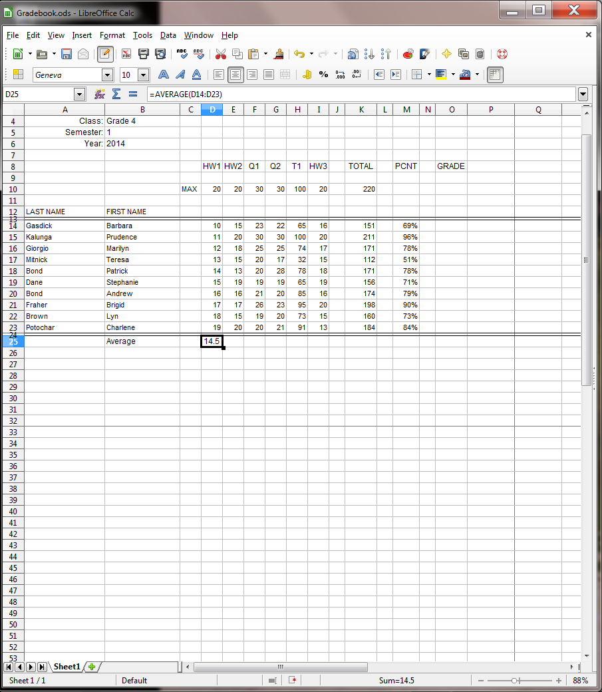

Fig. 5.10 Cell Fill handle

> Use the mouse to point at the **handle** in the **lower right** corner
> of cell **D25 (**Fig. 5.10), and drag the handle across to **Column
> I**—so that the formula is copied across to cells **E25**, **F25**,
> **G25**, **H25**, and **I25**, which will all now have the correct
> Average score for their respective columns

That's all there is to it. If necessary (though it shouldn’t be the case
with this exercise) adjust the column widths if you see pound signs
(\#\#\#\#\#) in any cell instead of averages.

> Time to save all your hard work (**Ctrl-s)**

**Displaying the Highest (MAX) and Lowest (MIN) scores for each column
of scores**

Now that you know how to use the Insert Function icon (***fx***) next to
the Data Entry bar, and in particular since you just used it to put the
Average function in your spreadsheet, you should be able to complete the
exercise that follows without much help.

> In cell **B26** put the heading **Max score** and in cell **B27** put
> the heading **Min score**
>
> Make sure cell **D26** is selected (the cell under the first Average
> calculation), then click on the **Function Wizard (*fx) ***icon in the
> **data entry** bar and, in the **Function Wizard dialog box**, from
> the list of **Categories**, select the **Statistical** category (Fig.
> 5.9 on page 139)
>
> From the list of **Statistical functions**, **double click** on the
> **MAX** function to select it

*Calc* again pastes the function into the *Formula area* of the dialog
box, followed by a set of empty brackets. The brackets are for the set
of cells that contain the scores that are to be averaged. Notice that
the cursor is waiting between the brackets for you to select that set of
cells.

> Type **D14:D23** (Fig. 5.9—p. 139) then click on **OK**

In the data entry bar at the top of the spreadsheet notice that the
formula *=MAX (D14:D23)* is copied there, too. Now look at cell **D26**.
It should contain the maximum score in Column D.

> Now make sure cell **D27** is selected (the cell where you’re going to
> put the MIN formula), then click on the **Function Wizard (*fx)
> ***icon in the **data entry** bar
>
> In the **Function Wizard dialog box**, from the list of
> **Categories**, select the **Statistical** category (Fig. 5.9 on page
> 139)
>
> From the list of **Statistical functions**, **double click** on the
> **MIN** function

*Calc* again pastes the function into the *Formula area* of the dialog
box, followed by a set of empty brackets. The brackets are for the set
of cells that contain the scores that are to be averaged. Notice again
that the cursor is waiting between the brackets for you to select that
set of cells.

> Type **D14:D23** (Fig. 5.9—p. 139) then click on **OK**

Look at the data entry bar at the top of the spreadsheet and notice that
the formula *=MIN (D14:D23)* is copied there, too. Now look at cell
**D27**. It should contain the maximum score in Column D. Check to
confirm that that is indeed the case.

At this stage, the last task is to copy the Functions across to the
other cells in rows 26 and 27. You probably already know how to do this,
but here are the steps in case you need help.

> With **cell D26** selected, grab hold of the **Fill** **handle** in
> the **lower right corner** of the cell and **drag across** to the
> **right** to select cells **E26 through I26**—the cells in which you
> want to include the **Max** function, and click **OK**
>
> Now, click on **cell D27**, grab hold of the **handle** in the **lower
> right corner** of the cell and **drag across** to the **right** to
> select cells **E27 through I27**—the cells in which you want to
> include the **Min** function, and click **OK**
>
> Better **Save** your work (**Ctrl-s**)

When you're done, your spreadsheet should look much the same as Fig.
5.11.

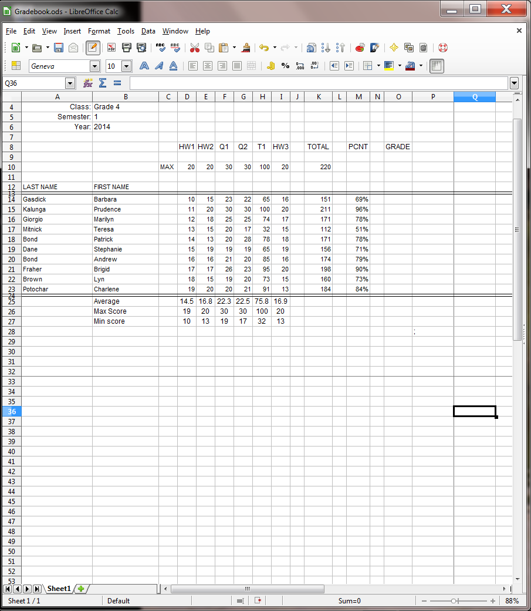

Fig. 5.11 The Gradebook after adding the functions (your data will be
different)

**Protecting (locking) important cells**

*Calc* allows you to protect the contents of a cell or cells. This means
that neither you nor anyone else will be able to change the contents
unless you remove the protection. This feature is useful to prevent
accidental loss of data, and will also help prevent others from
interfering with the data you have collected.

Since all the data in a Grade book are important, it would be a good
idea to protect everything. The process to do this is the same as if you
were protecting a single cell, or a few cells, except that you select
every cell.

> Press **Ctrl-a** to **Select All** the cells in the spreadsheet then,
> from the **Tools menu** > **Protect Document**, click to put a
> check mark in the box next to **Sheet** —to select protection for the
> sheet (Fig. 5.12)

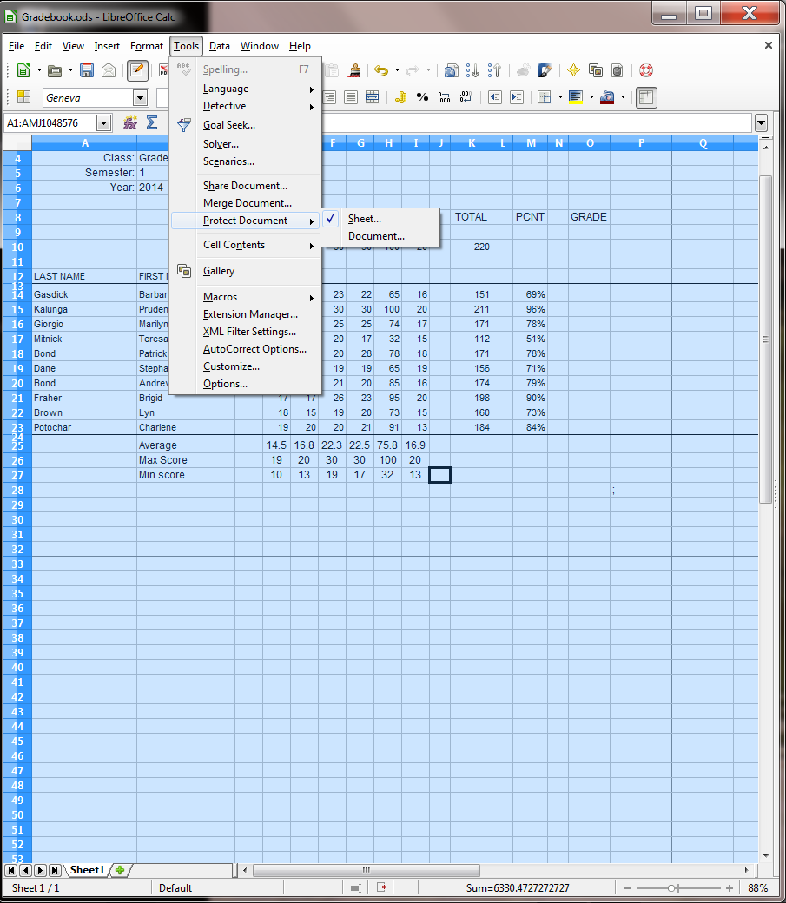

Fig. 5.12 Protecting the spreadsheet data

This brings up the *Protect Sheet* dialog box (Fig. 5.13).

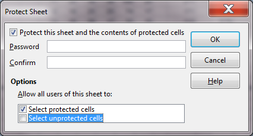

Fig. 5.13 Protect Sheet dialog box

Take a look at this dialog box. Notice that the option to “Protect this
sheet and the contents of protected cells” is checked by default, which
is fine because that’s what you want to do. Notice, too, that you have
the option to include a *password* for the protection, which would be
important if this were a real world spreadsheet. But for the sake of
this exercise, we’ll not use a password.

But you *do* need to remove the check mark next to *Select unprotected
cells*. This is because you have opted to protect *every* cell in the
spreadsheet.

> So, click to **remove** the **check mark** next to **Select
> unprotected cells**, then click on **OK**

Now, even if you try to click on a cell, the system won’t let you. Every
cell in the spreadsheet is protected against unwarranted attack.

**Password protection**

Of course, someone who knows how to use *Calc* will know how to unlock
the protection—unless it’s protected by a password, of course. So if you
really want to prevent someone else from messing with the data in the
spreadsheet, you may need to take advantage of the option to include a
password.

This is a necessary feature if you want to lock the cells in your
spreadsheet in a way that prevents others from changing data you have
stored in the spreadsheet, such as scores or grades.

Passwords provide protection against unauthorized access. Choose a
password carefully; one that would be difficult to guess, of course, but
also one that you would be sure to remember! The weirder the password
the better—it should include upper case letters as well as numbers and
special characters such as the @ symbol or whatever. Remember, the
weirder your password the better—as long as you can remember it.
However, there’s no need to use a password in this exercise unless you
want to, of course.

Now all the cells in the Gradebook spreadsheet are unable to be changed
unless, in the *Tools menu > Protect Document*, you remove the check
mark next to *Sheet* in the sub menu.

> Time to **Save** the changes to the Gradebook (**Ctrl-s**)

**Dividing the spreadsheet into panes**

Often a spreadsheet will be too long or too wide to view all the data at
once on the screen. For this purpose, *Calc* has a useful feature
(*Split*), which allows you to compare separate parts of a sheet
side-by-side. You can split any window horizontally and vertically into
sections (or Panes—like window panes). This allows you, while working or
scrolling in one section, to keep other section(s) fixed in place. This
applies whether the spreadsheet is protected or not.

> To see how this works, first click in cell **P28** to give *Calc* a
> pivot for the split screen, then in the **Window menu** select
> **Split**

*Calc* immediately divides up the worksheet into four sections, using a
vertical and a horizontal split bar (Fig. 5.14).

Fig. 5.14 *Calc*’s vertical and horizontal split bars

The split bars are grey so not that obvious, especially with other cell
lines all over the place, but look carefully and you’ll see them well
enough.

The vertical and horizontal split occurs at the point in the spreadsheet
where you have a cell selected. You can change the position of the split
bars by positioning the mouse arrow on a split bar and dragging across
or down the screen. Try this for practice

> Position the mouse arrow on either the vertical or horizontal **split
> bar** (you'll get a **cross-hair cursor**) and drag across or down the
> screen
>
> Now grab each of the **scroll bars** and check out the data in each of
> the four panes

Notice how easy it is to compare different parts of a spreadsheet in
this way.

> Finally, in the **Window menu** select **Split** again to **turn off**
> the panes option

**5.4 mAKING changes to the look of the spreadsheet**

In Lesson 4 you learned how to change the width of columns and the
height of rows. Now you are going to learn how to put borders around
selected cells and how to remove the grid lines and column and row
headings.

**Putting a border around a cell or set of cells**

Before you can make any changes, you need to remove Protection from the
worksheet. Let’s do that before proceeding with the tutorial.

> In the **Tools menu** select **Protect Document** and in the **sub
> menu** select **Sheet** to **remove the check mark** there, thus
> **removing Protection** on the **Gradebook** sheet

Now let’s make some more changes to the Gradebook. For example, you may
want to put a box around certain sections of your spreadsheet, such as
the Class info in cells A4 through B6. This will make the information
stand out on the sheet. Try this now.

> Drag across the six cells **A4 through B6** to select the set of
> **Class info**, then, in the **Format menu** select **Cells…** to
> bring up the **Format Cells** dialog box (Fig. 5.15)

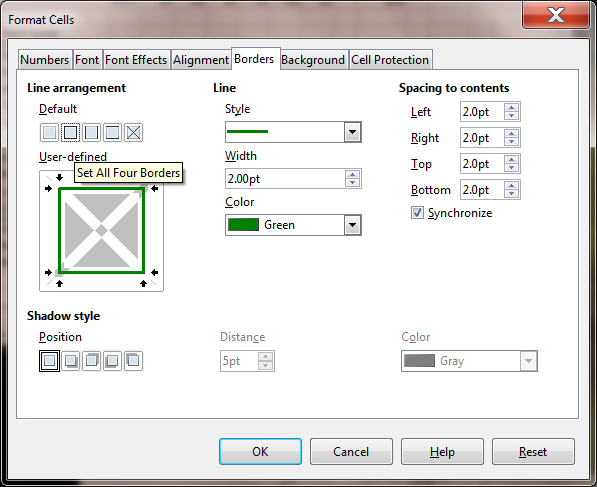

Fig. 5.15 *Calc*’s Borders options for cells or groups of cells

> In the dialog box, click on the **Borders** tab (Fig. 5.15 above)

As you can see, the Borders dialog box gives you various options.

> In the **Line Arrangement** section, click on the icon to **Set Outer
> Border Only** then, in the **Line** section (see Fig. 5.15 above),
> increase the **Line Width** to **2.00pt** and the **Line Color** to
> **Green**, then click on **OK**

The Class Info now has a distinctive green border around it, setting it
off from the rest of the data in the Gradebook (Fig. 5.16).

Fig. 5.16 Spreadsheet cell with border

**Removing grid lines and column and row headings**

Grid lines and column and row headings are essential when developing a
spreadsheet or when you are updating the data. But for reporting
purposes it may look better, perhaps even easier to read, if they are
removed. You may recall doing this in Lesson 4, specifically in order to
print the spreadsheet without column and row headers and gridlines.
Here, however, you want to remove the column and row headers and
gridlines in the spreadsheet as it appears on the computer screen.

> In the **View menu** select **Column and Row Headers** to remove the
> headers then, in the **Formatting toolbar**, click on the tool to
> **Toggle Grid Lines for Current Sheet** (Fig. 5.17)

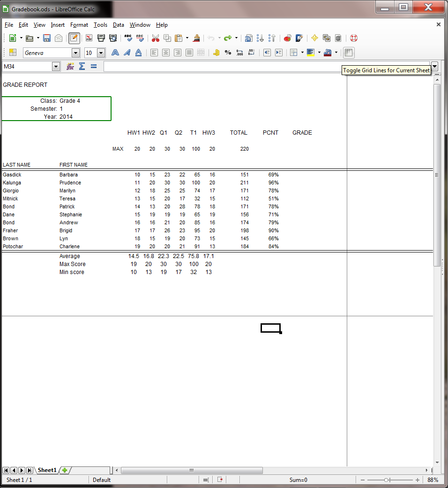

Fig. 5.17 Removing grid lines and column and row headings

No problem. The spreadsheet now looks quite different, as you can see.
For the next exercise, however, it will be best to have the Gridlines
and Headers showing in the Gradebook.

> In the **View menu** select **Column and Row Headers** again to put
> back the headers, then, in the Formatting toolbar, click on the tool
> to **Toggle Grid Lines for Current Sheet** (Fig. 5.16 on previous
> page)

**Updating the Grades Template spreadsheet**

You are now going to make the same changes to the Grades Template that
you just made to the Gradebook. To do this, it will be easiest if you
have both spreadsheets side-by-side on your screen.

> Click on **File** > **Open**, then navigate to your **disk
> drive/USB drive** > **Work Files for LibreOffice** >
> **Miscellaneous Files** > **Templates** folder and open the
> **Grades Template**

Now you should have both the Gradebook and the Grades Template open on
your screen.

> If you have a large enough screen, use the mouse to drag each window
> so they are side-by-side (Fig. 5.18)

Fig. 5.18 Spreadsheets arranged side-by-side

If you are using a computer with a smaller screen, the two spreadsheets
can be layered on top of one another and you can toggle back and forth
using the Window menu (Fig. 5.19).

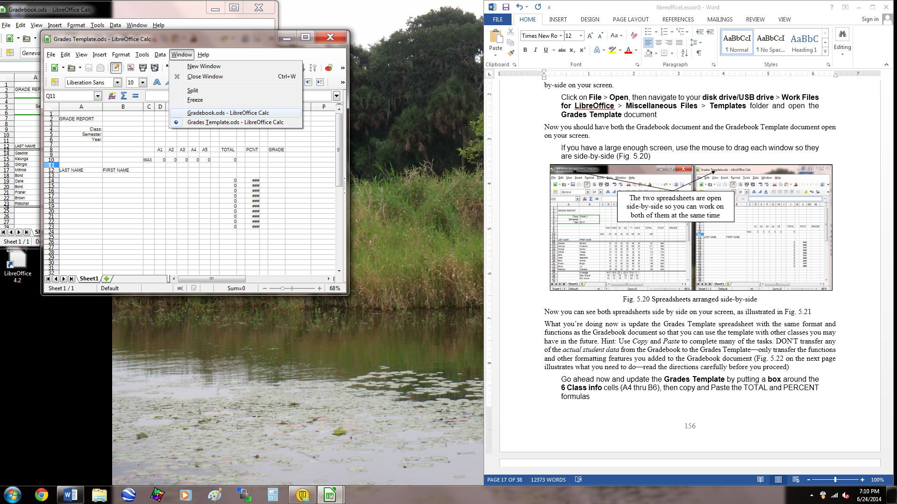

Fig. 5.19 Using the Window menu to toggle back and forth between
spreadsheets

What you’re going to do now is update the Grades Template spreadsheet
with the same format and functions as the Gradebook spreadsheet so that
you could use the template in the future.

Hint: Use *Copy* and *Paste* to complete many of the tasks. DON'T
transfer any of the *actual student data* from the Gradebook to the
Grades Template—only transfer the functions and other formatting
features you added to the Gradebook.

Fig. 5.20 illustrates what you need to do—read the directions carefully
before you proceed.

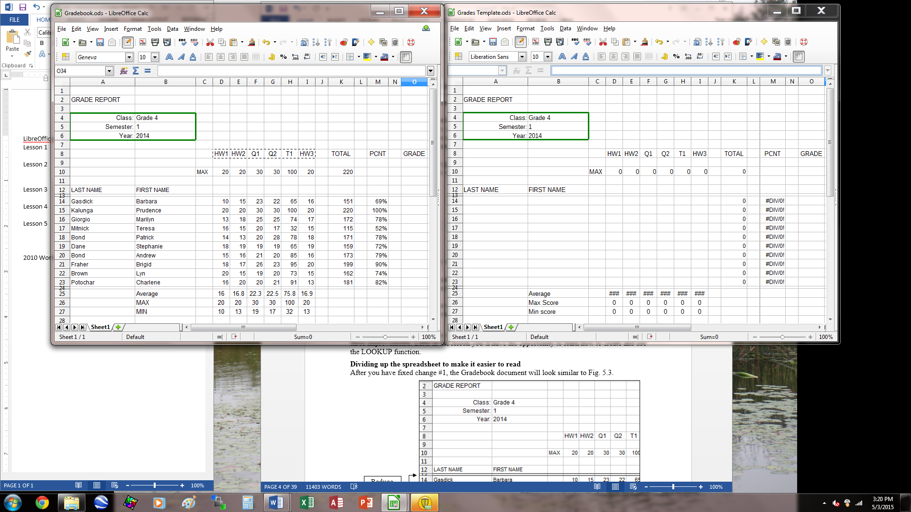

Fig. 5.20 Making updates to the Template

> Go ahead now and update the **Grades Template** by putting a **box**
> around the **6 Class info** cells (A4 thru B6), then **Copy** and
> **Paste** the columns of **TOTAL** and **PERCENT** formulas (

When you are done, your Grades Template spreadsheet will look like Fig.
5.21.

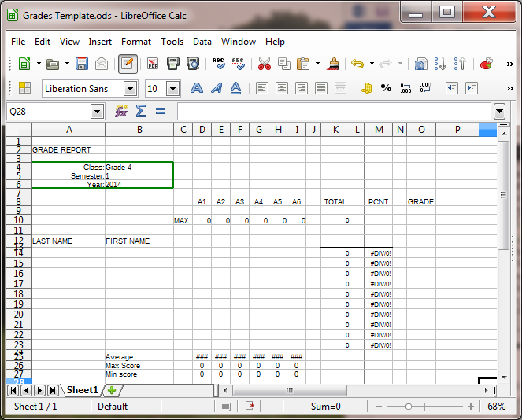

Fig. 5.21 Grades Template spreadsheet after updates

> Save the **Grades Template** when you have finished making the changes

Your next task is to once again protect the cells in the Gradebook
spreadsheet and also reset the protection on the worksheet. First you
must make the Gradebook the active document on the screen.

> In the **Window menu**, click on the **Gradebook.ods** so as to make
> this the current spreadsheet on the Desktop

Now you can go ahead and protect the Gradebook spreadsheet.

> Press **Ctrl-a** to **Select All** the cells in the spreadsheet (this
> is the quickest way to select all the cells in the spreadsheet, but
> you may recall that you can also click in the small box in the top
> left corner of the row and column headings)
>
> From the **Tools menu** select **Protect Document** and click
> **Sheet…** in the sub menu
>
> In the **Protect Sheet dialog box** that pops up, click to remove the
> check mark next to **Select unprotected cells** (see Figs. 5.12 and
> 5.13 on pages 142 and 143) then click on **OK**, and **Save** your
> work

It might be a good idea to take a break at this point in the tutorial.
But if have time, and you feel up to it, proceed directly to the next
section, Section 5.5, on the next page, and learn all about the LOOKUP
function.

**Time for a break?**

**FEEL FREE TO TAKE ONE…**

**THIS MIGHT BE ENOUGH FOR TODAY!**

**\
5.5 USING the Lookup function**

**The concept of the LOOKUP function**

The LOOKUP function is a simple logic tool that you can use to
automatically assign grades to students based on the numbers in the
Percentage column of your spreadsheet (column **L**).

You are probably aware by now that if you have the *automatic
calculation* option selected, *Calc* carries out function-based
calculations as you make changes in a spreadsheet. Thus, once you have
programmed *Calc* to LOOKUP the grades, the system will automatically
update each student's Letter Grade, along with Totals and Percentages,
even as you enter new scores for assignments, homework, tests, and so
forth.

Thus, with no effort on your part, you will be able to keep students
informed at any time during the semester as to exactly what grade they
currently carry for the class.

Fig. 5.2 illustrates the LOOKUP Table that will be the outcome of this
exercise.

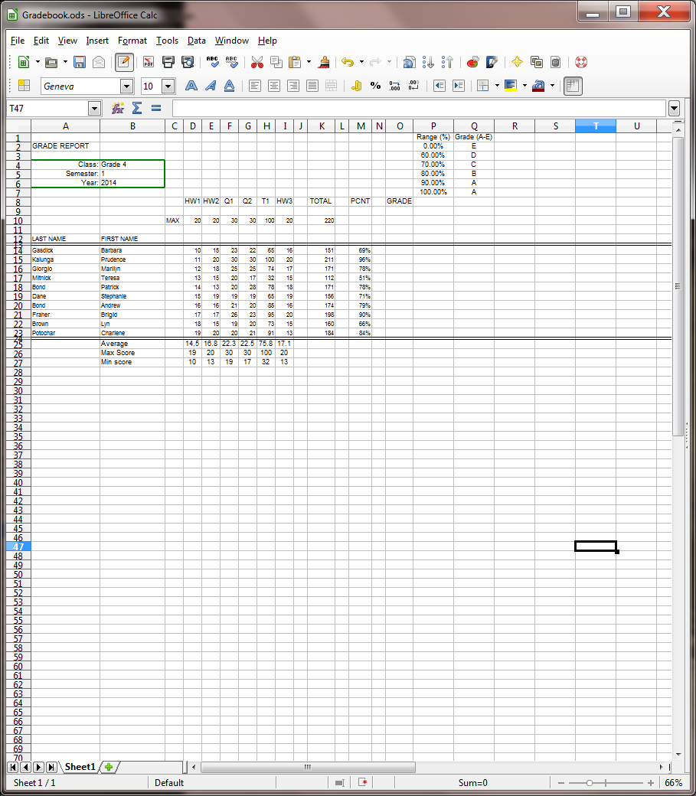

Fig. 5.22 LOOKUP table

You are going to tell *Calc* to compare a student's percentage with the
range of values in the first column of the table. These are control
percentages. *Calc* will search through this first column, looking for
the highest value (percentage) that is *less than or equal to* the
student's percentage. Once that value is located in the first column,
the function will assign the student the letter grade that is adjacent
to it in the second column.

Does that make sense? An example will help. Suppose the student's
percentage is 87%. Well, in the table above, the *highest* value in the
first column that is still *less than or equal to* 87% is 80%, is it
not? 70%, 60%, and 0% are less than or equal to 87%, but they are not
the *highest* value that is less than or equal to 87%. So 80% is the
value that *Calc* will select from the Range column in its LOOKUP of the
table. The letter grade from the corresponding cell in the second
column—in this case a "B"—will then be posted to the **GRADE** column of
the Gradebook.

Once you understand the concept of "the highest value less than or equal
to another number", the rest is easy. Here are a few student percentages
to try for yourself. Complete the exercise that follows.

From Fig. 5.22 above:

> What is the highest value less than or equal to 45%, and what is the
> resulting letter grade?\_\_\_\_\_\_\_\_\_\_\_\_\_
>
> What is the highest value less than or equal to 67%, and what is the
> resulting letter grade?\_\_\_\_\_\_\_\_\_\_\_\_\_
>
> What is the highest value less than or equal to 59%, and what is the
> resulting letter grade?\_\_\_\_\_\_\_\_\_\_\_\_\_
>
> What is the highest value less than or equal to 100%, and what’s the
> resulting letter grade?\_\_\_\_\_\_\_\_\_\_\_\_\_

The answers are in the footnote at the bottom of the page.[^2]

There are two parts to incorporating the *Calc* LOOKUP function into
your Gradebook. First you must build the LOOKUP Table into the
spreadsheet. Second you must enter into the appropriate cells the LOOKUP
function that will instruct *Calc* to carry out the LOOKUP operation.

**Building the LOOKUP Table**

> You’ll need both the **Gradebook** (which you saved in the **Data
> Files** folder in the **Spreadsheet Documents** folder) and the
> **Grades Template** (which you also saved in the **Data Files** folder
> in the **Spreadsheet Documents** folder) to complete the remainder of
> this tutorial, so if these documents are not already open, open them
> both now from your **Work Files for LibreOffice** folder before
> proceeding
>
> Next, in the **Window menu** select the **Gradebook**, if it is not
> already the active window on the screen

Since all the cells are protected in the Gradebook, you’ll need to
unlock them first in order to make changes.

> From the **Tools menu** select **Protect Document**, then make sure,
> in the sub menu, that there is **no check mark** next to **Sheet**

Now, let’s build the Lookup table that’s illustrated in Fig. 5.22 above
(page 150). The first column of the LOOKUP Table (the lookup vector) has
a set of numbers which *Calc* calls the *Search vector*.

A vector is just another name for a single column of numbers. The
*Search vector* contains the set of values against which *Calc* compares
the data from a selected cell in the Gradebook.

Let’s create this column (vector) of the LOOKUP table first. As you work
your way through this exercise, be sure to hit the *number* 0 (zero),
NOT the *letter* O; they are so close together on the keyboard that some
students hit the wrong character by mistake.

> Select cell **P1** and type the column header **Range (%)** then press
> **Enter** to move down to cell **P2**
>
> Type **0** (the number zero (0) that is) in cell **P2** and press
> **Enter** to move down to cell **P3**
>
> Type **0.6** (this is equivalent to 60% in mathematical terms) and
> press **Enter** again to select cell **P4**
>
> Type **0.7** and press **Enter** to make **P5** the current cell
>
> Type **0.8** and press **Enter** once more
>
> Type **0.9** in cell **P6** and press **Enter** again to make **P7**
> the current cell
>
> Finally type **1** (this is equivalent to 100%
> in mathematical terms) and click on the **Accept** ( ) button

Now you need to change the cell attributes of this first column of the
table so as to display the numbers in *percent* form (with the percent
(%) symbol). You did this before in Lesson 4, so the following is just a
reminder of how to do this.

> Drag down to highlight **all 6** of the values from cell **P2** to
> cell **P7**
>
> In the **Formatting toolbar** click on the **% (Percent)** symbol to
> change the format of the decimal numbers to percentages

That completes the first column of the table. Now for the second column
with the letter grades—what *Calc* calls the *result vector*. The
*result vector* contains the values which *Calc* returns to the
Gradebook cell which contains the formula which calls on (references)
the LOOKUP function.

> Select cell **Q1** and type the header **Grade (A-E)**, then press
> **Enter** to move down to cell **Q2**
>
> Type the letter **E** (or whatever you would use for a failing grade)
> and press **Enter** to go to cell **Q3**
>
> Type a **D** and move down to cell **Q4**, then type a **C** and move
> down to cell **Q5**
>
> Type a **B** and move on down to cell **Q6**, then type an **A** and
> move down to cell **Q7**
>
> Finally type an **A** again in cell **Q7** and
> click on the **Accept** ( ) **button**

The table is now almost ready for use. One more cosmetic adjustment will
improve its appearance.

> Select the complete **LOOKUP table** in columns **P** and **Q** by
> dragging across the **column headers** **P** and **Q** at the top of
> the columns then, in the **Home Ribbon** > **Paragraph Group**,
> click on the **Center** icon

Your LOOKUP Table should now look like Fig. 5.22 on page 150.

> **Save** all your hard work before proceeding with the tutorial

**Using the clipboard to copy cells from one document to another**

Now that you have completed the task of building the LOOKUP Table in the
Gradebook spreadsheet you should update the Grades Template along the
same lines. First you must copy the relevant cells (those used for the
LOOKUP Table) from the Gradebook spreadsheet to the clipboard and then
paste them into the Grades Template spreadsheet. Here are the steps.

> Select cell **P1** and drag down diagonally across the **LOOKUP
> Table** to cell **Q7**
>
> Press **Ctrl-c** to copy the **LOOKUP Table** to the clipboard
>
> Now switch to the **Grades Template** by **switching windows** in the
> **View Ribbon** > **Window Group** or, more simply, just clicking
> in any cell in the Grades Template
>
> In the **Grades Template**, click on cell **P1** to make it the
> current cell
>
> Press **Ctrl-v** to paste the **LOOKUP Table** from the clipboard to
> the **Grades Template**, then **Save** your work (**Ctrl-s**) once
> more

**Entering the LOOKUP function into the Grade column**

Take a moment to understand the next step in using the LOOKUP table.
Recall that the LOOKUP function instructs *Calc* to look up a table that
you have built and come back with a corresponding result to store in the
spreadsheet proper. Still confused? Maybe the following will help you
figure it out. The LOOKUP function has the following parts to it:

> **=LOOKUP(Search criterion,Search vector,result\_vector)**

Let’s examine each part of this function in order to understand how it
works.

1.  The "=" symbol at the start of the function simply tells *Calc* that
    a function or formula is in the cell, as opposed to ordinary data
    such as numbers or labels.

1.  The word **LOOKUP** tells *Calc* what task to carry out (**look**
    something **up** in a list).

1.  **Search criterion**, **Search vector**, and **result\_vector** are
    variables (control values) that *Calc* uses when it is looking up
    the table in columns P and Q:

1.  the **Search criterion** is either a number or text (such as a
    person's name); this **value** will be the "key" that *Calc* will
    use as it searches through the cells in the **Search vector** or
    column;

1.  the **Search vector** is the column of cells that *Calc* has to
    check in its lookup of the table (column P in Fig. 5.22 on page
    150);

1.  the **result\_vector** is the column of cells in which *Calc* will
    find the result of the LOOKUP operation (Column P in Fig. 5.22 on
    page 150).

Still confused? Don’t feel bad; this is definitely tricky stuff. Maybe
an example will help you understand how the Lookup function works. It
will be easiest for you to follow the next exercise if you have an
actual grade book to work with.

> The **Grades Template** and **Gradebook** spreadsheets should still be
> side-by-side on your screen, so switch back to the **Gradebook** (use
> the **Window menu** to **Switch Windows** for this or click on any
> cell in the **Gradebook**)

Make sure you have at least the LOOKUP Table (columns **P** and **Q**)
showing on the screen, as well as columns **M** thru **O** of the
Gradebook containing the PCNT and GRADE data.

> Scroll over if necessary until you have columns **M thru Q** showing
> on the screen, with the LOOKUP Table at the top of the screen (Fig.
> 5.23)

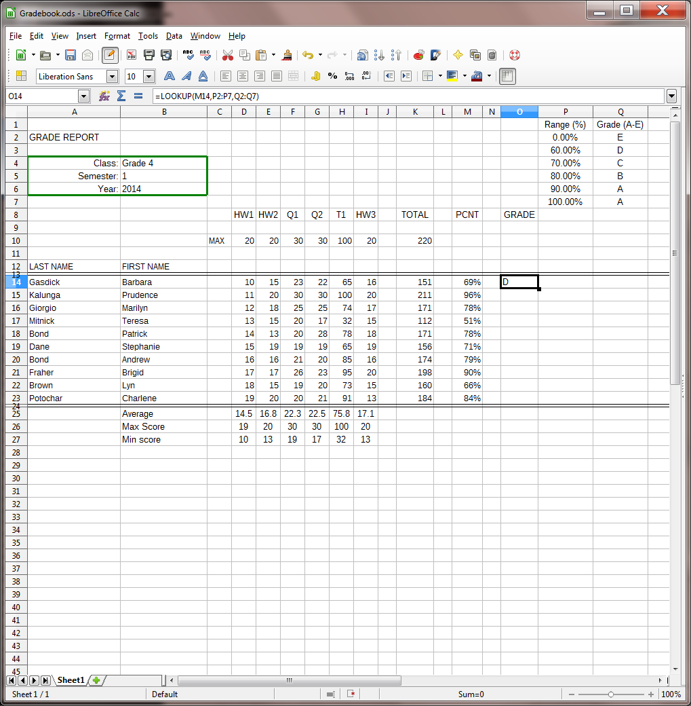

Fig. 5.23 Spreadsheet showing the Lookup Table

> Select cell **O14** (Fig. 5.23 on previous page)

This is the first cell in the GRADE column. You want *Calc* to use the
LOOKUP function to figure out the letter grade for each student and
display it in this column (Column O). So the LOOKUP function must go in
each cell of Column O.

> Click on the **Function Wizard** icon (***fx***) in the **data entry**
> bar towards the top of the spreadsheet window, then in the **Function
> Wizard** dialog box select the **Spreadsheet category** and locate and
> **double click** on the **Lookup function** to select it (Fig. 5.24)

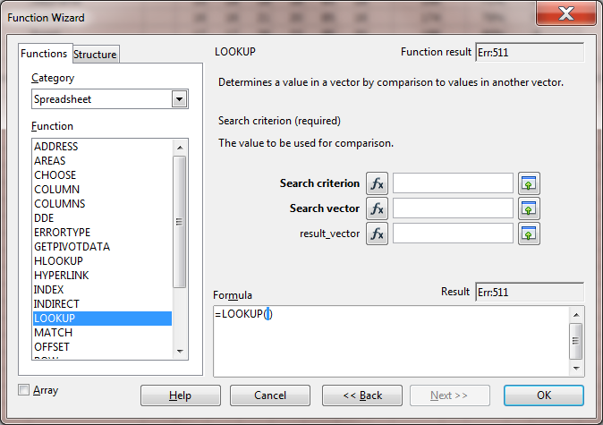

Fig. 5.24 Function Wizard dialog box before defining Lookup function
criteria

Notice in Fig. 5.24 that the cursor is positioned between the brackets
after the word =LOOKUP (**|**) in the formula area of the dialog box.
The three sets of data for the LOOKUP function will appear there as you
complete the steps that follow.

> If the **Function Wizard dialog box** is covering the cells you need
> to work with (**column M** and the **Lookup Table** in **columns P and
> Q**), slide the **Function Wizard dialog box** down and off to the
> right or left on the screen so that the dialog box is out of the way

On the *right side* of the *Function Wizard dialog box* in Fig. 5.24
above, you see three data entry boxes for the set of arguments (*Search
criterion, Search vector, result\_vector*) which you need to fill out.

In Fig. 5.25 below you see the end result of this task, with the set of
arguments (*Search criterion, Search vector, result\_vector*) filled out
relative to cell M14. Your task now is to reproduce this yourself.

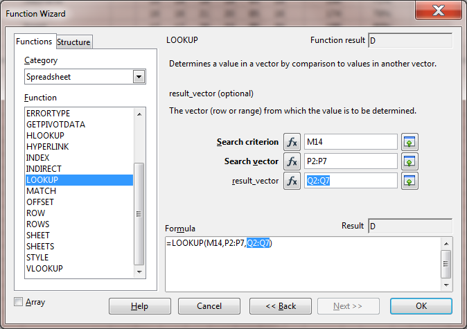

Fig. 5.25 Function Wizard dialog box showing the Spreadsheet > Lookup
function

*Entering the Search criterion in the dialog box*

Each student's Percentage will determine the Letter Grade, so the
percentage is what we want *Calc* to use as the Search criterion to find
the letter grade from the Lookup Table.

> In the **Gradebook** spreadsheet, click on cell **M14** and notice
> that **M14** is immediately entered into the **Search criterion data
> entry box** *and* also **between the brackets after =LOOKUP (|)**—you
> should now see **=LOOKUP (M14)** there

So *Calc* enters this cell's coordinates as the first of the LOOKUP
parameters, the *Search criterion*. You are telling *Calc* that it must
use this first student's percentage as the value to check against the
first column of the LOOKUP Table (cells P2 through P7).

*Entering in the Search vector*

Cells P2 through P7 are the Search vector for the LOOKUP Table.

> In the **Function wizard dialog box**, click to position the cursor in
> the **second** data entry box—the **Search vector** entry area (see
> Fig. 5.25 above)—so you can enter the cells which contain the **Search
> vector**
>
> Now, in the **Gradebook** spreadsheet, use the mouse to drag down
> **from cell P2 to cell P7**

Notice that in the data entry bar *Calc* fills in the second of the
LOOKUP parameters for the LOOKUP function, namely the *Search vector*.
It also appears between the brackets after =LOOKUP (M14,P2:P7). Check
that it also appears in the Gradebook spreadsheet in the Data entry bar,
too. You are almost done with building the LOOKUP function.

*Entering the result\_vector*

Cells Q2 through Q7 are the result\_vector for the LOOKUP Table.

> Click to put the cursor in the **third** data entry box so you can
> specify the cells that contain the **result\_vector**, then, in the
> **Gradebook** spreadsheet, drag down **from cell Q2 to cell Q7**

Notice, once again, that *Calc* fills in the third of the =LOOKUP
(M14,P2:P7,Q2:Q7) parameters, the result\_vector.

> In the **Gradebook spreadsheet** itself, check the **data entry bar**
> to see that the LOOKUP function is now complete—at this stage it
> should read **=LOOKUP(M14,P2:P7,Q2:Q7)**
>
> Finally, click on **OK** and **Save** your work

*Applying the function*

*Calc* will look for "the highest value in cells P2 through P7 that is
less than or equal to the student's percentage".

> Take a look at cell **O14** now and **verify** that it contains the
> correct **letter grade** according to the value in cell **M14** (the
> percentage for this first student)

As you see, once the LOOKUP function has located the correct cell in
column 1 of the Lookup Table (the Range column), all that remains is for
*Calc* to make a note of the letter grade that is in the corresponding
cell in column 2 of the table (the Grade column), and the LOOKUP
function copies that grade into cell O14.

Don’t feel bad if your eyes are starting to glaze over; this is kinda
nerdy stuff. But hang in there, we’re nearly done.

**Copying the LOOKUP function into the rest of the GRADE column**

The first student's grade is taken care of. The next task is to copy
this function from cell O14 down to the other cells in the GRADE column
(column O), but this is not as simple as it seems because we have to
consider the problem of *Absolute* and *Relative* cell references.

If you want to try and do this on your own (you will need to understand
the concept of Absolute and Relative references!), go ahead. If you are
successful you can skip the rest of this sub-section and go to the
*Practice makes perfect* section on the next page.

If you need help completing the LOOKUP function, read on to follow the
steps to *correctly* Fill down the LOOKUP function to the remaining
cells in column O.

First you must make a small change to the function itself. You also need
to put your thinking cap on, because if this is the first time you've
used a LOOKUP function, it can get mighty confusing.

You may recall learning about Relative and Absolute cell references in
Lesson 4. The function *=LOOKUP(L14,P2:P7,Q2:Q7)* will work fine for the
first student, but if you copy it to the other cells as is, *Calc* will
assume that *all* the cell references in the function are relative to
the cell into which they are being copied, and will adjust them
accordingly, resulting in the WRONG letter grades. If you enjoy math or
logic, you’ll be enjoying this; but if not, bear with us, OK?

What you have to bear in mind is that the references to the LOOKUP Table
(cells P2:P7 and Q2:Q7) must be *absolute* references—which means any
references to those cells *must not* change—because the data for the
LOOKUP Table will *absolutely* *always* be found in these specific
cells.

So you need to tell *Calc* to leave these LOOKUP Table references
unchanged when copying the LOOKUP function into the other cells in
column N. You do this by surrounding the LOOKUP Table’s cell coordinates
with \$ (dollar) signs. Like this:

> =LOOKUP(L14,**\$P\$2:\$P\$7,\$Q\$2:\$Q\$7**)

The reference to the lookup value (cell M14 for the first student) is
*relative*, and will be different for each student (M15, M16, and so
on), so it doesn’t need to have dollar signs around it. But the
references to the Search vector and to the result\_vector are
*absolute*—fixed because they refer to the LOOKUP table in columns P and
Q.

Here is a reminder of the steps to tell *Calc* to treat references as
Absolute References when referring to the LOOKUP Table.

> Click on cell **O14**

Take a look at the Data Entry bar at the top of the screen and you’ll
see that the LOOKUP function is spelled out in full (Fig. 5.26). It just
needs all those \$ signs around the references to the cells that make up
the LOOKUP table.

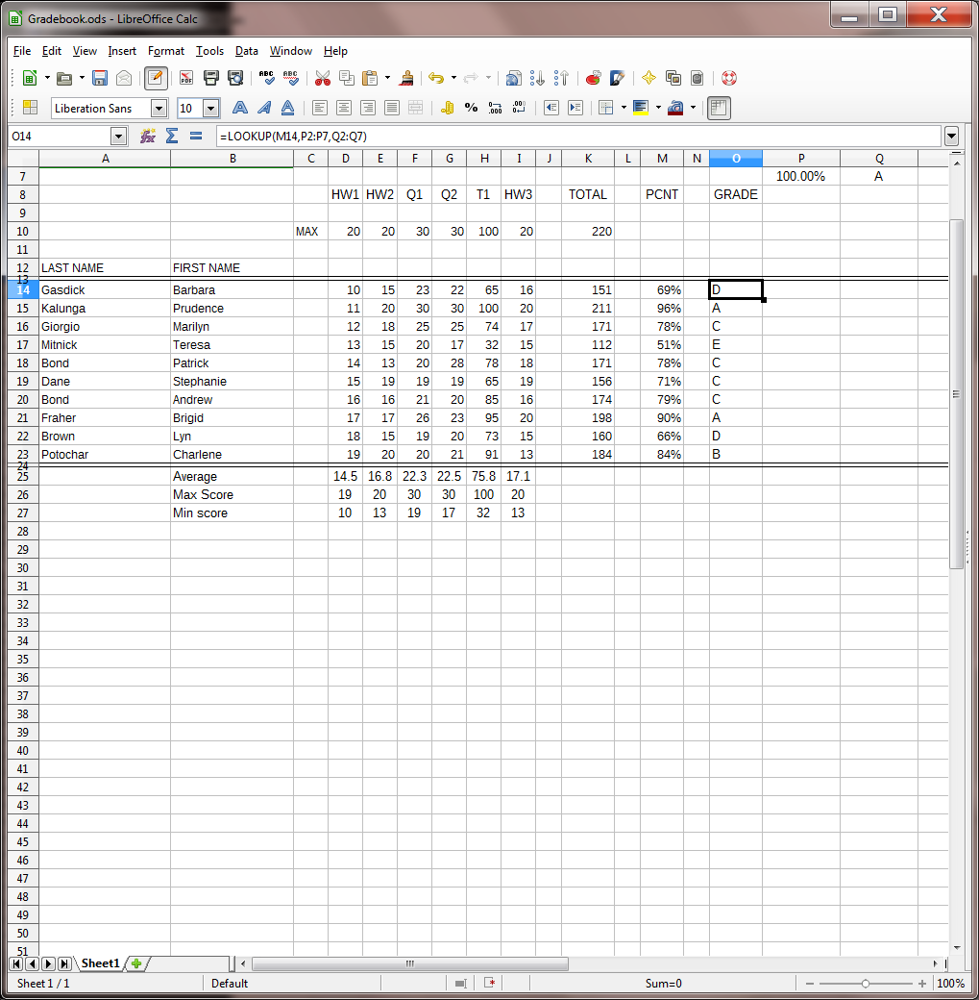

Fig. 5.26 LOOKUP function for cell N14

> In the **Data entry bar** (Fig. 5.26 above), in the **LOOKUP
> formula**, click to put the cursor immediately before the reference to
> **cell P2**
>
> Now put a dollar (**\$)** sign in front of **every coordinate** (rows
> *and* columns) for the LOOKUP Table (**8 \$ signs** in all) as
> illustrated in Fig. 5.27

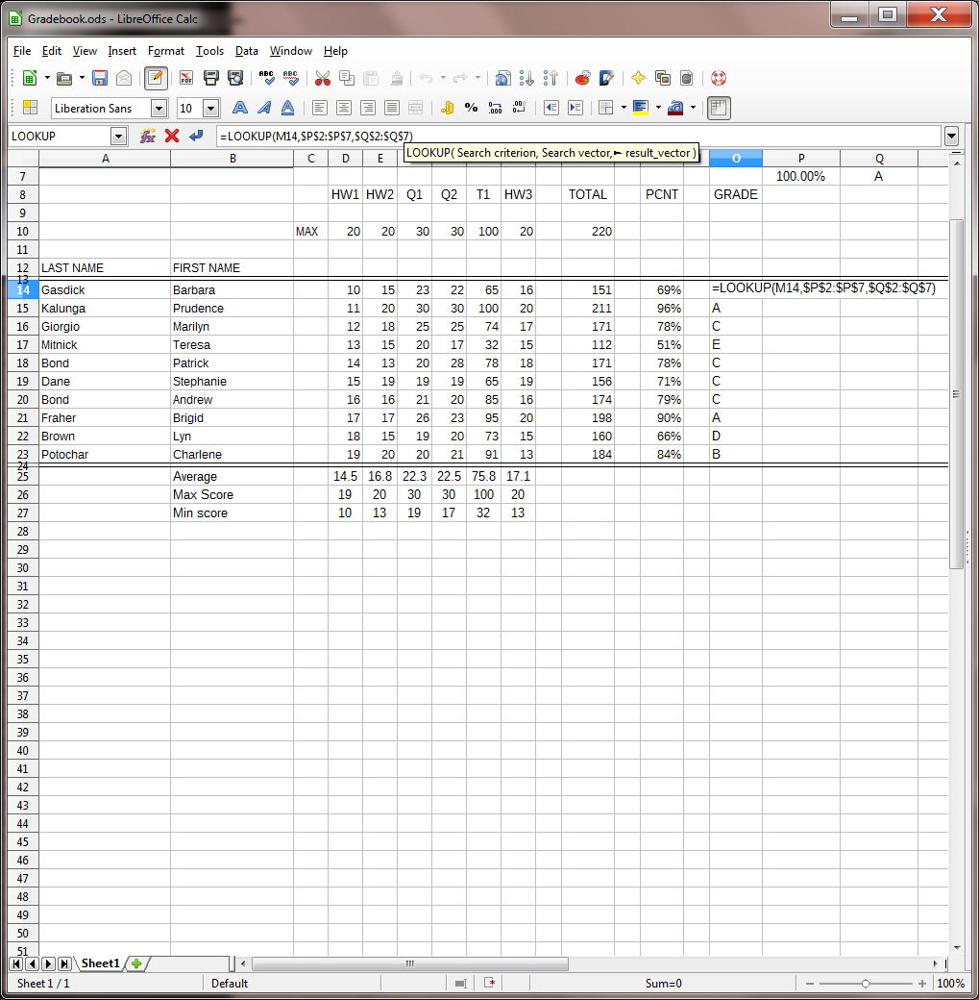

Fig. 5.27 Absolute references are preceded by dollar (\$) signs

This will ensure that this part of the function will remain unchanged
("absolute") when you copy it shortly into the other cells in column O.

> Click the **Accept button** ( ) to accept the
> LOOKUP function into cell **O14**

Here now are the steps to copy the function from cell O14 into the
remaining cells of the GRADE column (Column N).

> Make sure the current cell is still cell **O14**
>
> Grab hold of the small **Fill handle** in the **lower right** corner
> of **cell O14**, drag down to **cell O23** and let go of the mouse
> button (or take your finger tip off the screen if you’re using a touch
> screen)

You now should see the correct letter grade for each student in column
O.

> While you have the cells in **column O** highlighted, **center** the
> grades in the column (**Formatting toolbar** > **Center icon**)
>
> **Save** the changes you have made to the **Gradebook** spreadsheet

If you need to think about the LOOKUP function a little more, go
carefully back over what you have just done. Once you have a clear idea
of how the LOOKUP function works, you and your students will be able to
apply it in myriad situations when you build spreadsheets of your own.

*Practice makes perfect*

Your task now is to switch to the Grades Template again, and add the
LOOKUP function there, too. You do not have any data in the template (or
at least you shouldn’t have!), so your LOOKUP function will produce a
column of meaningless grades (all E’s!) in the GRADE column, just as was
the case when you built a function into the PCNT column of the Grades
Template when you were working on Lesson 4. This is no problem, because
the data will be relevant and correct when you use the spreadsheet with
an *actual class* *of your own* and enter *meaningful* sets of scores,
as is the case in the Gradebook itself.

You either can add the functions to the Grades Template the long way, by
repeating all the steps you just carried out for the Gradebook cell by
cell, or you can use the Copy (*Ctrl-c*) and Paste (*Ctrl-v*) functions
as you did a short while ago to copy the LOOKUP Table from the one
document to the other.

> Go ahead and **copy the grades formulas in column O** from the
> **Gradebook** to the **Grades Template**; don't forget, when you’re
> done, to **Save** the changes you have made to the **Grades Template**
> spreadsheet, then close the **Grades Template**

Finally in this exercise you must *protect* the Gradebook worksheet so
that no one can make unauthorized changes to the data in the cells.

> Select all the cells in the **Gradebook** worksheet (**Ctrl-a**),
> then, in the **Tools menu** > **Protect Document** click, in the
> sub menu, to put a **check mark** back in front of **Sheet…**
>
> Do the same for the **Grades Template** worksheet
>
> **Save** your work and **close just** the **Grades Template**

You should now have only the *Gradebook* open on your screen.

**5.6 PRINTING THE UPDATED SPREADSHEET**

You're going to print out the Gradebook twice. Here are the steps for
the first printout.

It is usually best to print a spreadsheet in landscape (sideways)
orientation.

> In the **Format menu** > **Page…** dialog box, in the **Orientation
> section**, click on the **radio button** next to **Landscape**
> Orientation

You need to take care of a couple of other details before clicking on
the Print button. The printed spreadsheet will look better if you remove
*column and row headings* as well as the *cell gridlines*.

> In the **View menu** click on **Column & Row Headers** to remove the
> **check mark** there, thus removing column and row headers from the
> spreadsheet
>
> Next remove the gridlines by clicking, in the **Formatting toolbar**,
> on the **Toggle Grid Lines for Current Sheet** icon (Fig. 5.28)

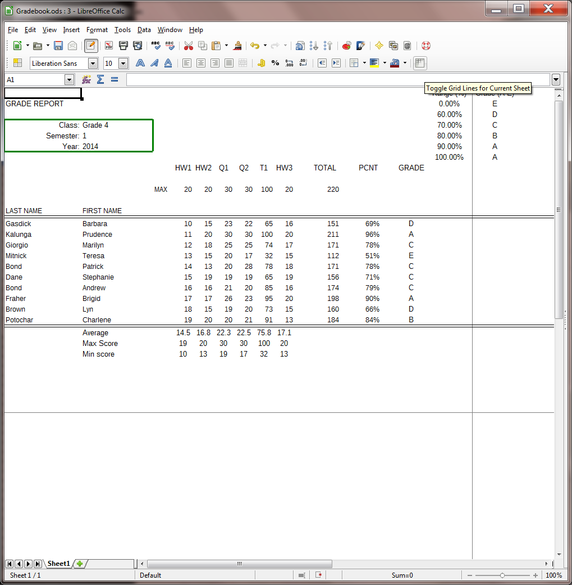

Fig. 5.28 Toggling gridlines on and off

**Selecting a section of the spreadsheet for printing **

When you first print out your Gradebook, you do not want the LOOKUP
Table to appear on the printed report. You want to print only that block
of cells that contains the data pertaining to student grades for the
semester. This includes columns A through O and Rows 1 through 27.

The steps that follow will show you how to select just this block of
cells for printing. First you must select (highlight) the range of cells
that you want to print.

> Drag down diagonally from cell **A1** to cell **O27** (this will
> include the **Average**, **Max Score**, and **Min Score** summary
> lines at the bottom of the Gradebook, but **not** the cells with the
> LOOKUP table)
>
> Now, from the **File menu** select **Print** to bring up the **Print
> dialog box** (Fig. 5.29)

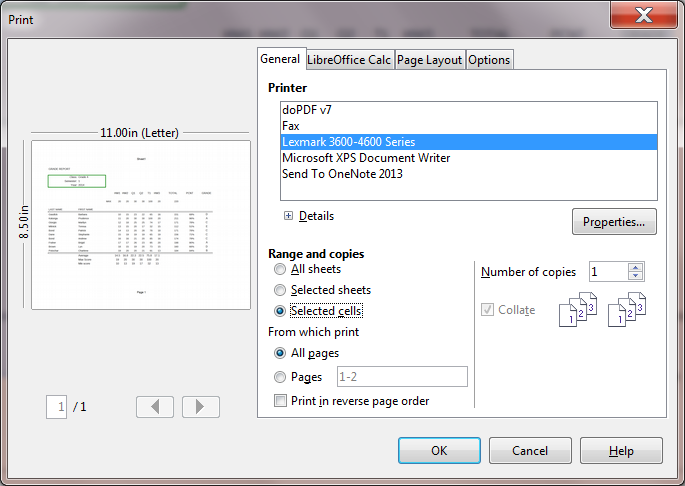

Fig. 5.29 Setting the Print area in the Print dialog box

Notice that in the Print dialog box you have a Preview of the worksheet
before printing. Your spreadsheet has just one page. If you wanted to
check how many pages there are in your spreadsheet before printing, you
would find the answer *underneath* the Print Preview window (it reads 1
of 1 for this spreadsheet).

> Check out how the spreadsheet looks in the **Preview window**, then
> click on **OK** to print out the first hardcopy of the **Gradebook**

Now you are going to print a second copy of the Gradebook, but this time
you will include the LOOKUP table, the Column and row headers and the
gridlines.

> In the **Gradebook**, drag down diagonally from cell **A1** to cell
> **Q27** (this will include the **LOOKUP table** in columns P and Q)
>
> In the **View menu** select **Column & Row Headers** to put back the
> **check mark** there, then **bring back** the **gridlines** by
> clicking, in the **Formatting toolbar**, on the **Toggle Grid Lines
> for Current Sheet** icon (Fig. 5.28 on page 174)
>
> Now, from the **File menu** select **Print** and, in the **Print
> dialog box** make sure the **radio button** next to **Selected cells**
> is **on** (check the **Print Preview window** to make sure the
> **LOOKUP table** is included in this **second** printout), then click
> on **OK** to print this **second copy** of the **Gradebook**
> spreadsheet
>
> If you are completing the lesson for a class at school, hand in **both
> hardcopies** of the spreadsheet to your instructor

**5.7 Creating charts based on SPREADSHEET data**

**The *Calc* charting capability**

*Calc* makes it easy to create dozens of different types of charts. You
can create a chart from information gathered in most any spreadsheet. In
the next Lesson (Lesson6) you’ll learn how to incorporate a chart into a
*Writer* document.

A spreadsheet user can take advantage of charts based on the numbers
stored in its rows and columns of cells. The numbers on their own may
not provide much information. Charts based on those numbers, on the
other hand, may enable the user to *visualize* the data. "A picture," as
they say, "is worth a thousand words."

**Creating a Column chart**

For this exercise, we’ll set aside the work we’ve been doing with the
Gradebook. You are going to open a new grades spreadsheet so that you
can practice creating charts.

> Go to **File** > **Open** and navigate to your **Removable Disk**
> > **Work Files for LibreOffice** > **Miscellaneous Files** >
> **Other Documents** folder and open the **Charts** spreadsheet

Your Charts spreadsheet should look like Fig. 5.30.

Fig. 5.30 Data for the Charts spreadsheet

The values represented in a chart are called a *data series* or a *data
set*. In the chart you are about to create, the number of students in
the various grade ranges (A, B, C, etc.) will be represented by bars.
The chart will have a *title* and a *legend* with names descriptive of
the *data series*.

Most charts, except pie charts, have *axes,* which are the perpendicular
lines along which the data are plotted or displayed. The Y axis is the
*vertical* axis (running from top to bottom). The X axis is the
*horizontal* axis (running from left to right).

To create a chart in *Calc*, you must first designate the set of cells
in the spreadsheet that you want included in the chart. This is called
the *chart range*. Let’s select the Chart Range now.

> Select, by dragging and highlighting, cells **A1** through **F2**

Now, let’s check out each of the various categories of *LibreOffice*
charts.

> In the **Standard toolbar**, click on the **Chart** tool (Fig. 5.31)

Fig. 5.31 The Chart tool in the Standard toolbar

This immediately brings up a basic chart (a bar chart) based on the data
highlighted in the spreadsheet, and also offers the *Chart Wizard dialog
box* (Fig. 5.32).

Fig. 5.32 The *LibreOffice* Chart Wizard

The Chart Wizard dialog box opens up a world of opportunities to create
other eye-catching and, more importantly, *effective* chart
styles—effective, that is, in the sense of getting the *true* meaning of
the data across.

> In the **Chart Wizard dialog box** > **Choose a chart type menu**,
> click on **Column** (Fig. 5.33 on previous page), and look at the many
> different types of **Column Charts** you can work with, from **Plain**
> to **3D charts** (including Box, Cylinder, Cone, and Pyramid charts)
>
> Click on the **Bar chart type** and look at the different types of
> **Bar Charts**
>
> Click on the **Pie chart type** and look at the different types of
> **Pie Charts**
>
> Click on the **Area** **chart type** and look at the different types
> of **Area Charts**
>
> Click on the **Line chart type** and look at the different types of
> **Line Charts**
>
> Click on the **XY (Scatter) chart type** and look at the different
> types of **Scatter Charts**
>
> Click on the **Bubble** **chart type** and look at the different types
> of **Bubble Charts**
>
> Click on the **Net** **chart type** and look at the different types of
> **Net Charts**
>
> Click on the **Stock** **chart type** and look at the different types
> of **Stock Charts**
>
> Finally, click on the **Column and Line** **chart type** and look at
> the different types of **Column and Line Charts**

Quite a selection—dozens of different kinds of charts. But let’s focus
for now on the Column charts.

> After you have checked out the various chart types, in the **Chart
> Wizard dialog box**, click on the **Column charts** **type**
>
> In the **Column Charts** options, click to put a **check mark** in the
> box next to **3D Look** (Fig. 5.31 on the previous page) then, in the
> **Shape menu**, click on **Box** (Fig. 5.31 again), and then click on
> the **Normal** type

Immediately *Calc* creates the chart and displays it on the screen (Fig.
5.33).

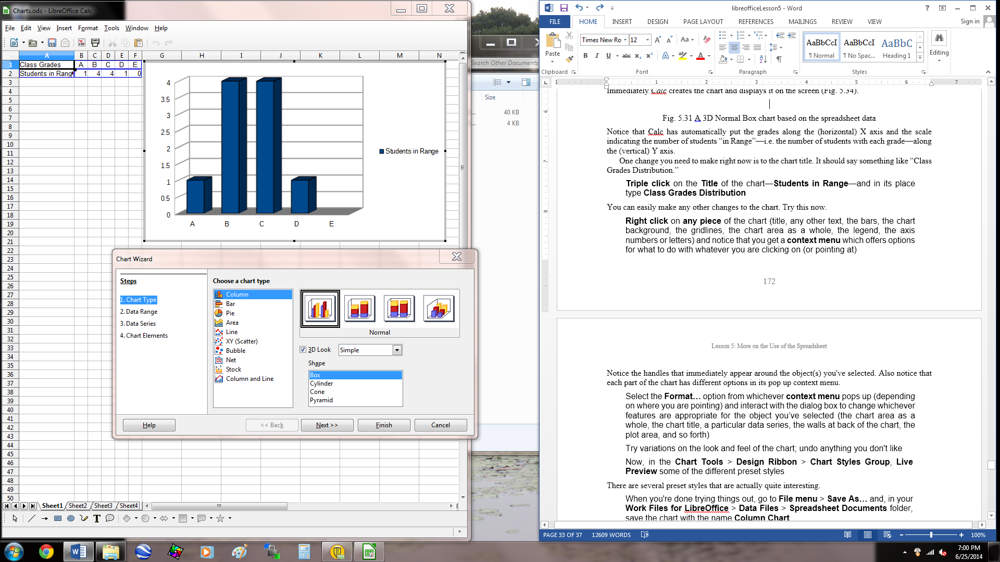

Fig. 5.33 A 3D Normal Box chart based on the spreadsheet data

Notice that Calc has automatically put the grades along the (horizontal)
X axis and the scale indicating the number of students “in Range”—i.e.
the number of students with each grade—along the (vertical) Y axis.

One change you need to make right now is to the chart title. It should
say something like “Class Grades Distribution.” While we’re doing that
we can make a couple of other changes as well.

> In the **Chart Wizard** > **Steps section**, click on **4. Chart
> Elements** (Fig. 5.34)

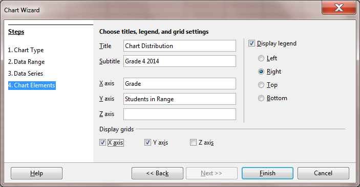

Fig. 5.34 Chart Wizard > Chart Elements dialog box

> In the **Chart Elements dialog box**, fill out the **Title**,
> **Subtitle**, **X axis**, and **Y axis** as per the data in Fig.
> 5.34—leave the **check mark** in the box next to **Display legend**
> and click on **Finish**

The end result will look like Fig. 5.35.

Fig. 5.35 The final version of the 3D Column chart

> Go to **File** > **Save As…** and, in your **Work Files for
> LibreOffice** > **Data** **Files** > **Spreadsheet Documents**
> folder, save the chart with the name **Column Chart**, then remove it
> from the spreadsheet window before the next exercise

**Creating a pie chart**

Creating a pie chart is straightforward (not to say easy) if you just
successfully completed the Column chart exercise. You will use the same
set of data for the exercise that follows.

> Drag to select cells **A1** through **F2**, then, in the **Standard
> toolbar**, click on the **Chart tool** to bring up the **Chart
> Wizard** (Fig. 5.32 on page 177), and then, in the **Choose a chart
> type** menu, click on **Pie**
>
> In the **Pie Charts** dialog, click to put a **check mark** next to
> **3D Look** and, in the **3D Look menu** select the **Simple** option
>
> In the **Chart Wizard**, click on each of the four Pie Chart styles
> and check them out

The style of Pie Chart you are going to work with is the *Exploded Pie
Chart* (Fig. 5.36).

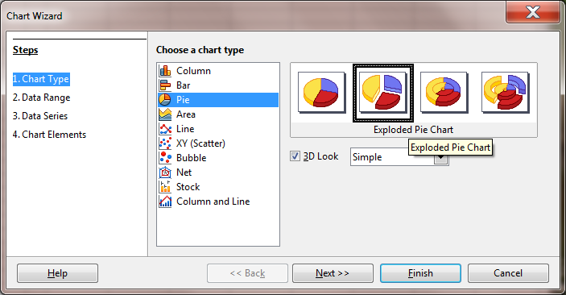

Fig. 5.36 Exploded Pie Chart Style

> In the **Steps section** on the **left** of the **Chart Wizard dialog
> box**, click on **4. Chart Elements** and change the **Title** to
> **Class Grades Distribution** as you did for the Column Chart, with a
> **Subtitle** of **Grade 4 2014**
>
> Leave the **check mark** in the box next to **Display legend** and
> click on **Finish**
>
> Now, **right click** on any of the **slices** in the **Pie chart**
> and, in the **context menu** that pops up, select the option to
> **Insert Data Labels**

This puts a label on each of the slices indicating how many students got
that particular grade, thus adding information to the chart. It would be
helpful if the Font size were bigger on each of those slices and maybe
the color white would stand out more against the colors of the various
slices. This is easy enough to do.

> **Right click** again on the **number** on any one of the slices in
> the **Pie chart** and, in the **context menu** that pops up, select
> the option to **Format Data Labels**

This brings up the dialog box titled *Data Labels for Data Series
“Students in Range”* (Fig. 5.37).

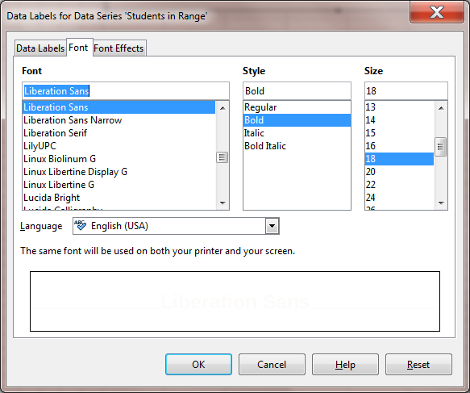

Fig. 5.37 Changing the Font and Size of the Data labels in a Pie chart

> Click on the **Font tab** and change the **Style** to **Bold** and the
> **font size** to **18**, then click on the **Font Effects tab** and
> change the **Font Color** to **White**

There, that’s better (Fig. 5.38).

Fig. 5.38 Final version of the Pie Chart

> **Save** the chart in your **Data** **Files** > **Spreadsheet
> Documents** folder with the name **Pie Chart**

That’s all you want to do with the pie chart, so you might as well
remove it from the spreadsheet window before the next exercise.

> **Left click** on the border of the **Pie chart** to select the
> **whole chart** and not some piece of the chart’s contents, then hit
> the **Del(ete)** key

**Creating a bar chart**

One last Chart type will suffice for you to get the hang of creating
charts using spreadsheet data. This time you’ll create a 3D Bar chart.

> If necessary, drag to select cells **A1** through **F2**, then, in the
> **Standard toolbar**, click on the **Chart tool** to bring up the
> **Chart Wizard** (Fig. 5.34 on page 179), and then, in the **Choose a
> chart type** menu, click on **Bar**
>
> In the **Bar Charts** dialog, click to put a **check mark** next to
> **3D Look**, then in the **3D Look menu** select the **Simple**
> option, and in the **Shape section** select **Cylinder**
>
> Of the four **Styles of Cylinder Bar Charts**, select the first
> (**Normal**) style, then, in the **Steps** section of the Chart
> Wizard, click on **Chart Elements** and type the Title **Class Grades
> Distribution**, with the Subtitle **Grade 4** **2014**
>
> Click the **Finish** button, then **right click** on any of the
> **Bars** in the **Bar chart** and, in the **context menu** that pops
> up, select the option to **Insert Data Labels**
>
> In the **Data Labels** dialog box, click on the **Font tab** and
> change the **Style** to **Bold** and the **font size** to **18**, then
> click on the **Font Effects tab** and change the **Font Color** to **a
> color of your choice**

The end result might look something like Fig. 5.39.

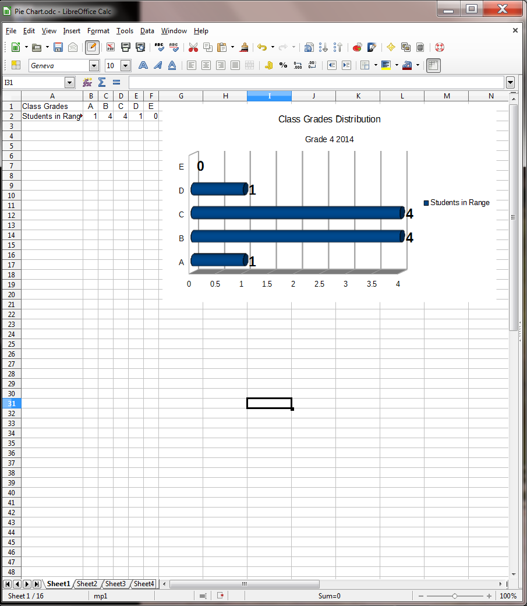

Fig. 5.39 Final version of the Bar Chart

> **Save** the chart in your **Data** **Files** > **Spreadsheet
> Documents** folder with the name **Bar Chart**, then **close** the
> spreadsheet

**SKILL CONSOLIDATION**

Complete these exercises to reinforce what you have learned in Lesson 5.

1\. List at least 5 applications, other than those presented in these
tutorials, for which you think you would use the *Calc* spreadsheet in a
classroom environment.

2\. Either alone, or with a group, develop templates for each of the five
spreadsheets identified in exercise 1. This could be an excellent class
project. Each team would develop a different set of templates. Then all
groups would present their results for review by everyone else in the
class, and the complete set of templates could be made available on disk
for everyone to take away from the course.

3\. Load the Gradebook to the Desktop.

> • Add the function to calculate the average score for each of the
> tests, quizzes, homework, etc. The system will add up all the scores
> and divide by the number of cells that contain scores to arrive at the
> average. You should use the copy function to duplicate the functions
> across the spreadsheet.
>
> • Save the updated spreadsheet.
>
> • Print out only the columns that contain the student names and the
> final totals and percentages (so you will need to temporarily delete
> the columns in between—don't save this!)

4\. Load the Gradebook onto the Desktop.

> • Add a new column for another set of scores
>
> • Add a new row for another student
>
> • Update the functions where necessary
>
> • Sort the student records based on the First and Last Name columns
>
> • Save the updated document

5\. Create a line chart based on a set of values for populations in
several cities in the U.S. Generate a Bar chart from the data. Research
the populations on the web at
http://www.census.gov/popest/states/NST-ann-est.html

6\. Create a pie chart based on a set of values for the amount of
rainfall for each of any ten cities world wide. Research the rainfall
data at this web address: http://www.worldclimate.com

[^1]: Your formula should look something like this: **=SUM(D14:D23)/10**

[^2]: 0% (E); 60% (D); 0% (E); 100% (A)
