**Lesson 6** Introduction to the *BASE*  database
=================================================

  ------- -----------------------------------------
  **6**   **Introduction to the *BASE* DATABASE**
          
          Keeping student records
  ------- -----------------------------------------

**LEARNING OUTCOMES**

This tutorial will introduce you to the following:

> • the general idea behind a database
>
> • planning a new database
>
> • creating a database template
>
> • adding records to a new or existing database
>
> • viewing the data in a database
>
> • clearing entries and records from a database
>
> • making a backup copy of a database

**BEFORE YOU BEGIN**

**Setting up for the tutorial**

If you completed Lesson 1 of these tutorials, you can skip the rest of
this section and proceed directly to the next section (*6.1 An Overview
of the Database Concept—next page*). If you did *not* complete Lesson 1,
then you must do this now, before proceeding with the rest of Lesson 6.

The set of *Work Files for LibreOffice* ideally should be stored on a
Flash drive (USB drive) in three folders named *Base Files*, *Impress
Files*, and *Miscellaneous Files*. You need to create a fourth folder
for the *data files* that you will be creating while working your way
through the tutorials. This fourth folder will be called *Data Files*.

Here are the steps to prepare these folders now before proceeding with
this tutorial.

> First, **Unzip** the set of **Work Files for LibreOffice** by **double
> clicking** on the File name on your computer (your instructor will
> help you with this if you are working with a class) and **Extract**
> them onto your flash drive
>
> **Double click** on the **Work Files for LibreOffice** folder to
> **open** it

Now, inside the *Work Files for LibreOffice* folder you need to create a
new, *fourth,* folder called *Data Files.* Here’s how you do this.

> **I**n the **Work Files for LibreOffice folder**, select **New
> Folder** (Fig. 6.1).

Fig. 6.1 Creating a New Folder

The system will create a new folder for you and then wait for you to
give it a name of your choice (Fig. 6.1 above).

> Call the new folder **Data Files**

During the course of these tutorials you will be storing many files in
this Data Files folder.

**6.1 AN OVERVIEW OF THE DATABASE CONCEPT**

**How is a database organized?**

*Base* is an object-oriented relational database management system. It
is designed to help an organization—such as a company or an institution
or a school or school district, and also the individual teacher—to
collect, organize, manage, and store data in such a way that they can be
easily accessed and made available to users in a variety of useful ways.

The various types of database objects that you can create using *Base*
are listed in the *Database* Objects menu in the left hand frame of any
*LibreOffice* database that you open, as illustrated in Fig. 6.2.

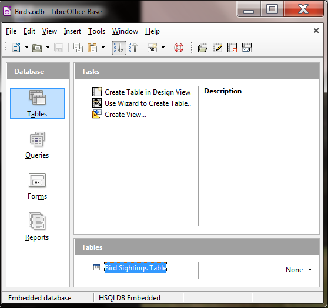

Fig. 6.2 The *Base* database objects

Let’s take a look at each of these objects now to see how they can be
used to help you organize and access the information collected into a
database (in this case a database of information about different birds).

-   A **Table** is the fundamental object in a relational database and
    > tables use rows and columns to present the data—rather like
    > a spreadsheet. You will learn about Tables and in this lesson, as
    > well as how to use the *Design View* to create a table, add fields
    > to a table, and define the type of data that is in a
    > specific field.

-   A **Query** makes a request to the database, asking it to find some
    > specific data that are stored in the database. You will learn more
    > about queries in Lesson 7.

-   A **Form** gives the user another way of looking at the data in
    > the database. Whereas a Table allows the user to view many records
    > at once, a Form displays the contents of just *one record at a
    > time*. Forms are very useful for entering data into new records or
    > updating the data in existing records. You will learn about Forms
    > in this lesson.

-   A **Report** is used to present a selected set of information from a
    > database in a format that is neatly laid out and thus easier for
    > the user to mentally digest. You will learn about reports in
    > Lesson 7.

***Base* database terminology**

A *Base* database is able to contain thousands, hundreds of thousands,
even millions of records. Records contain *fields*. Each field contains
*entries* made up of text and numbers, which are the basic building
blocks of data.

**6.2 LET’S TAKE A LOOK AT AN EXISTING *BASE* DATABASE**

It will be useful for you at this stage to see an actual *Base*
database.

> Open **LibreOffice** > **Base Database**

*Base* presents you with the Database Wizard dialog box (Fig. 6.3).

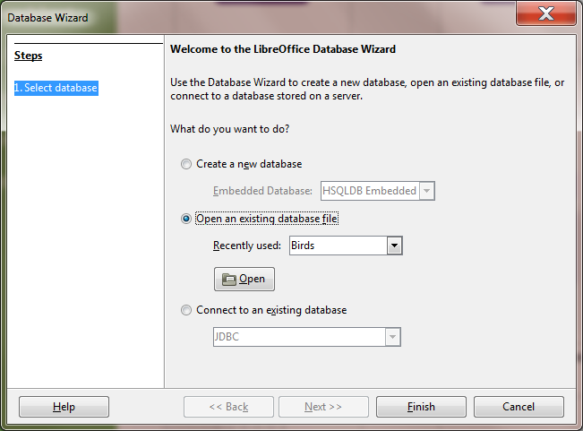

Fig. 6.3 The Database Wizard dialog box

This Wizard will step you through the process of either *creating* a new
database or *opening* an existing database or even connecting to an
existing database online.

Since you haven’t yet opened any *Base* files, you are offered the
opportunity to *Create* a new database. But instead you are going to
open a database that has already been created for you to work with in
this first section of the tutorial.

> So, as illustrated in **Fig. 6.3 on the previous page**, click on the
> **radio button** next to **Open an existing database file**, then
> click on the **Open** button

This brings up the Open window.

> In the **Open window**, navigate to your **USB drive** > **Work
> Files for LibreOffice** folder > **Base Files** folder and **double
> click** on the **Birds** database to **Open** it

In the Birds database dialog box you see the icons for the *LibreOffice
Base* database objects (Tables, Queries, Forms, and Reports), which are
listed one of top of the other in the *Database* menu on the *left side*
of the Birds database window (Fig. 6.4).

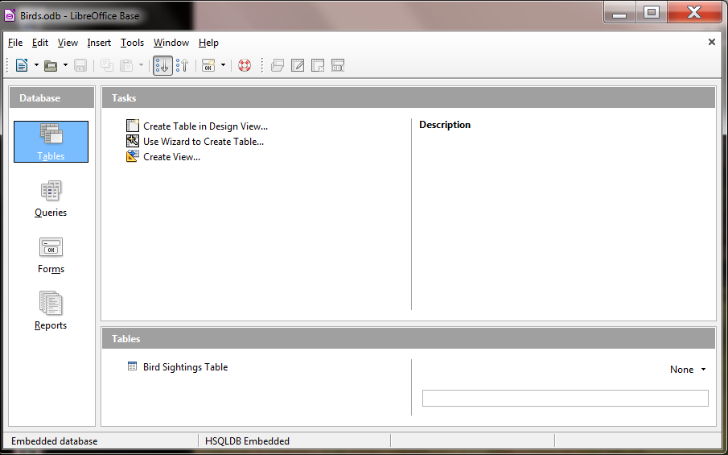

Fig. 6.4 How do you want to view the data in the database?

One way to view the data is as a *Table*, where the data for all the
records in the database are displayed in columns or as a list—much like
in a spreadsheet (Fig. 6.5).

Fig. 6.5 The Table View of the database

In the upper left corner of the Table window, in the window’s Title bar,
you see the Table name—Bird Sightings Table (Fig. 6.5 previous page).

In the lower left of the Table window are tools for you to access
specific records in the database (Fig. 6.6).

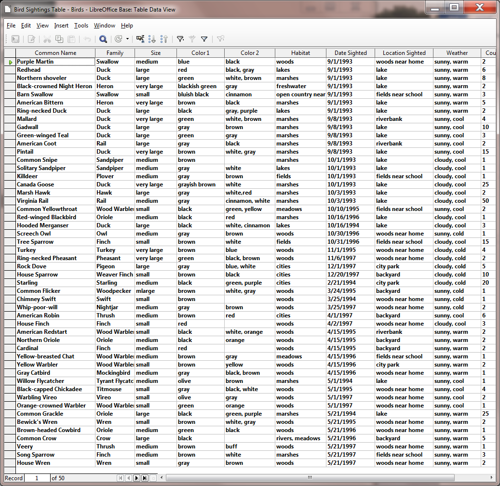

> 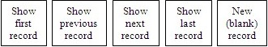

Fig. 6.6 Navigation tools in the *Base* database

There are 50 records in the *Birds* database. The field names (Common
Name, Family, Size, etc.) are at the top of each column of data (Fig.
6.5 previous page). As you can see, the screen is not big enough to
allow you simultaneously to see *all* the records in the database. If
you want to scroll through the records or look at any specific record,
you have several options.

You can use the scroll bar on the right of the screen to scroll through
the records.

> Try this now

To move *one by one* through the records, you can click left or right on
the arrows in the navigation tools in the lower left of the window (Fig.
6.6 above).

> Try this now

To go directly to a specific record, you can select the number of the
record you want to view by typing the number of that record in the small
data entry box to the left of the arrows (Fig. 6.6).

> Try this now to select record **12** (type the number **12** in the
> box then hit **Enter**) and you’ll see a small green arrow head
> pointing at the **record \#12** in the database table (it’s a bird
> called a **Pintail**)

**6.3 planning A NEW DATABASE**

So much for the nuts and bolts of databases. You are now ready to get
your feet wet planning your own database of student records.

> Click on the **Table’s File menu** and select **Close** to close the
> **Bird Sightings Table**, then in the **Birds Database** **File menu**
> select **Close** again

**Points to ponder when planning a database**

There are three rules of database design:

> Rule 1—Plan;
>
> Rule 2­—Plan;
>
> Rule 3—Plan!

The more complex the data, the more you need to plan. But even the
simplest database should be thought through on paper before being
created in *Base*. Poor planning often results in a database that fails
to meet longer term needs.

So think about your database ahead of time—and PLAN!!

**6.4 CREATing the DATABASE TEMPLATE**

You are going to start a new database for Student Records, which
initially will be a *template* for a database of student records because
it won’t contain any actual records right away. This way you’ll be able
to use this template database for future groups of students you may
have.

> Open **LibreOffice** > **Base Database** then, in the **Database
> Wizard** which pops up on the screen, make sure the **radio button**
> next to **Create a new database** is **on** and click on **Next
> >>** (Fig. 6.7)

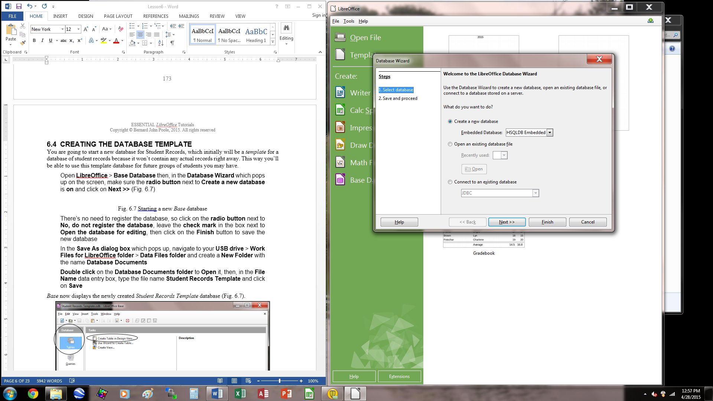

Fig. 6.7 Starting a new *Base* database

> There’s no need to register the database, so click on the **radio
> button** next to **No, do not register the database**, leave the
> **check mark** in the box next to **Open the database for editing**,
> then click on the **Finish** button to save the new database
>
> In the **Save As dialog box** which pops up, navigate to your **USB
> drive** > **Work Files for LibreOffice folder** > **Data Files
> folder** and create a **New Folder** with the name **Database
> Documents**
>
> **Double click** on the **Database Documents folder** to **Open** it,
> then, in the **File Name** data entry box, type the file name
> **Student Records Template** and click on **Save**

*Base* now displays the newly created *Student Records Template*
database (Fig. 6.8).

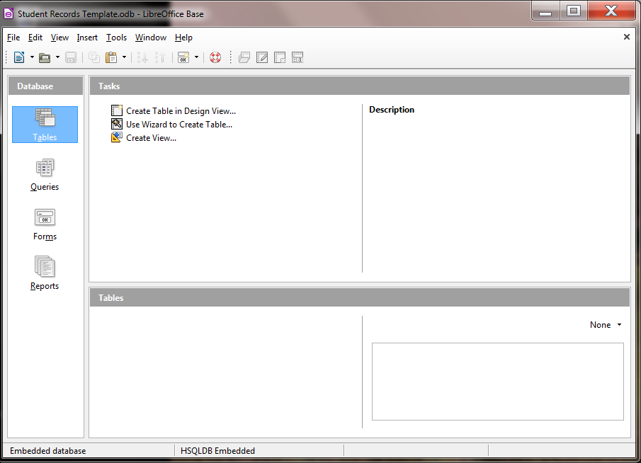

Fig. 6.8 The new Student Records Template database

Notice, in the *Database* frame on the left side of the *Base* window,
that the *Tables* object is selected (highlighted in blue). A Table is
the default object in a new *Base* database. To the *immediate right* of
the Database frame, in the *Tasks frame*, there are *three options*, the
first of which is what we want.

> Click once on the **Create Table in Design View** option (Fig. 6.8
> above)

Immediately you are presented with the Table Design dialog box (Fig.
6.9)

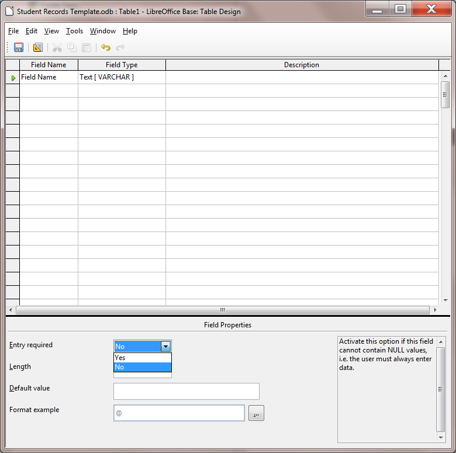

Fig. 6.9 Table Design dialog box, waiting for you to till out Field
entries

On the screen, *Base* is waiting for you to begin typing in the field
names. Before you enter the field names, however, read what follows.

> **Editing field names** Remember, you’re building a template so that
> you can use it for other student record databases at a future date.
> You can easily change, add or delete fields at any time, though the
> purpose of planning is to try your best to avoid having to make
> significant changes after the database has been created.
>
> **Selecting the data type of a field** As illustrated in Fig. 6.9
> (previous page), after typing in the field name in the first column,
> you’ll need to enter the *field's* *data type* in the second column.
> Table 6.1 below has all this information, too.

**Entering field names for the database**

Table 6.1 contains the complete list of field names for the Student
Records Template database.

  ------------------------- ------------------ -------------- ------------ --------------------
  > **Field Name**          > **Field Type**   **Required**   **Length**   **Format Example**
  > **First Name**          > Text             Yes            15           
  > **Middle Name**         > Text             Yes            15           
  > **Last Name**           > Text             Yes            15           
  > **Home Contact**        > Text             Yes            30           
  > **Nick Name**           > Text             No             15           
  > **Gender**              > Text             Yes            6            
  > **Address Line 1**      > Text             Yes            50           
  > **City**                > Text             Yes            25           
  > **State**               > Text             Yes            2            
  > **Zip Code**            > Text             Yes            10           
  > **Phone Number**        > Text             No             12           
  > **Email Address**       > Text             No             40           
  > **Date of Birth**       > Text             Yes            -            January 1, 1998
  > **Brothers**            > Number           Yes            2            
  > **Sisters**             > Number           Yes            2            
  > **Place in Family**     > Number           Yes            2            
  > **Clubs**               > Memo             No             -            
  > **Hobbies**             > Memo             No             -            
  > **Favorite Sports**     > Memo             No             -            
  > **Favorite Subjects**   > Memo             No             -            
  ------------------------- ------------------ -------------- ------------ --------------------

Table 6.1 Template Field Name listing

You'll be referring to this Table frequently as you work your way
through the next several pages, so you might like to bookmark Table 6.1
in order to easily find the Table whenever you need to.

Type only the Field Names that appear in the *first column* of Table 6.1
(there are 20 field names in all). The second column tells you what Data
Type to choose (from a drop down list that pops up when you click on the
down arrow at the right side of the entry box.

The other columns in the table (Required, Length, and Format Example
columns) are there to help you as you enter each field name and data
type and explain whether data is to be "Required" for that field and
what size (in text characters) and format the field is allowed to be.

Now you’re ready to begin entering the data listed in Table 6.1 above
into the Table Design dialog box

> Click in the **first** entry box in the **Field Name** column, then
> type **First Name** for the field name (Fig. 6.10)

Fig. 6.10 Field Properties and Help

Notice that, in the *lower right* section of the Student Records Table
window (Fig. 6.10 above), *Base* provides help to guide you as you enter
the data for each part of each field. Read this help as you go along. In
the *lower left* you can see the *Field Properties* dialog area.

If you take a look at Table 6.1 on page 176, the *Length* column
specifies the number of characters required for several of the fields in
the database.

> Check **Table 6.1** to find out whether an entry is **required** for
> the **First Name** field (the answer is **Yes**) and the **correct
> size** for the **First Name** field (the answer is **15** characters)
>
> Now, look down at the **lower left corner** of the **Table Design
> window** (Fig. 6.9 again), where you can see a list of **Field
> Properties**, along with data entry boxes to specify whether an entry
> is **required**, the entry’s **Length**, **Format example**, and so
> forth
>
> In the **Entry Required** box select **Yes**, and in the **Length**
> box type **15** (so as to allow up to 15 characters for the **First
> Name**)
>
> Hit the **Tab** key to move the cursor over to the **Field Type**
> column, click on the **down arrow** to the **right** of the box and
> select **Text \[VARCHAR\]** as the data type
>
> Now click in the **second** **Field Name box** (below the **First
> Name** box) so you can enter the next database field name
>
> Enter the field names **Middle Name** (**15** characters), **Last
> Name** (**15** characters), **Home Contact** (**30** characters), in
> each case making sure you have **Yes** in the **Entry** **Required**
> Field Property for each of these fields
>
> Now enter the field name **Nick Name** (**15** characters), but leave
> **No** in the **Required** Field Property box, since a Nick Name is
> **optional**
>
> Next enter the following field names, in each case making sure you
> have **Yes** in the **Entry** **Required** Field Property for each of
> the fields:
>
> **Gender (M/F)** (**1** character)
>
> **Address Line 1** (**50** characters)
>
> **City** (**25** characters)
>
> **State** (**2** characters)
>
> **Zip Code** (**10** characters),
>
> Now enter the field name **Phone Number** (**12** characters), and
> **Email Address** (**40** characters) but leave **No** in the
> **Required** Field Property box in case a student’s family does not
> have a phone or email address

**Using a Format example to control the format for a field**

You want to make sure that certain fields have a consistent format, such
as the Date of Birth field, which is next in the listing in Table 6.1 on
page 176, you want to select *\[DATE\]* as the data type for the field,
and select a **Format example** for it, too.

> Here’s how you do this.
>
> Enter the next field name **Date of Birth**, then in the **Field Type
> column** click on the **arrow** to bring down the **menu of Field
> Types**
>
> Select the Field Type **Date \[Date\]** then, in the **Field
> Properties area** click on the **ellipses** at the end of the **Format
> example** option (Fig. 6.11)

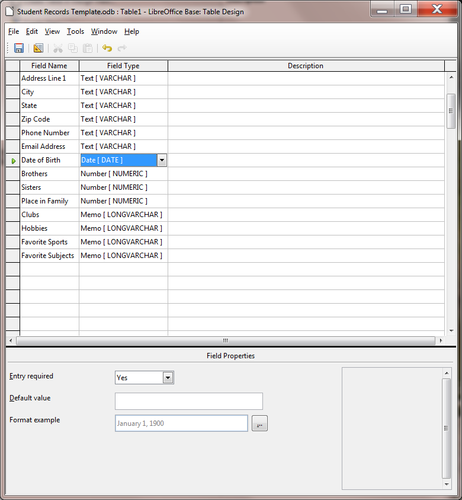

Fig. 6.11 Click on the ellipses to specify a Format example for the Date
of Birth field

> In the **Format tab** > **Category** select **Date**, then under
> **Format** select the option (December 31, 1999) highlighted in Fig.
> 6.12

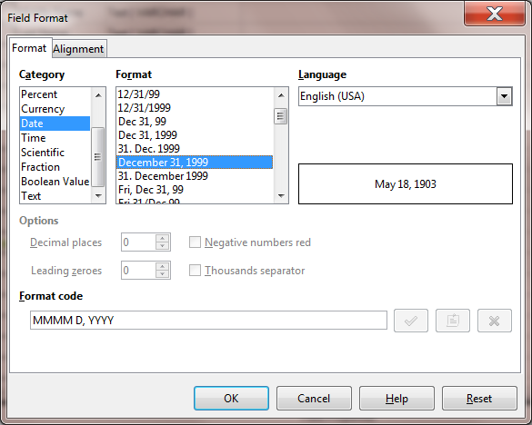

Fig. 6.12 Selecting a Format example in the Field Format dialog box

The remaining fields in the database (Clubs, Hobbies, Favorite Sports,
and Favorite Subjects) will all be *Memo* data type to allow the user to
type a longer entry if desired. Notice, in the Table on page 188, that
data entries for these memo fields are optional, so *No* will be the
answer to *Entry required*.

> For each of the **last four database field names** (Clubs, Hobbies,
> Favorite Sports, and Favorite Subjects) select the Field type **Memo**
> and select **NO** for **Entry required**
>
> When you have completed the entries for **all 20 field names**, select
> **File** > **Save As…** (Fig. 6.13), and, in the **Save As dialog
> box** type the name **Student Records Table** and click on **OK**

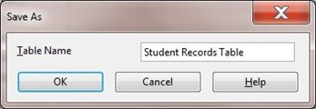

Fig. 6.13 Naming the Table

Whenever you attempt to save a *new* *LibreOffice Base* table for the
first time, you are asked to define a *Primary Key* for the Table (Fig.
6.14).

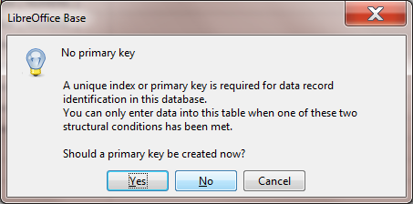

Fig. 6.14 Prompt to define a Primary Key

So what is a Primary Key in a database?

The purpose of a Primary Key is to enable easy manipulation of the data
across multiple database objects. If, for example, you were designing a
database for an administrative application in the Principal’s or
Superintendent’s office, or for a sizable company, this would be an
important consideration, because your database would be large, and there
would be many ways of looking at the data in the database (called
"views" on the data) represented by different tables.

> Click on **Yes** to tell *Base* that you ***do*** need a **Primary Key
> field** in the database, then go to **File** > **Close** to close
> the **Table Design window**

**6.5 COMPLETING PREPARATION OF THE DATABASE TEMPLATE**

**Creating a Form for the new database**

The following exercises will help you learn how to prepare a database
Form.

A Form is a database object which allows you to view the data one record
at a time, unlike a Table where you can view the data as a continuous
list of records—recall how the Table looked in the Birds database you
checked out at the beginning of this tutorial.

A Form is a convenient tool for data entry purposes because it allows
the user to see all the Field entries *in a single record* at one time,
unlike the Table view, which will often be unable to show all the data
fields of a single record across the screen.

Let’s create a Form for our Student Records Template database now. First
you need to bring up the Create Ribbon at the top of the database
window.

> Click on the **Create** tab to show the **Create Ribbon** at the top
> of the *Base* window and, in the **Forms** group, click on the **Form
> Wizard** dialog box (Fig. 6.15)

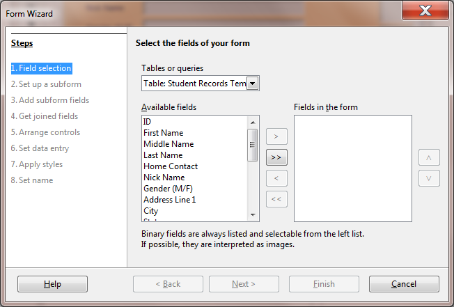

Fig. 6.15 Step 1 in the Form Wizard dialog box

As you see in Fig. 6.15 above, the Form Wizard dialog box steps you
through the 8 step process of creating a Form for the Student Records
Template database. Not all of the 8 Steps are relevant for our purposes,
but most of them are. **Step 1** in designing a new form for the Student
Records database is devoted to selecting all the fields for the new
Form.

> In the “**Select the fields of your form**” section (see Fig. 6.15
> above), click on the **double arrow** (**>>**) symbol

This moves **all 20** of the fields in the **Student Records Template
database**—that is to say, **All** the **Available fields**—over to the
**Fields in the Form** box (Fig. 6.16).

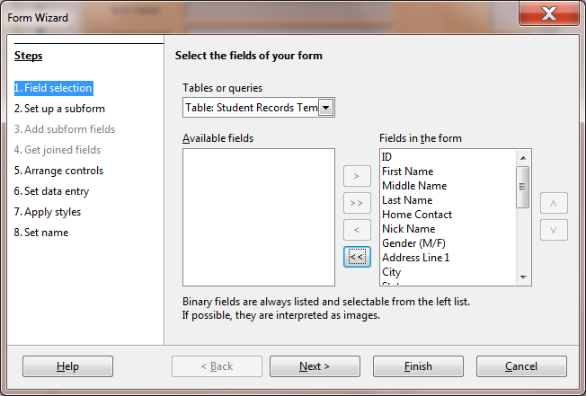

Fig. 6.16 The result of Step 1 in the Form Wizard dialog box

> **Step 2**—**Set up a Subform**—this is irrelevant to our purposes in
> this tutorial, as are also Steps 3 and 4, so just click on **Next**
> and **Next** to move on to **Step 5**, where you decide on the
> **design** **controls** on your database **Form** (Fig. 6.17)

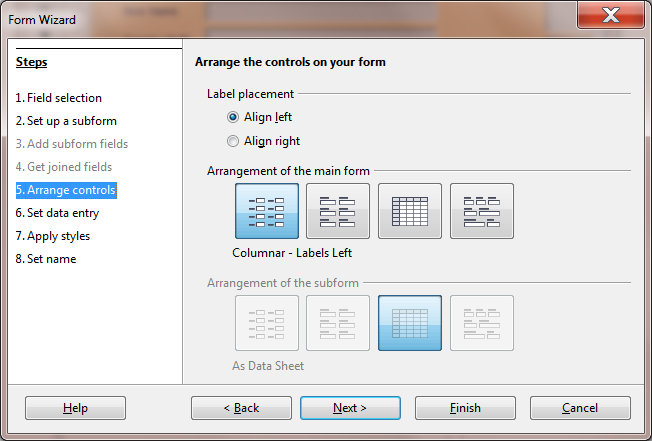

> Fig. 6.17 Selecting the Arrangement of the main form
>
> **Step 5**—select the **first of the four Arrangements** **of the main
> form** (**Columnar – Labels left**)—Fig. 6.17 above
>
> In **Step 6**, accept the default **data entry** for the **Form to**
> **Display all data** and click on **Next** to go to **Step 7**, where
> you can choose any **color and border** you like for the **Form Style
> (**Fig. 6.18)
>
> 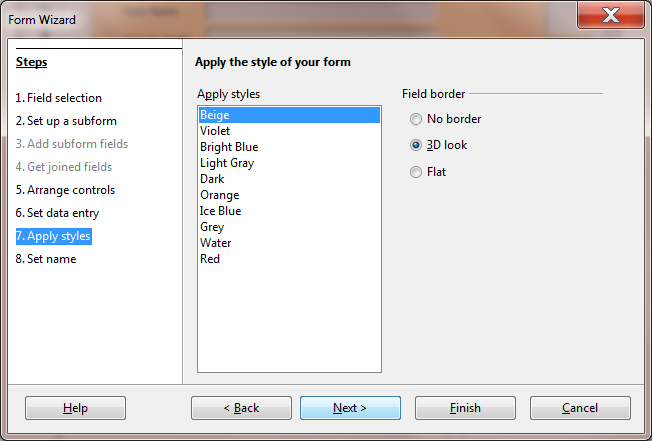
>
> Fig. 6.18 Selecting the Style for the Form background
>
> All that remains—**Step 8**—is to **name** the Form (**Student Records
> Form**) and make sure the **radio button** next to **Work with the
> form** is selected, then click on **Finish** (Fig. 6.19)

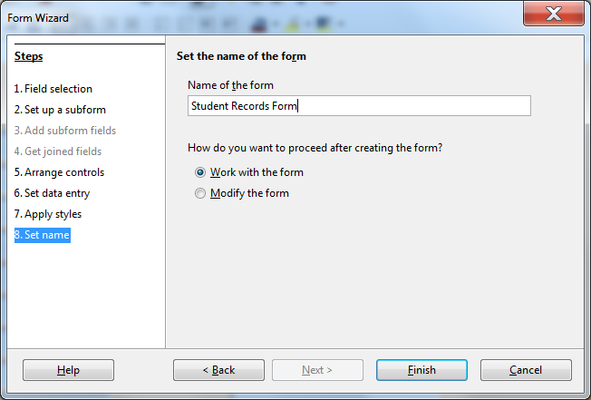

Fig. 6.19 Naming the database Form

*Base* finally presents the Student Records Database window, ready for
you to start filling out the individual records with student data (Fig.
6.20)

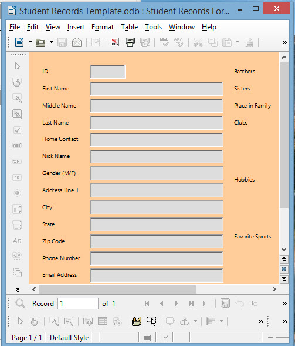

Fig. 6.20 The final look of the Student Records Database form

**6.6 adding records to A NEW or existing DATABASE**

**Creating a new database based on a Template database**

The Student Records Template is so named because you want to use this
same template document (with its table *Student Records Table*) and data
entry form (*Student Records Form*) over and over for class records in
the years ahead.

Before you start adding data about this year's students, you need to
create a new database using this template as the model. For the sake of
this exercise, you're going to call the new database *Fall Roster 2015*
(or some other appropriate name if you prefer). The name indicates that
the document will contain the database of student records for a Fall
2015 class.

The Template database should still be displayed on your screen. All you
need to do is *Save* the template with the new name Fall Roster 2015 and
you’re ready to add the data for the new class of students.

> In the **File menu** select **Save As…** and, in the **Save As dialog
> box**, type the file name **Fall Roster 2015** and click on the
> **Save** button

**Entering the data for the records in the database**

> The **Fall Roster 2015** database is open on your screen, so **click**
> in the **left hand frame** on **Forms** then, in the **Forms**
> **frame**, **double click** on **Student Records Form** to open it

Remember that each record in the Fall Roster 2015 database has a full
set of 19 entries for each student. You must enter a few records at this
stage (five will do for now) so that you can complete the rest of this
tutorial.

> Begin by selecting the **ID field** for **record \#1** and enter the
> number **1** as the **Primary Key** for the record (the next record
> will have the Primary Key of **2**, and so on—the **Primary Key field
> must be unique**) and hit the **Tab key** to move to the next field’s
> data entry box—the **First Name** field of **record \#1**
>
> Type in a **First Name** of a hypothetical student

The names don't have to be in any particular order since you can quickly
sort them later on. Check the name you just typed. Is it correct?

> If so, hit the **Tab** key again to proceed to the next field (you'd
> press **Shift-Tab** if you wanted to move to a previous field)

Notice that the data are now stored in the data entry box for the First
Name field in Record \#1. If you wanted to correct the data, you would
do so by clicking in the data entry box and then make any changes as if
you were in the word processor.

> Continue entering data for **Record \#1** (the data for the first
> student in a class roster); make up the data as you go along if you
> don't have actual students in mind

**Adding a New Record to the database**

> After you type the **last field entry** for each record, press
> **Tab**, and *Base* will automatically present a **new record Form**

*Base* will also automatically save each completed record into the
database on your disk, so you don’t have to worry about losing your work
as you go along, and you also won’t need to save the database at the
end.

> Type the entries into each field one by one, starting with the ID
> field which will contain the next number in sequence—**2**, if it’s
> the **second record** and so on; be sure to press the **Tab** key
> after each entry to get to the next field (eventually you should have
> **at least 5 records** in the **Fall Roster 2015** database)

Adding a record to an existing database is just the same. New records
are always added at the end of the database. If you want the new record
to appear in a specific place in the Datasheet view you would use the
Sort function. You'll learn how to do this in Lesson 7.

The new record will always have the same layout and format
characteristics as the others in the database. Also, remember that
*Base* automatically saves a new record in the database after you have
filled in the data for every entry.

**6.7 VIEWING THE DATA IN THE DATABASE**

Here are some of the ways to move about in a database. *Base* makes it
easy for you to get around. Take a few moments to move from field to
field and from record to record. Try these exercises.

> Click anywhere in the **data box** next to a **field name**

This allows you to edit or add data if needed.

> Hit the **Tab** key to move to the **next field** in the **same
> record**
>
> To move to the **same field** in the ***next*** or ***previous***
> ***record***, click on the left or right arrows in the **Navigation
> tools** at the bottom of the Form window (Fig. 6.21)

> 

Fig. 6.21 The *Base* database navigation tools

In Lesson 7 you will learn other ways of searching through the database,
along with other ways of selecting sets of records from the database,
and so forth. For now, as a final exercise in Lesson 7, let's just learn
how to update the data in a Base database.

**6.8 UPDATING ENTRIES AND records IN the DATABASE**

The following exercises will give you the opportunity to practice
working with the data in the database.

**Updating the contents of a field (one item of data in a student
record)**

> You should still be looking at the **Student Records Form**

To delete, or otherwise change, the contents of a field in a record,
click on the field data entry box, then erase characters or words in the
same way as you would if you were in the word processor.

**Deleting (clearing) a record**

In order to delete a single record from a database, you need the Form
Navigation toolbar, which should already be open at the bottom of the
database Form, along with the other toolbars relevant to a *Base*
database Form (Fig. 6.22).

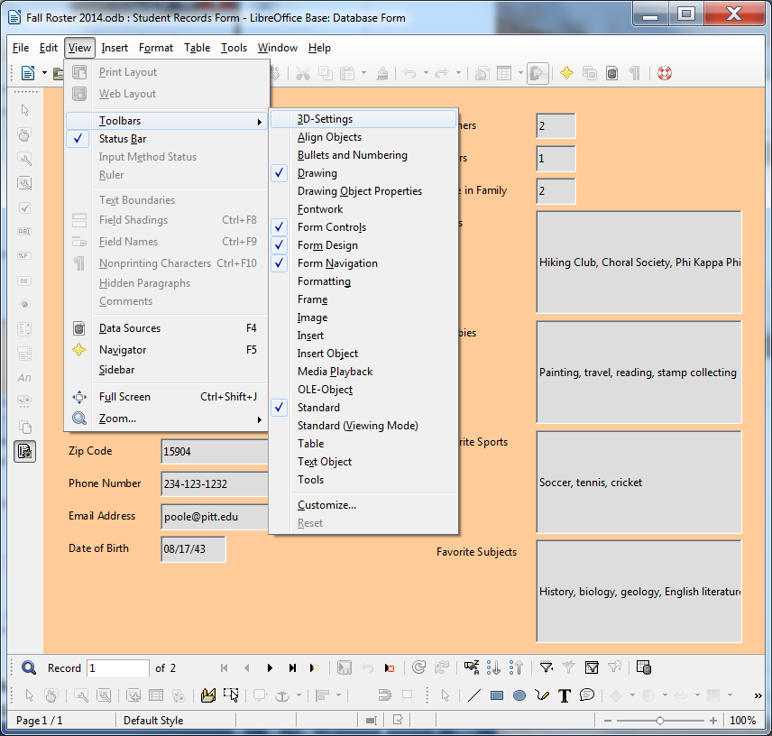

Fig. 6.22 The Form toolbars

> If these toolbars are not available in the Fall Roster 2015 database
> Form, go to the **View menu** > **Toolbars** and make sure you
> select each of the **Form toolbars** in turn—the **Form Controls**
> toolbar, the **Form Design** toolbar, and the **Form Navigation**
> toolbar (click to put a **check mark** next to each of them, as
> illustrated in Fig. 6.21 on the previous page)

Now try this to practice deleting a record from the database.

> 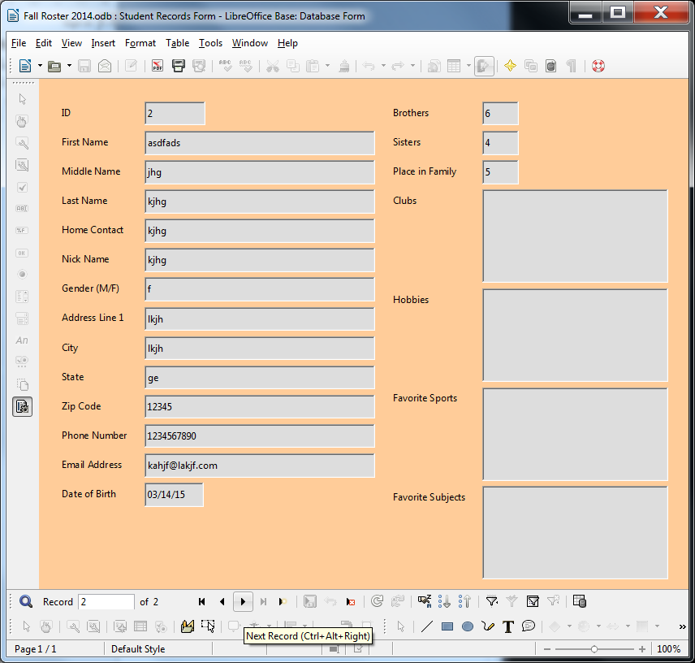In the **Navigation toolbar** (the upper of
> the two toolbars at the bottom of the Form window), click on the
> **record control tools** to select **Record \#2** in the **Fall Roster
> 2015** database (Fig. 6.23)

Fig. 6.23 Selecting a specific record in the database

> In the **Navigation toolbar**, click on the **Delete Record** tool

*Base* will warn you that you are about to delete a record (Fig. 6.24).

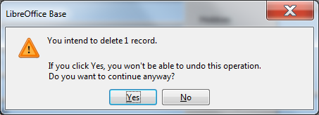

Fig. 6.24 Alert to inform you that deleting a record is undoable

This gives you the opportunity to change your mind, which you need to do
in this case. *Base* will otherwise immediately permanently remove the
record if you click on *Yes*.

> Click on **No** in the dialog box

**Deleting several records at once**

It’s easiest to use the Table View to clear several records that are
listed next to each other. To delete a block of records at one time
here’s what you do.

> In the **File menu** select **Close** to close the Fall Roster 2015
> database Form, then, in the **Database frame** on the **left hand
> side** of the Fall Roster 2015 window, click on the **Tables icon**,
> and then **double click** in the Tables section on **Student Records
> Table**
>
> Now, in the **left hand margin** of the Table, click to select
> **Record \#2**, then hold down the **Shift key** while you click in
> the left hand margin to select **Record \#4** (**Records 2, 3, and 4**
> should now be highlighted—Fig. 6.25)
>
> 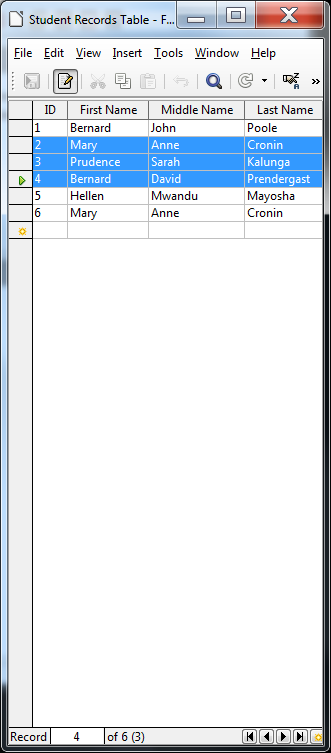
>
> Fig. 6.25 Selecting several records for deletion
>
> In the **Navigation toolbar**, click on the **Delete Record** tool

Again you will get a warning (see Fig. 6.24 above) that you are about to
delete however many records you have selected, and will ask you if you
are sure you want to do this.

> You don’t, so click on **No** in the dialog box

Bear in mind that the Delete Record command completely removes a record,
such that it is irretrievable once deleted.

**SKILL CONSOLIDATION**

Complete these exercises to reinforce what you have learned in Lesson 6.

1\. Design and create a database for the names, addresses, and telephone
numbers you have in your address book. Enter as many names and addresses
as you like (as long as you have at least 6). Don't forget to save the
database records as you go along.

2\. Add a couple of records to the database you created in exercise 1.
Clear a record.

3\. Add a field to the address book database—say Association (how are the
people associated to you—friend, colleague, etc.). Then enter the data
for each record for the new field.

4\. Imagine you are teaching a class and you want your students to do
research on a topic. Design and create a database around that topic. You
could discuss the fields with your students. The students would then go
off, do the research, and enter the data into the database as a basis
for a paper they must prepare. This would be a nice group (team)
exercise.

5\. Design and create a database for a Birthday List of your family and
friends. Include fields such as Name, Birthday, Greek sign, Favorite
color, Clothes sizes, Hobby, etc. Have at least 6 records in the
database, with each record containing at least 5 fields. Create a Form
for the database as well as a Table.

6\. Open the *Base* database Fall Roster 2015 and enter a complete new
record for a student named Jane Doe.

7\. Open the *Base* database named Template. Change the name to Grade
X.2015 so you won't lose the template, and add three (3) records. Then
save the updated database.
