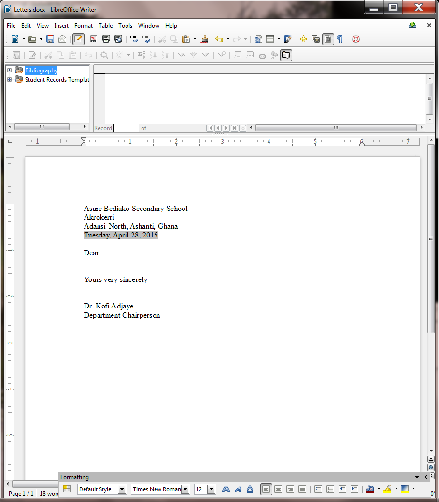
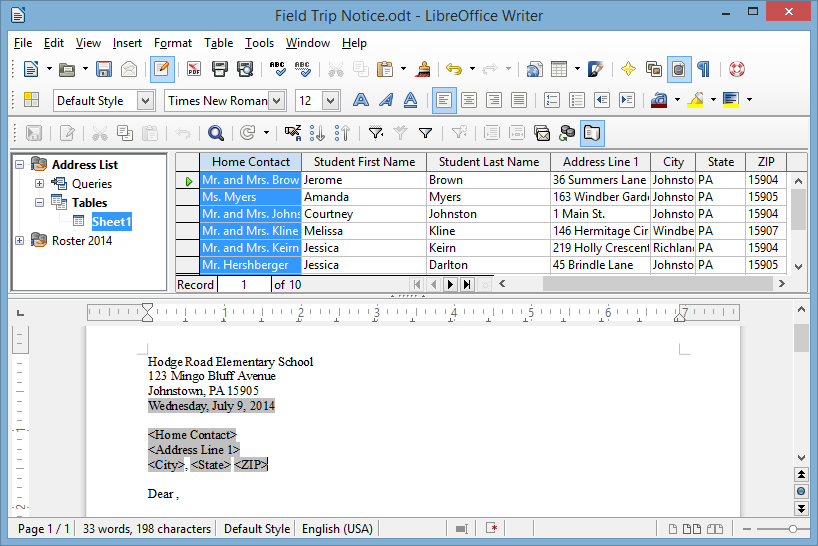
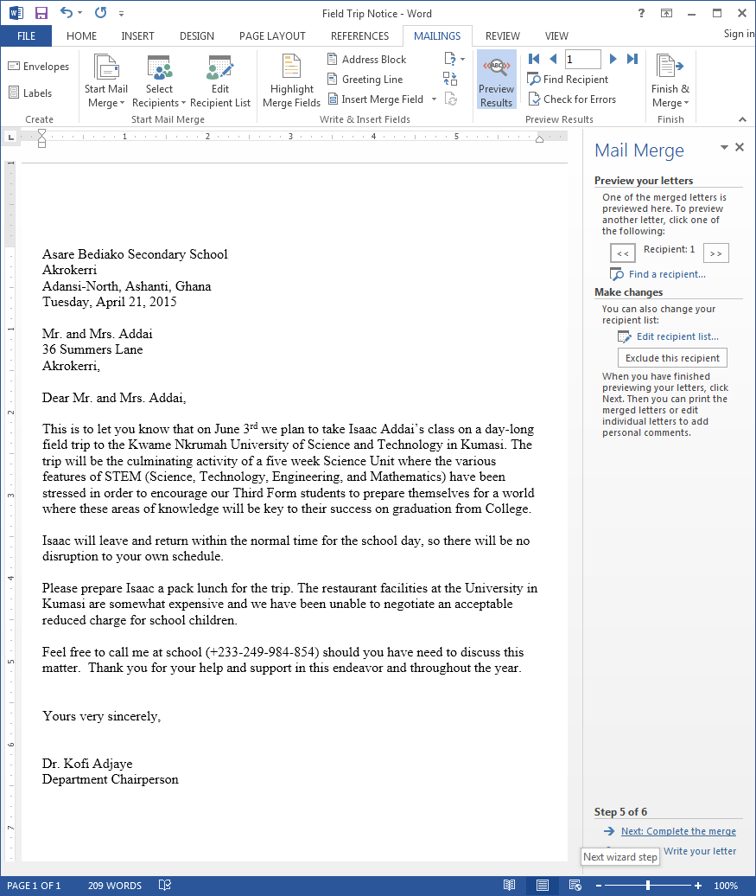
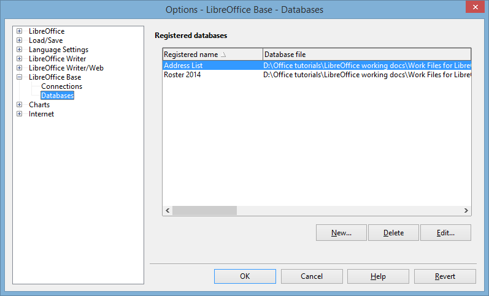
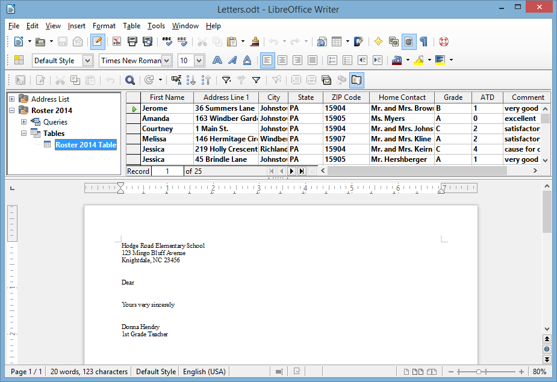
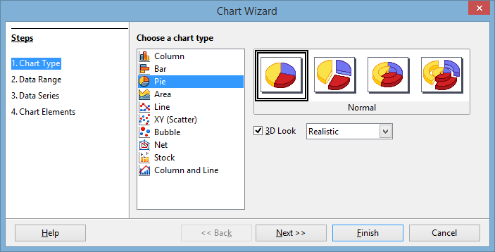

**Lesson 7** MAIL MERGE AND RELATED OPERATIONS
==============================================

  ------- ---------------------------------------
  **7**   **MAIL MERGE AND RELATED OPERATIONS**
          
          Form Letters and Mailing Labels
  ------- ---------------------------------------

**LEARNING OUTCOMES**

In this tutorial you will complete the following Mail Merge tasks[^1]:

> • prepare a data source document (a *LibreOffice Base* database) for a
> form letter;
>
> • create the form letter;
>
> • prepare a set of field trip notices;
>
> • prepare mailing labels;
>
> • prepare a new form letter using a macro and an existing data source
> document (a *LibreOffice Base* database).

**BEFORE YOU BEGIN**

**Setting up for the tutorial**

If you completed Lesson 1 of these tutorials, you can skip the rest of
this section and proceed directly to the next section (*7.1 Preparing an
Address List in Calc—next page*). If you did *not* complete Lesson 1,
then you must do this now, before proceeding with the rest of Lesson 7.

The set of *Work Files for LibreOffice* ideally should be stored on a
Flash drive (USB drive) in three folders named *Base Files*, *Impress
Files*, and *Miscellaneous Files*. You need to create a fourth folder
for the *data files* that you will be creating while working your way
through the tutorials. This fourth folder will be called *Data Files*.

Here are the steps to prepare these folders now before proceeding with
this tutorial.

> First, **Unzip** the set of **Work Files for LibreOffice** by **double
> clicking** on the File name on your computer (your instructor will
> help you with this if you are working with a class) and **Extract**
> them onto your flash drive
>
> **Double click** on the **Work Files for LibreOffice** folder to
> **open** it

Now, inside the *Work Files for LibreOffice* folder you need to create a
new, *fourth,* folder called *Data Files.* Here’s how you do this.

> **I**n the **Work Files for LibreOffice folder**, select **New
> Folder** (Fig. 7.1).

Fig. 7.1 Creating a New Folder

The system will create a new folder for you and then wait for you to
give it a name of your choice (Fig. 7.1 above).

> Call the new folder **Data Files**

During the course of these tutorials you will be storing many files in
this Data Files folder.

**7.1 PREPARING aN Address List IN *CALC* **

This exercise will show you how to create an address list data source
document using the *Calc* spreadsheet, which you will then convert into
a *Base* database for the purpose of merging the data with a form
letter.

**Entering the data for the Address List spreadsheet**

> Start by **open**ing a new ***LibreOffice*** **Calc** spreadsheet
>
> Now go to **File** > **Save As…**, navigate to your **USB drive**
> > **LibreOffice Work Files** *>* **Data Files** >
> **Spreadsheet Documents** and **Save** the spreadsheet with the name
> **Address List**
>
> In the new **Address List spreadsheet**, across the **first row**
> (**row 1**) enter the following **eight (8) column headers**:
>
> Header for **row 1, Column A:** **ID**
>
> Header for **row 1, Column B:** **Home Contact**
>
> Header for **row 1, Column C:** **Student First Name**
>
> Header for **row 1, Column D:** **Student Last Name**
>
> Header for **row 1, Column E:** **Address Line 1**
>
> Header for **row 1, Column F:** **City**
>
> Header for **row 1, Column G:** **State**
>
> Header for **row 1, Column H:** **Zip Code**

When you are done, the column headers in your spreadsheet should look
like Figure 7.2.

Fig. 7.2 Naming the column headers for the data source document

In lessons 4 and 5 you learned how to widen columns. if your columns are
too narrow for the column headers here and there, go ahead and make them
wider, as in Fig. 7.2 on the previous page.

The ID field (column A) will start with the value 1 (one) and increase
by 1 for each record (this will be the *Primary Key* when you convert
the spreadsheet into a *Base* database).

> Type in the data for the **first record**—starting with the value
> **1** for the **ID**; then make up data for each of the other fields
> in the appropriate column of the spreadsheet, starting in **column B**
> with the **Home Contact** (the name of the student’s parents or other
> guardian—Mr. and Mrs. Brown, for example)
>
> After the first (Home Contact) entry, hit **Tab**, then type a
> **Student First Name**, and so on across the spreadsheet row
>
> After you type in the **Zip Code**, the last entry for the **first
> record**, click in the **ID** field for **record \#2**, enter the ID
> value **2**, and carry on entering appropriate data till you have
> entered the data for **all 10 records** (or for as many students as
> you have in your class if you are a practicing teacher)
>
> After you have entered the data for at least **ten** records, **Save**
> the spreadsheet

**7.2 converting the *Calc* spreadsheet to a *base* database**

The next step in our mail merge process involves converting the Address
List spreadsheet, which you just created, into a *Base* database data
source object—which is necessary if you want to merge the data source
with a *Writer* form letter. Here are the steps to do this.

> In the **File menu** select **New** and, in the menu of *LibreOffice*
> applications, select **Database** (Fig. 7.3)

Fig. 7.3 Opening a new database

This will bring up the Database Wizard (Fig. 7.4).

Fig. 7.4 The *LibreOffice* Database Wizard

> In **Step 1** of the Wizard (**Select Database**), click to select the
> **radio button** next to **Connect to an existing database** (Fig. 7.4
> above), then click on the **down arrow** in the accompanying data box
> and, from the list of **different application types** that pops up,
> select **Spreadsheet** (Fig. 7.4 above) and click on **Next>>**
> to go to Step 2 of the Database Wizard
>
> In **Step 2**, click on **Browse** and, in the **Open** dialog box
> that pops up, in your **Work Files for LibreOffice** > **Data
> Files** > **Spreadsheet Documents** folder, **double click** on
> **Address List** to put it in the **Location and file name** data box
> (Fig. 7.5)

Fig. 7.5 Setting up a Spreadsheet connection

> Click on **Next >>**, then in **Step 3** of the Wizard, leave
> the selections as they are (Fig. 7.6), leave the **radio button** next
> to **Yes, register the database for me** checked, and also leave
> checked the box next to **Open the database for editing**, then click
> on **Finish**

Fig. 7.6 Final step in converting the Address List data source to a
*Base* database

> The Wizard will ask you to **Save** the new database, so click on
> **Save**, navigate to your **USB drive** > **Work Files for
> LibreOffice** > **Data Files** > **Database Documents folder**,
> name the database **Address List**, and click on **Save** again

The new *Base* database will open on your screen (Fig. 7.7).

Fig. 7.7 The new *Base* database data source

> Make sure **Tables** is selected in the **Database frame** (see Fig.
> 7.7 above), then **double click** on **Sheet1** to open the **Table**
> so that you can check that the **Address List data** has been
> correctly **imported** from the **spreadsheet** you created at the
> beginning of this exercise (Fig. 7.8 shows data created for this
> lesson by the author; yours will be different)

Fig. 7.8 The Address List imported to the *Base* database

Assuming everything looks good, you are ready to proceed with the next
step in the mail merge process, which involves the creation of the Form
Letter.

**7.3 CREATING the form letter (THE FIELD TRIP notice)**

Step 4: creating the Field Trip Notice into which will be merged the
records that you have prepared in the Address List database.

Fig. 7.9 on the next page shows the complete contents of this Field Trip
Notice letter.

> **Don't start typing it just yet**—follow the directions on the
> ensuing pages in order to avoid making mistakes.

You’re going to begin by opening, and renaming, a *Writer* template
document called *Letters*, which is already stored in the *Work Files
for LibreOffice folder* on your USB drive.

> In the **File** menu select **Open**, then navigate to your **USB
> drive** > **Work Files for LibreOffice** > **Miscellaneous
> Files** > **Merge Documents**, and **double click** on the
> **Letters** document to open it
>
> Now, in the **File** menu select **Save As…**, navigate to the **Work
> Files for LibreOffice** > **Data Files** > **Writer Documents**
> folder, type **Field Trip Notice** for the new document name, then
> click on **Save**

You are now ready to use *Writer’s* mail merge tools to produce a
customized, that is to say *individualized*, letter to send to the
parents or guardians of each student in your class.

In Fig. 7.9, the placeholders (where the field names are enclosed by the
**&lt; … >** symbols) indicate the place in the form letter where
data from the Address List database, which you created in the previous
exercise, will be merged with each of the letters in order to
personalize them.

**DO NOT START TYPING YET!** Bookmark this page. The exercises on the
next page explain how to proceed. Follow the steps carefully.

Fig. 7.9 The final version of the Field Trip Notice form letter

**Inserting the date**

The unedited Field Trip Notice document is open on your screen with the
bare bones of the form letter (the school address at the top, the
beginning of the salutation “Dear”, and the conclusion (Yours sincerely,
etc.).

You need to put the date at the top of your *Field Trip Notice*
document, immediately after the address, which, in a real situation,
would be the official address of the school where you are a teacher.

> Position the cursor on the **blank line** immediately **after** the
> **address** at the top of the page, then, in the **Insert** menu
> select **Fields** > **Date**

You should now have the date displayed in your form letter right after
the school address at the top of the page. You’ll maybe recall from
Lesson 1 that the default all-numeric format for the date can be
confusing in other countries, so you need to select a style that is
unambiguous.

> **Right click** on the inserted date and, in the **context menu**,
> select **Fields…** then, in the **Edit Fields dialog box**, click on
> the **date format** that looks like **Friday, December 31, 1999** and
> click on **OK** (Fig. 7.10)

Fig. 7.10 Insert Date feature of LibreOffice

That takes care of the date format.

**Viewing the Data Source for the Field Trip Notice**

Now it’s time to connect your Field Trip Notice to the Address List
database that you created in the previous exercise (Section 7.3 of this
tutorial).

> In the **View** menu, select **Data Sources**

You should now have a new window right at the top of your screen, at the
top of the page, showing, on the left, a list of the databases you have
registered with *LibreOffice*.

The *Address List* is the database you want to use with the Field Trip
Notice.

> In the list of registered databases, click on the **small + (plus
> sign)** to the immediate **left** of **Address List** to show
> **Queries** and **Tables** (Fig. 7.11 on the next page)
>
> Now click on the **small + (plus sign)** to the immediate **left** of
> **Tables** to show **Sheet1**

*Sheet1* contains the data that you imported into the database from the
Address List spreadsheet you created in Section 7.3 of this tutorial.

> Click on **Sheet1** and wait while *LibreOffice* fetches all the data
> **from the Sheet1 table** and displays the data as a table in the
> window **above** the form letter and **to the right** of the list of
> registered databases (Fig. 7.11, again your data will be different)

Fig. 7.11 Viewing the *LibreOffice* Data Sources

**Inserting fields (placeholders) into your form letter **

In the Figures that follow, ignore the data you see because yours will
be different.

You are now going to insert into the form letter the first set of
placeholders—for the receiver's (recipient’s) name and address—the
receiver is the parent or guardian of one of your students.

The receiver's address, after your own (school) address at the top of
the letter, will start with the **Home Contact** field. So you need to
tell *Writer* to merge the form letter with the corresponding data from
the *Address List* database. Here is how you do this.

> In the form letter, use the mouse to position the cursor on the empty
> line ***immediately above*** the salutation: "**Dear**" and press
> **Enter** to space down **one line**
>
> Use the mouse to drag the *title* **Home Contact** down to the correct
> position for the **Home Contact** in the first line of the recipient’s
> address (Fig. 7.12)

Fig. 7.12 Dragging the Home Contact merge field down into the form
letter

*Writer* quickly displays **&lt;Home Contact>** in the body of the
form letter immediately above the salutation “Dear” (with the brackets
around it as you see here—you never need to type the brackets with Mail
Merge). Now, when eventually the letters (all ten of them) are printed
out, the correct name of each student’s parent or guardian will be
copied from the Address List database and inserted into this position in
the letter.

Next you need to add the remaining placeholders for the Home Contact’s
address (see Fig. 7.12 previous page).

> The cursor should be waiting **at the end of &lt;Home Contact>**,
> so press the **Enter** key to move to a new line
>
> Once again, use the mouse to drag the *title* **Address Line 1** down
> to the correct position on the **new line** after **&lt;Home
> Contact>** (which will be the second line of the form letter
> recipient’s address)

*Writer* adds the new merge field to the address.

> Press the **Enter** key to move to a new line, use the mouse to drag
> the *title* **City** down to the correct position on the **new line**
> after **&lt;Address Line 1>** (which will be the third and last
> line of the form letter recipient’s address)
>
> Now **stay on the same line**, type a **comma (,)** followed by a
> **space**, and use the mouse to drag the *title* **State** down to the
> correct position on the **last line** of the recipient’s (Home
> Contact’s) address
>
> Hit the **space bar once**, then use the mouse to drag the *title*
> **Zip** down to the correct position at the end the **last line** of
> the recipient’s (Home Contact’s) address

This rounds off the address that is to be merged with the Field Trip
Notice form letter, which should now look like Fig. 7.13.

Fig. 7.13 Form letter after merging the recipient’s address and
salutation

> Press the **Enter** key to space down after the address

So far, so good. Next you need to put a placeholder for the **Home
Contact** after the salutation **Dear…** at the beginning of the letter
(Fig. 7.13 above).

> Put the cursor *right after* the word **Dear**, then press the **Space
> bar** to space over **one space** and use the mouse to drag the
> *title* **Home Contact** down to the correct position after the
> salutation **Dear…**

By now you should be getting the idea of how to insert merge fields into
the Field Trip Notice as you go along.

Refer to the **Field Trip Notice letter** (Fig. 7.9 on page 196) as you
complete the form letter.

> Type the remaining text of the **Field Trip Notice** letter
> illustrated in Fig. 7.9, inserting the merge placeholders where
> indicated
>
> Be sure to put a **space** ***before*** and/or ***after* each
> Placeholder** so that the data will be correctly spaced grammatically
> in the final version of the letter
>
> When you have finished, **Save** the **Field Trip Notice** form letter
> once more

**7.4 Printing the FIELD TRIP NOTICE**

Before printing your Field Trip Notice letters on paper (hard copy),
it’s always a good idea to preview them on the screen (soft copy), with
the appropriate data filled in for each version of the letter, so that
you can confirm that the data from the Address List source document has
been correctly merged with the form letter. In *LibreOffice*, this is
all part of the Print function.

> From the **File** menu select **Print**

*LibreOffice* immediately recognizes that the Field Trip Notice document
contains Address List database fields and asks you to confirm that you
want to print a form letter (Fig. 7.14).

Fig. 7.14 Prompt to confirm form letter

> Click on **Yes**

After a few seconds, you are presented with the Mail Merge dialog box
(Fig. 7.15).

Fig. 7.15 Mail Merge dialog box

You want the output to go to a File. You also want to save the merged
document as a *single document* which will contain all 10 of the Field
Trip Notices, each one individually tailored to the *Home Contact* of a
different student in the class.

> Click on the **radio button** next to **File** to **select** that
> option and leave the **radio button** next to **Save as single
> document** selected (Fig. 7.15 on the previous page) then click on
> **OK**

*LibreOffice* now displays the *Save As* dialog box, prompting you to
*Name* the Field Trip Notice merge file and decide where you want to
save it.

> In the **Save As** dialog box, navigate on your **USB drive**, to your
> **LibreOffice Work Files** > **Data Files** > **Writer
> Documents** folder, then, in the **File name:** data entry box, type
> **Field Trip Notice Merge Letters** and click on the **Save** button

The document *Field Trip Notice Merged Letters* is several pages long—at
least 10 if each letter fits on one page, but 20 if each letter flows
over onto a second page. Saving the merged letters is a good idea. It
means that you have a copy of the final version of the updated letters
for your records—a customary practice with regard to professional
correspondence.

**Previewing your letters on screen**

You’re nearly there. But first you need to take a look at the Field Trip
Notice Merge Letters to check that the data from the Address List has
been correctly merged with the file.

> Go to **File** > **Open** and **double click** on the **Field Trip
> Notice Merge Letters** file to **Open** it
>
> This a long document, containing **all ten** of the field trip
> notices, so **scroll through to the end** to check **(a)** that there
> are indeed 10 letters (or however many you records you entered into
> the Address List database) and **(b)** that each letter has the
> appropriate merged data

Notice how the data from the Address List has been merged into each of
the letters, giving each letter a personalized appearance (Fig. 7.16 on
the next page).

**Editing (further customizing) the recipients’ letters**

At this stage, you could do some final editing of the individual letters
(the Field Trip Notices), prior to printing them as hard copy. The set
of notices are all saved in one file and you can “visit” each letter and
add a comment here or there which pertains to a particular student or
the Home Contact.

For example, you could add a sentence to each letter saying something
special about the student. This would further individualize the letters,
giving parents the sense that the letter they receive is unique to them.
In this way you can further personalize what is, in fact, a form letter.
This is always a good thing to do, if you have the time.

> After you have checked **all ten** of the Field Trip notices, and made
> any final edits or personal touches you want, **Save** the **Field
> Trip Notice Merge Letters** document

Fig. 7.16 The Field Trip Notice Merged Letters

**Saving a PDF version of the merged Field Trip Notices**

Now is the time to convert the merged Field Trip Notices to PDF format.

At this stage, you have the Field Trip Notice merged with the Address
List database and safely saved as a *LibreOffice* *Writer* document. But
it would be a good idea to save the document as a PDF file, before going
on to print the letters as hard copy (on paper) or soft copy (on the
screen).

PDF stands for “Portable Document Format” and it was designed to allow
for easy sharing a documents across different computers and operating
systems. In other words, a PDF file, once saved, keeps its
formatting/layout no matter where it might be viewed or printed. It is a
more reliable format for all kinds of different types of documents.

Converting a document to PDF format is very easy to do. Essentially,
you’re going to repeat the steps you took when you completed the merge
of the Address List data into the Field Trip Notices merged document.

> The **Field Trip Notice** merge document should still be open on your
> screen, but if it is not, from the **File** menu select **Open** and
> **double click** on the file **Field Trip Notice** to **open** it
>
> Go to **File** > **Print** and, in the dialog box that pops up
> asking you to confirm that this is a **form letter** that you want to
> **print**, click on **Yes**
>
> In the **Mail Merge** **dialog box** that comes up next, click on the
> **radio button** next to **File** to **select** that option
>
> Leave the **radio button** next to **Save as single document**
> selected (Fig. 7.15 on page 200 above) then click on **OK**

The *Save As* dialog box comes up on the screen and you are asked to
name the document and decide where you want to save it. This time you’re
going to save the document as a **PDF file**, so here is how you do
that.

> In the **Save As Type:** data entry box, click on the **down arrow**
> next to **Save as type:** and, in the **menu of file types** that pops
> up, click on the option for **PDF - Portable Document Format (.pdf)**
> (Fig. 7.17)

Fig. 7.17 Selecting the PDF file type for the Field Trip Notice merged
document

> Make sure you are saving to your **LibreOffice Work Files** >
> **Data Files** > **Writer Documents** folder (Fig. 7.17 above)
>
> Now, in the **File name:** data entry box, type **Field Trip Notice
> Merge Docs** and click on **Save**, then wait while the Mail Merge
> Wizard’s **Print Monitor** saves the ten Field Trip Notices in PDF
> format (Fig. 7.18)

Fig. 7.18 Saving the PDF version of the Field Trip Notices

**Printing the PDF version of the Field Trip Notices**

> You no longer need the **Field Trip Notice *Writer* document**, so
> **close** it, then go to **File** > **Open** and **open** the
> **Field Trip Notices Merge Docs** document (the **PDF** file)

In the left hand frame of the PDF window, you are now presented with
thumbnails for each of the ten Field Trip Notices. On the right hand
side of the window, you can see the *first* of the 10 Field Trip Notices
containing all the merge field data from the first record in the Address
List database (Fig. 7.19).

Fig. 7.19 Printing the PDF version of the letters with the Merge Fields
filled in

> In the **left hand frame** of the **PDF document** (Fig. 7.19 above),
> click in turn on each of the **thumbnails** of all **ten versions** of
> the **Field Trip Notice** to scan through the recipients' letters and
> confirm that the correct data has been merged with each one
>
> If you intend to print out the Notices on paper, assuming all is well,
> and assuming you have a printer connected to your computer and turned
> on (with paper in the hopper), go ahead and click on **File** *>*
> **Print***…* and *Writer* will print the 10 form letters
>
> **Close** the **Field Trip Notice** **Merge Docs** PDF document when
> you are done

**7.5 Preparing mailing labels**

Mailing labels are like those Return-Address stickers you put on the
outside of your envelopes, or those address stickers that you sometimes
find on mass-mailed items that you perhaps have received in the mail.
Producing them is simple enough, especially if you have completed all
the tutorials up to this point.

**Deciding on the data for the mailing label**

*Writer* Merge documents, such as mailing labels, are always linked to a
database. We’ll keep it simple for now, so you’ll use the *Address List*
database you created for the *Field Trip Notice* form letter. You know
by now how to create your own database of addresses, so you could create
an address list of your own; in fact you probably have an electronic
address list which you could, if you wanted, use for this exercise.

First you need to open a new *Labels* document.

> Go to **File** > **New** > **Labels**

You should see the Labels dialog box on your screen (Fig. 7.20).

Fig. 7.20 The new Labels dialog box

You now need to make selections in the *Database*, *Table*, and
*Database field* data entry boxes. You will also move into the Label
Text box a complete set of *Address List database fields* for the Home
Contact address, and you have to select the *Brand* and *Type* of
mailing label you want to use (Fig. 7.20 previous page).

Fig. 7.21 shows the Labels dialog box after you have completed these
tasks.

Fig. 7.21 The Labels dialog box after filling out the various entries

The following directions will step you through this process of filling
out the Labels dialog box; follow them carefully. Notice, in Fig. 7.21,
that you are going to lay out the Recipient address as it would appear
on an envelope—as a *mailing label*.

> In the **Database entry box**, click on the **down arrow** at the end
> of the data entry box and, from the list of **databases**, select
> **Address List**
>
> Now, in the **Table entry box**, click on the **down arrow** at the
> end of the data entry box and, from the list of **Tables**, select
> **Sheet1**

Next you have to set up the layout for the recipient (Home Contact)
address for the mailing label.

> In the **Database field entry box**, click on the **down arrow** at
> the end of the data entry box and, from the list of **database
> fields**, select **Home Contact**, then click on the large arrow to
> **transfer** the **Home Contact field** across to the **Label Text
> area**
>
> Click on the **Enter** key to move the cursor to a **new line**
>
> Again, in the **Database field entry box**, click on the **down
> arrow** at the end of the data entry box and, from the list of
> **database fields**, select **Address Line** **1**, then click on the
> large arrow to transfer the **Address Line 1 field** across to the
> **Label Text area**
>
> Click on the **Enter** key to move the cursor to a **new line**
>
> In the **Database field entry box**, click on the **down arrow** and,
> from the list of **database fields**, select **City**, then click on
> the large arrow to transfer the **City** field across to the **Label
> Text area**
>
> Type a **comma** after the **City** field, then hit the **space bar **
>
> In the **Database field entry box**, click on the **down arrow** and,
> from the list of **database fields**, select **State**, then click on
> the large arrow to transfer the **State** field across to the **Label
> Text area**
>
> Hit the **space bar** to space after the **State** field
>
> Finally, in the **Database field entry box**, click on the **down
> arrow** and, from the list of **database fields**, select **Zip**,
> then click on the large arrow one last time to transfer the **Zip**
> field across to the **Label Text area**

**Selecting the standard format for the mailing label**

The mailing labels are now filled with the database fields; all that
remains is to tell *LibreOffice* what standard *format* you want them to
have for your Field Trip Notices envelopes.

We’re going to go with *Avery A4* for the *Brand* and *C2160 Avery
Inkjet Label* for the *Type*. But the label format doesn’t have to be
*Avery A4*, of course.

If you already have sheets of mailing labels that you intend to use for
this exercise, check out the box they come in and look for the Company
Brand and Type of label. Then look up the appropriate Brand and Label
Type in the menus that pop up when you click on the down arrows for the
respective data entry boxes.

So, for your own purposes you can select any option you like; otherwise,
for the sake of this tutorial go with the selections that follow for
now.

> In the **Format area** of the **Labels** dialog box (Fig. 7.20
> previous page), leave the **Sheet** option already selected
>
> In the **Brand** data entry box, click on the **down arrow** to bring
> up the menu of **standard** company mailing label formats and select
> the **Avery A4** option
>
> Then, in the **Type** data entry box, select **C2160 Avery Inkjet
> Label**
>
> In the **Labels** dialog box, click on the **Options** tab, and be
> sure to click to put a **check mark** next to **Synchronize contents**
> to ensure that all the labels are merged with the **Address List
> database**
>
> Finally click on **New Document**

Immediately, *LibreOffice* presents a sheet of mailing labels with all
the database fields laid out as per the design you specified in the
Labels dialog box (Fig. 7.22).

Fig. 7.22 The template mailing labels sheet

> Click on the **Synchronize Labels** button (Fig 7.22), then go to
> **File** > **Save As…**, navigate to your **USB drive** > **Work
> Files for LibreOffice** > **Data Files** > **Writer Documents**
> folder and **save** the new document with the name **Field Trip
> Notice** **Merged** **Mailing Labels**

**Previewing your mailing labels on screen**

Now you are ready to go ahead and *preview* the sheet of mailing labels
with all the data from the database, which you should always do before
sending them to the printer.

> From the **File** menu select **Print**

As before, *LibreOffice* immediately recognizes that the *Field Trip
Notice Merged Mailing Labels* document contains *Address List* database
fields and asks you to confirm that you want to print a form letter.

> Click on **Yes**

After a few seconds, you are presented with the Mail Merge dialog box
(Fig. 7.23).

Fig. 7.23 Mail Merge dialog box

You want the output to go to a File. You also want to save the merged
document as a *single document* which will contain all 10 of the Field
Trip Notice Mailing Labels, each one individually tailored to the *Home
Contact* of a different student in the class.

> Click on the **radio button** next to **File** to send the **output**
> to a **File**, and leave the **radio button** next to **Save as single
> document** selected (Fig. 7.23 above) then click on **OK**

*LibreOffice* now displays the *Save As* dialog box, prompting you to
*Name* the merge file and decide where you want to save it.

> In the **Save As** dialog box, navigate, on your **USB drive**, to
> your **LibreOffice Work Files** > **Data Files** > **Writer
> Documents** folder, then, in the **File name:** data entry box, type
> **Field Trip Notice Merged Mailing Labels** as before and click on the
> **Save** button
>
> *LibreOffice* will ask you if you want to save the file with the same
> name as the existing file, which you do, so click on **Yes** then
> **Close** the **Field Trip Notice Merged Mailing Labels**

As noted above, it’s always a good idea to take a look at the Field Trip
Notice Mailing Labels to check that the data from the Address List has
been correctly merged with the file.

> Go to **File** > **Open** and **double click** on the **Field Trip
> Notice Merged Mailing Labels** file to **Open** it

Notice how the data from the Address List has been merged into each of
the mailing labels, giving each label a customized look.

Check out the layout and content of the mailing labels. If you had many
addresses in your Address List you might need to scroll to check them
all out, or you could check out individual addresses by clicking on
*Ctrl-f* to *Find* a recipient… This isn't necessary for this exercise
since you have only a few (10) names and addresses in your Address List.

> You don’t need the **Field Trip Notice Mailing Labels** file for the
> exercise that follows, so go ahead and **Close** it, but keep open the
> **Field Trip Notice *Merged* Mailing Labels** document

**Saving a PDF version of the merged Field Trip Notice Mailing Labels**

Now is the time to convert the Field Trip Notice Merged Mailing Labels
to PDF format so that you will have a version in that format for
printing purposes. You’ll recall that PDF stands for “Portable Document
Format” and it was designed to allow for easy sharing a documents across
different computers and operating systems. In other words, a PDF file,
once saved, keeps its formatting/layout no matter where it might be
viewed or printed. It is a more reliable format for all kinds of
different types of documents.

Converting a document to PDF format is very easy to do. Essentially,
you’re going to repeat the steps you took when you completed the merge
of the Address List database into the Field Trip Notice Merged Mailing
Labels document. Here’s a reminder of the steps to do this.

> The **Field Trip Notice Merged Mailing Labels** document should still
> be open on your screen, but if it is not, from the **File** menu
> select **Open** and **double click** on the file **Field Trip Notice
> Merged Mailing Labels** to **open** it
>
> Go to **File** > **Print** and, in the dialog box that pops up
> asking you to confirm that this is a **form letter** that you want to
> **print**, click on **Yes**
>
> In the **Mail Merge** **dialog box** that comes up next, click on the
> **radio button** next to **File** to **select** that option
>
> Leave the **radio button** next to **Save as single document**
> selected (Fig. 7.23 on page 209 above) then click on **OK**

The *Save As* dialog box comes up on the screen and you are asked to
name the document and decide where you want to save it. This time you’re
going to save the document as a **PDF file**, so here is how you do
that.

> In the **Save As Type:** data entry box, click on the **down arrow**
> next to **Save as type:** and, in the **menu of file types** that pops
> up, click on the option for **PDF - Portable Document Format (.pdf)**
> (Fig. 7.24)

Fig. 7.24 Selecting the PDF file type for the Field Trip Notice merged
document

> Make sure you are saving to your **LibreOffice Work Files** >
> **Data Files** > **Writer Documents** folder (Fig. 7.24 above)
>
> Now, in the **File name:** data entry box, type **Field Trip Notice
> Merged Mailing Labels** (you can keep the same name since it’s a
> different **file type (PDF)** than the *Writer* version) and click on
> **Save**, then wait while the Mail Merge Wizard’s **Print Monitor**
> saves the mailing labels in **PDF format**

**Printing the PDF version of the mailing labels**

> Go to **File** > **Open** and **open** the **Field Trip Notice
> Merged Mailing Labels** document (the .**pdf** version)
>
> In the **right hand frame** of the **PDF document**, scan through the
> recipients' address on each of the labels and confirm that the correct
> data has been merged with each one
>
> If you intend to print out the mailing labels on paper, and assuming
> you have a printer connected to your computer, go ahead and click on
> **File** *>* **Print***…* and *Writer* will print the mailing label
> sheet(s) for you
>
> **Close** the **Field Trip Notice** **Merged Mailing Labels** PDF
> document when you are done

**7.6 PREPARING A NEW FORM LETTER USING AN EXISTING DATABASE**

By way of reinforcement of what you have learned in this lesson, let’s
prepare another form letter, this time using an existing database.

In your *Work Files for LibreOffice*/*Miscellaneous Files*/*Merge
Documents* folder there is a database called *Roster 2014*. It is a set
of records for a sample class of 25 students. You are going to use the
data in this database to prepare a form letter called *Mid Term Report*,
which will report to parents/guardians on their child’s progress-to-date
half way through a semester. You are going to have *Writer* merge the
*Mid Term Report* with the *Roster 2014* database.

First you need to open a Writer template as a basis for the report. The
template is called *Letters*.

> Go to **File** > **Open** > navigate to your **USB drive** >
> **Work Files for LibreOffice** > **Miscellaneous Files** >
> **Merge Documents** > and **double click** on **Letters** to
> **open** it

**Registering the Roster 2014 database**

You must register the *Roster 2014* database with *LibreOffice* before
you can use it to merge the *Roster 2014* data into the *Letters* merge
document. Follow these steps to do this.

> Go to the **Tools menu** > **Options…**, then in the **left hand
> frame** of the **Options window** select **LibreOffice Base** >
> **Databases** (Fig. 7.25)

Fig. 7.25 The Tools > Options dialog box

> In the **right hand frame**, in the **Registered databases** section,
> click on **New**

This brings up the *Create Database Link* dialog box (Fig. 7.26).

Fig. 7.26 Create Database Link dialog box

> In the **Create Database Link dialog box**, click on **Browse** and
> navigate to your **USB drive** > **Work files for LibreOffice**
> > **Miscellaneous Documents** > **Merge Documents** and **double
> click** on **Roster 2014** to put it in the **Registered name** data
> entry box (Fig. 7.26 above), then click on **OK**

Notice that the *Roster 2014* database is now in the *Registered Name*
list in the *Registered Databases* section of the *Options* dialog box
(Fig. 7.27).

Fig. 7.27 Adding *Roster 2014* to the list of registered databases

> Click on **OK** again to complete the **registration** of the **Roster
> 2014** database

The *Roster 2014* database is now a registered database and may be used
as a data source for the *Letters* document you are working with and
which should still be open on your screen.

> In the **View** menu select **Data Sources**, then, in the list of
> databases at **top-left** of the **Letters** window, click on the **+
> (plus sign)** next to **Roster 2014** and again on the **+ (plus
> sign)** next to **Tables** to bring up the **Roster 2014 Table** (Fig.
> 7.28)

Fig. 7.28 Viewing the *Roster 2014* data source

> Now, still in the top-left frame, click **once** on **Roster 2014
> Table**, then wait while the data from the **Roster 2014 database** is
> displayed **top-right** (Fig. 7.29)

Fig. 7.29 The Roster 2014 data displayed top right of the Letters window

**Creating the Mid Term Report form letter**

Next you are going to use the Letters *Writer* document (still on the
screen and also saved on your disk) to create a *Mid Term Report*
document which will go out to the parents of your students. The report
is illustrated in Fig. 7.29 on the next page. **Do NOT start typing the
report in yet**! You have a couple of other things to do to get set up
for the mail merge.

First you must save the *Letters* document with a different name so that
you will keep the copy of the *Letters* document as a template for
future use.

> Select **File** > **Save As…**
>
> **Change the name** of the **Letters** document to **Mid Term Report**
> (this will be the name of the form letter you are going to create),
> then navigate to your **USB drive** > **Work Files for
> LibreOffice** > **Data Files** > **Writer Documents folder** and
> click on **Save**

You are going to have *Writer* produce one letter for each student in
the *Roster 2014* class. As you can see, the form letter illustrated in
Fig. 7.30 on the next page reports to parents on how well their child is
doing half way through the semester.

You already told *Writer* that you want to merge the form letter with
the data stored in the *Roster 2014* database. The placeholders in Fig.
7.30 on the next page (where the field names are enclosed by the
&lt;…> brackets) indicate the location in the form letter where data
from the *Roster 2014* database is to be merged when the letters are
actually printed out.

Wherever you see a placeholder (&lt;…>), use the *mouse* to drag the
appropriate field header down from the data displayed top right as you
work your way through the letter.

You already completed a similar exercise earlier in this lesson. If you
are still unsure about what to do, you might like to check back at what
you did—section *7.3 Creating the form letter (the Field Trip Notice)*,
starting on page 195.

All that remains is for you to type the letter as it is illustrated in
Fig. 7.30.

> Hodge Road Elementary School
>
> 123 Mingo Bluff Avenue
>
> Johnstown, PA 23456
>
> Tuesday, March 10, 2015
>
> &lt;Home Contact>
>
> &lt;Address Line 1>
>
> &lt;City>, &lt;State> &lt;ZIP Code>
>
> Dear &lt;Home Contact>,
>
> As you may already be aware, I am &lt;First Name>'s home room
> teacher this year. You will be pleased to know that the class has
> settled down well, and the children are making excellent progress on
> the whole.
>
> I am writing to report to you about &lt;First Name>'s participation
> in school this first half of the current session. I'm sure you
> appreciate how important it is for you to be aware of where your child
> stands, especially in regard to class grades and attendance.
>
> &lt;First Name>'s current grade is &lt;Grade>. &lt;First
> Name> has missed &lt;Comment> days so far this session, which is
> &lt;Comment>.
>
> Please feel free to contact me at any time to arrange a conference,
> especially if the grade or attendance data in the previous paragraph
> are not what you expected.
>
> I can be contacted at school between the hours of 7:30 am and 4:00 pm,
> Monday through Friday. My phone number is 814-269-2923. You may also
> contact me using email. My email address is
> <vanstanden@keystone.k12.pa.us>.
>
> I look forward to hearing from you.
>
> Yours very sincerely,
>
> Mandi Van Staden
>
> Instructional Technology Coordinator

Fig. 7.30 The Mid Term Report form letter

> Type the **contents** of the **Mid Term Report** as illustrated in
> Fig. 7.30 above; be sure to use the **Date format** illustrated
> (**Insert** > **Fields** > **Date**, **right click** on the
> default **numeric Date** and, in the pop up **context menu** of
> **Field Options**, select the **Wednesday, December 31, 1999**
> **style**)
>
> When you are done, **Save** the **Mid Term Report**

**Pasting a chart into the letter**

The letter needs one final touch. You are going to put a chart in the
Mid Term Report. You will create the chart in a *Calc* spreadsheet, then
copy it into the Mid Term Report. It’s easy enough to do if you already
completed the *Calc* tutorials (Lessons 4 and 5) of this *LibreOffice*
book.

> Go to **File menu** > **Open…**, navigate to **USB drive** >
> **Work Files for LibreOffice** > **Miscellaneous Files** >
> **Merge documents** and **double click** on the **Gradedata**
> spreadsheet

You are going to create a simple chart using the data in the *Gradedata*
spreadsheet. This will be useful reinforcement of what you learned in
Lesson 5. Here are the steps, if you need the help.

> Highlight cells **A1** through **B6** (the data that will be
> represented in the chart), then go to **Insert menu** > **Object**
> > click on **Chart…** (Fig. 7.31)

Fig. 7.31 Selecting the Chart option in Calc

LibreOffice Calc immediately creates a default plain Column chart based
on the data in the spreadsheet, and then presents the Chart Wizard
dialog box (Fig. 7.32) to help you create a more interesting or, more to
the point, more *meaningful* chart.

Fig. 7.32 The Chart Wizard dialog box

> Start, in **Step 1**, by selecting the **Pie** chart option, then
> click in the check box next to **3D Look** (Fig. 7.32 above)

*Calc* quickly assembles the chart and displays it on the screen (you
should see the small handles around the chart indicating that it is a
*selected* object)—Fig. 7.33.

Fig. 7.33 The Grade 4 Reporting Period basic 3D Pie chart

As charts go, it’s pretty plain at this stage, and not very meaningful
at all. The chart needs a title and subtitle, and each of the slices
need numerical values associated with them.

Fig. 7.34 illustrates what we’re looking for in the final version of the
chart.

Fig. 7.34 Final version of the Grade 4 grading period data chart

Essentially, a chart like this is an *opportunity* to create “a picture
worth a thousand words.” And the *LibreOffice* suite of productivity
software does a good job of making this possible with little effort on
your part.

Let’s do what is necessary to arrive at this final version of the chart.
We don’t need to do anything with Steps 2 and 3 of the Chart Wizard
because our data sample is very simple.

So… Start with the Chart Titles (see Fig. 7.33 above).

> In the **left hand frame** of the **Chart Wizard** dialog box, click
> on **Step 4** to bring up the **Chart Wizard** > **Chart Elements**
> dialog (Fig. 7.35)

Fig. 7.35 The Chart Wizard > Chart Elements dialog

> Go ahead and type in the *Title*: **Grade Data Grade 4, Reporting
> Period 1**, then type in the *Subtitle*: **August 18 – September 26,
> 2014** and click on **Finish**

Next, let’s change the *font* of the Title and Subtitle text.

> On the **Title text** (Grade Data Grade 4, Reporting Period 1),
> **double click** **anywhere** to put a **blue box** around it, then
> **triple clic**k on the **Title text** to select the **whole of the
> title text** (Fig. 7.36)

Fig. 7.36 Selected Title text

> Now, **right click** anywhere in the **Title Text** box and, in the
> **context menu** that pops up, select **Format Title…** to bring up
> the **Main Title** dialog box (Fig. 7.37)

Fig. 7.37 Formatting the Chart Title

> In the **Main Title** dialog box (see Fig. 7.37 above), click on the
> **Font** tab and, in the **Font menu**, scroll to select **Comic Sans
> MS**, then in the **Style menu** select **Bold**, and in the **Size
> menu** select **12**, then click on **OK**

Now you need to do the same for the *Subtitle* text: *August 18 –
September 26, 2014*.

> **Double click** **anywhere** on the **Subtitle** text to put a **blue
> box** around it, then **triple clic**k on the **Subtitle text** to
> select the **whole of the text**
>
> Now, **right click** anywhere in the **Subtitle Text** box and, in the
> **context menu** that pops up, again select **Format Title…** to bring
> up the **Subtitle** dialog box (more or less the same as Fig. 7.37
> above)
>
> In the **Subtitle** dialog box, click on the **Font** tab and, in the
> **Font menu**, scroll to select **Comic Sans MS**, then in the **Style
> menu** select **Regular**, and in the **Size menu** select **10**,
> then click on **OK**

That takes care of the chart titles. All that remains is to put *labels*
on each of the slices in the Pie Chart to help the reader of the Mid
Term Report *interpret* the data in the chart.

> **Right click** anywhere on the **pie chart itself** and, in the
> **context menu** that pops us, select **Insert Data Labels**

*LibreOffice* immediately updates each slice of the Pie Chart with the
value (number) from the *Gradedata* spreadsheet that corresponds to each
of the Grades—A, B, C, D, or E (Fig. 7.38).

Fig. 7.38 Updated slices of the Pie Chart

Your last task is to format those numbers in each of the slices so that
they stand out and provide more information to the parents or guardians
who are going to use the chart to compare their child’s grade with those
of the rest of the class.

> **Right click** anywhere on the **Pie chart** and, in the **context
> menu** that pops up, select **Format Data Labels…** to bring up the
> **Data Labels for Data Series ‘Students’** dialog box (Fig. 7.39)

Fig. 7.39 Data Labels dialog box

> Click first on the **Data Labels tab** and click to put a **check
> mark** in the **box** next to Show value as **percentage**
>
> Next, click on the **Font tab** and select **Comic Sans MS** for the
> **Font**, **Bold** for the **Style**, and **20** for the **Size** of
> the font
>
> Finally, click on the **Font Effects tab** and select **White** for
> the **Font Color**, and **Embossed** for the **Font Relief**, then
> click on **OK**
>
> **Save** the **Gradedata spreadsheet** with the **chart** embedded in
> it

Now you can copy the chart and paste it into the Mid Term Report.

> Click anywhere on the **white background** of the pie chart so that
> you see the **small green handles** around the edges of the chart
> box—which means that the chart is selected (Fig. 7.40)

Fig. 7.40 Finished chart ready to be copied and pasted

> Press **Ctrl-c** to **copy** the chart to the clipboard
>
> Locate and switch back to the *Writer* **Mid Term Report** which is
> still open on your screen

The *Mid Term Report* document should now be the active window on the
screen.

> Click to position the cursor at the **very beginning** of the
> paragraph that reads **“Please feel free to contact me…."**
>
> Press **Ctrl-v** to paste the chart into the **Mid Term Report**
> document then, in the **Formatting toolbar** at the top of the screen,
> click on the **Center** icon to **center** the chart

As is, the letter probably spills over onto a second page because of the
chart. This is no problem if it cannot be avoided.

> Navigate to your **USB drive** > **Work Files for LibreOffice**
> > **Data Files** >**Writer Documents** folder and **Save** the
> **Mid Term Report**

*Final tasks*

First you need to complete the merge of the Mid Term Report with the
Roster 2014 database.

> In the **File** menu select **Print**, in the dialog box that pops up
> click on **Yes** to confirm that this is a **form letter**
>
> In the next dialog box, click to send the **Output** to a **File** and
> click on the **radio button** to **Save as a single document**, name
> the file **Mid Term Report Merged Document**, and **Save** it again

Next you need to save the merged Mid Term Report as a PDF file.

> In the **File** menu, again select **Print**, and, in the dialog box
> that pops up, click on **Yes** to confirm that this is a **form
> letter**
>
> In the next dialog box, click to send the **Output** to a **File** and
> click on the **radio button** to **Save as a single document**, then
> in the **Save As** dialog box, in the **Save as type:** data entry
> box, click on the **down arrow** at the end of the entry box and, in
> the menu of file types that pops up, click on the option for **PDF -
> Portable Document Format (.pdf)**
>
> Name the file **Mid Term Report Merged Document**, and **Save** it
> again

If you wanted to print them all out on paper, make sure the printer is
turned on and has paper in it, then click on **File** **>**
**Print…** and proceed as you now know how.

**SKILL CONSOLIDATION**

Complete these exercises to reinforce what you learned in Lesson 7.

1\. Imagine a scenario where you invite your students (as an assignment,
perhaps) to prepare sets of questions for tests based on the material
that you have covered in class. Each student types his or her questions
into the database. You would check the database to make sure that each
student had completed the assignment. Then you would print a copy of the
full set of test questions for every student to use as a study guide.
When the date for the test approaches you would simply select out those
that you want to use, and print up the test using the pre-prepared test
report format.

Individually or together with a team of your classmates, prepare a
database to store sets of test questions. Make up a representative set
of, say, 20 questions, and store them in the database. Prepare a test
report format (form letter) to merge with the test question database.
Use record selection rules to select ten out of the 20 questions. Print
out the test (merge to printer).

2\. Get together with a group of your classmates or colleagues. Compile a
list of suggestions for useful macros to use with *Writer*—macros like
the SchoolAddress macro that you learned in this tutorial. For example,
you could create a macro that types out your letterhead—address,
telephone number, and the date, using different fonts and sizes. Create
half a dozen macros from the best suggestions.

3\. Create a form letter to print a set of continuous index cards
cataloging your collection of music. Use the Mailing Labels feature for
this purpose. Set up a data source containing a sample set of data for
at least 6 records. Each record should have at least 5 fields (CD Title,
etc.).

4\. Meet together with a group of your fellow students or colleagues,
come up with a list of suggestions for useful form letters to be used in
a school environment, share out the ideas among the group (a minimum of
two each), and create the templates for the form letters. Each person in
the group should save a complete set.

5\. Create a Labels form letter to print a set of individualized set of
name tag stickers for a class of students to be worn on the first day of
class so that everyone can get to know each other. Use the Mailing
Labels feature for this purpose. Set up a data source containing a
sample set of data for at least 25 records (use an existing class
database, if you have one, or use the Roster 2014 database that
accompanies this tutorial).

[^1]: I am indebted to Tony Palaez for his video on Mail Merge at
    http://www.youtube.com/watch?v=prZJ4w-q9AA
