**Lesson 9** *IMPRESS* PRESENTATIONS
====================================

  ------- -------------------------------
  **9**   > ***IMPRESS* PRESENTATIONS**
          >
          > Creating slide shows
  ------- -------------------------------

**LEARNING OUTCOMES**

Here are the topics that will be covered in this lesson:

-   introductory thoughts about presentations;

-   *Impress* at work;

-   building the presentation;

-   adding bells and whistles to the presentation;

-   printing presentation handouts.

**BEFORE YOU BEGIN**

**Setting up for the tutorial**

If you completed Lesson 1 of these tutorials, you can skip the rest of
this section and proceed directly to the next section (9.1 *Introductory
Thoughts About Presentations—next page*). If you did *not* complete
Lesson 1, then you must do this now before proceeding with the rest of
Lesson 9.

The set of *Work Files for LibreOffice* ideally should be stored on a
Flash drive (USB drive) in three folders named *Base Files*, *Impress
Files*, and *Miscellaneous Files*. You need to create a fourth folder
for the *data files* that you will be creating while working your way
through the tutorials. This fourth folder will be called *Data Files*.

Here are the steps to prepare these folders now before proceeding with
this tutorial.

> First, **Unzip** the set of **Work Files for LibreOffice** by **double
> clicking** on the File name on your computer (your instructor will
> help you with this if you are working with a class) and **Extract**
> them onto your flash drive
>
> **Double click** on the **Work Files for LibreOffice** folder to
> **open** it

Now, inside the *Work Files for LibreOffice* folder you need to create a
new, *fourth,* folder called *Data Files.* Here’s how you do this.

> **I**n the **Work Files for LibreOffice folder**, select **New
> Folder** (Fig. 9.1).

Fig. 9.1 Creating a New Folder

The system will create a new folder for you and then wait for you to
give it a name of your choice (Fig. 9.1 above).

> Call the new folder **Data Files**

During the course of these tutorials you will be storing many files in
this Data Files folder.

**9.1 Introductory THOUGHTS ABOUT PRESENTATIONS**

Making a successful—well-designed, content-rich,
pedagogically-sound—*Impress* presentation requires forethought and
advance preparation. It’s rather like what good cooks or chefs do before
starting to cook a delicious dish of food. They read the recipe, make
sure they have all the ingredients they need, gather all the ingredients
together—the raw food such as vegetables and eggs and milk and wine and
spices and other flavoring—what they call the *mise en place*. They make
sure they have all the tools they need to do the job.

Good cooks don’t start cooking till they’re good and ready. In the same
way, you have to get your thoughts together, know what you’re going to
talk about, and have your audio-visual material gathered together in one
place (*mise en place)* so that when you come to create the
presentation, it’s a snap!

A good presentation, like a term paper, is usually based on an outline,
such as is illustrated in Fig. 9.2.

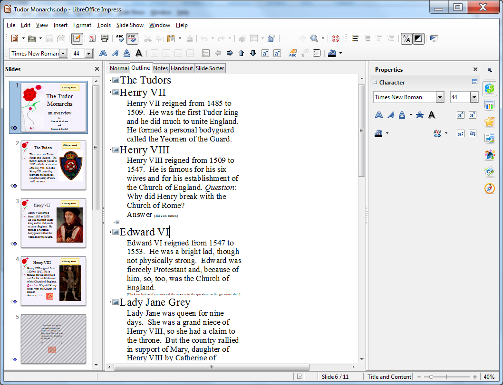

Fig. 9.2 Outline for the Tudor Monarchs presentation

You see on the left an outline of the text for each slide in the Tudor
Monarchs presentation. Think of the titles and text for each slide as an
outline you would have made for a high school or college paper. Similar,
right? This is why the outlining tool is built into *Impress*—to help
you plan.

Remember the golden rules of successful design: Rule 1—Plan; Rule
2—Plan; Rule 3—Plan! These golden rules apply whether you are designing
a term paper, an audio-visual aid, a class outing, or a class syllabus
and schedule.

You might begin with a brainstorming session to help you get an outline.
During brainstorming, members of the group would come up with as many
ideas as possible related to the topic of the project. Nobody's ideas
are rejected in the early stages so as to encourage a fertile flow of
useful suggestions.

The result of the brainstorming session might be a somewhat disorganized
list of ideas. This list might have been entered directly into the
computer during the brainstorming session, or it might have been
collected on a blackboard or flip chart. Before changing the list into
outline form you would re-organize it so that the ideas flowed naturally
and logically from one to the other.

Along the way you might toss out some of the ideas for one reason or
another. Eventually you'll have a working list which would end up as an
outline, perhaps in a word processor document.

**9.2 *IMPRESS* AT WORK**

Let’s see these ideas and others at work by looking at an example of an
Impress presentation.

> Turn on your computer, open ***LibreOffice*** then click on Open File
> and, in the Open dialog box, navigate to your **USB drive** >
> **Work Files for LibreOffice** > **Impress Files** folder and
> **double click** to open the **Tudor Monarchs** presentation

Fig. 9.3 shows the Tudor Monarchs presentation in *Normal View* as it
appears on your screen right after you open the document.

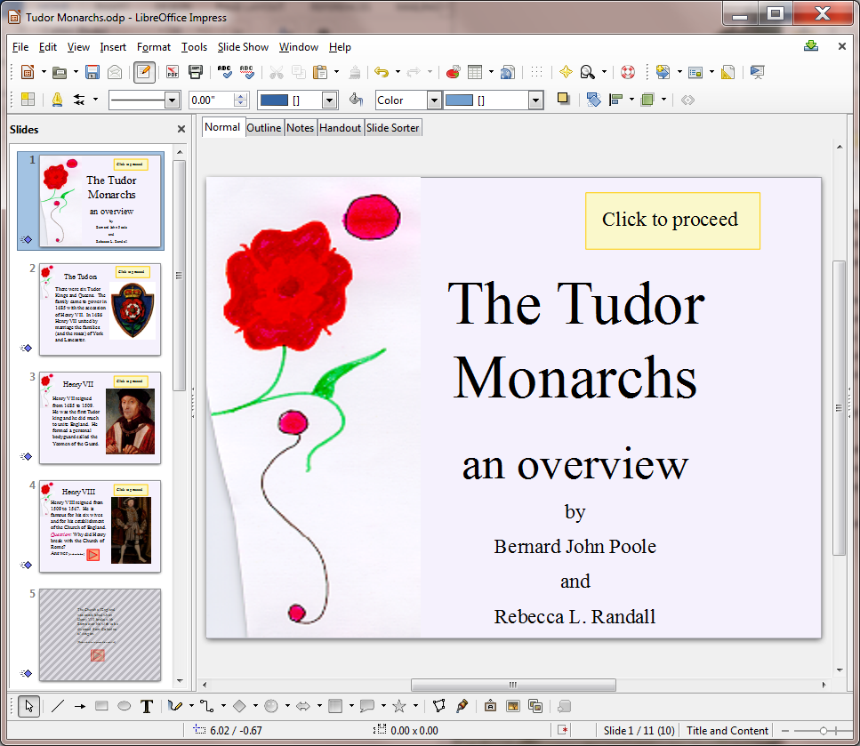

Fig. 9.3 The Tudor Monarchs presentation

Take a look at the Slide View tools in the upper left corner of the
*Impress* window (Fig. 9.3 above). You'll use these tools a lot while
you're developing your slides, so let's take a closer look at them right
away and find out what each of them is about (Fig. 9.4).

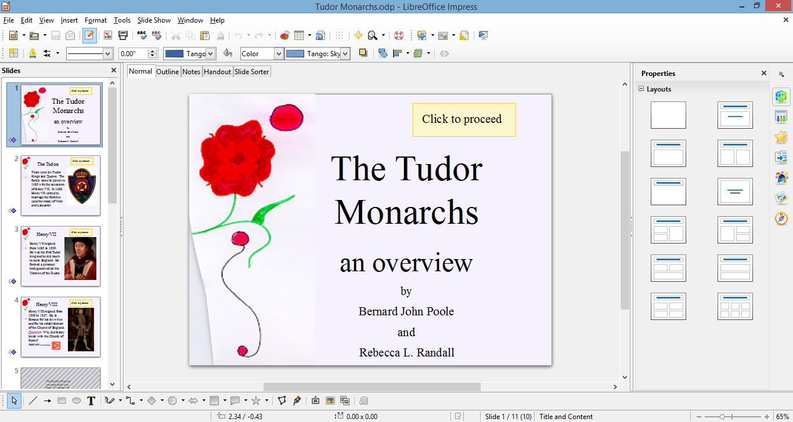

Fig. 9.4 The Slide View tools

**Different ways to view the slides in your presentation**

*Normal view*

This is the view you see illustrated in Fig. 9.3 above. It is the one
you'll use most of the time while you're actually putting information on
each slide. In this view, you have a left hand frame where you see
thumbnails of all your slides in a scroll box. In the center of the
window you have the slide you are actually working on—the active slide.
Then, over in the right hand frame you have the Properties Pane (not
shown in Fig. 9.3 above), where you'll find more tools to help you to
develop your presentation.

*Outline View*

The Outline View lets you see just the *text* on each slide. If you
want, you can use the outline tool to map out/plan the content of your
show before you “pretty up” the show with graphics and colors and
backgrounds and so forth.

*Notes View*

The Notes View is especially useful if you want to explain, or
reinforce, the content of each slide, either for your own use as the
presenter, or for your students, or for whoever is in your audience who
would like more information than is on each actual slide. In the Notes
View you are presented with a smaller version of each slide, one by one,
with ample space for extra notes pertaining to the content of each
slide, as illustrated in Fig. 9.5.

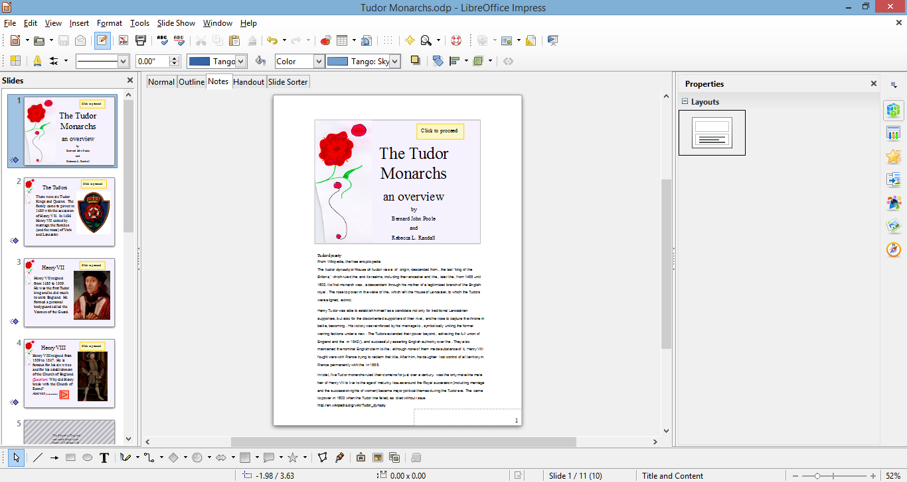

Fig. 9.5 The *Impress* Notes View showing the supplementary notes for
Slide One

*Handout View*

Anyone who gives a presentation is, in a way, a teacher, and the people
listening to him or her are, in a way, students, hoping to learn
something they didn't know before.

One of the problems with being a student is that it’s difficult to grasp
right away what the teacher is trying to get across. Good
teachers/presenters give their audience the opportunity to take away at
least a summary of what they have had to say. Hence handouts; and
*LibreOffice* makes handouts a snap.

Fig. 9.6 illustrates the *Impress* Handout View.

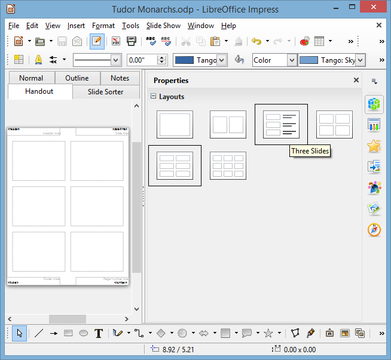

Fig. 9.6 The *Impress* Handout View

The best presentations do not overdo the use of slides! In other words,
if you are presenting for 40 to 50 minutes, you shouldn’t need more than
half a dozen slides—ten max.

One good rule is based on Miller’s Magical number (pertaining to short
term memory). People can hold on to no more than about 7±2 items—ideas,
numbers, whatever—in short term memory before those items are very
quickly gone! Keep it simple and attractive to the eye is the golden
rule.

But reinforcing those ideas, numbers, or whatever with some kind of
follow up or repetition significantly helps retention. Handouts are one
way to serve that purpose, and the *Impress* Handout View makes it easy
to format and print (or e-share through email, Facebook, and the myriad
other online social media) the Impress presentation that you have so
carefully designed and produced.

*\
*

*Slide Sorter view*

This is the view you see illustrated in Fig. 9.7, and it is the one
you'll find most useful when you want to get an overview of your show
while you’re working on it, since you'll be able to see most all your
slides laid out for you on one screen or page.

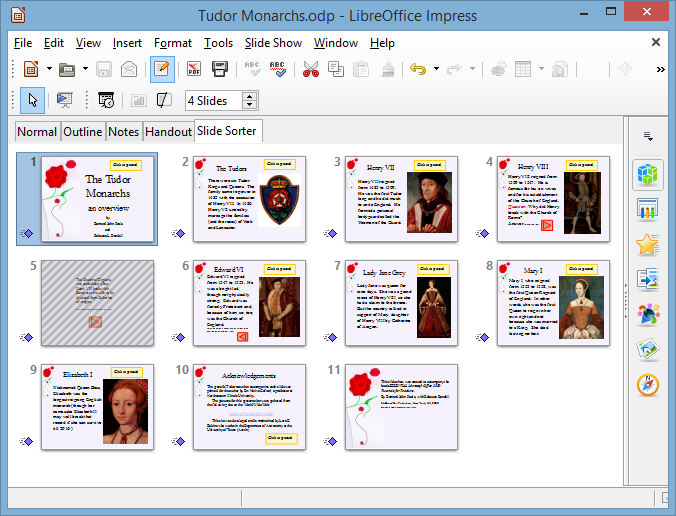

Fig. 9.7 The Slide Sorter View of the Presentation

You also can easily move your slides around, using the mouse to slide
them into place, changing the order to suit your purposes. This is why
it's called the Slide Sorter view.

You'll find yourself using these tools frequently to switch from one
view to another as you are developing your *Impress* presentations.
Let's further check out the Slide Sorter view now.

> Click on the **Slide Sorter tool** in the **Slide Views toolbar**
> (Fig. 9.7 above)

Take a look at the Slide Sorter View window that is presented to you now
(more or less the same as Fig. 9.7 above, though your screen may be a
different width, so the slides may be arranged differently across the
page).

The presentation you are looking at demonstrates some of the basic
features of *Impress*. By the end of this lesson you will be able to
build your own presentations along the same lines.

It’s time you worked your way through the *Impress* presentation about
the Tudor Kings and Queens of England.

> Click on the **Normal View** in the **Slide Views tools** and, in the
> **Presentation toolbar**, click on the icon to **Start from first
> slide** (Fig. 9.8)

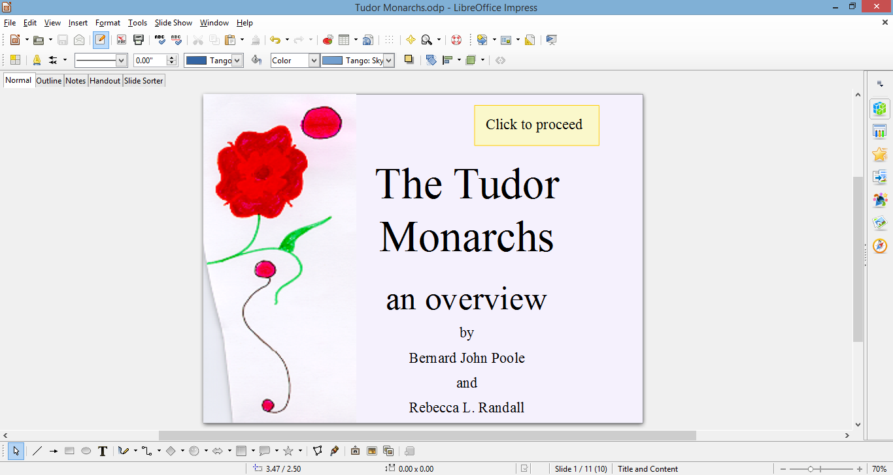

Fig. 9.8 *Start from First Slide* icon in the Presentation toolbar

**Features to look out for in the demonstration presentation**

While you click your way through the Tudor Monarchs presentation, look
out for the following *Impress* features that have been used in the
creation of the Tudor Monarchs slide show.

*Transition effects and animations*

The transition effects from one slide to another and the text animations
(which determine how the text will arrive on each slide) have been set
at *random* for the demonstration. This is to give you some idea of the
variety of transitions and animations you can use in *Impress*.

But this is not necessarily a good thing to do. Normally you would *not*
want to use many, if any, different transitions and animations since it
might distract from the impact you are trying to make. A good designer
homes in on a style that he or she likes best for a particular theme and
tends to stay with it for all the slides in the show.

*Inserting clip art, pictures and other media*

*LibreOffice* offers a database of *clip art* and *other media* on a
wide range of topics. This online database is available to all the
software in the *LibreOffice* suite.

Fig. 9.9 illustrates the Gallery from which you can select clip art and
other media (such as *photos*, *movie clips*, *sound files*, and so
forth) to insert onto your slides.

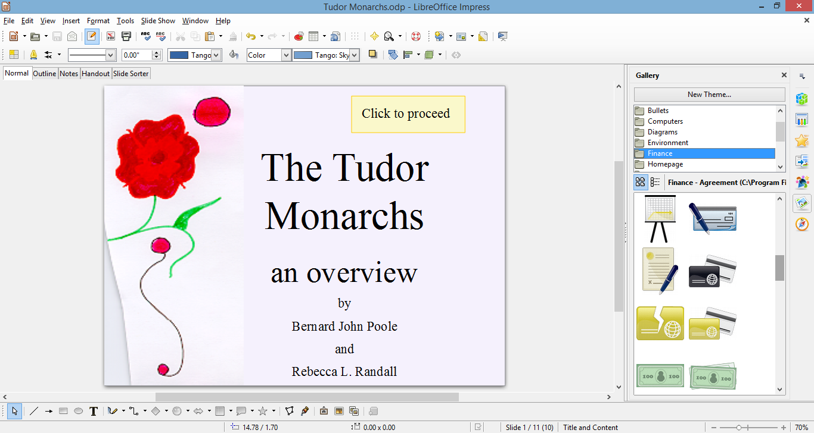

Fig. 9.9 Ribbon for inserting images, illustrations, and other media

You can download clip art, photographs, sound files, video clips and
other media from a file you have saved on disk, or from collections
available free of charge on the Web. Or you can bring onto a slide all
kinds of charts and tables from other *LibreOffice* programs such as
*Writer* or *Calc*.

You can also scan pictures directly onto a slide. So, if you have a
scanner connected to your computer, you’re in business.

If you’re looking for multimedia material to accompany your slides, the
Web is the place to go. Companies, universities, schools, and
individuals, especially teachers, are creating and making available
excellent multimedia materials. These materials are available, mostly
free of charge, from websites such as *flickr.com*, *youtube.com*, and
so forth.

*Impress* makes it easy to incorporate such material into presentations,
with or without accompanying text.

Remember though: YOU ***MUST*** ALWAYS GIVE CREDIT FOR ANYTHING YOU
ACCESS ONLINE.

*Buttons, Slide Controls and Hidden Slides *

Notice the use of *buttons* to allow the user to control movement
through the slides, thus making slideshows both interactive and
non-linear—in other words, the user has control over the sequencing of
the slides.

For example, in the Tudor Monarchs slide show there is a *Hidden Slide*
(slide \#5) which is only able to be seen if, on slide \#4, you click on
the orange button to see the answer to the question posed there. Let’s
check this out (Fig. 9.10).

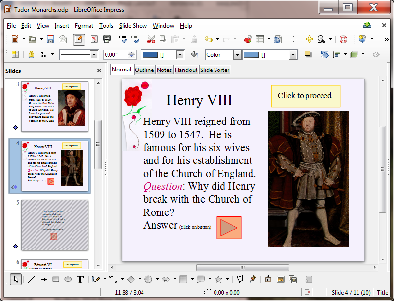

Fig. 9.10 Using buttons to control the progress through the slide show

> If you are actually viewing the slide show, hit the **Esc**(ape) key
> on the keyboard to **exit** the slide show then, in the **Slides
> menu** on the **left** of the *Impress* window, click on **Slide \#4**
> to make it the **active slide**
>
> In the **Slide Show menu** click on **Start from current Slide**

Slide \#4 is showing on your full screen as an active slide in the show.

> Now, read the text on the slide, but **DON’T** click on the **orange
> button** towards the bottom of the slide to find out the answer to the
> question as to why Henry VIII broke away from the Church of Rome;
> instead click on the **yellow button** at the top of the slide to
> **proceed** to the next slide

So, you can create interesting *interactive* learning materials using
*Impress*. Lesson 10 will help you learn more about interactive
presentations such as this. Your students, too, will have a lot of fun
using *Impress* to develop projects of all kinds for every subject under
the sun.

Let’s continue checking out the remaining *Impress* features.

*Timing and other considerations*

Fig. 9.11 shows the Slide Sorter View of the presentation. Fig. 9.11
also highlights the type of transition you can choose, how fast you want
the transition to occur, whether you want a sound to accompany the
transition from slide to slide, and so forth.

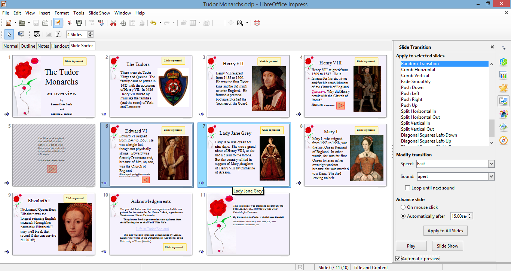

> Fig. 9.11 The Slide Sorter View showing the Slide Transition settings

Notice, in the *Slide Transition pane* on the right hand side of the
Slide Sorter window, that the transition (*Random Transition*) is set to
*Fast*, with an accompanying sound called *Apert*. Each slide will
advance automatically after *15 seconds*, unless the user clicks the
mouse on the “Click to proceed” button on each slide, in which case the
slide will advance right away.

*Acknowledgements: Always give credit where credit is due*

The last slide in any presentation, just as the last item in a term
paper or the credits that run at the end of a movie, should usually be
your list of sources cited or used—your Acknowledgements slide (Fig.
9.12).

Fig. 9.12 The first Acknowledgements slide

> So… If you haven't already done so, in the **Presentation toolbar**,
> click on the icon to **Start from first slide** (Fig. 9.8 on page 260)
>
> Click your way through the presentation now (click on the **Buttons**
> on each slide to proceed to the next slide)

The slides have been timed to allow the user (right now, that’s you) to
easily view and read what is on each slide without feeling rushed. If
you want the slides to proceed at a faster pace, simply click on the
*Click to proceed* button on each slide.

> When you have finished reviewing the **Tudor Monarchs** slide show,
> **exit** the show by **hitting** the **Esc**(ape) button in the **top
> left** corner of the keyboard

So much for an overview of *Impress*. No doubt you are anxious to start
creating your own presentation. The next section will help you do just
that.

> Close the **Tudor Monarchs** presentation when you are ready to
> continue

**9.3 BUILDING A NEW PRESENTATION**

**Preparation of the outline**

You are going to prepare a simple outline, which will give you the
experience to prepare your own outlines when you develop your own
*Impress* presentations.

Whenever you’re preparing a new *Impress* presentation, take your time.
Think about it; gather your data; brainstorm, with yourself at least,
and with friends if necessary. Don’t just blunder along, OK? So let’s
begin.

> From the **File** menu select **New**, then **open** a new *Impress*
> presentation
>
> Go to **File** > **Save As**, navigate (Browse) on your Computer to
> your **USB drive** (Removable disk) > **Work Files for
> LibreOffice** > **Data Files** folder and **Create** a new folder
> called **Impress Documents**
>
> **Open** the **Impress Documents** folder, name the new presentation
> **Screenbeans**, and click on **Save**

When you first open a new, blank presentation in *Impress*, the program
presents you with the *Normal View* (Fig. 9.13).

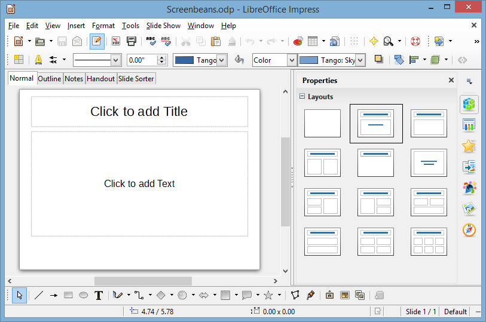

> Fig. 9.13 New Presentation window in *Normal View*

The first slide, by default, is in the *Title Slide layout*. This is
because you would normally want to start out a presentation with a slide
that displays the title of your show, along with sub titles such as your
name and so forth.

You don't *have* to use this slide layout, of course. *Impress* provides
a set of *slide layout templates* from which you can choose when you are
working on a slide, including one layout which is blank. The *Blank
Slide* template allows you to create slides from scratch, entirely of
your own design.

Let’s take a look at these different Slide Layouts now (Fig. 9.14).

> 
>
> Fig. 9.14 Slide Layouts
>
> Click on each of the layouts to check them out, then click on the
> **Title layout** last when you are ready to proceed with the lesson

**Typing the outline entries**

The *Normal View* is fine when you have your presentation built, bar the
shouting, and you want to be able to check out and edit individual
slides that you have already created. But when you are at the planning
stages and you want to create an outline of the *text* you want to
include on each slide, it is best to use the *Outline View*. *Impress*
provides a lot of help such as this while you're developing your
presentation. Let’s switch to the *Outline View* now.

> In the **View Ribbon** > **Presentation Views Group** click on the
> **Outline View** tab (Fig. 9.15)

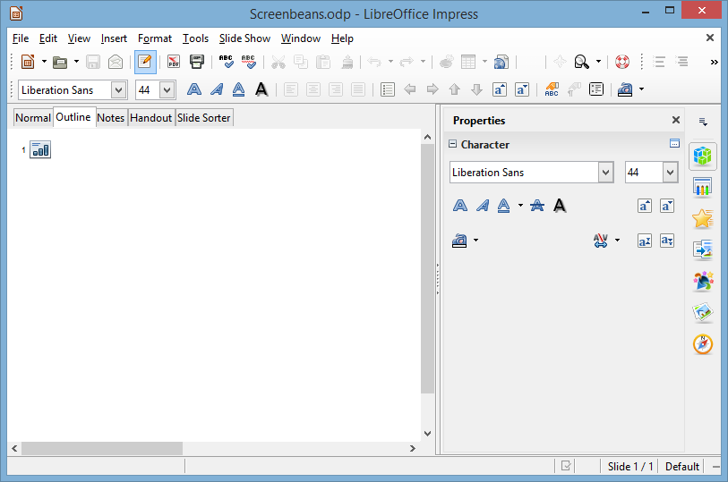

Fig. 9.15 The screen at the start of a new blank presentation

As you type the text for each slide, the text will be entered onto the
slide itself with no extra effort on your part, thanks to *Impress*’s
slide layout features. You’ll see how this works when you switch back to
Normal View after you have typed in the outline that you see illustrated
in Fig. 9.16. Don’t start typing text just yet, though. Refer to the
outline as you work your way through the directions that follow.

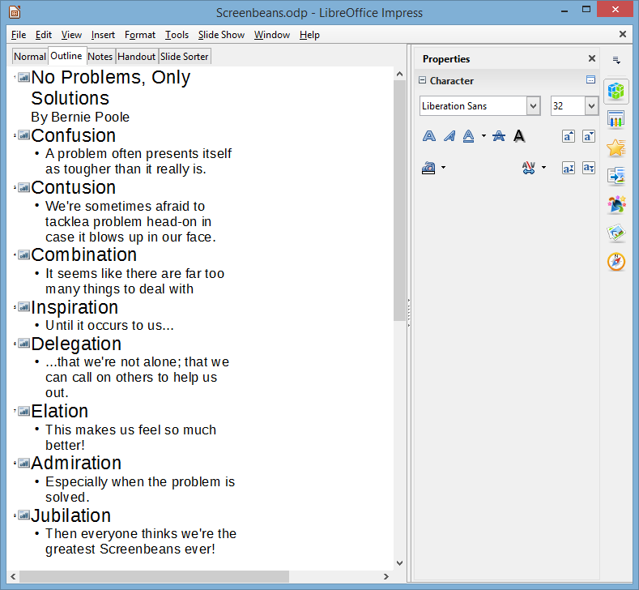

Fig. 9.16 The outline for the Screenbeans presentation

> On the left side of the window, next to the icon for the first slide,
> type the title **No Problems, Only Solutions** (see Fig. 9.16 above)
> then hit **Enter** on the keyboard

*Impress* now goes to a new slide because it assumes that you have
finished adding text to the first slide. But you need to add a sub-title
on the Title slide. To do this, you must *Demote* the next set of text
(*By \[author’s name\]*) so that it stays on the same slide (which means
you must *decrease its level on the slide*). You’ll see how it works as
you follow along in these directions.

Fig. 9.17 illustrates the *Demote* tool that you use to further indent
the level of *By \[author’s name\]* on the slide. Either side of the
Demote tool are the Promote, Move up, and Move down tools.

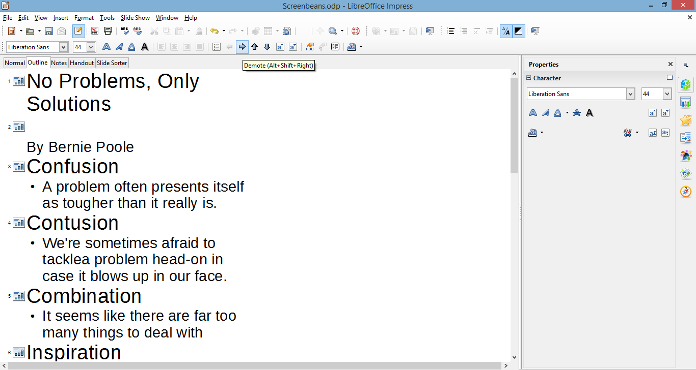

Fig. 9.17 The Demote tool

> Click on the **Demote** tool now, then type **By \[your name\]**—type
> *your own name*, of course—not “your name” or “Bernie Poole!!”—and hit
> the **Enter key**

So now your outline entry for the first slide will look something like
this (Fig. 9.18).

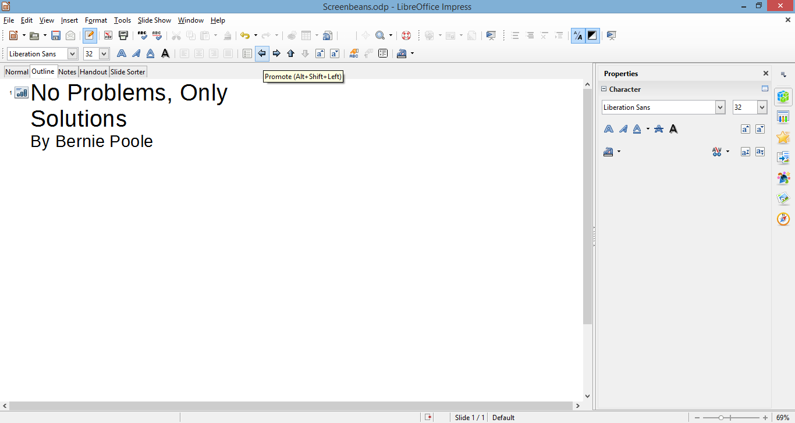

Fig. 9.18 The outline entry for the first slide

That’s all you need by way of text on the first slide. Now you need to
set up for a new slide. To do that in the outline, you must use the
*Promote* tool in the Text Formatting toolbar, which *raises* the level
back to the top level of a New Slide*.* The Promote tool is to the left
of the Demote tool (Fig. 9.18 above).

> Click on the **Promote** tool and notice how the icon for a new slide
> (Slide \#2) pops up, with the cursor waiting for you to type in the
> text for this second slide

Now you are ready to type in the entries for the second and remaining
slides. The content for all the slides is illustrated in Fig. 9.16 on
page 266.

> Return your attention to the **left hand frame** of the *Impress*
> window so you can continue with **Slide 2** of the **Outline**
>
> Type **Confusion** for the second slide title, and hit **Enter**

Now you need to switch levels as you did for slide \#1 between the Title
entry and the Author’s name entry.

**Switching levels **

Let’s review the steps. Switching levels means moving up or down in the
hierarchy of entries on a slide by increasing (demoting) or decreasing
(promoting) the indent of the text on each slide.

If you look at the text for the second slide (Fig. 9.16 on page 266),
the word *Confusion* (the Title of the slide) is at the top level. Then
what immediately follows (*A problem often presents itself*…, etc ) is
indented—it’s lower level text (demoted). When you switch to the next
level *down*, the text is automatically indented to the *right*, that is
to say the level (in Impress speak) is *further indented* from the 1^st^
level to the 2^nd^—or demoted.

So, to summarize, moving the text to the *LEFT* *promotes* the list
level in an outline. Moving the text to the *RIGHT* *demotes* the list
level in an outline. For the remaining slides you have to enter text not
only for the Title of each slide, but also for the sub-text. This
sub-text will be at a *demoted* list level compared to the Title.

*Demoting to a lower List Level*

As we already observed when you were working on Slide \#1, to change
levels in an outline, *Impress* provides list level control tools (Figs.
9.17 and 9.18 on page 267).

> Go back and **take a look at Figs. 9.17** and **9.18** now before
> proceeding, then click on the **Demote** tool for the text you are
> going to type into the outline for slide \#2

Look at your outline now and notice that the next entry you type will be
indented and bulleted.

> Type the **lower level text** for the second slide (*A problem often
> presents itself…, etc*.) from the illustration in Fig. 9.16 on page
> 266, then hit **Enter**

*Promoting to a higher List Level*

That is all you need by way of text for the second slide. As you can
see, you must Promote to a higher level for the new slide 3. To do this
you use the Slide Level tools once more.

> Click on the **Promote** tool to **start a new slide** for the next
> text you are going to type into the outline

As you see, this begins a new slide (Slide \#3). You should be starting
to get the hang of this.

> So go ahead and complete the rest of the outline (using Fig. 9.16 on
> page 266), **demoting** and **promoting** the text levels as you go
> along
>
> After you have typed the **Title** and **text** entries for **slide
> \#9**, be sure to navigate, if necessary, to your **USB/flash drive**
> > **Work Files for LibreOffice** > **Data Files** > **Impress
> Documents folder** and **Save** this **Screenbeans** *Impress* slide
> show

Click on the Slide Sorter tab to switch now to the Slide Sorter view
(Fig. 9.19).

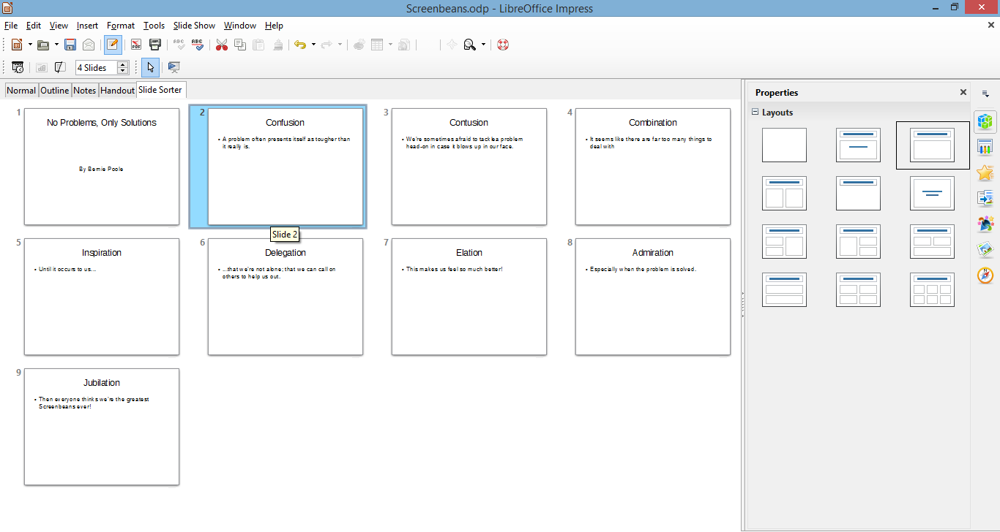

Fig. 9.19 The Slide Sorter view, showing the layout for Slide \#2

In Fig. 9.18 above, notice that *Impress* automatically selected *Title
and Content layout* for all the slides after the Title slide. But the
layout you need for slides 2 thru 9 is Title and 2 Content. Let’s fix
this first.

> In the **Slide Sorter** view, click on the **thumbnail** for **Slide
> \#2** (Fig. 9.18 above), then hold down the **Shift key** and **keep
> it down** while you click on **Slide \#9**

Slides 2 thru 9 should all now be highlighted.

> With **Slides 2 thru 9 selected**, in the set of **layout templates**
> in the **Properties frame** on the **right** of the screen, locate and
> **click** on the layout for a **Title and 2 Content** slide (Fig.
> 9.20)

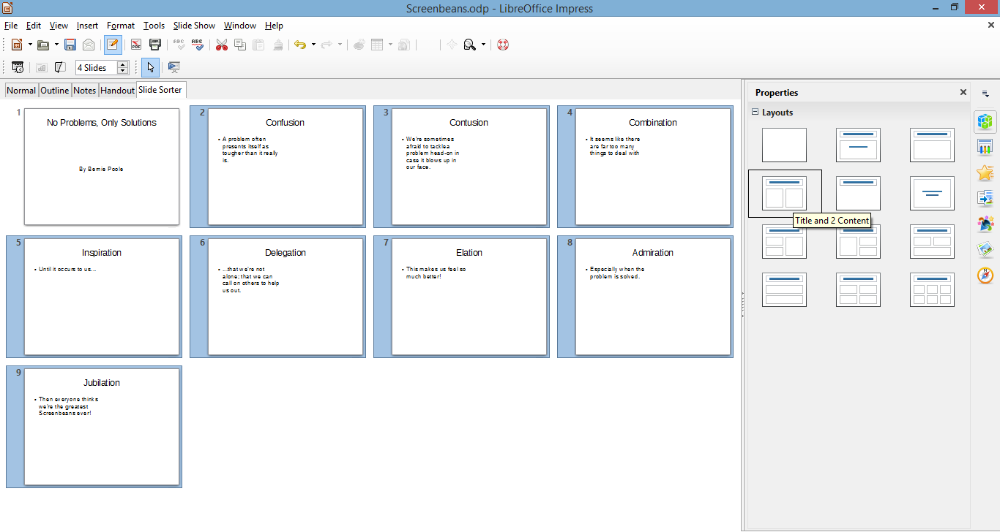

Fig. 9.20 Selecting the Title and 2 Content slide layout for slides 2
thru 9

Notice that you can see a thumbnail of each of slides 2-9 with, on the
left hand side, the text you typed in, and, on the right, an empty space
for further slide content, which can be more text, or a table from a
*Base* database, or images, or a chart imported from a *Calc*
spreadsheet, or even a movie clip.

> Time to **Save** your work **(Ctrl+s)**

Notice, too, how easy it is to check out how your work is progressing on
the presentation as a whole by using the *Slide Sorter* view.

> Still in the **Slide Sorter** view, click once on **Slide \#2** and
> then click on the **Normal tab** to go back to **Normal View** (Fig.
> 9.21)

Fig. 9.21 The Normal View for Slide \#2 with the five Content options
annotated

In Normal View you see the slide as it will show in a presentation. All
you have to do now is add more text, or any one of several different
types of media in the *Content Placeholder* box on the right hand side
of the slide (Fig. 9.21 above).

For this first *Impress* presentation we’ll keep it simple, adding just
an image to each of the last eight slides. In Lesson 10 you’ll have the
opportunity to practice adding a table from a *Base* database, a chart
from a *Calc* spreadsheet, and a movie, too.

**Adding pictures to the slides**

For Slides \#2 through \#9 you are going to insert a Screenbean[^1]
graphic in the *Content Placeholder*.

> On the **right hand side** of **slide \#2**, click on the **Insert
> Image** tool (the **lower left** of the four Insert object icons)—Fig.
> 9.21 above

This brings up the Insert Image dialog box (Fig. 9.22).

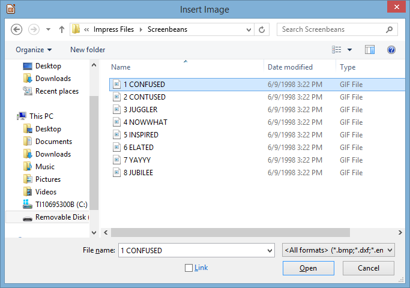

Fig. 9.22 The Insert Image dialog box

The set of Screenbean pictures that you are going to use for this
presentation are from Microsoft's clip art gallery, and they may not be
available on your computer since you may not be working online. So, for
the sake of this exercise, a folder containing eight Screenbean clip art
drawings has been prepared for you (Fig. 9.20 above). You’ll find it on
your USB drive, inside the *Work Files for LibreOffice* folder.

> Navigate on your **USB drive** to your **Work Files for LibreOffice**
> > **Impress Files** > **Screenbeans** folder

In the Screenbeans folder there are the 8 pictures you need for the next
8 slides in the presentation. Fig. 9.23 lists the pictures in the order
in which you should use them in the slides.

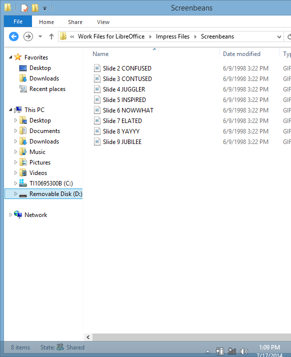

Fig. 9.23 The sequence you will use for the Screenbean pictures in the
presentation

> In the **Screenbeans** folder, **double click** on the **Confused**
> file (“Confused” with an “**f**”, not “Contused” with a “**t**”!)

*Impress* inserts the Screenbean figurine on Slide \#2 inside the right
side placeholder, with handles around it so that you can re-size it, if
necessary, to fit the space provided for it on the slide.

> Check to make sure the art is **correctly positioned** on the **right
> side** of the slide (it should look something like Fig. 9.24), then
> click anywhere **off the image** in order to set it in place (though
> you can click back on it anytime to change the image’s size and
> position)

Fig. 9.24 Slide \#2 with the image in place

> Repeat this exercise for the next **seven** slides, working from the
> **Slide Sorter View**, **double clicking** on each slide in turn to
> bring up the **Normal View** for that slide, then loading the
> **Screenbean images** one by one in the order they are listed in Fig.
> 9.22 on the previous page
>
> When you are done with slide \#9, **Save** your work to this point,
> then click on the **Slide Sorter** **tab**

Your *Impress* presentation should now resemble Fig. 9.25.

Fig. 9.25 Screenbeans slide show after inserting all the Screenbeans
images

**9.4 ADDING BELLS AND WHISTLES TO THE PRESENTATION**

**Resizing the Screenbeans on each of the slides**

The Screenbean images on each of the slides are smaller than they need
to be. If necessary you could also *crop* an image to select out just
the part of the image you want to use. To do this you would *right
click* on the image and, in the context menu that pops up, select the
Crop option. You don’t need to do that here, but you could if you wanted
to.

> In the **Slide Sorter View**, **double click** on **Slide \#2**, then
> click on the **Screenbean image** to bring up the small green
> **handles** around it (Fig. 9.24 below); then grab any one of the
> **handles** to **stretch the image** so that it is **as large as
> possible** in the space on the **right side** of the slide; just **be
> careful not to distort** the image or to **overflow the borders of the
> slide**, or to drag the top of the image **higher than the top line of
> sub-text** (Fig. 9.26 below)

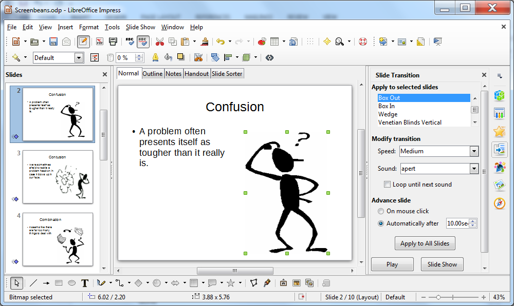

Fig. 9.26 Stretch the Screenbean using the corner handles

> Now do the same with the **Screenbean images** on the **other 7
> slides—**to end up with something like Fig. 9.27—then **Save** your
> work once more

Fig. 9.27 Screenbeans show after resizing the images

**Adding Transitions, Speed and Sound effects, and Timings**

This task should best be done—and easiest to do—while you are in the
Slide Sorter View.

> If necessary, click on the **Slide Sorter View** again

For this exercise, you are going to add the same Timing, Sound effect,
and Slide Transition to all the slides, though you could, if you wanted,
use different timings, sound effects, and transitions for each
individual slide. You’ll practice doing this in Lesson 10.

*Slide Transitions*

> In the **Edit menu**, click on **Select All** (or press **Ctrl+a** on
> the keyboard), then click on the **Slide Transition** button (Fig.
> 9.28)

> Fig. 9.28 The Slide Transition button

This Slide Transition button brings up, on the right side of the
*Impress* window, the Slide Transition pane (Fig. 9.28 above).

> To get a **Live Preview** of any of the transitions, make sure you
> check the box next to Automatic preview at the bottom of the Slide
> Transition pane (see Fig. 9.27 above)
>
> Click on any **Transition** in the menu and watch the effect of the
> slide transition in the selected slide in the **Slide Sorter view**
>
> Try several of them to get a feel for how they work, then select the
> one you most like

*Speed and Sound effects*

The Transition can be timed to happen at any one of three speeds: Fast,
Medium, or Slow. We’ll go with Medium speed, but feel free to choose
whichever speed appeals to you. We’re going to use the *Apert* sound
effect, but again feel free to choose any sound effect that appeals to
you.

> In the **Modify Transition** section, select one of the three
> **speeds**, then select any one of the **sound effects**

*Setting Timings for the slides*

This will allow the user to advance to the next slide either manually
(by clicking the mouse) or automatically (after 10 seconds is our
choice).

> In the **Modify Transition** section, click in the **check box** next
> to **Automatically after:** and increase the **Advance slide** time to
> **10** **(ten)** seconds

You are applying these Timing and Transition effects to *All* the
slides. But you should bear in mind that you could have different
effects for each slide if you wanted, simply by going from slide to
slide, setting the options, and not applying them to All Slides.

This is only a good idea if you are designing a slide show where your
goal is to impress your audience (a) with your *Impress* skills, or (b)
with your artistic/creative nature, or (c) you actually want to distract
your audience from the flow of your presentation, or (d) you just have
no idea what you’re doing!

So, unless you know what you’re doing, and for the sake of this
exercise, let’s apply these settings to All Slides.

> Click on the button to **Apply to All** Slides (see Fig. 9.27 previous
> page), then **Save** the slide show (**Ctrl+s**)
>
> Now would be a good time to check out the presentation, so click on
> the **Slide Show button** and sit back and enjoy what you’ve made of
> the show to this point (each slide will hold on screen for 10 seconds,
> which is ample time to read what’s on the slide, but if you want to
> move the show along, just click the **left mouse button** or tap on
> your touch pad at any time)

**Choosing a Master Page**

*Impress* gives you all kinds of assistance in the design of your
slides. So far we've used the basic set of *Slide Layouts*, which are OK
when it comes to the general layout of each slide in your show.

The *Slide Layouts* help you throw together so-called “quick-and-dirty”
*Impress* presentations, where you’ve planned what you want to “show and
tell,” but you haven’t given much thought to how you want your show to
look.

The easiest way to make your slides more interesting is to use one of
the *Master Pages* that come with *Impress*, or those you create
yourself. You can select from a set of pre-formatted slide *Master
Pages* involving graphics, colors, and animations.

Let's check out some of these Master Pages now.

> Stay in the **Slide Sorter** view, with **all the slides selected**
> (**Ctrl+a**), then click on the **Master Pages icon** in the **column
> of icons** on the **right edge** of the *Impress* window (Fig. 9.29
> next page)

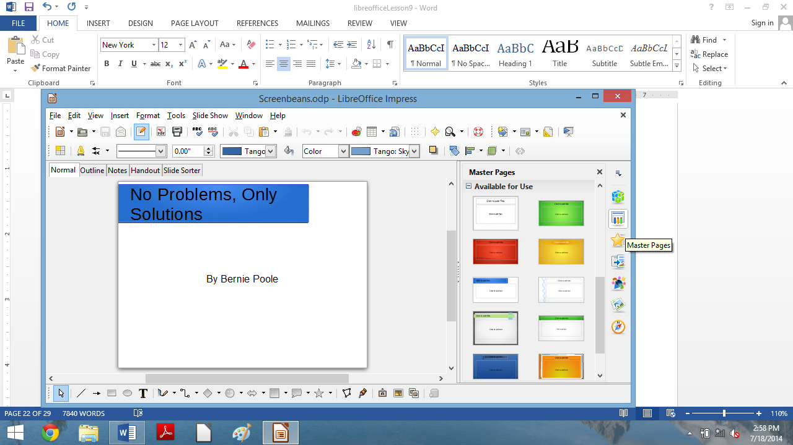

Fig. 9.29 The *Impress* Master Pages icon

> Click on the various **Master Pages designs** to check them out

As you click on each one, wait while *Impress* updates each slide with
the Master Page design. As you’ll quickly see, the best Master Pages for
the Screenbeans slide show are those that have a predominantly white
background because the Screenbean images are themselves black on a white
background. So the best Master Page is probably the one called *Bright
Blue*.

> For the sake of the exercises that follow, then, click to **select**
> the **Bright Blue** Master Page design, then **Save** this final
> version of the Screenbeans presentation

*Impress* quickly applies the selected design template to all the slides
in your show.

> Go to the **Slide Show** menu > **Start from first Slide** (Fig.
> 9.30) and take a few minutes to check out the show from start to
> finish

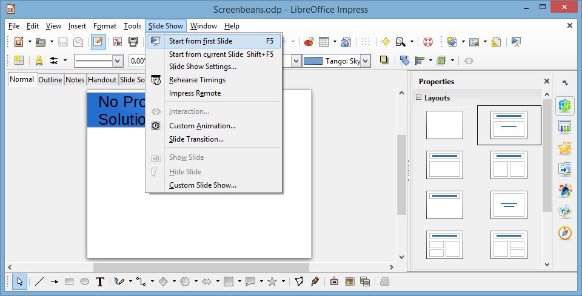

Fig. 9.30 Checking out the presentation

**\
9.5 PRINTING PRESENTATION HANDOUTS**

A nice feature of *Impress* is its ability to provide you with hard copy
versions of the slides and/or of the outline text of a presentation.
This is useful for the preparation of handouts for an audience such as a
class or other lecture environment. Here are the steps to do this.

> From the **File** menu choose **Print** (Fig. 9.31)

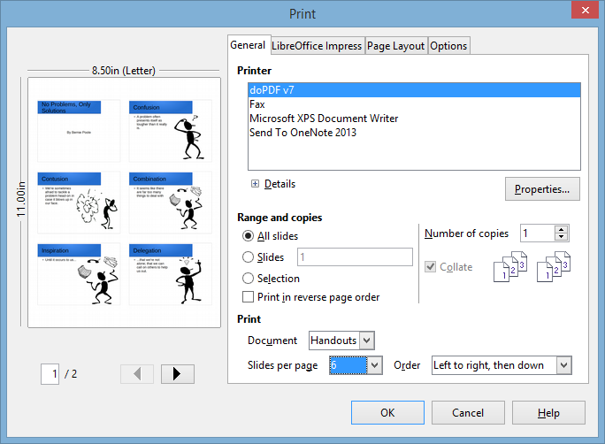

Fig. 9.31 Selecting the Handouts option for printing

> **All slides** should be selected for the **Range and copies**
> section, and, in the **Print** section, click on the **down arrow** in
> the Document data entry box and, in the menu of options, select
> **Handouts** (see Fig. 9.30 above) and notice that the slides will be
> printed **six-by-six per page**, **left to right, then down**
>
> Click on **OK** to print a copy of the presentation

In the handout options, you can choose two, four, six, or nine slides
per page, and you can display the slides in order either horizontally or
vertically. This handout can then be distributed to an audience or a
class for note-taking, review or reinforcement.

> **Save** this final version of the **Screenbeans** show then, before
> you finish, go ahead and make a **backup copy** of your
> **Screenbeans** presentation

**\
**

**SKILL CONSOLIDATION**

1\. Prepare a presentation on the subject of the American colonies. Make
sure you have at least eight first level topics (eight slides), as well
as a title slide and an acknowledgements slide.

2\. Prepare a presentation on the subject of US Presidents (or any
subject of your choice that you might use with a K-12 age group
appropriate to your major). Make sure you have at least eight first
level topics (eight slides), as well as a title slide and an
acknowledgements slide.

3\. Prepare a presentation on the subject of the American movie scene.
Make sure you have at least eight first level topics (eight slides), as
well as a title slide and an acknowledgements slide.

4\. Prepare a presentation in a style of your own choosing with at least
three levels on the subject of contemporary music. Make sure you have at
least eight first level topics (eight slides), as well as a title slide
and an acknowledgements slide.

5\. Create a slide show with yourself as the subject—you the person, you
the teacher. Use graphics drawn from any source you like. Make sure you
have at least eight first level topics (eight slides), as well as a
title slide and an acknowledgements slide.

6\. Create a slide show on the subject of pets. Use graphics from clip
art or created in a Drawing or Painting environment. Make sure you have
at least eight first level topics (eight slides), as well as a title
slide and an acknowledgements slide.

7\. Create a slide show on the subject of geometric shapes. Use graphics
drawn from clip art or created in a Drawing or Painting environment.
Make sure you have at
least eight first level topics (eight slides), as well as a title slide
and an acknowledgements slide.

[^1]: Screenbeans are cartoon characters created by Microsoft, Inc.
