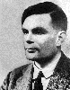
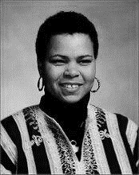

LibreOffice Tutorials for Turing Trust Students
===============================================

ESSENTIAL *LibreOffice* Tutorials for Turing Trust Students in Ghana

| by Bernard John Poole
| Associate Professor Emeritus
| of Johnstown, PA, USA
|
|
| Dedicated to
|

| Alan Mathison Turing, PhD, OBE, FRS
| 1912-1954
| British mathematician, logician, cryptanalyst, philosopher, pioneeringomputer scientist, mathematical biologist, and marathon runner
|
|
| and to
|

| Pharra Joy DeWindt, PhD – Yaa Nyarkoa
| 1957-2005
|
| Founder and Executive Director of the Digital Literacy Alliance (DLA), non-profit organization dedicated to facilitating the educationaldvancement of the youth of Agona Duakwa, a village in the Centralegion of Ghana, West Africa.
| “Literacy is the beginning of freedom.”
| (motto of the Digital Literacy Alliance)

.. toctree::
   :maxdepth: 1
   :glob:

   Lesson1/Lesson1
   Lesson2/Lesson2
   Lesson3/Lesson3
   Lesson4/Lesson4
   Lesson5/Lesson5
   Lesson6/Lesson6
   Lesson7/Lesson7
   Lesson8/Lesson8
   Lesson9/Lesson9
   Lesson10/Lesson10
   Shortcuts/LibreOffice Shortcuts
